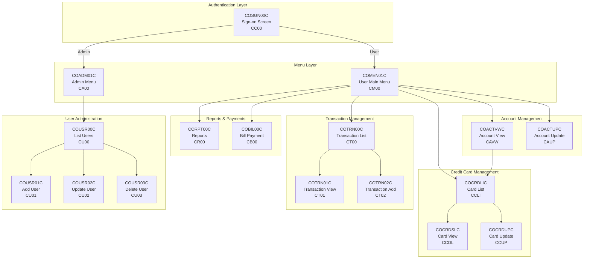
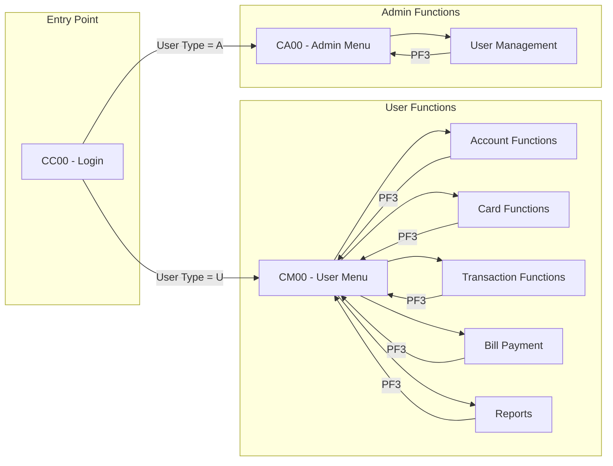
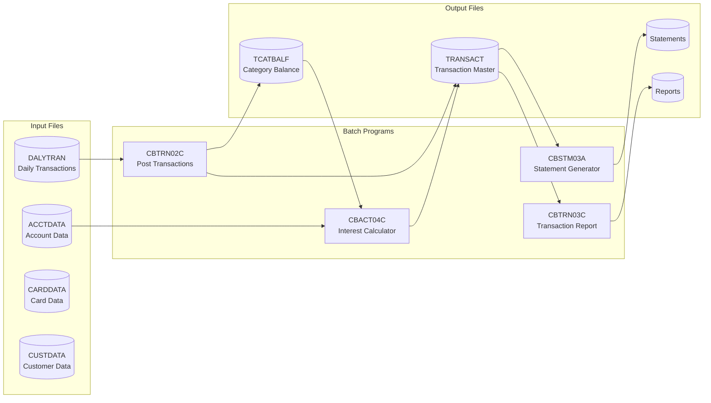
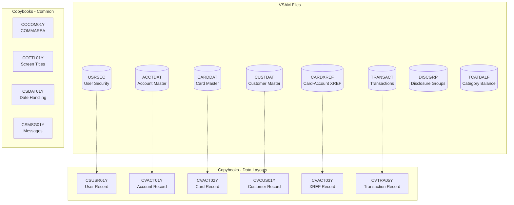
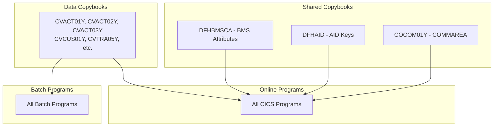

# CardDemo Application Architecture

This document provides a visual overview of the CardDemo mainframe application architecture, including component relationships and data flows.

## Table of Contents
- [High-Level Application Architecture](#high-level-application-architecture)
- [Online Transaction Flow](#online-transaction-flow)
- [Batch Processing Components](#batch-processing-components)
- [Data Files and Copybooks](#data-files-and-copybooks)
- [Program Dependencies](#program-dependencies)

## High-Level Application Architecture

The CardDemo application follows a classic mainframe architecture with CICS for online transactions and JCL for batch processing.

## Online Transaction Flow

This diagram shows how users navigate through the application based on their role (Admin vs Regular User).

## Batch Processing Components

The batch processing layer handles daily transaction posting, interest calculations, and statement generation.

## Data Files and Copybooks

This diagram shows the relationship between VSAM data files and their corresponding copybook layouts.

## Program Dependencies

This diagram illustrates how programs depend on shared copybooks and components.

## Component Summary

### Online Programs (CICS)

| Program | Transaction | Function | BMS Map |
|---------|-------------|----------|---------|
| COSGN00C | CC00 | Sign-on Screen | COSGN00 |
| COMEN01C | CM00 | User Main Menu | COMEN01 |
| COADM01C | CA00 | Admin Menu | COADM01 |
| COACTVWC | CAVW | Account View | COACTVW |
| COACTUPC | CAUP | Account Update | COACTUP |
| COCRDLIC | CCLI | Credit Card List | COCRDLI |
| COCRDSLC | CCDL | Credit Card View | COCRDSL |
| COCRDUPC | CCUP | Credit Card Update | COCRDUP |
| COTRN00C | CT00 | Transaction List | COTRN00 |
| COTRN01C | CT01 | Transaction View | COTRN01 |
| COTRN02C | CT02 | Transaction Add | COTRN02 |
| CORPT00C | CR00 | Transaction Reports | CORPT00 |
| COBIL00C | CB00 | Bill Payment | COBIL00 |
| COUSR00C | CU00 | List Users | COUSR00 |
| COUSR01C | CU01 | Add User | COUSR01 |
| COUSR02C | CU02 | Update User | COUSR02 |
| COUSR03C | CU03 | Delete User | COUSR03 |

### Batch Programs

| Program | Function |
|---------|----------|
| CBTRN02C | Post daily transactions |
| CBACT04C | Calculate interest |
| CBSTM03A | Generate statements |
| CBTRN03C | Generate transaction reports |

### Key Copybooks

| Copybook | Purpose |
|----------|---------|
| COCOM01Y | Communication area between programs |
| CVACT01Y | Account record layout |
| CVACT02Y | Card record layout |
| CVACT03Y | Card-Account cross-reference |
| CVCUS01Y | Customer record layout |
| CVTRA05Y | Transaction record layout |
| CSUSR01Y | User security record layout |
