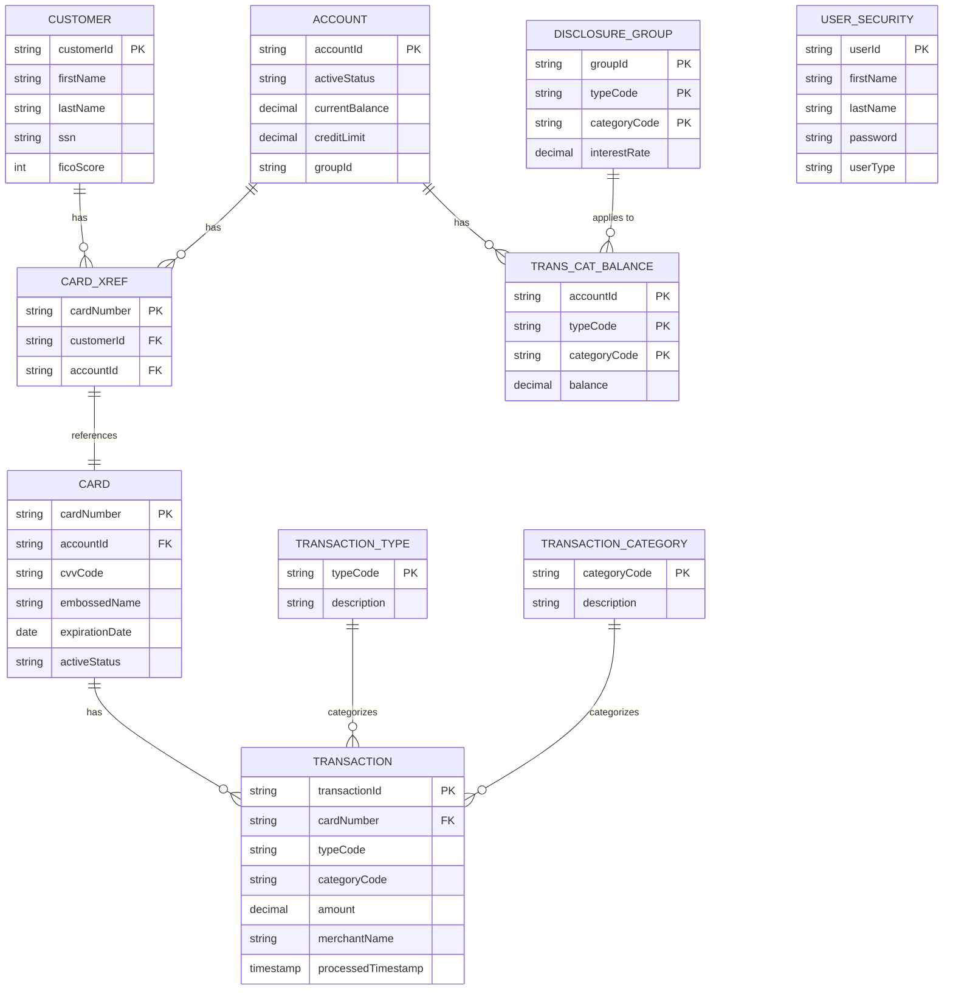

# CardDemo Application - Business Domain Model

## Document Information

| Attribute | Value |
|-----------|-------|
| Document Title | CardDemo Business Domain Model |
| Version | 1.0 |
| Date | January 2026 |
| Purpose | Domain-Driven Design Reference for Modernization |

---

## 1. Executive Summary

This document presents the business domain model for the CardDemo credit card management application. The model captures the core business entities, their attributes, relationships, and the business rules that govern their behavior. This domain model serves as a foundation for modernization efforts, enabling a clear understanding of the business logic that must be preserved during any transformation.

---

## 2. Domain Overview

### 2.1 Business Domain

CardDemo operates within the **Credit Card Management** domain, which encompasses the complete lifecycle of credit card operations from customer onboarding through transaction processing and account management.

### 2.2 Bounded Contexts

The application is organized into the following bounded contexts:

```
+------------------------------------------------------------------+
|                    CardDemo Domain                                |
|                                                                   |
|  +------------------+  +------------------+  +------------------+ |
|  |   Customer       |  |   Account        |  |   Transaction    | |
|  |   Management     |  |   Management     |  |   Processing     | |
|  +------------------+  +------------------+  +------------------+ |
|                                                                   |
|  +------------------+  +------------------+  +------------------+ |
|  |   Card           |  |   Security &     |  |   Reporting &    | |
|  |   Management     |  |   Access Control |  |   Analytics      | |
|  +------------------+  +------------------+  +------------------+ |
|                                                                   |
|  +------------------+  +------------------+  +------------------+ |
|  |   Authorization  |  |   Interest &     |  |   Batch          | |
|  |   (Optional)     |  |   Billing        |  |   Processing     | |
|  +------------------+  +------------------+  +------------------+ |
+------------------------------------------------------------------+
```

---

## 3. Core Domain Entities

### 3.1 Customer Entity

The Customer entity represents individuals who hold credit card accounts.

```
+---------------------------------------------------------------+
|                         CUSTOMER                               |
+---------------------------------------------------------------+
| Attributes:                                                    |
|   - customerId: CustomerID (PK) [9 digits]                    |
|   - firstName: String [25 chars]                              |
|   - middleName: String [25 chars]                             |
|   - lastName: String [25 chars]                               |
|   - addressLine1: String [50 chars]                           |
|   - addressLine2: String [50 chars]                           |
|   - addressLine3: String [50 chars]                           |
|   - stateCode: StateCode [2 chars]                            |
|   - countryCode: CountryCode [3 chars]                        |
|   - zipCode: ZipCode [10 chars]                               |
|   - phoneNumber1: PhoneNumber [15 chars]                      |
|   - phoneNumber2: PhoneNumber [15 chars]                      |
|   - ssn: SSN [9 digits]                                       |
|   - governmentId: String [20 chars]                           |
|   - dateOfBirth: Date [YYYY-MM-DD]                            |
|   - eftAccountId: String [10 chars]                           |
|   - primaryCardholderIndicator: Boolean [Y/N]                 |
|   - ficoScore: Integer [3 digits, 300-850]                    |
+---------------------------------------------------------------+
| Business Rules:                                                |
|   - Customer ID must be unique and 9 digits                   |
|   - SSN must be valid 9-digit format                          |
|   - FICO score must be between 300 and 850                    |
|   - At least one phone number is required                     |
+---------------------------------------------------------------+
```

### 3.2 Account Entity

The Account entity represents credit card accounts with credit limits and balances.

```
+---------------------------------------------------------------+
|                          ACCOUNT                               |
+---------------------------------------------------------------+
| Attributes:                                                    |
|   - accountId: AccountID (PK) [11 digits]                     |
|   - activeStatus: Status [1 char: Y/N]                        |
|   - currentBalance: Money [Signed 10.2 decimal]               |
|   - creditLimit: Money [Signed 10.2 decimal]                  |
|   - cashCreditLimit: Money [Signed 10.2 decimal]              |
|   - openDate: Date [YYYY-MM-DD]                               |
|   - expirationDate: Date [YYYY-MM-DD]                         |
|   - reissueDate: Date [YYYY-MM-DD]                            |
|   - currentCycleCredit: Money [Signed 10.2 decimal]           |
|   - currentCycleDebit: Money [Signed 10.2 decimal]            |
|   - addressZip: ZipCode [10 chars]                            |
|   - groupId: GroupID [10 chars]                               |
+---------------------------------------------------------------+
| Business Rules:                                                |
|   - Account ID must be unique and 11 digits                   |
|   - Current balance cannot exceed credit limit                |
|   - Cash advances cannot exceed cash credit limit             |
|   - Account must be active (Y) for transactions               |
|   - Expiration date must be after open date                   |
+---------------------------------------------------------------+
| Derived Attributes:                                            |
|   - availableCredit = creditLimit - currentBalance            |
|   - availableCash = cashCreditLimit - cashAdvanceBalance      |
+---------------------------------------------------------------+
```

### 3.3 Card Entity

The Card entity represents physical or virtual credit cards linked to accounts.

```
+---------------------------------------------------------------+
|                           CARD                                 |
+---------------------------------------------------------------+
| Attributes:                                                    |
|   - cardNumber: CardNumber (PK) [16 chars]                    |
|   - accountId: AccountID (FK) [11 digits]                     |
|   - cvvCode: CVV [3 digits]                                   |
|   - embossedName: String [50 chars]                           |
|   - expirationDate: Date [YYYY-MM-DD]                         |
|   - activeStatus: Status [1 char: Y/N]                        |
+---------------------------------------------------------------+
| Business Rules:                                                |
|   - Card number must be 16 digits (Luhn algorithm valid)      |
|   - CVV must be 3 digits                                      |
|   - Embossed name must contain only alphabetic characters     |
|   - Card must be linked to a valid account                    |
|   - Card status must be Y for transactions                    |
|   - Expiration date format: YYYY-MM-DD                        |
+---------------------------------------------------------------+
```

### 3.4 Transaction Entity

The Transaction entity represents financial transactions on credit card accounts.

```
+---------------------------------------------------------------+
|                       TRANSACTION                              |
+---------------------------------------------------------------+
| Attributes:                                                    |
|   - transactionId: TransactionID (PK) [16 chars]              |
|   - typeCode: TransactionTypeCode [2 chars]                   |
|   - categoryCode: CategoryCode [4 digits]                     |
|   - source: String [10 chars]                                 |
|   - description: String [100 chars]                           |
|   - amount: Money [Signed 9.2 decimal]                        |
|   - merchantId: MerchantID [9 digits]                         |
|   - merchantName: String [50 chars]                           |
|   - merchantCity: String [50 chars]                           |
|   - merchantZip: ZipCode [10 chars]                           |
|   - cardNumber: CardNumber (FK) [16 chars]                    |
|   - originalTimestamp: Timestamp [26 chars]                   |
|   - processedTimestamp: Timestamp [26 chars]                  |
+---------------------------------------------------------------+
| Business Rules:                                                |
|   - Transaction ID is auto-generated                          |
|   - Amount must be positive for purchases, negative for credits|
|   - Card must be active and not expired                       |
|   - Transaction must not exceed available credit              |
|   - Type code must exist in Transaction Type reference        |
|   - Category code must exist in Transaction Category reference|
+---------------------------------------------------------------+
```

### 3.5 Card Cross-Reference Entity

The CardXref entity links cards to customers and accounts, enabling the many-to-many relationship.

```
+---------------------------------------------------------------+
|                      CARD_CROSS_REFERENCE                      |
+---------------------------------------------------------------+
| Attributes:                                                    |
|   - cardNumber: CardNumber (PK) [16 chars]                    |
|   - customerId: CustomerID (FK) [9 digits]                    |
|   - accountId: AccountID (FK) [11 digits]                     |
+---------------------------------------------------------------+
| Business Rules:                                                |
|   - Each card maps to exactly one customer and one account    |
|   - Customer and account must exist before creating xref      |
|   - Used for transaction validation and routing               |
+---------------------------------------------------------------+
```

### 3.6 User Security Entity

The UserSecurity entity manages system access and authentication.

```
+---------------------------------------------------------------+
|                      USER_SECURITY                             |
+---------------------------------------------------------------+
| Attributes:                                                    |
|   - userId: UserID (PK) [8 chars]                             |
|   - firstName: String [20 chars]                              |
|   - lastName: String [20 chars]                               |
|   - password: Password [8 chars]                              |
|   - userType: UserType [1 char: A/U]                          |
+---------------------------------------------------------------+
| Business Rules:                                                |
|   - User ID must be unique and 8 characters                   |
|   - Password must be exactly 8 characters                     |
|   - User type 'A' = Administrator, 'U' = Regular User         |
|   - Administrators can manage users and access all accounts   |
|   - Regular users have limited access based on role           |
+---------------------------------------------------------------+
```

---

## 4. Reference Data Entities

### 4.1 Transaction Type Entity

```
+---------------------------------------------------------------+
|                     TRANSACTION_TYPE                           |
+---------------------------------------------------------------+
| Attributes:                                                    |
|   - typeCode: TypeCode (PK) [2 chars]                         |
|   - description: String [50 chars]                            |
+---------------------------------------------------------------+
| Sample Values:                                                 |
|   - 'PR' = Purchase                                           |
|   - 'CR' = Credit/Return                                      |
|   - 'CA' = Cash Advance                                       |
|   - 'FE' = Fee                                                |
|   - 'IN' = Interest                                           |
|   - 'PM' = Payment                                            |
+---------------------------------------------------------------+
```

### 4.2 Transaction Category Entity

```
+---------------------------------------------------------------+
|                   TRANSACTION_CATEGORY                         |
+---------------------------------------------------------------+
| Attributes:                                                    |
|   - categoryCode: CategoryCode (PK) [4 digits]                |
|   - description: String [50 chars]                            |
+---------------------------------------------------------------+
| Sample Values:                                                 |
|   - 0001 = Retail Purchase                                    |
|   - 0002 = Online Purchase                                    |
|   - 0003 = Travel                                             |
|   - 0004 = Dining                                             |
|   - 0005 = Fuel                                               |
+---------------------------------------------------------------+
```

### 4.3 Transaction Category Balance Entity

```
+---------------------------------------------------------------+
|               TRANSACTION_CATEGORY_BALANCE                     |
+---------------------------------------------------------------+
| Attributes:                                                    |
|   - accountId: AccountID (PK1) [11 digits]                    |
|   - typeCode: TypeCode (PK2) [2 chars]                        |
|   - categoryCode: CategoryCode (PK3) [4 digits]               |
|   - balance: Money [Signed 9.2 decimal]                       |
+---------------------------------------------------------------+
| Business Rules:                                                |
|   - Tracks balance by account, type, and category             |
|   - Updated during transaction posting                        |
|   - Used for interest calculation by category                 |
+---------------------------------------------------------------+
```

### 4.4 Disclosure Group Entity

```
+---------------------------------------------------------------+
|                     DISCLOSURE_GROUP                           |
+---------------------------------------------------------------+
| Attributes:                                                    |
|   - accountGroupId: GroupID (PK1) [10 chars]                  |
|   - transactionTypeCode: TypeCode (PK2) [2 chars]             |
|   - transactionCategoryCode: CategoryCode (PK3) [4 digits]    |
|   - interestRate: Percentage [Signed 4.2 decimal]             |
+---------------------------------------------------------------+
| Business Rules:                                                |
|   - Defines interest rates by account group and category      |
|   - Used during monthly interest calculation                  |
|   - Different rates for purchases, cash advances, etc.        |
+---------------------------------------------------------------+
```

---

## 5. Entity Relationship Diagram

### 5.1 Core Entity Relationships

```
                                    +------------------+
                                    |    CUSTOMER      |
                                    |------------------|
                                    | customerId (PK)  |
                                    | firstName        |
                                    | lastName         |
                                    | ssn              |
                                    | ficoScore        |
                                    +--------+---------+
                                             |
                                             | 1
                                             |
                                             | N
                                    +--------+---------+
                                    | CARD_CROSS_REF   |
                                    |------------------|
                                    | cardNumber (PK)  |
                                    | customerId (FK)  |----+
                                    | accountId (FK)   |    |
                                    +--------+---------+    |
                                             |              |
                                             | 1            |
                                             |              |
                                             | 1            |
                                    +--------+---------+    |
                                    |      CARD        |    |
                                    |------------------|    |
                                    | cardNumber (PK)  |    |
                                    | accountId (FK)   |    |
                                    | cvvCode          |    |
                                    | embossedName     |    |
                                    | expirationDate   |    |
                                    | activeStatus     |    |
                                    +--------+---------+    |
                                             |              |
                                             | 1            |
                                             |              |
                                             | N            |
                                    +--------+---------+    |
                                    |   TRANSACTION    |    |
                                    |------------------|    |
                                    | transactionId(PK)|    |
                                    | cardNumber (FK)  |    |
                                    | typeCode         |    |
                                    | categoryCode     |    |
                                    | amount           |    |
                                    | merchantName     |    |
                                    +------------------+    |
                                                           |
                +------------------------------------------+
                |
                | N
       +--------+---------+
       |     ACCOUNT      |
       |------------------|
       | accountId (PK)   |
       | activeStatus     |
       | currentBalance   |
       | creditLimit      |
       | groupId          |
       +--------+---------+
                |
                | 1
                |
                | N
       +--------+------------------+
       | TRANS_CATEGORY_BALANCE   |
       |--------------------------|
       | accountId (PK1)          |
       | typeCode (PK2)           |
       | categoryCode (PK3)       |
       | balance                  |
       +--------------------------+
```

### 5.2 Relationship Cardinalities

| Parent Entity | Child Entity | Cardinality | Description |
|---------------|--------------|-------------|-------------|
| Customer | CardXref | 1:N | One customer can have multiple cards |
| Account | CardXref | 1:N | One account can have multiple cards |
| CardXref | Card | 1:1 | Each cross-reference maps to one card |
| Card | Transaction | 1:N | One card can have multiple transactions |
| Account | TransCategoryBalance | 1:N | One account has balances per category |
| DisclosureGroup | TransCategoryBalance | 1:N | Interest rates apply to category balances |
| TransactionType | Transaction | 1:N | One type can have many transactions |
| TransactionCategory | Transaction | 1:N | One category can have many transactions |

---

## 6. Aggregate Roots and Boundaries

### 6.1 Customer Aggregate

```
+---------------------------------------------------------------+
|                    CUSTOMER AGGREGATE                          |
+---------------------------------------------------------------+
|                                                                |
|   +-------------------+                                        |
|   |     Customer      | <-- Aggregate Root                    |
|   +-------------------+                                        |
|            |                                                   |
|            +-- Contact Information (Value Object)              |
|            +-- Address (Value Object)                          |
|            +-- Credit Profile (Value Object)                   |
|                                                                |
+---------------------------------------------------------------+
| Invariants:                                                    |
|   - Customer must have valid SSN                              |
|   - Customer must have at least one contact method            |
|   - FICO score must be within valid range                     |
+---------------------------------------------------------------+
```

### 6.2 Account Aggregate

```
+---------------------------------------------------------------+
|                     ACCOUNT AGGREGATE                          |
+---------------------------------------------------------------+
|                                                                |
|   +-------------------+                                        |
|   |      Account      | <-- Aggregate Root                    |
|   +-------------------+                                        |
|            |                                                   |
|            +-- Card (Entity)                                   |
|            |      +-- CardXref (Entity)                       |
|            |                                                   |
|            +-- TransCategoryBalance (Entity)                   |
|            +-- CreditLimits (Value Object)                     |
|            +-- CycleActivity (Value Object)                    |
|                                                                |
+---------------------------------------------------------------+
| Invariants:                                                    |
|   - Balance cannot exceed credit limit                        |
|   - All cards must be linked via CardXref                     |
|   - Category balances must sum to current balance             |
+---------------------------------------------------------------+
```

### 6.3 Transaction Aggregate

```
+---------------------------------------------------------------+
|                   TRANSACTION AGGREGATE                        |
+---------------------------------------------------------------+
|                                                                |
|   +-------------------+                                        |
|   |    Transaction    | <-- Aggregate Root                    |
|   +-------------------+                                        |
|            |                                                   |
|            +-- MerchantInfo (Value Object)                     |
|            +-- TransactionType (Reference)                     |
|            +-- TransactionCategory (Reference)                 |
|                                                                |
+---------------------------------------------------------------+
| Invariants:                                                    |
|   - Transaction must reference valid card                     |
|   - Amount must not exceed available credit                   |
|   - Type and category must be valid references                |
+---------------------------------------------------------------+
```

---

## 7. Value Objects

### 7.1 Money Value Object

```
+---------------------------------------------------------------+
|                         MONEY                                  |
+---------------------------------------------------------------+
| Attributes:                                                    |
|   - amount: Decimal [Signed 10.2]                             |
|   - currency: CurrencyCode [Default: USD]                     |
+---------------------------------------------------------------+
| Operations:                                                    |
|   - add(Money): Money                                         |
|   - subtract(Money): Money                                    |
|   - multiply(factor): Money                                   |
|   - isPositive(): Boolean                                     |
|   - isNegative(): Boolean                                     |
+---------------------------------------------------------------+
```

### 7.2 Address Value Object

```
+---------------------------------------------------------------+
|                        ADDRESS                                 |
+---------------------------------------------------------------+
| Attributes:                                                    |
|   - line1: String [50 chars]                                  |
|   - line2: String [50 chars]                                  |
|   - line3: String [50 chars]                                  |
|   - stateCode: StateCode [2 chars]                            |
|   - countryCode: CountryCode [3 chars]                        |
|   - zipCode: ZipCode [10 chars]                               |
+---------------------------------------------------------------+
```

### 7.3 Date Range Value Object

```
+---------------------------------------------------------------+
|                      DATE_RANGE                                |
+---------------------------------------------------------------+
| Attributes:                                                    |
|   - startDate: Date [YYYY-MM-DD]                              |
|   - endDate: Date [YYYY-MM-DD]                                |
+---------------------------------------------------------------+
| Operations:                                                    |
|   - contains(date): Boolean                                   |
|   - overlaps(DateRange): Boolean                              |
|   - isExpired(): Boolean                                      |
+---------------------------------------------------------------+
```

---

## 8. Domain Services

### 8.1 Transaction Processing Service

```
+---------------------------------------------------------------+
|              TRANSACTION_PROCESSING_SERVICE                    |
+---------------------------------------------------------------+
| Operations:                                                    |
|   - validateTransaction(Transaction): ValidationResult        |
|   - postTransaction(Transaction): PostingResult               |
|   - reverseTransaction(transactionId): ReversalResult         |
|   - calculateFees(Transaction): Money                         |
+---------------------------------------------------------------+
| Dependencies:                                                  |
|   - CardRepository                                            |
|   - AccountRepository                                         |
|   - TransactionRepository                                     |
|   - CardXrefRepository                                        |
+---------------------------------------------------------------+
```

### 8.2 Interest Calculation Service

```
+---------------------------------------------------------------+
|               INTEREST_CALCULATION_SERVICE                     |
+---------------------------------------------------------------+
| Operations:                                                    |
|   - calculateMonthlyInterest(accountId): InterestResult       |
|   - applyInterestCharges(accountId): PostingResult            |
|   - getApplicableRate(accountId, typeCode, catCode): Rate     |
+---------------------------------------------------------------+
| Dependencies:                                                  |
|   - AccountRepository                                         |
|   - TransCategoryBalanceRepository                            |
|   - DisclosureGroupRepository                                 |
+---------------------------------------------------------------+
| Business Rules:                                                |
|   - Interest calculated on average daily balance              |
|   - Different rates for purchases vs cash advances            |
|   - Grace period applies if balance paid in full              |
+---------------------------------------------------------------+
```

### 8.3 Authentication Service

```
+---------------------------------------------------------------+
|                  AUTHENTICATION_SERVICE                        |
+---------------------------------------------------------------+
| Operations:                                                    |
|   - authenticate(userId, password): AuthResult                |
|   - validateSession(sessionId): Boolean                       |
|   - getUserType(userId): UserType                             |
|   - changePassword(userId, oldPwd, newPwd): Result            |
+---------------------------------------------------------------+
| Dependencies:                                                  |
|   - UserSecurityRepository                                    |
+---------------------------------------------------------------+
```

### 8.4 Bill Payment Service

```
+---------------------------------------------------------------+
|                   BILL_PAYMENT_SERVICE                         |
+---------------------------------------------------------------+
| Operations:                                                    |
|   - processPayment(accountId, amount): PaymentResult          |
|   - validatePaymentAmount(accountId, amount): ValidationResult|
|   - getMinimumPayment(accountId): Money                       |
|   - getPaymentDueDate(accountId): Date                        |
+---------------------------------------------------------------+
| Dependencies:                                                  |
|   - AccountRepository                                         |
|   - TransactionRepository                                     |
+---------------------------------------------------------------+
```

---

## 9. Domain Events

### 9.1 Transaction Events

| Event | Trigger | Data |
|-------|---------|------|
| TransactionPosted | Transaction successfully posted | transactionId, accountId, amount, timestamp |
| TransactionRejected | Transaction validation failed | transactionId, reason, timestamp |
| PaymentReceived | Bill payment processed | accountId, amount, timestamp |

### 9.2 Account Events

| Event | Trigger | Data |
|-------|---------|------|
| AccountOpened | New account created | accountId, customerId, creditLimit |
| CreditLimitChanged | Credit limit modified | accountId, oldLimit, newLimit |
| AccountClosed | Account deactivated | accountId, reason, timestamp |
| InterestApplied | Monthly interest posted | accountId, amount, timestamp |

### 9.3 Card Events

| Event | Trigger | Data |
|-------|---------|------|
| CardIssued | New card created | cardNumber, accountId, expirationDate |
| CardActivated | Card status changed to active | cardNumber, timestamp |
| CardDeactivated | Card status changed to inactive | cardNumber, reason, timestamp |
| CardExpired | Card expiration date passed | cardNumber, expirationDate |

---

## 10. Business Rules Summary

### 10.1 Authentication Rules

| Rule ID | Description | Enforcement |
|---------|-------------|-------------|
| BR-AUTH-001 | User ID must be 8 characters | Input validation |
| BR-AUTH-002 | Password must be 8 characters | Input validation |
| BR-AUTH-003 | User type determines menu access | Authorization check |
| BR-AUTH-004 | Invalid credentials lock after 3 attempts | Security policy |

### 10.2 Account Rules

| Rule ID | Description | Enforcement |
|---------|-------------|-------------|
| BR-ACCT-001 | Account ID must be 11 digits | Input validation |
| BR-ACCT-002 | Balance cannot exceed credit limit | Transaction validation |
| BR-ACCT-003 | Account must be active for transactions | Status check |
| BR-ACCT-004 | Expiration date must be future date | Date validation |

### 10.3 Card Rules

| Rule ID | Description | Enforcement |
|---------|-------------|-------------|
| BR-CARD-001 | Card number must be 16 digits | Input validation |
| BR-CARD-002 | CVV must be 3 digits | Input validation |
| BR-CARD-003 | Embossed name alphabetic only | Input validation |
| BR-CARD-004 | Card must be active for transactions | Status check |

### 10.4 Transaction Rules

| Rule ID | Description | Enforcement |
|---------|-------------|-------------|
| BR-TRAN-001 | Transaction ID auto-generated | System generated |
| BR-TRAN-002 | Amount must not exceed available credit | Balance check |
| BR-TRAN-003 | Card must be valid and active | Card validation |
| BR-TRAN-004 | Type and category must be valid | Reference validation |

### 10.5 Interest Calculation Rules

| Rule ID | Description | Enforcement |
|---------|-------------|-------------|
| BR-INT-001 | Interest calculated monthly | Batch schedule |
| BR-INT-002 | Rate based on disclosure group | Rate lookup |
| BR-INT-003 | Different rates by transaction type | Category-based |
| BR-INT-004 | Grace period for full payment | Balance check |

---

## 11. Optional Module Domain Extensions

### 11.1 Authorization Domain (IMS-DB2-MQ)

```
+---------------------------------------------------------------+
|                    AUTHORIZATION                               |
+---------------------------------------------------------------+
| Attributes:                                                    |
|   - authorizationId: AuthID (PK)                              |
|   - cardNumber: CardNumber (FK)                               |
|   - amount: Money                                             |
|   - merchantInfo: MerchantInfo                                |
|   - status: AuthStatus [Pending/Approved/Declined]            |
|   - responseCode: ResponseCode                                |
|   - timestamp: Timestamp                                      |
|   - fraudIndicator: Boolean                                   |
+---------------------------------------------------------------+
| Business Rules:                                                |
|   - Authorization expires after 7 days                        |
|   - Fraud marked authorizations logged to DB2                 |
|   - Available credit reduced by pending authorizations        |
+---------------------------------------------------------------+
```

### 11.2 Transaction Type Management Domain (DB2)

```
+---------------------------------------------------------------+
|              TRANSACTION_TYPE_MANAGEMENT                       |
+---------------------------------------------------------------+
| Entities:                                                      |
|   - TransactionType (DB2 table)                               |
|   - TransactionTypeCategory (DB2 table)                       |
+---------------------------------------------------------------+
| Operations:                                                    |
|   - Add/Edit/Delete transaction types                         |
|   - Cursor-based list navigation                              |
|   - Extract to VSAM for runtime use                           |
+---------------------------------------------------------------+
```

---

## 12. Glossary

| Term | Definition |
|------|------------|
| Account | A credit card account with credit limits and balances |
| Authorization | A pending transaction awaiting settlement |
| Card | A physical or virtual credit card linked to an account |
| CardXref | Cross-reference linking cards to customers and accounts |
| Category Balance | Balance tracked by transaction type and category |
| Credit Limit | Maximum amount that can be charged to an account |
| Customer | An individual who holds one or more credit card accounts |
| Disclosure Group | Interest rate configuration by account group and category |
| FICO Score | Credit score used for risk assessment (300-850) |
| Grace Period | Time period where no interest is charged if balance paid in full |
| Merchant | Business where a transaction originates |
| Transaction | A financial activity (purchase, payment, fee, etc.) on an account |
| User | System operator with authentication credentials |

---

## 13. Appendix: Domain Model Diagram (Mermaid)



---

*Document generated from CardDemo Functional and Technical Specifications for domain-driven design and modernization planning purposes.*
