# CardDemo Application - Mermaid Diagrams

## Document Information

| Attribute | Value |
|-----------|-------|
| Document Title | CardDemo Visual Architecture Diagrams |
| Version | 1.0 |
| Date | January 2026 |
| Purpose | Visual Documentation for Modernization |
| Format | Mermaid Diagram Syntax |

---

## Table of Contents

1. [Use Case Diagram](#1-use-case-diagram)
2. [User Journey Maps](#2-user-journey-maps)
3. [User Personas](#3-user-personas)
4. [Domain Model (Business Entities)](#4-domain-model-business-entities)
5. [BDAT Architecture](#5-bdat-architecture)
6. [Data Model/Schema](#6-data-modelschema)

---

## 1. Use Case Diagram

### 1.1 Complete System Use Cases

```mermaid
flowchart TB
    subgraph Actors
        RU[("Regular User<br/>(Cardholder/CSR)")]
        AD[("Administrator")]
        BO[("Batch Operator")]
        ES[("External System")]
    end

    subgraph Authentication["Authentication & Security"]
        UC01[UC-01: Login to System]
        UC02[UC-02: Logout from System]
        UC03[UC-03: Session Management]
    end

    subgraph AccountMgmt["Account Management"]
        UC04[UC-04: View Account Details]
        UC05[UC-05: Update Account Information]
        UC06[UC-06: View Account Balance]
    end

    subgraph CardMgmt["Card Management"]
        UC07[UC-07: List Cards]
        UC08[UC-08: View Card Details]
        UC09[UC-09: Update Card Information]
        UC10[UC-10: Activate/Deactivate Card]
    end

    subgraph TransactionMgmt["Transaction Management"]
        UC11[UC-11: List Transactions]
        UC12[UC-12: View Transaction Details]
        UC13[UC-13: Add New Transaction]
        UC14[UC-14: Search Transactions]
    end

    subgraph BillPayment["Bill Payment"]
        UC15[UC-15: Make Bill Payment]
        UC16[UC-16: View Payment History]
    end

    subgraph Reporting["Reporting"]
        UC17[UC-17: Generate Transaction Report]
        UC18[UC-18: View Report]
    end

    subgraph UserAdmin["User Administration"]
        UC19[UC-19: List Users]
        UC20[UC-20: Add New User]
        UC21[UC-21: Update User]
        UC22[UC-22: Delete User]
        UC23[UC-23: Reset Password]
    end

    subgraph BatchProcessing["Batch Processing"]
        UC24[UC-24: Post Daily Transactions]
        UC25[UC-25: Calculate Interest]
        UC26[UC-26: Generate Statements]
        UC27[UC-27: Export Data]
        UC28[UC-28: Import Data]
        UC29[UC-29: Backup Files]
    end

    subgraph OptionalModules["Optional Modules"]
        UC30[UC-30: Process Authorization]
        UC31[UC-31: View Pending Authorizations]
        UC32[UC-32: Mark Fraud]
        UC33[UC-33: Manage Transaction Types]
        UC34[UC-34: System Date Inquiry]
        UC35[UC-35: Account Details Inquiry]
    end

    %% Regular User connections
    RU --> UC01
    RU --> UC02
    RU --> UC04
    RU --> UC06
    RU --> UC07
    RU --> UC08
    RU --> UC11
    RU --> UC12
    RU --> UC13
    RU --> UC14
    RU --> UC15
    RU --> UC16
    RU --> UC17
    RU --> UC18

    %% Administrator connections
    AD --> UC01
    AD --> UC02
    AD --> UC04
    AD --> UC05
    AD --> UC07
    AD --> UC08
    AD --> UC09
    AD --> UC10
    AD --> UC11
    AD --> UC12
    AD --> UC13
    AD --> UC19
    AD --> UC20
    AD --> UC21
    AD --> UC22
    AD --> UC23
    AD --> UC33

    %% Batch Operator connections
    BO --> UC24
    BO --> UC25
    BO --> UC26
    BO --> UC27
    BO --> UC28
    BO --> UC29

    %% External System connections
    ES --> UC30
    ES --> UC34
    ES --> UC35
```

### 1.2 Online Use Cases (CICS)

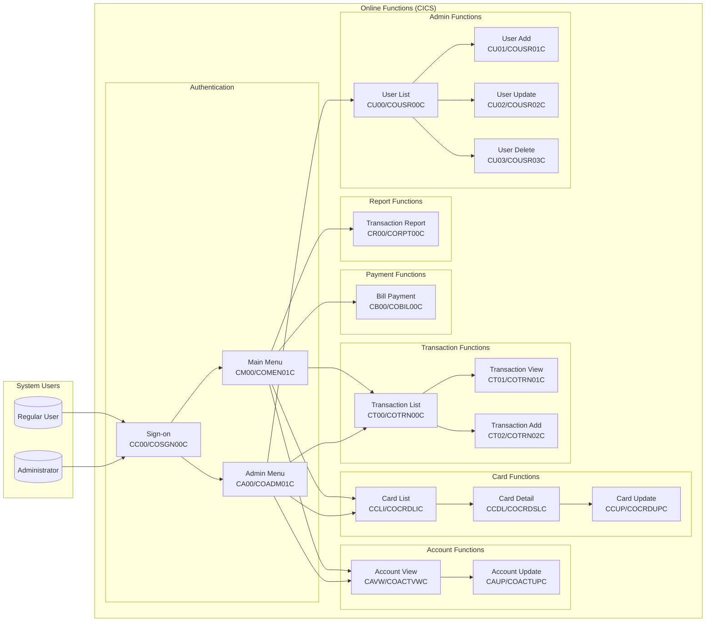
```mermaid
flowchart LR
    subgraph Users["System Users"]
        U1[("Regular User")]
        U2[("Administrator")]
    end

    subgraph OnlineUseCases["Online Functions (CICS)"]
        direction TB
        
        subgraph Auth["Authentication"]
            A1[Sign-on<br/>CC00/COSGN00C]
            A2[Main Menu<br/>CM00/COMEN01C]
            A3[Admin Menu<br/>CA00/COADM01C]
        end

        subgraph Account["Account Functions"]
            B1[Account View<br/>CAVW/COACTVWC]
            B2[Account Update<br/>CAUP/COACTUPC]
        end

        subgraph Card["Card Functions"]
            C1[Card List<br/>CCLI/COCRDLIC]
            C2[Card Detail<br/>CCDL/COCRDSLC]
            C3[Card Update<br/>CCUP/COCRDUPC]
        end

        subgraph Transaction["Transaction Functions"]
            D1[Transaction List<br/>CT00/COTRN00C]
            D2[Transaction View<br/>CT01/COTRN01C]
            D3[Transaction Add<br/>CT02/COTRN02C]
        end

        subgraph Payment["Payment Functions"]
            E1[Bill Payment<br/>CB00/COBIL00C]
        end

        subgraph Report["Report Functions"]
            F1[Transaction Report<br/>CR00/CORPT00C]
        end

        subgraph Admin["Admin Functions"]
            G1[User List<br/>CU00/COUSR00C]
            G2[User Add<br/>CU01/COUSR01C]
            G3[User Update<br/>CU02/COUSR02C]
            G4[User Delete<br/>CU03/COUSR03C]
        end
    end

    U1 --> A1
    A1 --> A2
    A2 --> B1 & C1 & D1 & E1 & F1
    
    U2 --> A1
    A1 --> A3
    A3 --> G1 & B1 & C1 & D1
    
    B1 --> B2
    C1 --> C2
    C2 --> C3
    D1 --> D2
    D1 --> D3
    G1 --> G2 & G3 & G4
```

### 1.3 Batch Use Cases (JCL)

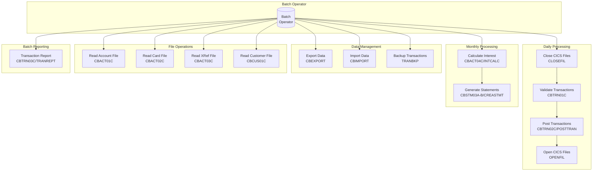
```mermaid
flowchart TB
    subgraph BatchOperator["Batch Operator"]
        OP[("Batch<br/>Operator")]
    end

    subgraph DailyProcessing["Daily Processing"]
        BP1[Close CICS Files<br/>CLOSEFIL]
        BP2[Validate Transactions<br/>CBTRN01C]
        BP3[Post Transactions<br/>CBTRN02C/POSTTRAN]
        BP4[Open CICS Files<br/>OPENFIL]
    end

    subgraph MonthlyProcessing["Monthly Processing"]
        MP1[Calculate Interest<br/>CBACT04C/INTCALC]
        MP2[Generate Statements<br/>CBSTM03A-B/CREASTMT]
    end

    subgraph DataManagement["Data Management"]
        DM1[Export Data<br/>CBEXPORT]
        DM2[Import Data<br/>CBIMPORT]
        DM3[Backup Transactions<br/>TRANBKP]
    end

    subgraph FileOperations["File Operations"]
        FO1[Read Account File<br/>CBACT01C]
        FO2[Read Card File<br/>CBACT02C]
        FO3[Read XRef File<br/>CBACT03C]
        FO4[Read Customer File<br/>CBCUS01C]
    end

    subgraph Reporting["Batch Reporting"]
        BR1[Transaction Report<br/>CBTRN03C/TRANREPT]
    end

    OP --> BP1
    BP1 --> BP2
    BP2 --> BP3
    BP3 --> BP4

    OP --> MP1
    MP1 --> MP2

    OP --> DM1 & DM2 & DM3
    OP --> FO1 & FO2 & FO3 & FO4
    OP --> BR1
```

---

## 2. User Journey Maps

### 2.1 Cardholder Journey - View Account and Make Payment

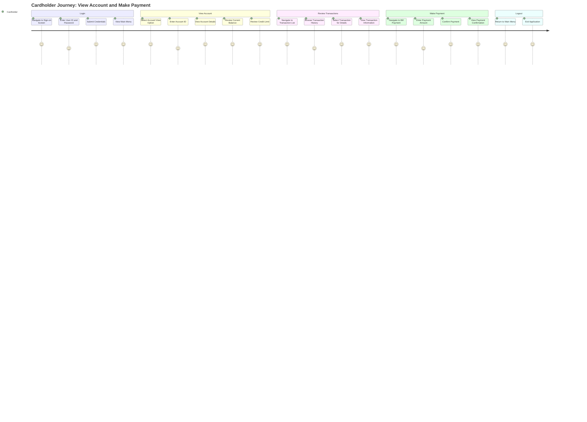
```mermaid
journey
    title Cardholder Journey: View Account and Make Payment
    section Login
        Navigate to Sign-on Screen: 5: Cardholder
        Enter User ID and Password: 4: Cardholder
        Submit Credentials: 5: Cardholder
        View Main Menu: 5: Cardholder
    section View Account
        Select Account View Option: 5: Cardholder
        Enter Account ID: 4: Cardholder
        View Account Details: 5: Cardholder
        Review Current Balance: 5: Cardholder
        Review Credit Limit: 5: Cardholder
    section Review Transactions
        Navigate to Transaction List: 5: Cardholder
        Browse Transaction History: 4: Cardholder
        Select Transaction for Details: 5: Cardholder
        View Transaction Information: 5: Cardholder
    section Make Payment
        Navigate to Bill Payment: 5: Cardholder
        Enter Payment Amount: 4: Cardholder
        Confirm Payment: 5: Cardholder
        View Payment Confirmation: 5: Cardholder
    section Logout
        Return to Main Menu: 5: Cardholder
        Exit Application: 5: Cardholder
```

### 2.2 Customer Service Representative Journey - Assist Customer

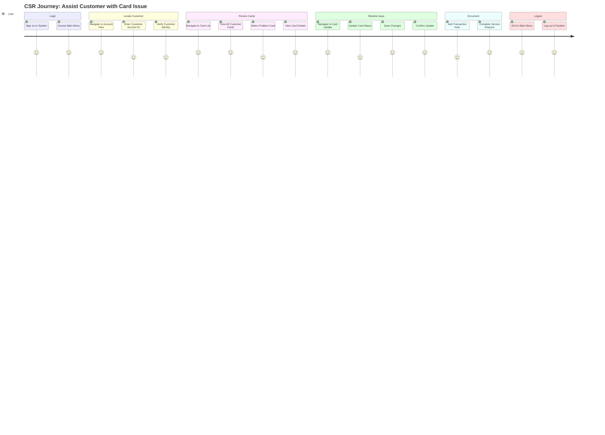
```mermaid
journey
    title CSR Journey: Assist Customer with Card Issue
    section Login
        Sign on to System: 5: CSR
        Access Main Menu: 5: CSR
    section Locate Customer
        Navigate to Account View: 5: CSR
        Enter Customer Account ID: 4: CSR
        Verify Customer Identity: 4: CSR
    section Review Cards
        Navigate to Card List: 5: CSR
        View All Customer Cards: 5: CSR
        Select Problem Card: 4: CSR
        View Card Details: 5: CSR
    section Resolve Issue
        Navigate to Card Update: 5: CSR
        Update Card Status: 4: CSR
        Save Changes: 5: CSR
        Confirm Update: 5: CSR
    section Document
        Add Transaction Note: 4: CSR
        Complete Service Request: 5: CSR
    section Logout
        Exit to Main Menu: 5: CSR
        Log out of System: 5: CSR
```

### 2.3 Administrator Journey - User Management

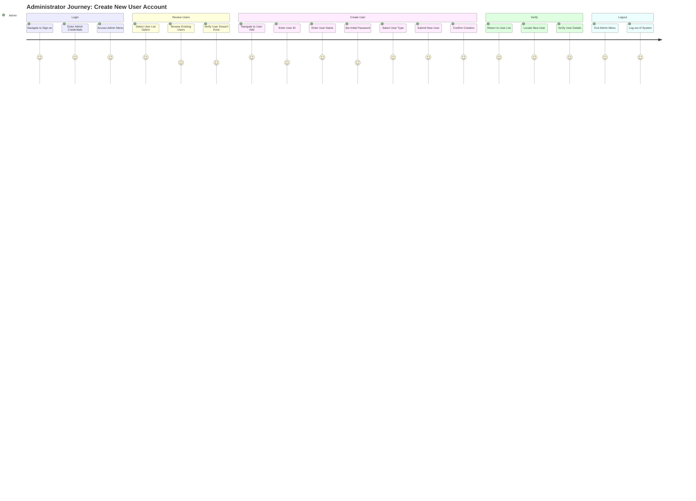
```mermaid
journey
    title Administrator Journey: Create New User Account
    section Login
        Navigate to Sign-on: 5: Admin
        Enter Admin Credentials: 5: Admin
        Access Admin Menu: 5: Admin
    section Review Users
        Select User List Option: 5: Admin
        Browse Existing Users: 4: Admin
        Verify User Doesn't Exist: 4: Admin
    section Create User
        Navigate to User Add: 5: Admin
        Enter User ID: 4: Admin
        Enter User Name: 5: Admin
        Set Initial Password: 4: Admin
        Select User Type: 5: Admin
        Submit New User: 5: Admin
        Confirm Creation: 5: Admin
    section Verify
        Return to User List: 5: Admin
        Locate New User: 5: Admin
        Verify User Details: 5: Admin
    section Logout
        Exit Admin Menu: 5: Admin
        Log out of System: 5: Admin
```

### 2.4 Batch Operator Journey - End of Day Processing

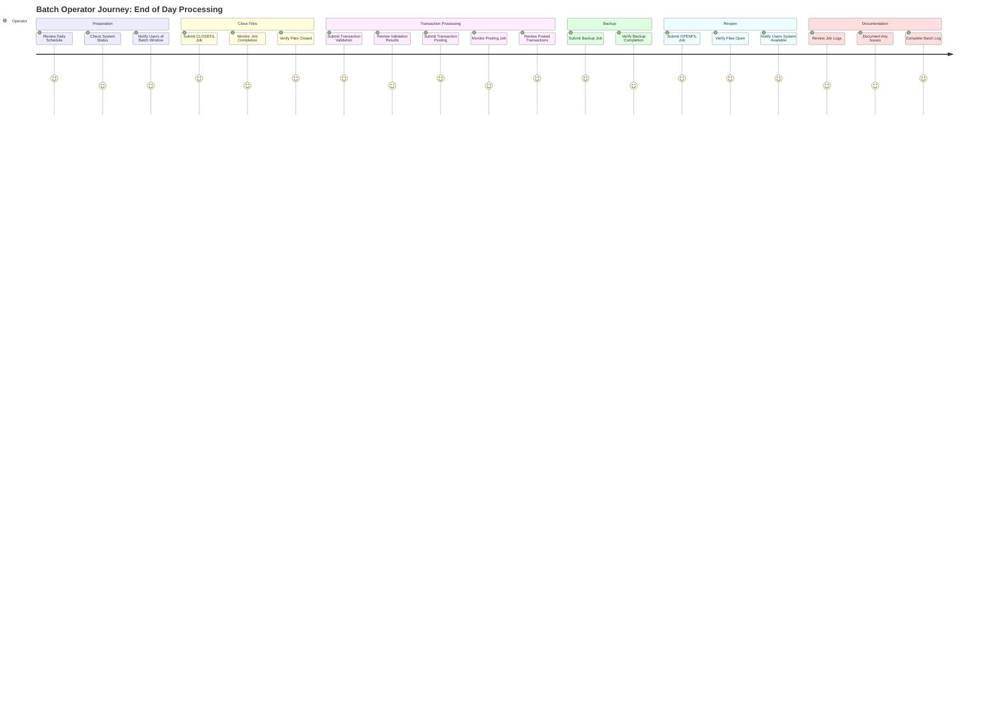
```mermaid
journey
    title Batch Operator Journey: End of Day Processing
    section Preparation
        Review Daily Schedule: 5: Operator
        Check System Status: 4: Operator
        Notify Users of Batch Window: 4: Operator
    section Close Files
        Submit CLOSEFIL Job: 5: Operator
        Monitor Job Completion: 4: Operator
        Verify Files Closed: 5: Operator
    section Transaction Processing
        Submit Transaction Validation: 5: Operator
        Review Validation Results: 4: Operator
        Submit Transaction Posting: 5: Operator
        Monitor Posting Job: 4: Operator
        Review Posted Transactions: 5: Operator
    section Backup
        Submit Backup Job: 5: Operator
        Verify Backup Completion: 4: Operator
    section Reopen
        Submit OPENFIL Job: 5: Operator
        Verify Files Open: 5: Operator
        Notify Users System Available: 5: Operator
    section Documentation
        Review Job Logs: 4: Operator
        Document Any Issues: 4: Operator
        Complete Batch Log: 5: Operator
```

### 2.5 Fraud Analyst Journey - Investigate Suspicious Transaction

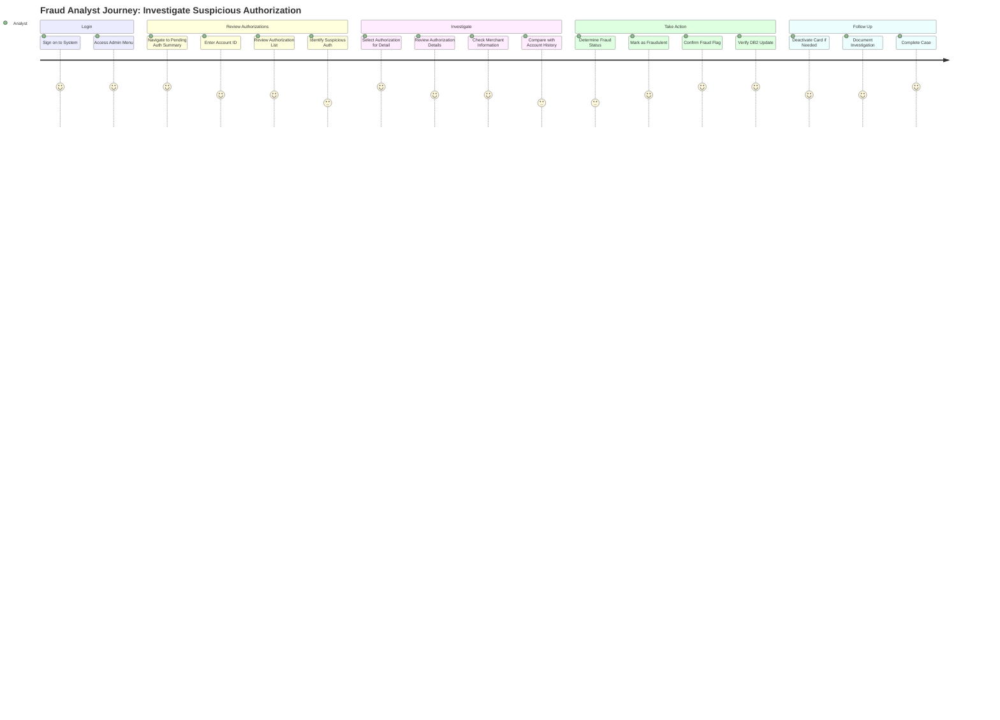
```mermaid
journey
    title Fraud Analyst Journey: Investigate Suspicious Authorization
    section Login
        Sign on to System: 5: Analyst
        Access Admin Menu: 5: Analyst
    section Review Authorizations
        Navigate to Pending Auth Summary: 5: Analyst
        Enter Account ID: 4: Analyst
        Review Authorization List: 4: Analyst
        Identify Suspicious Auth: 3: Analyst
    section Investigate
        Select Authorization for Detail: 5: Analyst
        Review Authorization Details: 4: Analyst
        Check Merchant Information: 4: Analyst
        Compare with Account History: 3: Analyst
    section Take Action
        Determine Fraud Status: 3: Analyst
        Mark as Fraudulent: 4: Analyst
        Confirm Fraud Flag: 5: Analyst
        Verify DB2 Update: 5: Analyst
    section Follow Up
        Deactivate Card if Needed: 4: Analyst
        Document Investigation: 4: Analyst
        Complete Case: 5: Analyst
```

---

## 3. User Personas

### 3.1 User Persona Overview

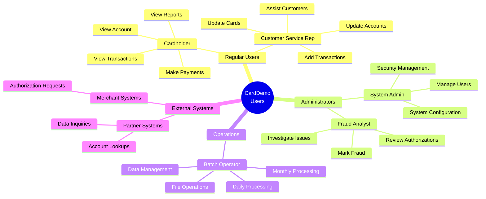
```mermaid
mindmap
    root((CardDemo<br/>Users))
        Regular Users
            Cardholder
                View Account
                View Transactions
                Make Payments
                View Reports
            Customer Service Rep
                Assist Customers
                Update Accounts
                Update Cards
                Add Transactions
        Administrators
            System Admin
                Manage Users
                System Configuration
                Security Management
            Fraud Analyst
                Review Authorizations
                Mark Fraud
                Investigate Issues
        Operations
            Batch Operator
                Daily Processing
                Monthly Processing
                Data Management
                File Operations
        External Systems
            Merchant Systems
                Authorization Requests
            Partner Systems
                Data Inquiries
                Account Lookups
```

### 3.2 Cardholder Persona

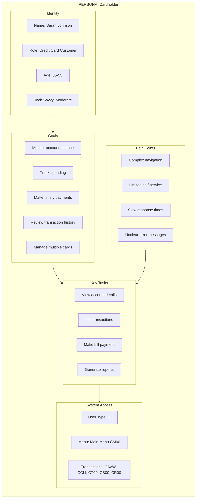
```mermaid
flowchart TB
    subgraph Persona["PERSONA: Cardholder"]
        direction TB
        
        subgraph Identity["Identity"]
            Name["Name: Sarah Johnson"]
            Role["Role: Credit Card Customer"]
            Age["Age: 35-55"]
            Tech["Tech Savvy: Moderate"]
        end

        subgraph Goals["Goals"]
            G1["Monitor account balance"]
            G2["Track spending"]
            G3["Make timely payments"]
            G4["Review transaction history"]
            G5["Manage multiple cards"]
        end

        subgraph Frustrations["Pain Points"]
            F1["Complex navigation"]
            F2["Limited self-service"]
            F3["Slow response times"]
            F4["Unclear error messages"]
        end

        subgraph Tasks["Key Tasks"]
            T1["View account details"]
            T2["List transactions"]
            T3["Make bill payment"]
            T4["Generate reports"]
        end

        subgraph Access["System Access"]
            A1["User Type: U"]
            A2["Menu: Main Menu CM00"]
            A3["Transactions: CAVW, CCLI, CT00, CB00, CR00"]
        end
    end

    Identity --> Goals
    Goals --> Tasks
    Frustrations --> Tasks
    Tasks --> Access
```

### 3.3 Customer Service Representative Persona

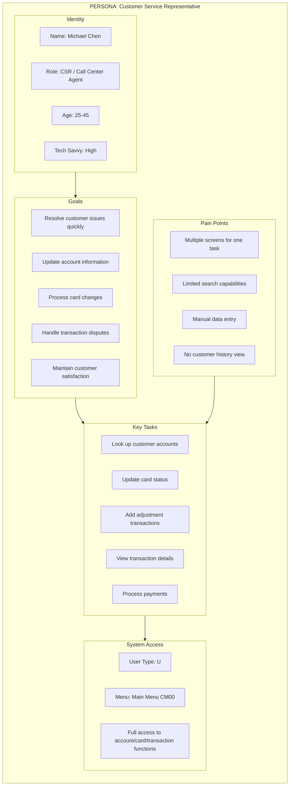
```mermaid
flowchart TB
    subgraph Persona["PERSONA: Customer Service Representative"]
        direction TB
        
        subgraph Identity["Identity"]
            Name["Name: Michael Chen"]
            Role["Role: CSR / Call Center Agent"]
            Age["Age: 25-45"]
            Tech["Tech Savvy: High"]
        end

        subgraph Goals["Goals"]
            G1["Resolve customer issues quickly"]
            G2["Update account information"]
            G3["Process card changes"]
            G4["Handle transaction disputes"]
            G5["Maintain customer satisfaction"]
        end

        subgraph Frustrations["Pain Points"]
            F1["Multiple screens for one task"]
            F2["Limited search capabilities"]
            F3["Manual data entry"]
            F4["No customer history view"]
        end

        subgraph Tasks["Key Tasks"]
            T1["Look up customer accounts"]
            T2["Update card status"]
            T3["Add adjustment transactions"]
            T4["View transaction details"]
            T5["Process payments"]
        end

        subgraph Access["System Access"]
            A1["User Type: U"]
            A2["Menu: Main Menu CM00"]
            A3["Full access to account/card/transaction functions"]
        end
    end

    Identity --> Goals
    Goals --> Tasks
    Frustrations --> Tasks
    Tasks --> Access
```

### 3.4 System Administrator Persona

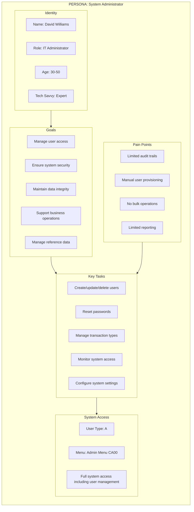
```mermaid
flowchart TB
    subgraph Persona["PERSONA: System Administrator"]
        direction TB
        
        subgraph Identity["Identity"]
            Name["Name: David Williams"]
            Role["Role: IT Administrator"]
            Age["Age: 30-50"]
            Tech["Tech Savvy: Expert"]
        end

        subgraph Goals["Goals"]
            G1["Manage user access"]
            G2["Ensure system security"]
            G3["Maintain data integrity"]
            G4["Support business operations"]
            G5["Manage reference data"]
        end

        subgraph Frustrations["Pain Points"]
            F1["Limited audit trails"]
            F2["Manual user provisioning"]
            F3["No bulk operations"]
            F4["Limited reporting"]
        end

        subgraph Tasks["Key Tasks"]
            T1["Create/update/delete users"]
            T2["Reset passwords"]
            T3["Manage transaction types"]
            T4["Monitor system access"]
            T5["Configure system settings"]
        end

        subgraph Access["System Access"]
            A1["User Type: A"]
            A2["Menu: Admin Menu CA00"]
            A3["Full system access including user management"]
        end
    end

    Identity --> Goals
    Goals --> Tasks
    Frustrations --> Tasks
    Tasks --> Access
```

### 3.5 Batch Operator Persona

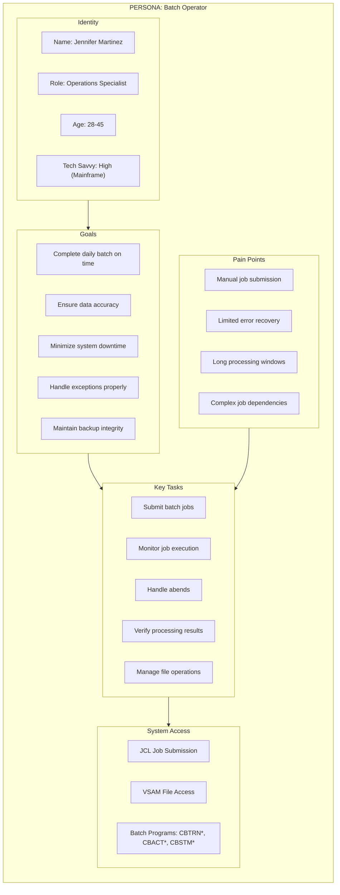
```mermaid
flowchart TB
    subgraph Persona["PERSONA: Batch Operator"]
        direction TB
        
        subgraph Identity["Identity"]
            Name["Name: Jennifer Martinez"]
            Role["Role: Operations Specialist"]
            Age["Age: 28-45"]
            Tech["Tech Savvy: High (Mainframe)"]
        end

        subgraph Goals["Goals"]
            G1["Complete daily batch on time"]
            G2["Ensure data accuracy"]
            G3["Minimize system downtime"]
            G4["Handle exceptions properly"]
            G5["Maintain backup integrity"]
        end

        subgraph Frustrations["Pain Points"]
            F1["Manual job submission"]
            F2["Limited error recovery"]
            F3["Long processing windows"]
            F4["Complex job dependencies"]
        end

        subgraph Tasks["Key Tasks"]
            T1["Submit batch jobs"]
            T2["Monitor job execution"]
            T3["Handle abends"]
            T4["Verify processing results"]
            T5["Manage file operations"]
        end

        subgraph Access["System Access"]
            A1["JCL Job Submission"]
            A2["VSAM File Access"]
            A3["Batch Programs: CBTRN*, CBACT*, CBSTM*"]
        end
    end

    Identity --> Goals
    Goals --> Tasks
    Frustrations --> Tasks
    Tasks --> Access
```

---

## 4. Domain Model (Business Entities)

### 4.1 Core Domain Model

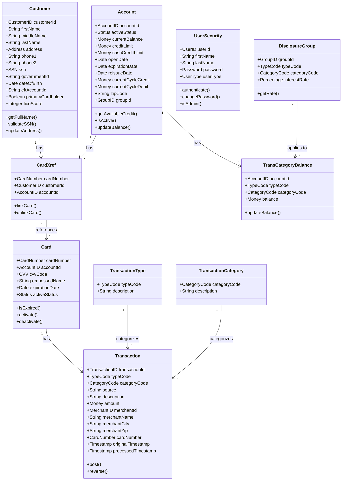
```mermaid
classDiagram
    class Customer {
        +CustomerID customerId
        +String firstName
        +String middleName
        +String lastName
        +Address address
        +String phone1
        +String phone2
        +SSN ssn
        +String governmentId
        +Date dateOfBirth
        +String eftAccountId
        +Boolean primaryCardholder
        +Integer ficoScore
        +getFullName()
        +validateSSN()
        +updateAddress()
    }

    class Account {
        +AccountID accountId
        +Status activeStatus
        +Money currentBalance
        +Money creditLimit
        +Money cashCreditLimit
        +Date openDate
        +Date expirationDate
        +Date reissueDate
        +Money currentCycleCredit
        +Money currentCycleDebit
        +String zipCode
        +GroupID groupId
        +getAvailableCredit()
        +isActive()
        +updateBalance()
    }

    class Card {
        +CardNumber cardNumber
        +AccountID accountId
        +CVV cvvCode
        +String embossedName
        +Date expirationDate
        +Status activeStatus
        +isExpired()
        +activate()
        +deactivate()
    }

    class Transaction {
        +TransactionID transactionId
        +TypeCode typeCode
        +CategoryCode categoryCode
        +String source
        +String description
        +Money amount
        +MerchantID merchantId
        +String merchantName
        +String merchantCity
        +String merchantZip
        +CardNumber cardNumber
        +Timestamp originalTimestamp
        +Timestamp processedTimestamp
        +post()
        +reverse()
    }

    class CardXref {
        +CardNumber cardNumber
        +CustomerID customerId
        +AccountID accountId
        +linkCard()
        +unlinkCard()
    }

    class UserSecurity {
        +UserID userId
        +String firstName
        +String lastName
        +Password password
        +UserType userType
        +authenticate()
        +changePassword()
        +isAdmin()
    }

    class TransactionType {
        +TypeCode typeCode
        +String description
    }

    class TransactionCategory {
        +CategoryCode categoryCode
        +String description
    }

    class TransCategoryBalance {
        +AccountID accountId
        +TypeCode typeCode
        +CategoryCode categoryCode
        +Money balance
        +updateBalance()
    }

    class DisclosureGroup {
        +GroupID groupId
        +TypeCode typeCode
        +CategoryCode categoryCode
        +Percentage interestRate
        +getRate()
    }

    Customer "1" --> "*" CardXref : has
    Account "1" --> "*" CardXref : has
    CardXref "1" --> "1" Card : references
    Card "1" --> "*" Transaction : has
    Account "1" --> "*" TransCategoryBalance : has
    DisclosureGroup "1" --> "*" TransCategoryBalance : applies to
    TransactionType "1" --> "*" Transaction : categorizes
    TransactionCategory "1" --> "*" Transaction : categorizes
```

### 4.2 Aggregate Boundaries

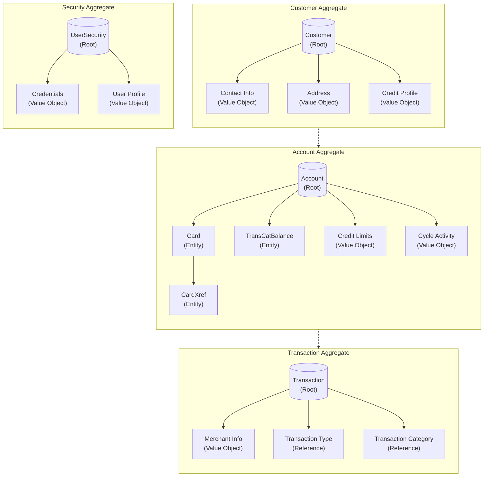
```mermaid
flowchart TB
    subgraph CustomerAggregate["Customer Aggregate"]
        direction TB
        C1[("Customer<br/>(Root)")]
        C2["Contact Info<br/>(Value Object)"]
        C3["Address<br/>(Value Object)"]
        C4["Credit Profile<br/>(Value Object)"]
        
        C1 --> C2
        C1 --> C3
        C1 --> C4
    end

    subgraph AccountAggregate["Account Aggregate"]
        direction TB
        A1[("Account<br/>(Root)")]
        A2["Card<br/>(Entity)"]
        A3["CardXref<br/>(Entity)"]
        A4["TransCatBalance<br/>(Entity)"]
        A5["Credit Limits<br/>(Value Object)"]
        A6["Cycle Activity<br/>(Value Object)"]
        
        A1 --> A2
        A2 --> A3
        A1 --> A4
        A1 --> A5
        A1 --> A6
    end

    subgraph TransactionAggregate["Transaction Aggregate"]
        direction TB
        T1[("Transaction<br/>(Root)")]
        T2["Merchant Info<br/>(Value Object)"]
        T3["Transaction Type<br/>(Reference)"]
        T4["Transaction Category<br/>(Reference)"]
        
        T1 --> T2
        T1 --> T3
        T1 --> T4
    end

    subgraph SecurityAggregate["Security Aggregate"]
        direction TB
        S1[("UserSecurity<br/>(Root)")]
        S2["Credentials<br/>(Value Object)"]
        S3["User Profile<br/>(Value Object)"]
        
        S1 --> S2
        S1 --> S3
    end

    CustomerAggregate -.-> AccountAggregate
    AccountAggregate -.-> TransactionAggregate
```

### 4.3 Domain Services

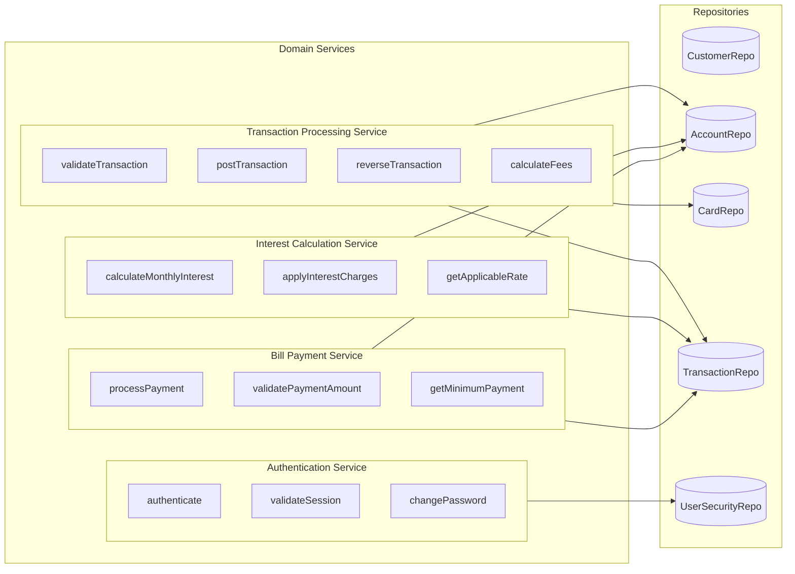
```mermaid
flowchart LR
    subgraph DomainServices["Domain Services"]
        direction TB
        
        subgraph TransactionService["Transaction Processing Service"]
            TS1[validateTransaction]
            TS2[postTransaction]
            TS3[reverseTransaction]
            TS4[calculateFees]
        end

        subgraph InterestService["Interest Calculation Service"]
            IS1[calculateMonthlyInterest]
            IS2[applyInterestCharges]
            IS3[getApplicableRate]
        end

        subgraph AuthService["Authentication Service"]
            AS1[authenticate]
            AS2[validateSession]
            AS3[changePassword]
        end

        subgraph PaymentService["Bill Payment Service"]
            PS1[processPayment]
            PS2[validatePaymentAmount]
            PS3[getMinimumPayment]
        end
    end

    subgraph Repositories["Repositories"]
        R1[(CustomerRepo)]
        R2[(AccountRepo)]
        R3[(CardRepo)]
        R4[(TransactionRepo)]
        R5[(UserSecurityRepo)]
    end

    TransactionService --> R2 & R3 & R4
    InterestService --> R2 & R4
    AuthService --> R5
    PaymentService --> R2 & R4
```

---

## 5. BDAT Architecture

### 5.1 Complete BDAT Architecture

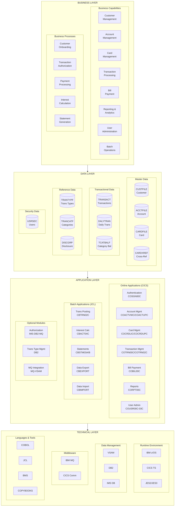
```mermaid
flowchart TB
    subgraph Business["BUSINESS LAYER"]
        direction TB
        
        subgraph Capabilities["Business Capabilities"]
            BC1["Customer<br/>Management"]
            BC2["Account<br/>Management"]
            BC3["Card<br/>Management"]
            BC4["Transaction<br/>Processing"]
            BC5["Bill<br/>Payment"]
            BC6["Reporting &<br/>Analytics"]
            BC7["User<br/>Administration"]
            BC8["Batch<br/>Operations"]
        end

        subgraph Processes["Business Processes"]
            BP1["Customer<br/>Onboarding"]
            BP2["Transaction<br/>Authorization"]
            BP3["Payment<br/>Processing"]
            BP4["Interest<br/>Calculation"]
            BP5["Statement<br/>Generation"]
        end
    end

    subgraph Data["DATA LAYER"]
        direction TB
        
        subgraph MasterData["Master Data"]
            MD1[("CUSTFILE<br/>Customer")]
            MD2[("ACCTFILE<br/>Account")]
            MD3[("CARDFILE<br/>Card")]
            MD4[("CARDXREF<br/>Cross-Ref")]
        end

        subgraph TransactionalData["Transactional Data"]
            TD1[("TRANSACT<br/>Transactions")]
            TD2[("DALYTRAN<br/>Daily Trans")]
            TD3[("TCATBALF<br/>Category Bal")]
        end

        subgraph ReferenceData["Reference Data"]
            RD1[("TRANTYPF<br/>Trans Types")]
            RD2[("TRANCATF<br/>Categories")]
            RD3[("DISCGRP<br/>Disclosure")]
        end

        subgraph SecurityData["Security Data"]
            SD1[("USRSEC<br/>Users")]
        end
    end

    subgraph Application["APPLICATION LAYER"]
        direction TB
        
        subgraph OnlineApps["Online Applications (CICS)"]
            OA1["Authentication<br/>COSGN00C"]
            OA2["Account Mgmt<br/>COACTVWC/COACTUPC"]
            OA3["Card Mgmt<br/>COCRDLIC/COCRDUPC"]
            OA4["Transaction Mgmt<br/>COTRN00C/COTRN02C"]
            OA5["Bill Payment<br/>COBIL00C"]
            OA6["Reports<br/>CORPT00C"]
            OA7["User Admin<br/>COUSR00C-03C"]
        end

        subgraph BatchApps["Batch Applications (JCL)"]
            BA1["Trans Posting<br/>CBTRN02C"]
            BA2["Interest Calc<br/>CBACT04C"]
            BA3["Statements<br/>CBSTM03A/B"]
            BA4["Data Export<br/>CBEXPORT"]
            BA5["Data Import<br/>CBIMPORT"]
        end

        subgraph OptionalApps["Optional Modules"]
            OP1["Authorization<br/>IMS-DB2-MQ"]
            OP2["Trans Type Mgmt<br/>DB2"]
            OP3["MQ Integration<br/>MQ-VSAM"]
        end
    end

    subgraph Technical["TECHNICAL LAYER"]
        direction TB
        
        subgraph Runtime["Runtime Environment"]
            RT1["IBM z/OS"]
            RT2["CICS TS"]
            RT3["JES2/JES3"]
        end

        subgraph DataMgmt["Data Management"]
            DM1["VSAM"]
            DM2["DB2"]
            DM3["IMS DB"]
        end

        subgraph Middleware["Middleware"]
            MW1["IBM MQ"]
            MW2["CICS Comm"]
        end

        subgraph Languages["Languages & Tools"]
            LT1["COBOL"]
            LT2["JCL"]
            LT3["BMS"]
            LT4["COPYBOOKS"]
        end
    end

    Business --> Data
    Data --> Application
    Application --> Technical
```

### 5.2 Business Architecture

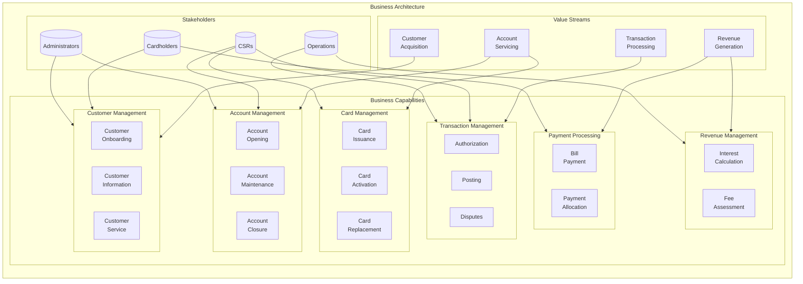
```mermaid
flowchart TB
    subgraph BusinessArchitecture["Business Architecture"]
        direction TB
        
        subgraph ValueStreams["Value Streams"]
            VS1["Customer<br/>Acquisition"]
            VS2["Account<br/>Servicing"]
            VS3["Transaction<br/>Processing"]
            VS4["Revenue<br/>Generation"]
        end

        subgraph Capabilities["Business Capabilities"]
            direction LR
            
            subgraph CustomerCap["Customer Management"]
                C1["Customer<br/>Onboarding"]
                C2["Customer<br/>Information"]
                C3["Customer<br/>Service"]
            end

            subgraph AccountCap["Account Management"]
                A1["Account<br/>Opening"]
                A2["Account<br/>Maintenance"]
                A3["Account<br/>Closure"]
            end

            subgraph CardCap["Card Management"]
                D1["Card<br/>Issuance"]
                D2["Card<br/>Activation"]
                D3["Card<br/>Replacement"]
            end

            subgraph TransCap["Transaction Management"]
                T1["Authorization"]
                T2["Posting"]
                T3["Disputes"]
            end

            subgraph PaymentCap["Payment Processing"]
                P1["Bill<br/>Payment"]
                P2["Payment<br/>Allocation"]
            end

            subgraph RevenueCap["Revenue Management"]
                R1["Interest<br/>Calculation"]
                R2["Fee<br/>Assessment"]
            end
        end

        subgraph Stakeholders["Stakeholders"]
            ST1[("Cardholders")]
            ST2[("CSRs")]
            ST3[("Administrators")]
            ST4[("Operations")]
        end
    end

    VS1 --> CustomerCap
    VS2 --> AccountCap & CardCap
    VS3 --> TransCap
    VS4 --> PaymentCap & RevenueCap

    ST1 --> CustomerCap & PaymentCap
    ST2 --> AccountCap & CardCap & TransCap
    ST3 --> CustomerCap & AccountCap
    ST4 --> TransCap & RevenueCap
```

### 5.3 Application Architecture

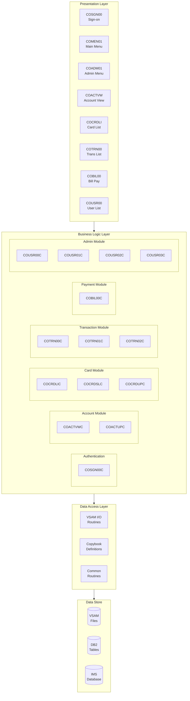
```mermaid
flowchart TB
    subgraph Presentation["Presentation Layer"]
        direction LR
        BMS1["COSGN00<br/>Sign-on"]
        BMS2["COMEN01<br/>Main Menu"]
        BMS3["COADM01<br/>Admin Menu"]
        BMS4["COACTVW<br/>Account View"]
        BMS5["COCRDLI<br/>Card List"]
        BMS6["COTRN00<br/>Trans List"]
        BMS7["COBIL00<br/>Bill Pay"]
        BMS8["COUSR00<br/>User List"]
    end

    subgraph BusinessLogic["Business Logic Layer"]
        direction LR
        
        subgraph AuthModule["Authentication"]
            BL1["COSGN00C"]
        end

        subgraph AccountModule["Account Module"]
            BL2["COACTVWC"]
            BL3["COACTUPC"]
        end

        subgraph CardModule["Card Module"]
            BL4["COCRDLIC"]
            BL5["COCRDSLC"]
            BL6["COCRDUPC"]
        end

        subgraph TransModule["Transaction Module"]
            BL7["COTRN00C"]
            BL8["COTRN01C"]
            BL9["COTRN02C"]
        end

        subgraph PaymentModule["Payment Module"]
            BL10["COBIL00C"]
        end

        subgraph AdminModule["Admin Module"]
            BL11["COUSR00C"]
            BL12["COUSR01C"]
            BL13["COUSR02C"]
            BL14["COUSR03C"]
        end
    end

    subgraph DataAccess["Data Access Layer"]
        direction LR
        DA1["VSAM I/O<br/>Routines"]
        DA2["Copybook<br/>Definitions"]
        DA3["Common<br/>Routines"]
    end

    subgraph DataStore["Data Store"]
        direction LR
        DS1[("VSAM<br/>Files")]
        DS2[("DB2<br/>Tables")]
        DS3[("IMS<br/>Database")]
    end

    Presentation --> BusinessLogic
    BusinessLogic --> DataAccess
    DataAccess --> DataStore
```

### 5.4 Technical Architecture

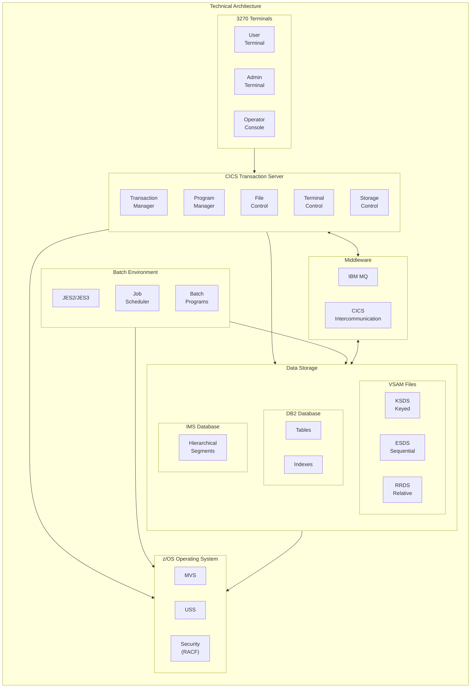
```mermaid
flowchart TB
    subgraph TechnicalArchitecture["Technical Architecture"]
        direction TB
        
        subgraph Terminals["3270 Terminals"]
            T1["User<br/>Terminal"]
            T2["Admin<br/>Terminal"]
            T3["Operator<br/>Console"]
        end

        subgraph CICS["CICS Transaction Server"]
            direction TB
            C1["Transaction<br/>Manager"]
            C2["Program<br/>Manager"]
            C3["File<br/>Control"]
            C4["Terminal<br/>Control"]
            C5["Storage<br/>Control"]
        end

        subgraph Batch["Batch Environment"]
            direction TB
            B1["JES2/JES3"]
            B2["Job<br/>Scheduler"]
            B3["Batch<br/>Programs"]
        end

        subgraph Storage["Data Storage"]
            direction TB
            
            subgraph VSAM["VSAM Files"]
                V1["KSDS<br/>Keyed"]
                V2["ESDS<br/>Sequential"]
                V3["RRDS<br/>Relative"]
            end

            subgraph DB2["DB2 Database"]
                D1["Tables"]
                D2["Indexes"]
            end

            subgraph IMS["IMS Database"]
                I1["Hierarchical<br/>Segments"]
            end
        end

        subgraph Middleware["Middleware"]
            M1["IBM MQ"]
            M2["CICS<br/>Intercommunication"]
        end

        subgraph OS["z/OS Operating System"]
            O1["MVS"]
            O2["USS"]
            O3["Security<br/>(RACF)"]
        end
    end

    Terminals --> CICS
    CICS --> Storage
    Batch --> Storage
    CICS <--> Middleware
    Middleware <--> Storage
    CICS --> OS
    Batch --> OS
    Storage --> OS
```

---

## 6. Data Model/Schema

### 6.1 Complete Entity Relationship Diagram

```mermaid
erDiagram
    CUSTOMER ||--o{ CARD_XREF : "has cards"
    ACCOUNT ||--o{ CARD_XREF : "has cards"
    CARD_XREF ||--|| CARD : "references"
    CARD ||--o{ TRANSACTION : "has transactions"
    ACCOUNT ||--o{ TRANS_CAT_BALANCE : "has balances"
    DISCLOSURE_GROUP ||--o{ TRANS_CAT_BALANCE : "applies rates"
    TRANSACTION_TYPE ||--o{ TRANSACTION : "categorizes"
    TRANSACTION_CATEGORY ||--o{ TRANSACTION : "categorizes"

    CUSTOMER {
        string CUST_ID PK "9 digits"
        string CUST_FIRST_NAME "25 chars"
        string CUST_MIDDLE_NAME "25 chars"
        string CUST_LAST_NAME "25 chars"
        string CUST_ADDR_LINE_1 "50 chars"
        string CUST_ADDR_LINE_2 "50 chars"
        string CUST_ADDR_LINE_3 "50 chars"
        string CUST_ADDR_STATE_CD "2 chars"
        string CUST_ADDR_COUNTRY_CD "3 chars"
        string CUST_ADDR_ZIP "10 chars"
        string CUST_PHONE_NUM_1 "15 chars"
        string CUST_PHONE_NUM_2 "15 chars"
        string CUST_SSN "9 digits"
        string CUST_GOVT_ISSUED_ID "20 chars"
        string CUST_DOB_YYYY_MM_DD "10 chars"
        string CUST_EFT_ACCOUNT_ID "10 chars"
        string CUST_PRI_CARD_HOLDER_IND "1 char Y/N"
        number CUST_FICO_CREDIT_SCORE "3 digits"
    }

    ACCOUNT {
        string ACCT_ID PK "11 digits"
        string ACCT_ACTIVE_STATUS "1 char Y/N"
        decimal ACCT_CURR_BAL "S9(10)V99"
        decimal ACCT_CREDIT_LIMIT "S9(10)V99"
        decimal ACCT_CASH_CREDIT_LIMIT "S9(10)V99"
        string ACCT_OPEN_DATE "10 chars"
        string ACCT_EXPIRAION_DATE "10 chars"
        string ACCT_REISSUE_DATE "10 chars"
        decimal ACCT_CURR_CYC_CREDIT "S9(10)V99"
        decimal ACCT_CURR_CYC_DEBIT "S9(10)V99"
        string ACCT_ADDR_ZIP "10 chars"
        string ACCT_GROUP_ID "10 chars"
    }

    CARD {
        string CARD_NUM PK "16 chars"
        string CARD_ACCT_ID FK "11 digits"
        string CARD_CVV_CD "3 digits"
        string CARD_EMBOSSED_NAME "50 chars"
        string CARD_EXPIRAION_DATE "10 chars"
        string CARD_ACTIVE_STATUS "1 char Y/N"
    }

    CARD_XREF {
        string XREF_CARD_NUM PK "16 chars"
        string XREF_CUST_ID FK "9 digits"
        string XREF_ACCT_ID FK "11 digits"
    }

    TRANSACTION {
        string TRAN_ID PK "16 chars"
        string TRAN_TYPE_CD FK "2 chars"
        string TRAN_CAT_CD FK "4 digits"
        string TRAN_SOURCE "10 chars"
        string TRAN_DESC "100 chars"
        decimal TRAN_AMT "S9(09)V99"
        string TRAN_MERCHANT_ID "9 digits"
        string TRAN_MERCHANT_NAME "50 chars"
        string TRAN_MERCHANT_CITY "50 chars"
        string TRAN_MERCHANT_ZIP "10 chars"
        string TRAN_CARD_NUM FK "16 chars"
        string TRAN_ORIG_TS "26 chars"
        string TRAN_PROC_TS "26 chars"
    }

    USER_SECURITY {
        string SEC_USR_ID PK "8 chars"
        string SEC_USR_FNAME "20 chars"
        string SEC_USR_LNAME "20 chars"
        string SEC_USR_PWD "8 chars"
        string SEC_USR_TYPE "1 char A/U"
    }

    TRANSACTION_TYPE {
        string TRAN_TYPE_CD PK "2 chars"
        string TRAN_TYPE_DESC "50 chars"
    }

    TRANSACTION_CATEGORY {
        string TRAN_CAT_CD PK "4 digits"
        string TRAN_CAT_DESC "50 chars"
    }

    TRANS_CAT_BALANCE {
        string TRANCAT_ACCT_ID PK "11 digits"
        string TRANCAT_TYPE_CD PK "2 chars"
        string TRANCAT_CD PK "4 digits"
        decimal TRAN_CAT_BAL "S9(09)V99"
    }

    DISCLOSURE_GROUP {
        string DIS_ACCT_GROUP_ID PK "10 chars"
        string DIS_TRAN_TYPE_CD PK "2 chars"
        string DIS_TRAN_CAT_CD PK "4 digits"
        decimal DIS_INT_RATE "S9(04)V99"
    }
```

### 6.2 VSAM File Structure

```mermaid
flowchart TB
    subgraph VSAMFiles["VSAM File Structure"]
        direction TB
        
        subgraph MasterFiles["Master Files (KSDS)"]
            direction LR
            MF1["CUSTFILE<br/>Customer Master<br/>Key: CUST-ID<br/>Record: 500 bytes"]
            MF2["ACCTFILE<br/>Account Master<br/>Key: ACCT-ID<br/>Record: 300 bytes"]
            MF3["CARDFILE<br/>Card Master<br/>Key: CARD-NUM<br/>Record: 150 bytes"]
            MF4["CARDXREF<br/>Card Cross-Ref<br/>Key: XREF-CARD-NUM<br/>Record: 50 bytes"]
        end

        subgraph TransFiles["Transaction Files (KSDS)"]
            direction LR
            TF1["TRANSACT<br/>Transaction History<br/>Key: TRAN-ID<br/>Record: 350 bytes"]
            TF2["DALYTRAN<br/>Daily Transactions<br/>Key: TRAN-ID<br/>Record: 350 bytes"]
            TF3["DALYREJS<br/>Rejected Trans<br/>Key: TRAN-ID<br/>Record: 400 bytes"]
        end

        subgraph RefFiles["Reference Files (KSDS)"]
            direction LR
            RF1["TRANTYPF<br/>Transaction Types<br/>Key: TYPE-CD<br/>Record: 60 bytes"]
            RF2["TRANCATF<br/>Trans Categories<br/>Key: CAT-CD<br/>Record: 60 bytes"]
            RF3["DISCGRP<br/>Disclosure Groups<br/>Key: Composite<br/>Record: 50 bytes"]
        end

        subgraph BalanceFiles["Balance Files (KSDS)"]
            direction LR
            BF1["TCATBALF<br/>Category Balances<br/>Key: Composite<br/>Record: 50 bytes"]
        end

        subgraph SecurityFiles["Security Files (KSDS)"]
            direction LR
            SF1["USRSEC<br/>User Security<br/>Key: USR-ID<br/>Record: 80 bytes"]
        end
    end

    MasterFiles --> TransFiles
    TransFiles --> RefFiles
    RefFiles --> BalanceFiles
```

### 6.3 Record Layout Details

```mermaid
flowchart TB
    subgraph CustomerRecord["Customer Record (CVCUS01Y.cpy) - 500 bytes"]
        direction LR
        CR1["CUST-ID<br/>9(9)"]
        CR2["CUST-FIRST-NAME<br/>X(25)"]
        CR3["CUST-LAST-NAME<br/>X(25)"]
        CR4["CUST-ADDR<br/>X(150)"]
        CR5["CUST-PHONE<br/>X(30)"]
        CR6["CUST-SSN<br/>9(9)"]
        CR7["CUST-DOB<br/>X(10)"]
        CR8["CUST-FICO<br/>9(3)"]
        CR1 --> CR2 --> CR3 --> CR4 --> CR5 --> CR6 --> CR7 --> CR8
    end

    subgraph AccountRecord["Account Record (CVACT01Y.cpy) - 300 bytes"]
        direction LR
        AR1["ACCT-ID<br/>9(11)"]
        AR2["ACCT-STATUS<br/>X(1)"]
        AR3["ACCT-CURR-BAL<br/>S9(10)V99"]
        AR4["ACCT-CREDIT-LIMIT<br/>S9(10)V99"]
        AR5["ACCT-CASH-LIMIT<br/>S9(10)V99"]
        AR6["ACCT-DATES<br/>X(30)"]
        AR7["ACCT-GROUP-ID<br/>X(10)"]
        AR1 --> AR2 --> AR3 --> AR4 --> AR5 --> AR6 --> AR7
    end

    subgraph CardRecord["Card Record (CVACT02Y.cpy) - 150 bytes"]
        direction LR
        CDR1["CARD-NUM<br/>X(16)"]
        CDR2["CARD-ACCT-ID<br/>9(11)"]
        CDR3["CARD-CVV<br/>9(3)"]
        CDR4["CARD-NAME<br/>X(50)"]
        CDR5["CARD-EXP<br/>X(10)"]
        CDR6["CARD-STATUS<br/>X(1)"]
        CDR1 --> CDR2 --> CDR3 --> CDR4 --> CDR5 --> CDR6
    end

    subgraph TransactionRecord["Transaction Record (CVTRA05Y.cpy) - 350 bytes"]
        direction LR
        TR1["TRAN-ID<br/>X(16)"]
        TR2["TRAN-TYPE<br/>X(2)"]
        TR3["TRAN-CAT<br/>9(4)"]
        TR4["TRAN-AMT<br/>S9(9)V99"]
        TR5["TRAN-MERCHANT<br/>X(120)"]
        TR6["TRAN-CARD<br/>X(16)"]
        TR7["TRAN-TS<br/>X(52)"]
        TR1 --> TR2 --> TR3 --> TR4 --> TR5 --> TR6 --> TR7
    end
```

### 6.4 Data Flow Diagram

```mermaid
flowchart LR
    subgraph External["External Entities"]
        E1[("Cardholder")]
        E2[("Administrator")]
        E3[("Batch System")]
        E4[("External MQ")]
    end

    subgraph Processes["Processes"]
        P1["1.0<br/>Authentication"]
        P2["2.0<br/>Account<br/>Management"]
        P3["3.0<br/>Card<br/>Management"]
        P4["4.0<br/>Transaction<br/>Processing"]
        P5["5.0<br/>Bill<br/>Payment"]
        P6["6.0<br/>Batch<br/>Processing"]
        P7["7.0<br/>User<br/>Administration"]
    end

    subgraph DataStores["Data Stores"]
        D1[("D1: USRSEC")]
        D2[("D2: CUSTFILE")]
        D3[("D3: ACCTFILE")]
        D4[("D4: CARDFILE")]
        D5[("D5: CARDXREF")]
        D6[("D6: TRANSACT")]
        D7[("D7: DALYTRAN")]
    end

    E1 -->|"Login Request"| P1
    P1 -->|"Validate"| D1
    P1 -->|"Session"| E1

    E1 -->|"View Account"| P2
    P2 <-->|"Account Data"| D3
    P2 <-->|"Customer Data"| D2

    E1 -->|"View Cards"| P3
    P3 <-->|"Card Data"| D4
    P3 <-->|"XRef Data"| D5

    E1 -->|"Add Transaction"| P4
    P4 -->|"Write"| D6
    P4 <-->|"Validate"| D4

    E1 -->|"Make Payment"| P5
    P5 -->|"Update Balance"| D3
    P5 -->|"Create Trans"| D6

    E3 -->|"Submit Job"| P6
    P6 <-->|"Process"| D7
    P6 -->|"Post"| D6
    P6 -->|"Update"| D3

    E2 -->|"Manage Users"| P7
    P7 <-->|"User Data"| D1
```

### 6.5 Database Schema (DB2 - Optional Module)

```mermaid
erDiagram
    TRAN_TYPE_DB2 {
        char TRAN_TYPE_CD PK "2 chars"
        varchar TRAN_TYPE_DESC "50 chars"
        timestamp CREATED_TS
        timestamp UPDATED_TS
    }

    TRAN_CAT_DB2 {
        char TRAN_CAT_CD PK "4 chars"
        varchar TRAN_CAT_DESC "50 chars"
        timestamp CREATED_TS
        timestamp UPDATED_TS
    }

    AUTH_PENDING {
        char AUTH_ID PK "16 chars"
        char CARD_NUM FK "16 chars"
        char ACCT_ID FK "11 digits"
        decimal AUTH_AMT "S9(9)V99"
        char MERCHANT_ID "9 digits"
        varchar MERCHANT_NAME "50 chars"
        char AUTH_STATUS "1 char"
        timestamp AUTH_TS
        timestamp EXPIRE_TS
    }

    AUTH_FRAUD {
        char FRAUD_ID PK "16 chars"
        char AUTH_ID FK "16 chars"
        char CARD_NUM "16 chars"
        char ACCT_ID "11 digits"
        decimal FRAUD_AMT "S9(9)V99"
        varchar FRAUD_REASON "100 chars"
        char ANALYST_ID "8 chars"
        timestamp MARKED_TS
    }

    TRAN_TYPE_DB2 ||--o{ AUTH_PENDING : "categorizes"
    AUTH_PENDING ||--o| AUTH_FRAUD : "may have"
```

---

## 7. Diagram Rendering Notes

### 7.1 Mermaid Compatibility

These diagrams are designed to render in:
- GitHub Markdown
- GitLab Markdown
- Mermaid Live Editor (https://mermaid.live)
- VS Code with Mermaid extension
- Confluence with Mermaid plugin
- Any Mermaid-compatible documentation system

### 7.2 Diagram Types Used

| Diagram Type | Mermaid Syntax | Used For |
|--------------|----------------|----------|
| Flowchart | `flowchart TB/LR` | Use Cases, Architecture |
| Journey | `journey` | User Journey Maps |
| Mindmap | `mindmap` | Persona Overview |
| Class Diagram | `classDiagram` | Domain Model |
| ER Diagram | `erDiagram` | Data Model/Schema |

### 7.3 Color Coding Convention

- **Blue**: User-facing components
- **Green**: Data stores
- **Orange**: Processing components
- **Purple**: External systems
- **Gray**: Infrastructure

---

*Document generated from CardDemo Functional Specification, Technical Specification, and source code analysis for visual documentation and modernization planning.*
