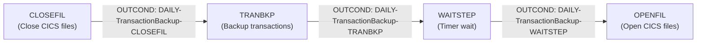
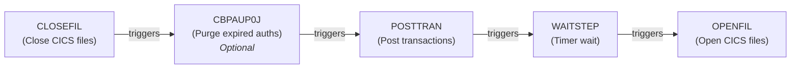
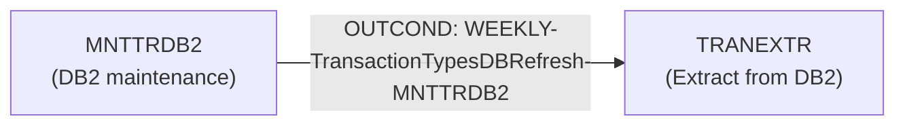
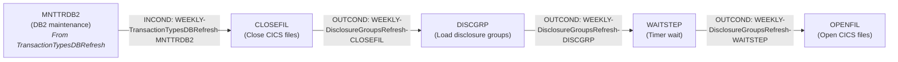
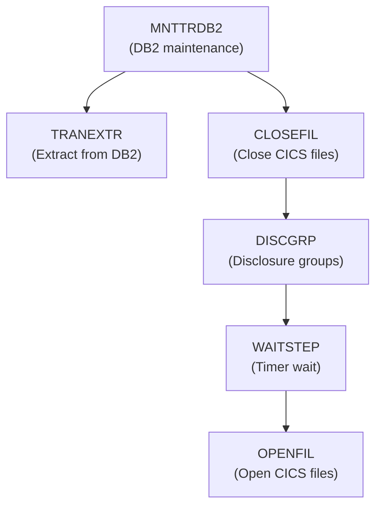

# Job Dependency Flow Diagrams

This document provides visual representations of the batch job dependency chains in the CardDemo application.

> **Source files:**
> - Control-M: [`app/scheduler/CardDemo.controlm`](../../app/scheduler/CardDemo.controlm)
> - CA7: [`app/scheduler/CardDemo.ca7`](../../app/scheduler/CardDemo.ca7)

---

## Daily Cycle: Transaction Backup

**Control-M Folder:** `DAILY-TransactionBackup`
**Schedule:** Every day (`DAYS="ALL"`)



**ASCII Representation:**
```
CLOSEFIL ──▶ TRANBKP ──▶ WAITSTEP ──▶ OPENFIL
```

### Extended Daily Chain (CA7 Configuration)

The CA7 scheduler configuration shows an extended chain that includes POSTTRAN and the optional CBPAUP0J job:



**ASCII Representation:**
```
CLOSEFIL ──▶ CBPAUP0J* ──▶ POSTTRAN ──▶ WAITSTEP ──▶ OPENFIL

  * Optional IMS-DB2-MQ module
```

---

## Weekly Cycle: Transaction Types DB Refresh

**Control-M Folder:** `WEEKLY-TransactionTypesDBRefresh`



**ASCII Representation:**
```
MNTTRDB2 ──▶ TRANEXTR
```

---

## Weekly Cycle: Disclosure Groups Refresh

**Control-M Folder:** `WEEKLY-DisclosureGroupsRefresh` (SMART_FOLDER)
**Schedule:** Saturdays (`DAYS="SA"`)
**Cross-folder dependency:** Requires MNTTRDB2 from `WEEKLY-TransactionTypesDBRefresh` to complete first.



**ASCII Representation:**
```
MNTTRDB2 ──▶ CLOSEFIL ──▶ DISCGRP ──▶ WAITSTEP ──▶ OPENFIL
  (from TransactionTypesDBRefresh)
```

### Combined Weekly View



**ASCII Representation:**
```
             ┌──▶ TRANEXTR
MNTTRDB2 ──┤
             └──▶ CLOSEFIL ──▶ DISCGRP ──▶ WAITSTEP ──▶ OPENFIL
```

---

## Monthly Cycle: Interest Calculation

**Control-M Folder:** `MONTHLY-InterestCalculation`

```mermaid
graph LR
    CLOSEFIL["CLOSEFIL<br/>(Close CICS files)"]
    INTCALC["INTCALC<br/>(Interest calculation)"]
    COMBTRAN["COMBTRAN<br/>(Combine transactions)"]
    WAITSTEP["WAITSTEP<br/>(Timer wait)"]
    OPENFIL["OPENFIL<br/>(Open CICS files)"]

    CLOSEFIL -->|OUTCOND: MONTHLY-InterestCalculation-CLOSEFIL| INTCALC
    INTCALC -->|OUTCOND: MONTHLY-InterestCalculation-INTCALC| COMBTRAN
    COMBTRAN -->|OUTCOND: MONTHLY-InterestCalculation-COMBTRAN| WAITSTEP
    WAITSTEP -->|OUTCOND: MONTHLY-InterestCalculation-WAITSTEP| OPENFIL
```



**ASCII Representation:**
```
CLOSEFIL ──▶ INTCALC ──▶ COMBTRAN ──▶ WAITSTEP ──▶ OPENFIL
```

---

## Dependency Mechanism: Control-M INCOND/OUTCOND

Control-M uses condition-based dependencies defined in the XML configuration:

- **OUTCOND** with `SIGN="+"`: Creates a positive condition when the job completes successfully
- **OUTCOND** with `SIGN="-"`: Removes (consumes) a condition after it has been used
- **INCOND** with `AND_OR="A"`: Requires the named condition to be present before the job can start

### Example: Daily Chain

| Step | Job | INCOND (waits for) | OUTCOND (produces) |
|:-----|:----|:-------------------|:-------------------|
| 1 | CLOSEFIL | (none) | +DAILY-TransactionBackup-CLOSEFIL |
| 2 | TRANBKP | DAILY-TransactionBackup-CLOSEFIL | -DAILY-TransactionBackup-CLOSEFIL, +DAILY-TransactionBackup-TRANBKP |
| 3 | WAITSTEP | DAILY-TransactionBackup-TRANBKP | -DAILY-TransactionBackup-TRANBKP, +DAILY-TransactionBackup-WAITSTEP |
| 4 | OPENFIL | DAILY-TransactionBackup-WAITSTEP | -DAILY-TransactionBackup-WAITSTEP |

---

## Dependency Mechanism: CA7 Triggered Jobs

CA7 uses a trigger-based model where the completion of one job triggers the submission of the next:

```
JOB=CLOSEFIL  ──triggers──▶  JOB=CBPAUP0J (SCHID=030)
JOB=CBPAUP0J  ──triggers──▶  JOB=POSTTRAN (SCHID=030)
JOB=POSTTRAN  ──triggers──▶  JOB=WAITSTEP (SCHID=030)
JOB=WAITSTEP  ──triggers──▶  JOB=OPENFIL  (SCHID=030)
```

Additional CA7 trigger chains found:

```
JOB=CLOSEFIL  ──triggers──▶  JOB=TRANTYPE  (SCHID=030)
JOB=TRANTYPE  ──triggers──▶  JOB=WAITSTEP  (SCHID=030)
JOB=WAITSTEP  ──triggers──▶  JOB=CLOSEFIL1 (SCHID=031)
                              JOB=CLOSEFIL2 (SCHID=032)
JOB=CLOSEFIL1 ──triggers──▶  JOB=TRANCATG  (SCHID=031)
JOB=CLOSEFIL2 ──triggers──▶  JOB=TCATBALF  (SCHID=032)
JOB=TRANCATG  ──triggers──▶  JOB=WAITSTEP  (SCHID=031)
JOB=TCATBALF  ──triggers──▶  JOB=WAITSTEP  (SCHID=032)
```

> **Migration Note:** Both Control-M and CA7 dependency models will need to be replaced with equivalent orchestration in the target architecture (e.g., AWS Step Functions, Apache Airflow, or event-driven workflows).
