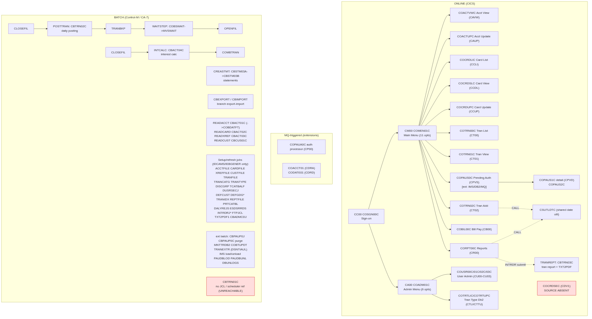

# CardDemo Module Inventory (`!mf_module_inventory_analysis`)

Status: COMPLETE — presented at STOP B (2026-08-20). Analysis only; no stream chosen here.
Module: **CARDDEMO** (whole estate in `Cognition-Partner-Workshops/ts-cobol-carddemo`, branch `main`, source under `app/`).
Scope decision recorded: the three optional extension directories (`app/app-authorization-ims-db2-mq`, `app/app-transaction-type-db2`, `app/app-vsam-mq`) are **counted in the module denominator** (they are wired into the core menus/CSD/Control-M), but their streams are flagged EXTENSION and carry IMS/DB2/MQ boundaries.

---

## 1. Module bounding (the denominator)

Mechanical file-set rule (`.migration/02_conventions.md`): all `*.cbl`/`*.CBL` under `app/cbl` and `app/app-*/cbl`, plus anything they CALL.

| Bucket | Count | Programs |
|---|---|---|
| Core online (CICS) | 20 | COSGN00C, COMEN01C, COADM01C, COACTVWC, COACTUPC, COCRDLIC, COCRDSLC, COCRDUPC, COTRN00C, COTRN01C, COTRN02C, CORPT00C, COBIL00C, COUSR00C, COUSR01C, COUSR02C, COUSR03C, and shared CSUTLDTC (see §6) — plus batch-shell COBSWAIT counted under batch |
| Core batch | 13 | CBACT01C, CBACT02C, CBACT03C, CBACT04C, CBCUS01C, CBTRN01C, CBTRN02C, CBTRN03C, CBSTM03A, CBSTM03B, CBEXPORT, CBIMPORT, COBSWAIT |
| Extension: authorization (IMS/DB2/MQ) | 8 | COPAUA0C, COPAUS0C, COPAUS1C, COPAUS2C, CBPAUP0C, PAUDBLOD, PAUDBUNL, DBUNLDGS |
| Extension: transaction-type DB2 | 3 | COTRTLIC, COTRTUPC, COBTUPDT |
| Extension: VSAM-MQ | 2 | COACCT01, CODATE01 |
| **Total COBOL programs** | **44** | (31 core in `app/cbl` + 13 extension) |

Non-COBOL called artifacts (boundaries, not in the denominator): `app/asm/MVSWAIT.asm` (called by COBSWAIT, `app/cbl/COBSWAIT.cbl:37`), `app/asm/COBDATFT.asm` (called by CBACT01C, `app/cbl/CBACT01C.cbl:231`), LE service `CEE3ABD` (e.g. `app/cbl/CBACT01C.cbl:410`), IMS `CBLTDLI`, MQ verbs, DB2 SQL.

**Absent-module risk:** `COCRDSEC` is CSD-defined (`app/csd/CARDDEMO.CSD:211`, transaction CDV1 at `:388-390`) but **has no source anywhere in the repo** — HIGH risk, see §8/§9.

---

## 2. Call graph method

Scripted scan of all sources for `CALL '<literal>'`, `CALL <identifier>`, `EXEC CICS XCTL/LINK/START`, `EXEC PGM=` in JCL, scheduler `MEMNAME`/`INCOND`/`OUTCOND`, skipping comment lines (`*` col 7). Dynamic targets resolved via MOVEd literals and route-table copybooks; unresolved edges listed in §10.6. Early scanner false positives (IMS keywords `TO`, `THRU`, `FAIL(ED)` misread as call targets) were filtered out and are NOT reported as edges.

---

## 3. Entry points (each proven by a runtime declaration)

### 3.1 ONLINE (CICS CSD: `app/csd/CARDDEMO.CSD`; extension CSDs under `app/app-*/csd`)

| Trancode | Program | Proof (CSD line) | Role |
|---|---|---|---|
| CC00 | COSGN00C | CARDDEMO.CSD:378 | Sign-on (root of all online) |
| CM00 | COMEN01C | CARDDEMO.CSD:399 | Main menu (11 routes) |
| CA00 | COADM01C | CARDDEMO.CSD:327 | Admin menu (6 routes) |
| CAVW / CAUP | COACTVWC / COACTUPC | CSD DEFINE TRANSACTION entries | Account view/update |
| CCLI / CCDL / CCUP | COCRDLIC / COCRDSLC / COCRDUPC | CSD | Card list/view/update |
| CDV1 | **COCRDSEC** | CARDDEMO.CSD:388 | **BLOCKED — source absent** |
| CT00 / CT01 / CT02 | COTRN00C / COTRN01C / COTRN02C | CSD | Transaction list/view/add |
| CR00 | CORPT00C | CSD | Reports (submits batch, §7 B-001) |
| CB00 | COBIL00C | CSD | Bill payment |
| CU00–CU03 | COUSR00C–COUSR03C | CSD | User admin |
| CPVS / CPVD | COPAUS0C / COPAUS1C | app-authorization CSD (CRDDEMO2.csd) | Pending auth view/detail (ext) |
| CP00 | COPAUA0C | ext CSD; MQ-triggered | Auth processor (ext) |
| CTLI / CTTU | COTRTLIC / COTRTUPC | ext CSD | Tran-type maintenance (ext, DB2) |
| CDRA / CDRD | COACCT01 / CODATE01 | app-vsam-mq CSD | MQ request/reply demos (ext) |

### 3.2 BATCH (scheduler: `app/scheduler/CardDemo.controlm` + `CardDemo.ca7`; JCL `EXEC PGM=`)

| Job (JCL) | App program (proof) | Trigger |
|---|---|---|
| POSTTRAN | CBTRN02C (`app/jcl/POSTTRAN.jcl:23`) | Control-M DAILY chain |
| INTCALC | CBACT04C (`app/jcl/INTCALC.jcl:22`) | Control-M MONTHLY chain |
| TRANREPT | CBTRN03C (`app/jcl/TRANREPT.jcl:59`) | Submitted by CORPT00C via TDQ `JOBS` |
| CREASTMT | CBSTM03A (`app/jcl/CREASTMT.JCL:79`) | On-demand statements |
| WAITSTEP | COBSWAIT (`app/jcl/WAITSTEP.jcl:22`) | Control-M DAILY/MONTHLY chains |
| READACCT/READCARD/READCUST/READXREF | CBACT01C/CBACT02C/CBCUS01C/CBACT03C (`app/jcl/READ*.jcl:21-32`) | On-demand verify/reads |
| CBEXPORT / CBIMPORT | CBEXPORT (`app/jcl/CBEXPORT.jcl:43`) / CBIMPORT (`app/jcl/CBIMPORT.jcl:22`) | Branch export/import |
| CBPAUP0J | CBPAUP0C via IMS `DFSRRC00` (`app/app-authorization-ims-db2-mq/jcl/CBPAUP0J.jcl:24`) | Auth purge (ext) |
| MNTTRDB2 | COBTUPDT (`RUN PROGRAM(COBTUPDT) PLAN(CARDDEMO)`) | Control-M WEEKLY (controlm:27) |
| ~20 setup/refresh jobs | utilities only (IDCAMS/IEBGENER/SORT/IKJEFT1B, e.g. TXT2PDF1.JCL:24) | No app COBOL — infra jobs |

Control-M dependency chains (INCOND/OUTCOND): DAILY `CLOSEFIL→POSTTRAN→TRANBKP→WAITSTEP→OPENFIL`; WEEKLY `MNTTRDB2→TRANEXTR` and DISCGRP refresh; MONTHLY `INTCALC→COMBTRAN→WAITSTEP→OPENFIL` (controlm:4-27ff).

### 3.3 SUBTRANSACTION
`COPAUS1C/COPAUS2C` (auth detail/fraud, XCTL'd from COPAUS0C — `COPAUS1C.cbl:35`), `CBSTM03B` (called by CBSTM03A, `CBSTM03A.CBL:351,377`), `CSUTLDTC` (called subroutine, §6).

### 3.4 ORPHAN
**CBTRN01C** — no JCL, PROC, scheduler, or program reference anywhere (`grep -rn CBTRN01C` outside its own source: zero hits). Classified UNREACHABLE, not promoted to entry point.

---

## 4. Route closure (producer–consumer proof)

**Main menu**: `app/cpy/COMEN02Y.cpy:21` declares `CDEMO-MENU-OPT-COUNT VALUE 11`; exactly 11 literal route records follow (COACTVWC, COACTUPC, COCRDLIC, COCRDSLC, COCRDUPC, COTRN00C, COTRN01C, COTRN02C, CORPT00C, COBIL00C, COPAUS0C). Dispatch consumes the same table: `XCTL PROGRAM(CDEMO-MENU-OPT-PGMNAME(WS-OPTION))` (`app/cbl/COMEN01C.cbl:149`). Count = branches = 11; invalid option falls to error message path (documented default route). CLOSED.

**Admin menu**: `app/cpy/COADM02Y.cpy:22` declares count 6 (COUSR00C–03C, COTRTLIC, COTRTUPC); dispatch `XCTL PROGRAM(CDEMO-ADMIN-OPT-PGMNAME(WS-OPTION))` (`app/cbl/COADM01C.cbl:146`) with `DUMMY` guard at `:141`. Count = branches = 6. CLOSED.

**Grep sweep**: every occurrence of `CDEMO-MENU-OPT-PGMNAME` / `CDEMO-ADMIN-OPT-PGMNAME` reviewed — single dispatch site each (plus a COPAUS0C special-case guard at `COMEN01C.cbl:147`); no hidden second router. `CDEMO-TO-PROGRAM` is the return-routing idiom in every screen program (e.g. `COACTVWC.cbl:336-350`); its producible values are only MOVEd literals `LIT-MENUPGM`/`CDEMO-FROM-PROGRAM` — resolved, see §10.6.

---

## 5. Stream catalog and 100% program coverage

| # | Stream | Type | Entry (proof §3) | Programs | Status |
|---|---|---|---|---|---|
| S-01 | Sign-on + menu shell | ONLINE | CC00/CM00/CA00 | COSGN00C, COMEN01C, COADM01C | active — **shared shell, port first** |
| S-02 | Account View | ONLINE | CAVW | COACTVWC | active |
| S-03 | Account Update | ONLINE | CAUP | COACTUPC | active |
| S-04 | Card List | ONLINE | CCLI | COCRDLIC | active |
| S-05 | Card View | ONLINE | CCDL | COCRDSLC | active |
| S-06 | Card Update | ONLINE | CCUP | COCRDUPC | active |
| S-07 | Transaction List | ONLINE | CT00 | COTRN00C | active |
| S-08 | Transaction View | ONLINE | CT01 | COTRN01C | active |
| S-09 | Transaction Add | ONLINE | CT02 | COTRN02C (+shared CSUTLDTC) | active |
| S-10 | Reports (online→batch) | ONLINE+BATCH | CR00 + TRANREPT | CORPT00C, CBTRN03C (+shared CSUTLDTC) | active; crosses B-001 |
| S-11 | Bill Payment | ONLINE | CB00 | COBIL00C | active |
| S-12 | User Admin | ONLINE | CU00–CU03 | COUSR00C, COUSR01C, COUSR02C, COUSR03C | active |
| S-13 | Card Detail (security) | ONLINE | CDV1 | COCRDSEC | **BLOCKED — source absent** |
| S-14 | Daily posting chain | BATCH | Control-M DAILY | CBTRN02C, COBSWAIT | active |
| S-15 | Interest calc chain | BATCH | Control-M MONTHLY | CBACT04C (COBSWAIT shared) | active |
| S-16 | Statement creation | BATCH | CREASTMT | CBSTM03A, CBSTM03B | active |
| S-17 | Data read/verify jobs | BATCH | READ*.jcl | CBACT01C, CBACT02C, CBACT03C, CBCUS01C | active |
| S-18 | Branch export/import | BATCH | CBEXPORT/CBIMPORT jcl | CBEXPORT, CBIMPORT | active |
| S-19 | Pending auth view (ext) | ONLINE | CPVS/CPVD | COPAUS0C, COPAUS1C, COPAUS2C | EXTENSION (IMS/DB2/MQ) |
| S-20 | Auth processing + purge (ext) | SUBTRANSACTION+BATCH | CP00 (MQ) + CBPAUP0J | COPAUA0C, CBPAUP0C, PAUDBLOD, PAUDBUNL, DBUNLDGS | EXTENSION |
| S-21 | Tran-type maintenance (ext) | ONLINE+BATCH | CTLI/CTTU + MNTTRDB2 | COTRTLIC, COTRTUPC, COBTUPDT | EXTENSION (DB2) |
| S-22 | VSAM-MQ demo (ext) | SUBTRANSACTION | CDRA/CDRD (MQ) | COACCT01, CODATE01 | EXTENSION (MQ) |

### Coverage arithmetic (the 100% gate)
```
44 programs = 40 stream-assigned (S-01..S-22, each exactly once)
            +  2 shared/utility   (CSUTLDTC, COBSWAIT — see §6)
            +  1 unreachable      (CBTRN01C, §3.4)
            +  1 declared-but-absent (COCRDSEC — counted in S-13 as BLOCKED, source missing)
Check: S-01(3)+S-02..S-09,S-11(1 each=9)+S-10(2)+S-12(4)+S-13(0 source)+S-14(2*)+S-15(1*)+S-16(2)
      +S-17(4)+S-18(2)+S-19(3)+S-20(5)+S-21(3)+S-22(2) = 42 placements over 41 programs
      (COBSWAIT appears in S-14 and S-15 → counted once as shared; CSUTLDTC shared S-09/S-10)
41 with source + 1 absent (COCRDSEC) + 1 unreachable (CBTRN01C) + CSUTLDTC = 44. BALANCES.
```
Every program is placed with a cite (§3 tables). No program dropped.

---

## 6. Shared-program (choke point) map

| Program | Used by | R/W | Contract | Port owner rule |
|---|---|---|---|---|
| CSUTLDTC | S-09 (`COTRN02C.cbl:393,413`), S-10 (`CORPT00C.cbl:392`) | read-only | CALL USING date, format, result | first of S-09/S-10 migrated owns it |
| COBSWAIT (+MVSWAIT asm) | S-14, S-15 (WAITSTEP job in both chains) | read-only | JCL PARM wait-seconds | first batch chain owns it; likely replaced by scheduler-native wait |
| COSGN00C/COMEN01C/COADM01C (S-01 shell) | every online stream (XCTL routes §4) | session state | COMMAREA `CDEMO-*` | S-01 must be wave 1 of the first online stream |
| CBSTM03B | S-16 only (internal sub) | read | CALL USING WS-M03B-AREA | owned by S-16 |
| COMMAREA copybooks (COCOM01Y etc.) | all online | n/a | shared data contract | ported once in Phase 0/1 |

---

## 7. Boundary register (first pass — appended to `.migration/04_boundary_register.md`)

| ID | Class | Description | Cite | Streams |
|---|---|---|---|---|
| B-001 | Online→batch hand-off | CORPT00C submits TRANREPT JCL via CICS TDQ `JOBS` (internal reader) | `CORPT00C.cbl:517` | S-10 |
| B-002 | Non-COBOL callee | MVSWAIT assembler | `COBSWAIT.cbl:37`; `app/asm/MVSWAIT.asm` | S-14, S-15 |
| B-003 | Non-COBOL callee | COBDATFT assembler date edit | `CBACT01C.cbl:231` | S-17 |
| B-004 | LE runtime | CEE3ABD abend service (7 batch pgms) | e.g. `CBACT01C.cbl:410` | batch streams |
| B-005 | IMS DL/I | CBLTDLI calls | `PAUDBLOD.CBL:244` etc. | S-19, S-20 |
| B-006 | DB2 SQL | EXEC SQL (tran-type + auth ext) | `COTRTLIC.cbl:304,331` | S-19–S-21 |
| B-007 | MQ | MQOPEN/MQGET/MQPUT1/MQCLOSE | `COPAUA0C.cbl:262,400,758`; `COACCT01.cbl:233` | S-20, S-22 |
| B-008 | Scheduler | Control-M INCOND/OUTCOND chains + CA-7 | `app/scheduler/CardDemo.controlm:4-27` | all batch |
| B-009 | Persistence | VSAM KSDS/AIX → PostgreSQL mapping | CSD FCT + IDCAMS jobs | all |
| B-010 | Dataset hand-off | PS/GDG files (export/import, statements, reports, TXT2PDF) | `TXT2PDF1.JCL:24` | S-10, S-16, S-18 |
| B-011 | Absent module | COCRDSEC declared, source missing | `CARDDEMO.CSD:211,388` | S-13 |
| B-012 | Dynamic routing | `XCTL PROGRAM(CDEMO-TO-PROGRAM)` return routing | `COACTVWC.cbl:350` | all online |

Count by class: hand-off 2 (B-001, B-010) · non-COBOL 2 · runtime 1 · IMS 1 · DB2 1 · MQ 1 · scheduler 1 · persistence 1 · absent 1 · dynamic 1 = **12 boundaries**. Decisions deferred to `!mf_boundary_resolution` / stream plan.

---

## 8. Risk list

1. **COCRDSEC source absent** (B-011) — S-13 blocked until source is provided or descoped. HIGH.
2. **CBTRN01C unreachable** — no runtime declaration or caller; confirm dead before descoping. MEDIUM.
3. **Unresolved dynamic edges** — none remaining beyond resolved route tables; `CDEMO-TO-PROGRAM` values fully producible from literals (§10.6). LOW.
4. **Assembler dependencies** (MVSWAIT, COBDATFT) need functional re-spec in .NET. MEDIUM.
5. **Extension streams need infra decisions**: MQ broker (deferred at STOP A), IMS emulation strategy. MEDIUM (lead-time).
6. **TXT2PDF external load library** (`AWS.M2.LBD.TXT2PDF.LOAD`) not in repo. MEDIUM for S-10 reports.

---

## 9. Module flow diagram



Mermaid source: [`diagrams/CardDemo_module_flow.mmd`](diagrams/CardDemo_module_flow.mmd)

---

## 10. Validation results

1. **Coverage arithmetic**: 44 = 40 assigned + 2 shared + 1 unreachable + 1 absent — balances (§5).
2. **Producer–consumer closure**: menu 11=11, admin 6=6, defaults documented (§4). PASS.
3. **Dispatch grep sweep**: one router per selection variable; no hidden dispatch (§4). PASS.
4. **Shared-program map**: 5 entries (§6). PASS.
5. **Boundary count by class**: 12 across 10 classes (§7). PASS.
6. **Unresolved-edge list**: `CDEMO-TO-PROGRAM` (resolved: only `LIT-MENUPGM`/`CDEMO-FROM-PROGRAM` literals MOVEd, e.g. `COACTVWC.cbl:336-338`); menu/admin table dispatches (resolved from copybooks). **Zero unresolved dynamic edges remain**; early scanner false positives (IMS keywords) were discarded, not reported.

---

## 11. Recommended migration order (recommendation only — user chooses at STOP B)

1. **S-01 Sign-on + menu shell** — unlocks every online stream; smallest, builds the session/COMMAREA seam.
2. **S-02/S-05/S-07/S-08 read-only views** (Account View, Card View, Tran List/View) — low risk, build data-access seams.
3. **S-09 Transaction Add** (ports shared CSUTLDTC) then **S-03/S-06 updates**, **S-11 Bill Pay**, **S-12 User Admin**.
4. **S-14 Daily posting** (first batch chain, ports COBSWAIT seam) → **S-15 Interest calc** → **S-16 Statements** → **S-17/S-18**.
5. **S-10 Reports** once batch seam exists (crosses B-001).
6. Extension streams (S-19–S-22) last — pending MQ/IMS boundary decisions.
