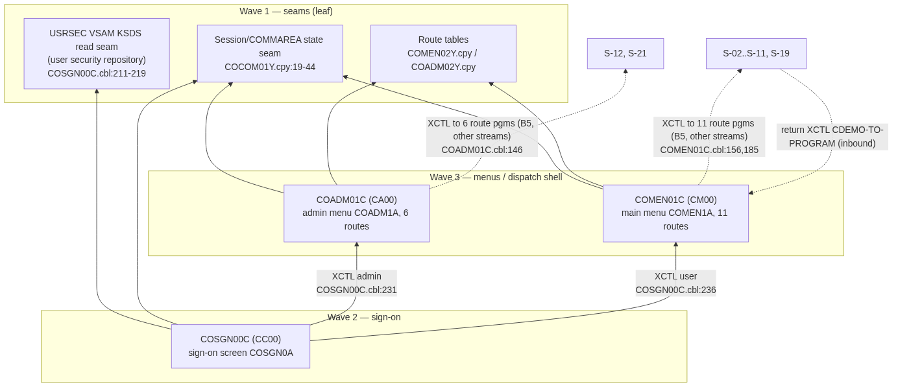

# S-01 Sign-on + Menu Shell — Stream Analysis (`!mf_stream_analysis`)

Status: complete (2026-08-20). Stream chosen by user at STOP B; process type **ONLINE** confirmed.
Target profiles applied (read-only): CORE + ONLINE + DATA/BOUNDARY from `functional/CARDDEMO/CardDemo_target_state.md` (C#/.NET 8 + ASP.NET Core, Angular 17+, PostgreSQL, single repo).

## 1. Pinned stream

- **Entry points (proof)**: `CC00 -> COSGN00C` (`app/csd/CARDDEMO.CSD:378`), `CM00 -> COMEN01C` (`:399`), `CA00 -> COADM01C` (`:327`).
- **Hard stop (user-confirmed default)**: every `XCTL` out of the menus to a route program is OUT of scope — those are the other streams' entry programs. Registered boundaries B-001..B-012 are the stop line; this stream implements none of the route targets.
- **Exclusions**: all 11 main-menu route targets (`COMEN02Y.cpy`), all 6 admin route targets (`COADM02Y.cpy`), and the extension programs.
- Pseudo-conversational shape: each program ends `EXEC CICS RETURN TRANSID(...) COMMAREA(...)` (`COSGN00C.cbl:98-102`, `COMEN01C.cbl:107-110`, `COADM01C.cbl:111-114`).

## 2. Program inventory + leaf-first DAG

| Program | Path | Role | Callees / edges | Shared? | Present |
|---|---|---|---|---|---|
| COSGN00C | app/cbl/COSGN00C.cbl | entry/validate (sign-on) | CICS READ USRSEC (:211); XCTL COADM01C (:231) / COMEN01C (:236) | shell shared by all online streams | yes |
| COMEN01C | app/cbl/COMEN01C.cbl | dispatch (main menu) | XCTL route table (:156,:185); XCTL CDEMO-TO-PROGRAM (:202); INQUIRE PROGRAM guard for COPAUS0C (:148) | shared shell | yes |
| COADM01C | app/cbl/COADM01C.cbl | dispatch (admin menu) | XCTL route table (:146); XCTL CDEMO-TO-PROGRAM (:169); HANDLE CONDITION PGMIDERR (:78) | shared shell | yes |

No subroutine CALLs; no absent programs inside the hard stop. Route-table copybooks `COMEN02Y.cpy` (11 options) and `COADM02Y.cpy` (6 options) are stream-owned config data.

**Leaf-first DAG** (rendered):

Source: [`diagrams/S01_signon_menu_dag.mmd`](diagrams/S01_signon_menu_dag.mmd)

## 3. Surfaces (ONLINE)

### COSGN00C — screen COSGN0A / mapset COSGN00 (`app/bms/COSGN00.bms`, fields `app/cpy-bms/COSGN00.CPY:67-78`)
| Field | I/O | PIC | Edits (cite) |
|---|---|---|---|
| USERID | INPUT | X(8) | mandatory — "Please enter User ID ..." (`COSGN00C.cbl:118-122`); upper-cased (`:132`) |
| PASSWD | INPUT | X(8) | mandatory (`:123-127`); upper-cased (`:135`); dark/non-display attribute per BMS |
| ERRMSG | DISPLAY | X(80) | message line |
| TITLE01/02, TRNNAME, PGMNAME, CURDATE, CURTIME, APPLID, SYSID | DISPLAY | — | header populated `:177-204` (APPLID/SYSID via `EXEC CICS ASSIGN :198-204`) |

AID keys: ENTER=submit, PF3=exit with thank-you plain text (`:88-90`), other=invalid-key error (`:91-94`).
Auth outcomes (`READ-USER-SEC-FILE`, `:221-257`): RESP 0 + pwd match → route by `SEC-USR-TYPE` ('A'→COADM01C, else COMEN01C); pwd mismatch → "Wrong Password. Try again ..." (`:242`); RESP 13 (NOTFND) → "User not found. Try again ..." (`:249`); other RESP → "Unable to verify the User ..." (`:254`). **Return-code protocol: 0 / 13 / other.**

### COMEN01C — screen COMEN1A / mapset COMEN01
| Field | I/O | Edits |
|---|---|---|
| OPTION | INPUT X(2) | right-justified, blank→'0' (`:117-124`); must be numeric, 1..11 (`:127-134`); admin-only options rejected for type 'U' with "No access - Admin Only option..." (`:136-143`) |
| OPTN001–OPTN012 | DISPLAY | built from route table (`:262-303`) |
AID: ENTER=dispatch, PF3=back to sign-on (`:96-98`), other=invalid key. Special cases: COPAUS0C availability check via `INQUIRE PROGRAM` → "not installed" message (`:148-168`); `DUMMY*` targets → "coming soon" (`:169-176`).

### COADM01C — screen COADM1A / mapset COADM01
Same shape: OPTION numeric 1..6 (`:131-138`), `DUMMY*` guard (`:141`), PGMIDERR handled (`:77-79`), PF3→sign-on (`:100-102`).

## 4. Data + field dictionary

**Dataset**: USRSEC VSAM KSDS `AWS.M2.CARDDEMO.USRSEC.VSAM.KSDS` (defined `app/jcl/DUSRSECJ.jcl:62-64`), key = user id, read-only in this stream (CRUD writes belong to S-12 User Admin — B10 shared contract).

Field dictionary (all FACT, from `app/cpy/CSUSR01Y.cpy:17-23` — no DCLGEN; VSAM record):
| COBOL field | PIC | C# type | PostgreSQL column |
|---|---|---|---|
| SEC-USR-ID | X(08) | string(8) | users.user_id PK varchar(8) |
| SEC-USR-FNAME | X(20) | string | users.first_name varchar(20) |
| SEC-USR-LNAME | X(20) | string | users.last_name varchar(20) |
| SEC-USR-PWD | X(08) | string (hash in target — deviation to record) | users.password varchar(8) / hashed |
| SEC-USR-TYPE | X(01) | enum UserType {'A','U'} | users.user_type char(1) |
| SEC-USR-FILLER | X(23) | — | not mapped |

Session state (COMMAREA `app/cpy/COCOM01Y.cpy:19-44`, FACT): CDEMO-FROM/TO-TRANID X(4), CDEMO-FROM/TO-PROGRAM X(8), CDEMO-USER-ID X(8), CDEMO-USER-TYPE X(1) ('A'/'U' 88-levels :27-28), CDEMO-PGM-CONTEXT 9(1) (enter/re-enter :29-31), plus customer/account/card context fields (9(09) cust id, 9(11) acct id, 9(16) card num → C# `long`/`decimal` per CORE mapping; strings for names). Target: server-side session/JWT claims per ONLINE profile.

## 5. Boundary table (headline) — appended to `.migration/04_boundary_register.md` as S01-B1..S01-B6, status UNDECIDED

| ID | Class | Contract | Direction | Cite | Required action / lead time |
|---|---|---|---|---|---|
| S01-B1 | B5 cross-program switch | XCTL to 10 core route programs with CARDDEMO-COMMAREA; targets = other streams' entries | outbound | COMEN01C.cbl:185; COADM01C.cbl:146 | target routing = Angular navigation + per-stream API; until routes migrate, menu shows "not installed" (existing idiom :160-168) |
| S01-B2 | B5 + availability probe | XCTL COPAUS0C guarded by INQUIRE PROGRAM | outbound | COMEN01C.cbl:148-159 | map to feature-flag/route-availability check |
| S01-B3 | B5 inbound return routing | route programs XCTL back via CDEMO-TO-PROGRAM | inbound | COMEN01C.cbl:202; COACTVWC.cbl:350 | menu shell must expose stable return route (nav state) |
| S01-B4 | B4 data-access leaf | CICS READ USRSEC keyed by user id; RESP protocol 0/13/other | outbound | COSGN00C.cbl:211-219 | physical layer = VSAM; target owns data → plain EF Core repository, no SP. Postgres `users` table in Phase 1 |
| S01-B5 | B10 shared data contract | USRSEC written by S-12 (COUSR01C/02C/03C) and batch DUSRSECJ; read here | both | DUSRSECJ.jcl:62-64 | single-writer decision needed when S-12 migrates; until then seed/import parity |
| S01-B6 | B10 shared data contract | CARDDEMO-COMMAREA copybook consumed by all online programs | both | COCOM01Y.cpy:19 | session-state DTO ported once here; later streams consume it (module property) |

Environment display via `EXEC CICS ASSIGN APPLID/SYSID` (`COSGN00C.cbl:198-204`) — cosmetic runtime metadata, mapped to app config; not a register-level boundary.

All contracts resolved from source; **no unresolved-contract blockers**.

## 6. Waves (leaf-first, from DAG depth)

| Wave | Content | Repos touched |
|---|---|---|
| 1 | Data seam: `users` table + EF Core repository (S01-B4), session-state DTO/claims seam (S01-B6), route-table config | backend/ |
| 2 | COSGN00C: sign-on API (`POST /api/v1/auth/signin`) + Angular sign-on screen; return-code protocol 0/13/other mapped to 401/404-style results per FR | backend/, frontend/ |
| 3 | COMEN01C + COADM01C: menu APIs + Angular menu shells, option validation, admin-only gate, "not installed"/"coming soon" route availability (S01-B1..B3) | backend/, frontend/ |

Shared-port note: S-01 ports the session/COMMAREA seam and app shell **on behalf of the whole module**; every later online stream consumes them.

## 7. Risks

1. Password stored/compared in clear (`COSGN00C.cbl:223`); target must hash — behavioral deviation to confirm in FR. MEDIUM.
2. USRSEC dual-writer window until S-12 migrates (S01-B5). MEDIUM.
3. COPAUS0C availability semantics (INQUIRE PROGRAM) need a target equivalent (feature flag). LOW.
4. COMEN1A map has 12 option slots but table count is 11 (`COMEN01C.cbl:297-298` WHEN 12) — slot 12 unused; keep UI to table count. LOW.

## 8. Validation
(1) all programs entry→hard stop inventoried (3/3, none absent); (2) wave order is a topological sort of the DAG; (3) claims cited `<file>:<line>`; (4) surfaces are ONLINE (screens/AID/edits) only; (5) all mechanical crossings in the boundary table with full contracts; (6) sole data-access leaf S01-B4 physical layer resolved (VSAM → target-owned Postgres).
