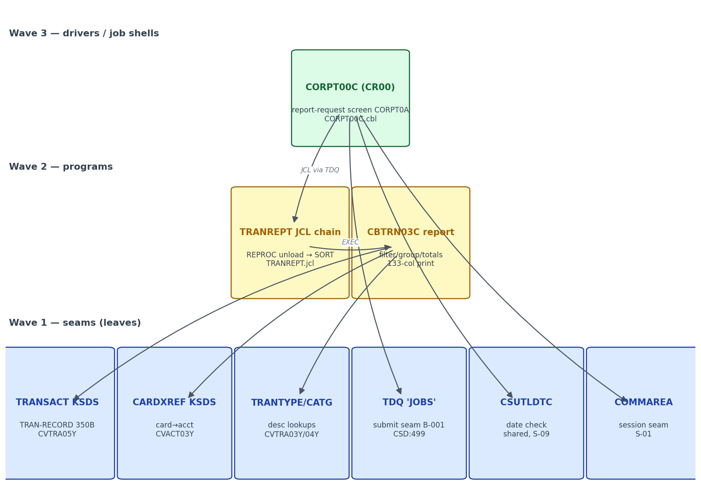

# S-10 Reports — Stream Analysis (`!mf_stream_analysis`)

Status: complete (2026-09-16). Stream assigned by orchestrator; process type **ONLINE+BATCH** confirmed.
Target profiles applied (read-only): CORE + ONLINE + BATCH + DATA/BOUNDARY from
`functional/CARDDEMO/CardDemo_target_state.md`.

## 1. Pinned stream

- **Entry points (proof)**: `CR00 -> CORPT00C` (`app/csd/CARDDEMO.CSD:409-410`,
  `TWASIZE(0) PROFILE(DFHCICST) STATUS(ENABLED)`); the batch half is the in-stream job
  `TRNRPT00` built inside CORPT00C (`CORPT00C.cbl:81-127`, `EXEC PROC=TRANREPT` at `:93`)
  and submitted through TDQ `JOBS` (`:517-523`), whose steps are defined by
  `app/jcl/TRANREPT.jcl`.
- **Hard stop**: the report file `AWS.M2.CARDDEMO.TRANREPT(+1)` (LRECL 133, FB) produced
  by STEP10R (`TRANREPT.jcl:76-80`). Downstream print/fileroom distribution is out of
  scope — no source consumer exists in the repo.
- **Exclusions**: menu routing back to COMEN01C/COSGN00C (S-01 seam), CSUTLDTC internals
  (S-09-owned shared utility), the `JOBS` TDQ's partner intrdr JES submission (platform
  property), and the TRANBKP dataset lifecycle (S-14 chain owns TRANSACT housekeeping).
- Pseudo-conversational shape: entry with `EIBCALEN = 0` XCTLs to COSGN00C
  (`CORPT00C.cbl:172-174`); each AID returns `EXEC CICS RETURN TRANSID(WS-TRANID)
  COMMAREA(...)` (`:199-201`).

## 2. Program inventory + leaf-first DAG

| Program | Path | Role | Callees / edges | Shared? | Present |
|---|---|---|---|---|---|
| CORPT00C | app/cbl/CORPT00C.cbl | entry/validate/submit (report request) | XCTL COSGN00C (:172-174); XCTL COMEN01C PF3 (:187-189); CALL CSUTLDTC ×2 (:392-426); WRITEQ TD 'JOBS' (:517); XCTL back via CDEMO-TO-PROGRAM (:540-551) | screen shared w/ S-01 shell | yes |
| TRANREPT (JCL job) | app/jcl/TRANREPT.jcl | job shell — REPROC unload (:23-33), DFSORT filter/sort (:37-55), CBTRN03C (:59-80) | invoked by submitted job TRNRPT00 `EXEC PROC=TRANREPT` (CORPT00C.cbl:93) | — | yes |
| CBTRN03C | app/cbl/CBTRN03C.cbl | report program — date filter, card break, type/category descriptions, page/account/grand totals | reads DATEPARM (:220-233), TRANFILE seq (:173-174), XREFFILE keyed (:181-188), TRANTYPE/TRANCATG keyed (:189-195); writes TRANREPT (:361-373); abend via CEE3ABD 999 (:626-630) | — | yes |
| CSUTLDTC | app/cbl/CSUTLDTC.cbl | date-validation utility | CALL'd with (date, format, result) (CORPT00C.cbl:392-426) | **shared — S-09 owns** (`CardDemo_inventory.md:141`) | yes |

No absent programs inside the hard stop. `MVSWAIT`, `IDCAMS/REPRO`, `DFSORT` are
platform utilities (inventory B-002/B-010 class), not CardDemo programs.

**Leaf-first DAG** (rendered):

Source: [`diagrams/S10_reports_dag.mmd`](diagrams/S10_reports_dag.mmd)

## 3. Surfaces

### 3a. ONLINE half — CORPT00C, screen CORPT0A / mapset CORPT00 (`app/bms/CORPT00.bms`, fields `app/cpy-bms/CORPT00.CPY`)

| Field | I/O | PIC | Edits (cite) |
|---|---|---|---|
| MONTHLY | INPUT | X(1) | any non-blank value selects Monthly (:213); mutually exclusive by first-match EVALUATE order (:212-256) |
| YEARLY | INPUT | X(1) | selects Yearly (:239) |
| CUSTOM | INPUT | X(1) | selects Custom (:256) |
| SDTMM/SDTDD/SDTYYYY | INPUT | X(2)/X(2)/X(4) | Custom only: blank → "Start Date - Month cannot be empty..." (:259-266); NUMVAL-C-normalized (:305-327); not numeric or >12 → "Not a valid Month..." (:329-336); not numeric or >31 → "Not a valid Day..." (:337-344); not numeric year → "Not a valid Year..." (:346-352) |
| EDTMM/EDTDD/EDTYYYY | INPUT | X(2)/X(2)/X(4) | same edits for End Date (:280-303, :354-379) |
| CONFIRM | INPUT | X(1) | blank → 'Please confirm to print the <name> report...' (:464-473); 'Y'/'y' submit, 'N'/'n' clear+resend, other → '"<v>" is not a valid value to confirm...' (:478-493) |
| ERRMSG | DISPLAY | X(78) | message line (BMS POS 23,1, red) |
| TITLE01/02, TRNNAME, PGMNAME, CURDATE, CURTIME | DISPLAY | — | standard header |

AID keys: ENTER → PROCESS-ENTER-KEY (:185-186); PF3 → XCTL COMEN01C (:187-189); any other
AID → invalid-key message (:190-194).

Derived ranges (FACT): **Monthly** start = 1st of current month, end = last day of current
month (`:217-235`: bump month+1 w/ year rollover at day 1, `INTEGER-OF-DATE`-1 back a day
at `:229-230`). **Yearly** start = `YYYY-01-01`, end = `YYYY-12-31` of current year
(`:239-252`). **Custom**: after the field edits, both dates go through CSUTLDTC with
format `'YYYY-MM-DD'`; severity `0000` accepted, and non-zero severity is **accepted
anyway when message number is `2513`** (pre-1582 / out-of-range year tolerated,
`:396-405, :416-425`). There is no start≤end comparison in CORPT00C — an inverted range
is submitted as-is and simply yields an empty SORT INCLUDE (note for FR parity).

Submission: on confirm='Y' the program writes the 14-card JOB-DATA block
(`//TRNRPT00 JOB 'TRAN REPORT'` … `/*EOF`, `:81-127`) to TDQ `JOBS` card-by-card
(`:498-535`), stopping at `'/*EOF'`/spaces/LOW-VALUES; TDQ is EXTRAPARTITION
DDNAME=INREADER RECORDSIZE=80 FIXED UNBLOCKED DISPOSITION(MOD) — i.e. the JES internal
reader (`app/csd/CARDDEMO.CSD:499-505`). Non-NORMAL RESP → 'Unable to Write TDQ (JOBS)...'
(`:524-535`). Success → green '<name> report submitted for printing ...' (`:445-456`).

### 3b. BATCH half — job TRNRPT00 → proc TRANREPT

| Step | Program | Datasets in → out | Contract (cite) |
|---|---|---|---|
| STEP05R (1st) | PROC=REPROC (IDCAMS REPRO) | TRANSACT.VSAM.KSDS → TRANSACT.BKUP(+1) PS 350B FB | unload snapshot (`TRANREPT.jcl:23-33`) |
| STEP05R (2nd, duplicate step name in source) | DFSORT | BKUP(+1) → TRANSACT.DALY(+1) | SYMNAMES `TRAN-CARD-NUM,263,16,ZD`, `TRAN-PROC-DT,305,10,CH`, `PARM-START-DATE`/`PARM-END-DATE`; `INCLUDE COND` on proc-dt in range; `SORT FIELDS=(TRAN-CARD-NUM,A)` (`:37-55`); the submitted job overrides SYMNAMES parms in-stream (CORPT00C.cbl:96-107) |
| STEP10R | CBTRN03C | TRANFILE=DALY(+1), CARDXREF/TRANTYPE/TRANCATG KSDS, DATEPARM (PS or inline DD *) → TRANREPT(+1) LRECL 133 FB | (:59-80); submitted job supplies `//STEP10R.DATEPARM DD *` inline (CORPT00C.cbl:112-119) |

CBTRN03C behavior: reads DATEPARM `WS-START-DATE`/`WS-END-DATE` X(10) (`:122-126,
:220-233`); sequential TRANFILE read, kept when `TRAN-PROC-TS(1:10)` within range
(`:173-174`); break on TRAN-CARD-NUM → XREFFILE keyed read for ACCT-ID (`:181-188`);
TRANTYPE + TRANCATG keyed lookups for descriptions (`:189-195`); detail line from
CVTRA07Y `TRANSACTION-DETAIL-REPORT`; page totals every `WS-PAGE-SIZE`=20 lines
(`:131, :282-285`), account totals on card break, grand total at EOF (`:198-203`);
all file errors → DISPLAY + `CALL 'CEE3ABD'` abend 999 (`:626-630`). Report layout =
`app/cpy/CVTRA07Y.cpy` (REPORT-NAME-HEADER 'DALYREPT'/'Daily Transaction Report' +
'Date Range: ', TRANSACTION-HEADER-1/-2, detail, PAGE/ACCOUNT/GRAND totals with
`+ZZZ,ZZZ,ZZZ.ZZ` masks).

## 4. Data + field dictionary

**Datasets** (all FACT):

| Legacy | Form | Direction | Target mapping |
|---|---|---|---|
| AWS.M2.CARDDEMO.TRANSACT.VSAM.KSDS | VSAM KSDS 350B | read (via BKUP/DALY copies) | `transactions` table — Spring Data JPA |
| CARDXREF.VSAM.KSDS | VSAM KSDS 50B | keyed read card→acct | `card_xrefs` |
| TRANTYPE.VSAM.KSDS | VSAM KSDS 60B | keyed read | `transaction_types` |
| TRANCATG.VSAM.KSDS | VSAM KSDS 60B | keyed read | `transaction_categories` |
| TRANSACT.BKUP(+1) / DALY(+1) | PS/GDG 350B | intermediate snapshots | eliminated — query `transactions` directly |
| DATEPARM | PS 80B / in-stream DD * | 2×X(10) dates | JobParameters `startDate`,`endDate` |
| TRANREPT(+1) | GDG 133B FB | report output | flat file `cbtrn03-report.txt` under job output dir |

Field dictionary — TRAN-RECORD (all FACT, `app/cpy/CVTRA05Y.cpy:4-16`):

| COBOL field | PIC | Java type | PostgreSQL column |
|---|---|---|---|
| TRAN-ID | X(16) | String | transactions.tran_id varchar(16) PK |
| TRAN-TYPE-CD | X(02) | String | tran_type_code char(2) |
| TRAN-CAT-CD | 9(04) | Integer | tran_category_code smallint |
| TRAN-SOURCE | X(10) | String | tran_source varchar(10) |
| TRAN-DESC | X(100) | String | tran_description varchar(100) |
| TRAN-AMT | S9(09)V99 | BigDecimal(11,2) | tran_amount numeric(11,2) |
| TRAN-MERCHANT-ID | 9(09) | Long | tran_merchant_id bigint |
| TRAN-MERCHANT-NAME/CITY/ZIP | X(50)/X(50)/X(10) | String | tran_merchant_* varchar |
| TRAN-CARD-NUM | X(16) | String | tran_card_number varchar(16) |
| TRAN-ORIG-TS / TRAN-PROC-TS | X(26) | LocalDateTime | tran_origin_timestamp / tran_process_timestamp |

XREF (`CVACT03Y.cpy:4-9`, FACT): XREF-CARD-NUM X(16) → card_xrefs.xref_card_number;
XREF-CUST-ID 9(09) → xref_cust_id bigint; XREF-ACCT-ID 9(11) → xref_acct_id bigint.
TRANTYPE (`CVTRA03Y.cpy:4-7`): TRAN-TYPE X(02) → transaction_types PK;
TRAN-TYPE-DESC X(50) → description. TRANCATG (`CVTRA04Y.cpy:4-8`): key (TRAN-TYPE-CD,
TRAN-CAT-CD) → composite PK; TRAN-CAT-TYPE-DESC X(50) → description.
DATEPARM record (FACT, `CBTRN03C.cbl:122-126`): WS-START-DATE X(10), WS-END-DATE X(10)
→ JobParameters startDate/endDate (ISO-8601).
Report masks (FACT, CVTRA07Y): REPT-PAGE/ACCOUNT/GRAND-TOTAL `PIC +ZZZ,ZZZ,ZZZ.ZZ` →
`BigDecimal` formatted '+%,10.2f'-style edit; TRAN-REPORT-AMT `PIC -ZZZ,ZZZ,ZZZ.ZZ`.

## 5. Boundary table (headline)

`.migration/04_boundary_register.md` is read-only context; module entries B-001..B-012 are
already decided. Stream-local entries S10-B1..S10-B8 live inline here.

| ID | Class | Contract | Direction | Cite | Required action / lead time |
|---|---|---|---|---|---|
| S10-B1 | B-001 online→batch submit | 80-col JCL cards to TDQ 'JOBS' (intrdr INREADER); in-stream SYMNAMES + DATEPARM carry the two dates | outbound (screen→job) | CORPT00C.cbl:81-127, :498-535; CSD:499-505 | replace with POST /api/reports → Spring Batch launch; seam already in baseline (`ReportController`, `ReportService:44-47`) |
| S10-B2 | B-008 parameter channel | two channels — DFSORT SYMNAMES (TRANREPT.jcl:40-48) and DATEPARM PS/DD* (CBTRN03C.cbl:122-126) | outbound | TRANREPT.jcl:43-48 | single source of truth: `startDate`/`endDate` JobParameters consumed by reader query + report header |
| S10-B3 | B-009 VSAM access | TRANSACT (seq on snapshot), CARDXREF, TRANTYPE, TRANCATG keyed reads | inbound | TRANREPT.jcl:65-72 | Postgres JPA repositories; physical layer resolved — VSAM, target-owned, no stored procedures |
| S10-B4 | B-010 dataset outputs | TRANREPT(+1) 133-col GDG; BKUP(+1)/DALY(+1) intermediate GDGs | outbound | TRANREPT.jcl:27-55, :76-80 | report → flat file under `carddemo.batch.output-dir`; intermediates dropped (no GDG versioning) |
| S10-B5 | B10 shared utility | CALL CSUTLDTC (date, 'YYYY-MM-DD', result); sev 0000 or msg 2513 ⇒ valid | outbound | CORPT00C.cbl:388-426 | consume S-09's ported `DateValidationService`; do NOT re-port |
| S10-B6 | B5 screen navigation | EIBCALEN=0→COSGN00C; PF3→COMEN01C; return via CDEMO-TO-PROGRAM | inbound+outbound | CORPT00C.cbl:172-189, :540-551 | web routes: unauthenticated → `/signon`; back → `/menu` |
| S10-B7 | B-004 error protocol | file/lookup errors → DISPLAY + CEE3ABD abend 999 | outbound | CBTRN03C.cbl:626-630 | exception → step FAILED → job exit code; message to SYSOUT-equivalent log |
| S10-B8 | B-008/B-010 utility steps | IDCAMS REPRO snapshot + DFSORT INCLUDE/SORT BY card | internal | TRANREPT.jcl:23-55 | eliminated in target — `findByTranProcessTimestampBetween` ORDER BY replaces both (verify ORDER-BY parity: card then id) |

All contracts resolved from source; **no unresolved-contract blockers**.

## 6. Waves (leaf-first, from DAG depth)

| Wave | Content | Repos touched |
|---|---|---|
| 1 | Verification wave over existing baseline: `cbtrn03Job` parity vs CBTRN03C semantics (date filter on proc-ts(1:10), card sort, page/account/grand totals, CVTRA07Y mask), POST /api/reports contract vs CORPT00C edits (2513 tolerance, confirm semantics, verbatim messages) | spring-boot/ |
| 2 | UI slice: Thymeleaf report-request page (Monthly/Yearly/Custom radios + 6 date fields + confirm) wired to the same service; month-end/calendar-edit parity; S10-B6 nav | spring-boot/ |

Shared-port note: S-10 owns no shared program — CSUTLDTC is S-09's, COMMAREA/session
and the app shell are S-01's. S-10 consumes all three.

## 7. Risks

1. **Report byte-fidelity**: baseline `ReportLineAggregator` writes a simplified header
   ('DALYREPT … Daily Transaction Report') and does not emit the full CVTRA07Y layout
   (Date Range line, column headers, page/account breaks every 20 lines). Gap vs the
   133-col contract — MEDIUM, must be closed or accepted as deviation in the plan.
2. **Inverted range**: legacy accepts start>end silently (no check in CORPT00C.cbl);
   baseline `ReportService` rejects with REPORT_RANGE_INVALID. Deviation — safer, but
   record it (MEDIUM-low).
3. **2513 tolerance**: legacy accepts out-of-CEEDAYS-range dates; `LocalDate.parse`
   can't express them anyway (year>9999 impossible on a 4-digit field; pre-1582 years
   can't appear after the >12/>31/num edits). Deviation is reachable only for
   pathological years — LOW.
4. **TDQ submit semantics**: legacy is fire-and-forget (response = 'submitted');
   baseline returns job id. Confirm acceptance wording parity on the UI — LOW.
5. **Duplicate step names** STEP05R×2 in TRANREPT.jcl (:23,:37) — legacy quirk, no
   target impact, but cite it for fidelity. LOW.
6. TXT2PDF external library (`AWS.M2.LBD.TXT2PDF.LOAD`) is absent (inventory §4 risk 6)
   — S-10's report output feeds no repo consumer; treat as out-of-scope. LOW for S-10,
   MEDIUM for S-16 (statements do feed TXT2PDF1).

## 8. Validation

(1) All programs entry→hard stop inventoried (4 units incl. the JCL shell; none absent);
(2) wave order is a topological sort of the DAG (seams → driver → surface);
(3) every behavior claim cites `file:line`; (4) surfaces are ONLINE (screen/AID/edits)
+ BATCH (job steps, datasets, return codes) per the hybrid process type; (5) all
mechanical crossings (TDQ, XCTL, CALL, DD, SYMNAMES, scheduler parms) in the boundary
table with contracts; (6) every data-access leaf resolved to its physical layer — all
VSAM KSDS, target-owned Postgres, no stored-procedure question.
