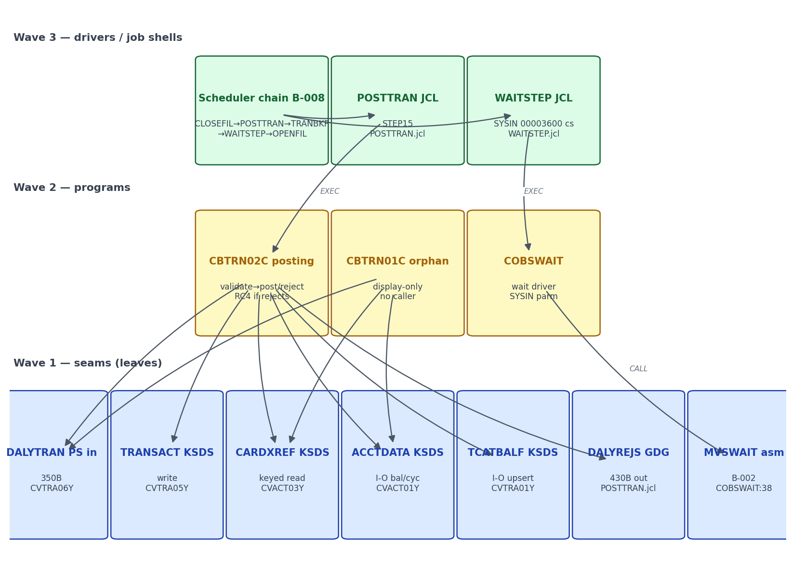

# S-14 Daily Posting Chain — Stream Analysis (`!mf_stream_analysis`)

Status: complete (2026-09-16). Stream assigned by orchestrator; process type
**BATCH** confirmed. Target profiles applied (read-only): CORE + BATCH +
DATA/BOUNDARY from `functional/CARDDEMO/CardDemo_target_state.md`.

## 1. Pinned stream

- **Entry (proof)**: the daily posting chain, defined twice in source —
  - Control-M folder `DAILY-TransactionBackup`: `CLOSEFIL → TRANBKP →
    WAITSTEP → OPENFIL` via INCOND/OUTCOND conditions
    (`app/scheduler/CardDemo.controlm:3-24`). **POSTTRAN is not in this folder.**
  - CA-7 trigger listing: `CLOSEFIL → CBPAUP0J → POSTTRAN → WAITSTEP → OPENFIL`
    (`app/scheduler/CardDemo.ca7:18-24, :42-45` CLOSEFIL→CBPAUP0J;
    `:69-70` CBPAUP0J→POSTTRAN; `:96-97` POSTTRAN→WAITSTEP; `:123-124`
    WAITSTEP→OPENFIL).
  - `CardDemo_inventory.md` merges the two views as
    `CLOSEFIL→POSTTRAN→TRANBKP→WAITSTEP→OPENFIL`. Orchestrator scope for this
    stream: **CBTRN02C (POSTTRAN) + COBSWAIT (WAITSTEP) + CBTRN01C (orphan)**.
    CLOSEFIL/OPENFIL/CBPAUP0J are CICS file-control utility jobs outside scope;
    TRANBKP (IDCAMS REPRO + delete/define TRANSACT, `app/jcl/TRANBKP.jcl`) is a
    VSAM housekeeping job — documented as chain context, not a program unit.
- **Hard stop**: OPENFIL (online files reopened) — the last condition target.
  The stream's own work ends at POSTTRAN's outputs + the WAITSTEP delay.
- **Exclusions**: online transaction intake that produces DALYTRAN (S-06/S-09
  write path), TRANBKP internals, CBPAUP0J, and the CLOSEFIL/OPENFIL file-control
  commands themselves.
- Return-code protocol: POSTTRAN ends `RETURN-CODE = 4` when
  `WS-REJECT-COUNT > 0` (`CBTRN02C.cbl:229-231`), else 0; file errors abend via
  CEE3ABD (`:250,:268,:287` etc.).

## 2. Program inventory + leaf-first DAG

| Program | Path | Role | Callees / edges | Shared? | Present |
|---|---|---|---|---|---|
| POSTTRAN (JCL) | app/jcl/POSTTRAN.jcl | job shell, STEP15 `EXEC PGM=CBTRN02C` | DDs: DALYTRAN PS in, TRANFILE/ACCTFILE/TCATBALF/XREFFILE KSDS, DALYREJS GDG(+1) out 430B | — | yes |
| CBTRN02C | app/cbl/CBTRN02C.cbl | posting program — validate → post or reject | seq read DALYTRAN; keyed XREF/ACCT reads; TRANFILE write; TCATBALF + ACCTFILE I-O; DALYREJS write; CEE3ABD abend | — | yes |
| WAITSTEP (JCL) | app/jcl/WAITSTEP.jcl | job shell, `//WAIT EXEC PGM=COBSWAIT` | SYSIN `00003600` (centiseconds = 36 s) | — | yes |
| COBSWAIT | app/cbl/COBSWAIT.cbl | wait-step driver | `ACCEPT PARM-VALUE FROM SYSIN` (:36) → `CALL 'MVSWAIT'` (:38) → STOP RUN | **shared S-14/S-15 — S-14 owns** (`CardDemo_inventory.md:142`) | yes |
| MVSWAIT | app/asm/MVSWAIT.asm | assembler callee | called by COBSWAIT with centisecond count | shared with COBSWAIT | yes (source absent from build — assembly only) |
| CBTRN01C | app/cbl/CBTRN01C.cbl | **orphan** — validate-only daily-tran sweep (card verify + acct lookup, DISPLAY diagnostics, no writes) | seq DALYTRAN; keyed XREFFILE/ACCTFILE reads (:150-195, :203-230) | none; no caller (inventory §3.4) | yes |
| TRANBKP (JCL) | app/jcl/TRANBKP.jcl | housekeeping job — REPRO TRANSACT→BKUP(+1), delete+define TRANSACT KSDS | IDCAMS steps; COND=(4,LT) | chain context | yes |

**Leaf-first DAG** (rendered):

Source: [`diagrams/S14_daily_posting_dag.mmd`](diagrams/S14_daily_posting_dag.mmd)

## 3. Surfaces (BATCH)

### POSTTRAN — `EXEC PGM=CBTRN02C` (`POSTTRAN.jcl`)

| DD | Dataset | Mode | Target |
|---|---|---|---|
| DALYTRAN | CARDDEMO.DALYTRAN.PS (350B, CVTRA06Y) | sequential input | flat-file reader (`dailytran.txt`/`dailyFile` param) |
| TRANFILE | TRANSACT.VSAM.KSDS | keyed write | `transactions` JPA write |
| XREFFILE | CARDXREF.VSAM.KSDS | keyed read | `card_xrefs` |
| ACCTFILE | ACCTDATA.VSAM.KSDS | keyed I-O | `accounts` read+update |
| TCATBALF | TCATBALF.VSAM.KSDS | keyed I-O | `transaction_category_balances` upsert |
| DALYREJS | DALYREJS(+1) GDG 430B | sequential output | `cbtrn02-rejects.txt` flat file |

CBTRN02C loop (:202-219): per DALYTRAN record → 1500-A XREF read
(INVALID KEY → reason 100 'INVALID CARD NUMBER FOUND', :385-388) → 1500-B ACCT
read (INVALID KEY → 101 'ACCOUNT RECORD NOT FOUND', :397-399; else overlimit
check `WS-TEMP-BAL = ACCT-CURR-CYC-CREDIT - ACCT-CURR-CYC-DEBIT + DALYTRAN-AMT`
vs `ACCT-CREDIT-LIMIT` → 102 'OVERLIMIT TRANSACTION', :403-412; expiration check
`ACCT-EXPIRAION-DATE < DALYTRAN-ORIG-TS(1:10)` → 103 'TRANSACTION RECEIVED AFTER
ACCT EXPIRATION', :414-419). Valid → 2000-POST-TRANSACTION (:424-442 field moves,
DB2-format timestamp via Z-GET-DB2-FORMAT-TIMESTAMP :692-705) → TRANFILE WRITE;
1500-C/D TCATBALF create-or-update (:467-542: read → on NOTFND build + WRITE,
else ADD amount + REWRITE :527-528); 2500-UPDATE-ACCOUNT: `ADD DALYTRAN-AMT TO
ACCT-CURR-BAL`, sign-aware cyc credit (amt≥0) / cyc debit (amt<0) add, REWRITE —
INVALID KEY → reject reason 109 (:545-559). Invalid → reject record =
350B original + 80B trailer `reason 9(04) + desc X(76)` (:446-465, :180-182) →
DALYREJS. End: DISPLAY reject count; `RETURN-CODE = 4` if >0 (:228-231).
All file-status errors → DISPLAY + CEE3ABD abend (:249-268, abend paragraph).

### WAITSTEP — `EXEC PGM=COBSWAIT` (`WAITSTEP.jcl`)

| DD | Content | Semantics |
|---|---|---|
| SYSIN | `00003600` "VALUE IN CENTISECONDS" (:7-8) | 3 600 cs = **36 s** delay |

COBSWAIT: `ACCEPT PARM-VALUE FROM SYSIN` → `MOVE` to `MVSWAIT-TIME 9(8) COMP`
(:36-37) → `CALL 'MVSWAIT'` (:38) → STOP RUN. Purpose: give CICS-time file
close/open actions (CLOSEFIL/OPENFIL) wall-clock settle time between chain steps.

### CBTRN01C — orphan validation sweep (`CBTRN01C.cbl`)

No JCL member executes it (`POSTTRAN.jcl` runs CBTRN02C; no other job refs it —
inventory §3.4). Sequential DALYTRAN read; XREF keyed read (`WS-XREF-READ-STATUS
4` on invalid, :173-183); ACCT keyed read; `DISPLAY` the record and
'CARD NUMBER … COULD NOT BE VERIFIED' / 'ACCOUNT … NOT FOUND' diagnostics; no
writes. Functionally a dry-run/debug variant of the posting pass.

## 4. Data + field dictionary

| Legacy | Form | Direction | Target |
|---|---|---|---|
| DALYTRAN.PS | PS 350B | input feed | flat file (job param `dailyFile`, default `app/data/ASCII/dailytran.txt`) |
| TRANSACT.VSAM.KSDS | KSDS 350B | keyed write | `transactions` |
| CARDXREF.VSAM.KSDS | KSDS 50B | keyed read | `card_xrefs` |
| ACCTDATA.VSAM.KSDS | KSDS 300B | keyed I-O | `accounts` |
| TCATBALF.VSAM.KSDS | KSDS 50B | keyed I-O | `transaction_category_balances` |
| DALYREJS(+1) | GDG 430B FB | output | `cbtrn02-rejects.txt` |

DALYTRAN-RECORD (FACT, `CVTRA06Y.cpy:4-18`) — identical layout to TRAN-RECORD
(see S-10 §4 table): id X(16), type X(02), cat 9(04), source X(10), desc X(100),
amt S9(09)V99, merch-id 9(09), merch-name/city/zip, card X(16), orig/proc ts
X(26) → `transactions` columns + `DailyTransactionRecord` DTO.
ACCOUNT-RECORD (FACT, `CVACT01Y.cpy:4-17`): ACCT-ID 9(11) PK; ACCT-CURR-BAL,
ACCT-CREDIT-LIMIT, ACCT-CASH-CREDIT-LIMIT, ACCT-CURR-CYC-CREDIT,
ACCT-CURR-CYC-DEBIT S9(10)V99 → `numeric(12,2)`; dates X(10) → `date`;
ACCT-ACTIVE-STATUS X(01); ACCT-ADDR-ZIP X(10); ACCT-GROUP-ID X(10).
TRAN-CAT-BAL-RECORD (FACT, `CVTRA01Y.cpy:4-9`): key (TRANCAT-ACCT-ID 9(11),
TRANCAT-TYPE-CD X(02), TRANCAT-CD 9(04)) → composite PK; TRAN-CAT-BAL S9(09)V99.
Reject trailer (FACT, `CBTRN02C.cbl:180-182`): WS-VALIDATION-FAIL-REASON 9(04) +
desc X(76) appended after the 350B record → 430B.

## 5. Boundary table (headline)

`.migration/04_boundary_register.md` is read-only; stream entries inline here.

| ID | Class | Contract | Direction | Cite | Required action / lead time |
|---|---|---|---|---|---|
| S14-B1 | B-008 scheduler chain | Control-M conds CLOSEFIL→TRANBKP→WAITSTEP→OPENFIL (controlm:3-24) + CA-7 SCHID 030 CLOSEFIL→CBPAUP0J→POSTTRAN→WAITSTEP→OPENFIL (ca7:18-124) | inbound | both files | documented job-order + exit codes in target ops runbook; no scheduler engine in scope |
| S14-B2 | B-009 VSAM access | TRANFILE write, XREFFILE/ACCTFILE/TCATBALF keyed I-O | inbound | POSTTRAN.jcl DDs | Postgres JPA per module B-009; physical layer resolved (VSAM, target-owned) |
| S14-B3 | B-010 dataset hand-off | DALYTRAN PS in; DALYREJS(+1) GDG 430B out | both | POSTTRAN.jcl | flat files under job output dir; no GDG versioning (module B-010) |
| S14-B4 | B-002 non-COBOL callee | `CALL 'MVSWAIT'` w/ centisecond binary count | outbound | COBSWAIT.cbl:38; MVSWAIT.asm | Java wait tasklet (`Thread.sleep`) — seam ported in S-14, inherited by S-15 |
| S14-B5 | B-004 error protocol | CEE3ABD abend on any file-status error; RC=4 on rejects>0 | outbound | CBTRN02C.cbl:229-231, :249-268 | exception → step failure; reject-count exit code mapped to job exit code/report |
| S14-B6 | B10 shared-data timing | CLOSEFIL/OPENFIL bracket batch access to online VSAM; TRANBKP recreates TRANSACT mid-chain | both | controlm:3-24 | target DB needs no close/open; document that posting vs online writes serialize via job order only |
| S14-B7 | B-008 feed contract | DALYTRAN produced by upstream daily capture outside repo scope | inbound | POSTTRAN.jcl DALYTRAN | flat-file drop = contract; missing/empty file = empty run RC 0 |
| S14-B8 | module | CBTRN01C orphan duplicates part of the validate path | internal | CBTRN01C.cbl all | port as standalone validation job (`cbtrn01Job` exists in baseline); flag orphan in FR |
| S14-B9 | B-010 housekeeping | TRANBKP destroys+recreates TRANSACT between POSTTRAN and WAITSTEP in the Control-M view | internal | TRANBKP.jcl | eliminated in target (Postgres has no define/delete cycle); document |

## 6. Waves (leaf-first, from DAG depth)

| Wave | Content | Repos touched |
|---|---|---|
| 1 | Verify `cbtrn02Job` vs CBTRN02C semantics (100/101/102/103/109 reasons, 430B reject format, RC=4 contract, sign-aware cyc update); port COBSWAIT seam as a wait tasklet; document daily job order; keep `cbtrn01Job` as the orphan utility | spring-boot/ |

## 7. Risks

1. **Scheduler-view discrepancy**: Control-M shows no POSTTRAN; CA-7 does. The
   posting step exists as a real job (POSTTRAN.jcl + CBTRN02C) — the discrepancy
   is in the *definitions*, likely Control-M modeling the file-swap half while
   CA-7 shows the posting chain. Documented in §1; no resolution needed for
   parity — target documents the job order, not a scheduler migration. MEDIUM
   (fidelity of the daily runbook).
2. **RC=4 propagation**: baseline `cbtrn02Job` writes rejects but does not fail
   or flag the execution — check JobExecution exit code mapping. MEDIUM.
3. **Reject-trailer fidelity**: 430B = 350B record + 9(04)+X(76) trailer —
   verify baseline format matches. MEDIUM-low.
4. **COBSWAIT semantics**: wait is a *job-level* delay between file-open
   operations — in target it's a no-op tasklet seam kept only for runbook shape;
   real value is documenting why it exists. LOW.
5. CBTRN01C is dead code upstream — keep the ported utility clearly labeled
   "orphan (not in daily chain)". LOW.

## 8. Validation

(1) All units inventoried: 3 in-scope programs + POSTTRAN/WAITSTEP/TRANBKP job
shells + MVSWAIT callee (absent-from-build flagged); (2) wave order topological;
(3) claims cited `file:line`; (4) surfaces are BATCH (DD contracts, return
codes, scheduler conditions, restart semantics) only — no screens; (5) all
crossings (DD datasets, CALL MVSWAIT, CEE3ABD, scheduler conds, SYSIN) in the
boundary table; (6) all data leaves resolved — VSAM KSDS → target-owned Postgres,
no stored-procedure question.
