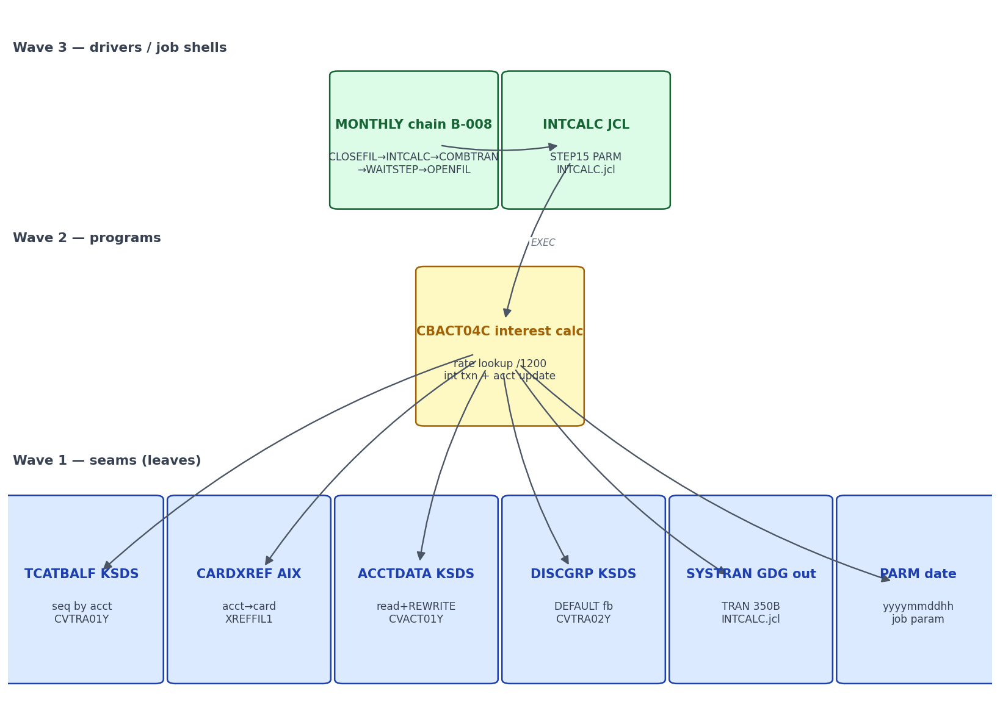

# S-15 Interest Calculation — Stream Analysis (`!mf_stream_analysis`)

Status: complete (2026-09-16). Stream assigned by orchestrator; process type
**BATCH** confirmed. Target profiles applied (read-only): CORE + BATCH +
DATA/BOUNDARY from `functional/CARDDEMO/CardDemo_target_state.md`.

## 1. Pinned stream

- **Entry (proof)**: Control-M folder `MONTHLY-InterestCalculation`:
  `CLOSEFIL → INTCALC → COMBTRAN → WAITSTEP → OPENFIL` via INCOND/OUTCOND
  conditions (`app/scheduler/CardDemo.controlm:64-90`). Job `INTCALC`:
  `//STEP15 EXEC PGM=CBACT04C,PARM='2022071800'` (`app/jcl/INTCALC.jcl:3`).
- **Hard stop**: `SYSTRAN(+1)` GDG written by CBACT04C and merged back into
  TRANSACT by COMBTRAN (SORT merge + REPRO reload,
  `app/jcl/COMBTRAN.jcl`), plus accounts updated in place — the chain ends at
  OPENFIL after the wait step.
- **Exclusions**: CLOSEFIL/OPENFIL file-control internals; COMBTRAN itself
  (merge utility step — documented as chain context, eliminated in target);
  the weekly DISCGRP/TRANTYPE refresh chains (separate folders,
  controlm:26-63); COBSWAIT internals (S-14 owns the port).
- Return-code protocol: RC 0 on clean sweep; CEE3ABD abend on any file-status
  error (`CBACT04C.cbl` error paragraphs throughout, e.g. :326-340, :350-369,
  :455-457, :502-514).

## 2. Program inventory + leaf-first DAG

| Program | Path | Role | Callees / edges | Shared? | Present |
|---|---|---|---|---|---|
| INTCALC (JCL) | app/jcl/INTCALC.jcl | job shell STEP15 `EXEC PGM=CBACT04C,PARM='2022071800'` | DDs: TCATBALF, XREFFILE, XREFFIL1 (AIX path), ACCTFILE, DISCGRP, TRANSACT=SYSTRAN(+1) NEW 350B | — | yes |
| CBACT04C | app/cbl/CBACT04C.cbl | interest calculator | seq TCATBALF grouped by acct (:188-225); keyed ACCTFILE (:367-375); keyed XREF via AIX XREFFIL1 (:381-413); keyed DISCGRP w/ 'DEFAULT' fallback (:415-457); TRANSACT(SYSTRAN) write (:473-514); ACCTFILE REWRITE (:350-369) | — | yes |
| COMBTRAN (JCL) | app/jcl/COMBTRAN.jcl | merge utility — SORT SYSTRAN(0)+BKUP(0) → COMBINED(+1), REPRO → TRANSACT KSDS | DFSORT + IDCAMS | chain context | yes |
| COBSWAIT | app/cbl/COBSWAIT.cbl | wait-step driver (chain context) | CALL MVSWAIT | **shared — S-14 owns** | yes |
| MVSWAIT | app/asm/MVSWAIT.asm | assembler callee | — | shared | yes |

**Leaf-first DAG** (rendered):

Source: [`diagrams/S15_interest_dag.mmd`](diagrams/S15_interest_dag.mmd)

## 3. Surfaces (BATCH)

### INTCALC — `EXEC PGM=CBACT04C,PARM='2022071800'` (`INTCALC.jcl`)

| DD | Dataset | Mode | Target |
|---|---|---|---|
| TCATBALF | TCATBALF.VSAM.KSDS | sequential read, grouped by account | `transaction_category_balances` ordered reader |
| XREFFILE | CARDXREF.VSAM.KSDS | keyed read (card→acct) | `card_xrefs` |
| XREFFIL1 | CARDXREF.VSAM.AIX.PATH | keyed read by **acct-id alternate index** | `card_xrefs` secondary index / `findByXrefAcctId` |
| ACCTFILE | ACCTDATA.VSAM.KSDS | keyed read + REWRITE | `accounts` |
| DISCGRP | DISCGRP.VSAM.KSDS | keyed read (+ 'DEFAULT' fallback) | `disclosure_groups` |
| TRANSACT | SYSTRAN(+1) GDG NEW 350B | sequential write of interest transactions | `transactions` insert (COMBTRAN eliminated) |
| PARM | `PARM='2022071800'` → PARM-DATE X(10) in EXTERNAL-PARMS (:176-180) | job param | `parmDate` JobParameter |

CBACT04C sweep (:188-225): sequential TCATBALF read; on account boundary
(`TRANCAT-ACCT-ID ≠ WS-LAST-ACCT-NUM`, :196) → 1050-UPDATE-ACCOUNT for the
previous account (:197-199), reset WS-TOTAL-INT, read ACCTFILE (:367-375), read
XREF via FD-XREF-ACCT-ID (AIX path, :381-413). Per record: DISCGRP key =
ACCT-GROUP-ID + TRANCAT-TYPE-CD + TRANCAT-CD (:210-213); INVALID KEY → retry
with group 'DEFAULT' (:436-444); on `DIS-INT-RATE ≠ 0`: interest =
`(TRAN-CAT-BAL × DIS-INT-RATE) / 1200` (:463-465) accumulated and written as an
interest transaction (:473-514): TRAN-ID = `PARM-DATE`+6-digit counter suffix,
type `'01'`, category `'05'`, source `'System'`, description
`'Int. for a/c <acct>'`, amount = interest, card = XREF-CARD-NUM, orig/proc ts =
current DB2-format timestamp. At account-group end / EOF: `ADD WS-TOTAL-INT TO
ACCT-CURR-BAL`, `ACCT-CURR-CYC-CREDIT/DEBIT := 0`, REWRITE (:343-369).
`1400-COMPUTE-FEES` is a stub — 'To be implemented' (:518-520).

## 4. Data + field dictionary

| Legacy | Form | Direction | Target |
|---|---|---|---|
| TCATBALF.VSAM.KSDS | KSDS 50B | seq read | `transaction_category_balances` (sorted acct,type,cat) |
| CARDXREF AIX path | KSDS+AIX 50B | keyed read by acct | `card_xrefs` (index on xref_acct_id) |
| ACCTDATA.VSAM.KSDS | KSDS 300B | keyed I-O | `accounts` |
| DISCGRP.VSAM.KSDS | KSDS 50B | keyed read | `disclosure_groups` |
| SYSTRAN(+1) | GDG 350B | write | `transactions` rows (type 01/cat 05) |

DIS-GROUP-RECORD (FACT, `CVTRA02Y.cpy:4-9`): key DIS-ACCT-GROUP-ID X(10) +
DIS-TRAN-TYPE-CD X(02) + DIS-TRAN-CAT-CD 9(04) → composite PK;
DIS-INT-RATE S9(04)V99 → `numeric(6,2)` annual %.
TRAN-CAT-BAL-RECORD (FACT, `CVTRA01Y.cpy:4-9`): key (acct 9(11), type X(02),
cat 9(04)); TRAN-CAT-BAL S9(09)V99 → `numeric(11,2)`.
Interest TRANSACTION = full TRAN-RECORD (FACT, `CVTRA05Y.cpy`) populated per
§3 field moves — documented derivation: TRAN-ID X(16) = `PARM-DATE`(10)
+ `WS-TRANID-SUFFIX` 9(06) (:473-480, :173).
PARM contract (FACT, :176-180): PARM-LENGTH S9(04) COMP + PARM-DATE X(10)
(from PARM='2022071800' — 10 chars yyyymmddhh).

## 5. Boundary table (headline)

`.migration/04_boundary_register.md` is read-only; stream entries inline here.

| ID | Class | Contract | Direction | Cite | Required action / lead time |
|---|---|---|---|---|---|
| S15-B1 | B-009 VSAM | TCATBALF seq, ACCTFILE I-O, DISCGRP keyed | inbound | INTCALC.jcl DDs | Postgres JPA; physical layer resolved (VSAM, target-owned, no SP) |
| S15-B2 | B-009 alternate index | XREFFIL1 = path over AIX keyed by XREF-ACCT-ID | inbound | INTCALC.jcl XREFFIL1 DD | `card_xrefs` index on xref_acct_id + `findByXrefAcctId` |
| S15-B3 | B-010 dataset chain | SYSTRAN(+1) GDG written, then COMBTRAN merges into TRANSACT | outbound | INTCALC.jcl TRANSACT; COMBTRAN.jcl | write `transactions` directly; COMBTRAN eliminated (no GDG versioning) |
| S15-B4 | B-008 params | JCL PARM 'yyyymmddhh' → PARM-DATE X(10); seeds TRAN-ID prefix | inbound | INTCALC.jcl:3; CBACT04C.cbl:176-180, :473-480 | `parmDate` JobParameter + transaction-id derivation |
| S15-B5 | B-008 chain | MONTHLY order CLOSEFIL→INTCALC→COMBTRAN→WAITSTEP→OPENFIL | inbound | controlm:64-90 | documented monthly job order + exit codes |
| S15-B6 | B-002 wait seam | COBSWAIT/MVSWAIT between COMBTRAN and OPENFIL | internal | controlm:81-85 | consume S-14's WaitStepTasklet — not re-ported |
| S15-B7 | B-004 errors | CEE3ABD abend on any file-status error | outbound | CBACT04C.cbl abend paths | exception → step FAILED → job exit code |
| S15-B8 | B10 shared data | DISCGRP refreshed weekly by a separate chain (controlm:32-53); 'DEFAULT' group is the documented fallback | inbound | CBACT04C.cbl:436-444 | disclosure data seeded; fallback preserved; DISCGRP refresh = separate stream concern |

All contracts resolved from source; **no unresolved-contract blockers**.

## 6. Waves (leaf-first, from DAG depth)

| Wave | Content | Repos touched |
|---|---|---|
| 1 | Verify `cbact04Job` vs CBACT04C semantics: acct-group break update order, rate lookup + DEFAULT fallback, `(bal×rate)/1200` formula + rounding, interest-transaction record (id = parm-date + suffix vs `TransactionIdGenerator`, type 01/cat 05/'System'/desc/card/timestamps), account REWRITE + cyc zeroing; monthly job-order runbook | spring-boot/ |

## 7. Risks

1. **TRAN-ID derivation**: legacy `PARM-DATE`(10)+6-digit run counter is
   deterministic per run; baseline uses `TransactionIdGenerator.nextId()` —
   different id space. Deviation — record (MEDIUM-low; affects id-format parity
   vs downstream consumers, none in repo).
2. **Card-less accounts**: legacy **abends** — `1110-GET-XREF-DATA` INVALID KEY
   → status '23' ≠ '00' → APPL-RESULT 12 → CEE3ABD (:395-411); same for missing
   ACCTFILE (:367-375). Baseline `calculateInterest` silently skips the interest
   txn when card==null and still updates the account — a real semantic delta.
   MEDIUM.
3. **Cycle reset semantics**: legacy zeros CURR-CYC-CREDIT/DEBIT at month end
   per account — baseline `writeInterest` does the same. Verify non-interest
   accounts (no tcatbal rows) are untouched in both — likely equivalent. LOW.
4. **PARM format**: 'yyyymmddhh' (10 chars) — a date-hour prefix; baseline has
   no parm. LOW.
5. **Fees stub**: `1400-COMPUTE-FEES` 'To be implemented' (:518-520) — legacy
   dead path; do NOT implement (faithful stub). LOW.

## 8. Validation

(1) All units inventoried (CBACT04C + INTCALC/COMBTRAN/WAITSTEP shells +
shared COBSWAIT — none absent); (2) wave order topological; (3) claims cited
`file:line`; (4) surfaces are BATCH (DD contracts, params, scheduler conds,
exit codes) only; (5) all crossings (VSAM DDs, AIX path, GDG, PARM, CALL
MVSWAIT via shared program, CEE3ABD, scheduler conds) in the boundary table;
(6) data leaves resolved — all VSAM KSDS → target-owned Postgres, AIX path →
secondary index; no stored-procedure question.
