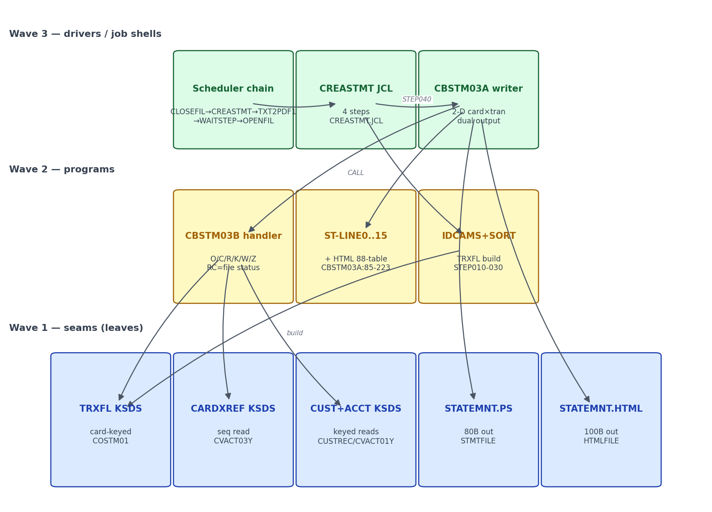

# S-16 Statement Generation — Stream Analysis (`!mf_stream_analysis`)

Status: complete (2026-09-16). Stream assigned by orchestrator; process type
**BATCH** confirmed. Target profiles applied (read-only): CORE + BATCH +
DATA/BOUNDARY from `functional/CARDDEMO/CardDemo_target_state.md`.

## 1. Pinned stream

- **Entry (proof)**: Control-M statement chain: `CLOSEFIL → CREASTMT →
  TXT2PDF1 → WAITSTEP → OPENFIL` (`app/scheduler/CardDemo.controlm` statement
  folder; CA-7 agrees — `app/scheduler/CardDemo.ca7:468-471` `CLOSEFIL →
  CREASTMT`, `:493` `CREASTMT → TXT2PDF1`, `:517-520` `TXT2PDF1 → WAITSTEP`).
- **Hard stop**: `AWS.M2.CARDDEMO.STATEMNT.PS` (80B) + `STATEMNT.HTML` (100B)
  written by CBSTM03A, plus the TXT2PDF1 conversion step producing PDFs.
- **Exclusions**: CLOSEFIL/OPENFIL file-control internals; the TXT2PDF1 tool
  itself (external converter — target emits HTML + prints directly, PDF via a
  target-side library if required — flagged); COBSWAIT internals (S-14 owns).
- Job `CREASTMT.JCL` has 4 steps (`app/jcl/CREASTMT.JCL`): DELDEF01 IDCAMS
  delete/define TRXFL VSAM KSDS `KEYS(32 0)`; STEP010 SORT filtered transactions
  (current acct, key card+id → OUTREC recut: `1:263,16, 17:1,262, 279:279,50` —
  reorders to card-id-first, TRXFL.SEQ); STEP020 REPRO TRXFL.SEQ → TRXFL KSDS,
  `COND=(0,NE)` on STEP010; STEP030 IEFBR14 delete TRXFL.SEQ `COND=(0,NE)`;
  STEP040 `EXEC PGM=CBSTM03A,PARM='12'` → STATEMNT.PS + STATEMNT.HTML.
- Return-code protocol: CBSTM03A RC 0; file errors → DISPLAY + abend.

## 2. Program inventory + leaf-first DAG

| Program | Path | Role | Callees / edges | Shared? | Present |
|---|---|---|---|---|---|
| CREASTMT (JCL) | app/jcl/CREASTMT.JCL | 4-step job shell | DELDEF01/STEP010/STEP020/STEP030 utilities + STEP040 CBSTM03A | — | yes |
| CBSTM03A | app/cbl/CBSTM03A.cbl | statement writer — TIOT walk + DD display (:265-288), ALTER-driven file dispatch (:296-315), preloads TRXFL into `WS-TRNX-TABLE` 51 cards × 10 txns (:818-854), per-xref statement loop (:316-330), writes STMT-FILE 80B + HTML-FILE 100B | `CALL 'CBSTM03B' USING WS-M03B-AREA` ×15 (all file I/O), `CALL 'CEE3ABD'` (:922) | — | yes |
| CBSTM03B | app/cbl/CBSTM03B.cbl | **file-handler subroutine** (not a second statement program) — dispatches on LK-M03B-DD: TRNXFILE seq read (key card X(16)+id X(16), 350B rec), XREFFILE seq read, CUSTFILE/ACCTFILE random keyed reads; RC returned in LK-M03B-RC | called only by CBSTM03A | — | yes |
| TXT2PDF1 | app/ctlcard/TXT2PDF1.txt (proc) | text→PDF conversion step | external tool; no COBOL | chain context | ctlcard only |
| COBSWAIT | app/cbl/COBSWAIT.cbl | wait step | CALL MVSWAIT | shared — S-14 owns | yes |

CBSTM03A/CBSTM03B relationship (verified from source): CBSTM03A owns zero
input files — its FILE-CONTROL declares only STMT-FILE and HTML-FILE
(:39-41); every TRXFL/XREFFILE/CUSTFILE/ACCTFILE access is a
`CALL 'CBSTM03B'` with an LK-M03B-AREA linkage (DD X(08), operation O/C/R/K/W/Z,
RC X(02), key+key-len, FLDT X(1000) — CBSTM03B.CBL:99-112). CBSTM03B is the
IO handler, not a partition. **`PARM='12'` on STEP040 is never used** —
CBSTM03A's PROCEDURE DIVISION has no USING PARM and LINKAGE only holds the
PSA/TCB/TIOT walk structures (:239-263); the parm is vestigial.

**Leaf-first DAG** (rendered):

Source: [`diagrams/S16_statements_dag.mmd`](diagrams/S16_statements_dag.mmd)

## 3. Surfaces (BATCH)

### CREASTMT steps (`app/jcl/CREASTMT.JCL`)

| Step | Program/util | DD contract | Target fate |
|---|---|---|---|
| DELDEF01 | IDCAMS | delete+define `M2.CARDDEMO.TRXFL` KSDS KEYS(32 0) | eliminated (table query, no rebuild) |
| STEP010 | SORT | read `TRANSACT.BKUP(+1)`; INCLUDE `TRAN-PROC-TS < current` style filter + sort card,id (263,16,A,1,16,A); OUTREC recut `(card,rest,ts)` 330B; → TRXFL.SEQ | reader predicate + sort |
| STEP020 | IDCAMS REPRO | TRXFL.SEQ → TRXFL KSDS; `COND=(0,NE)` | eliminated |
| STEP030 | IEFBR14 | delete TRXFL.SEQ `COND=(0,NE)` | eliminated |
| STEP040 | CBSTM03A PARM='12' | STATEMNT.PS 80B + STATEMNT.HTML 100B | `cbstm03Job` → `STATEMNT.PS`-equivalent text + HTML file |

### CBSTM03A statement surface

Input files all reached via CBSTM03B: TRXFL sequential (preload, sorted
card+id), XREFFILE sequential (statement driver — one statement per xref row,
even zero-transaction cards), CUSTFILE + ACCTFILE random keyed reads per card
(CBSTM03A.CBL:317-330). Outputs: `STATEMNT.PS` 80-col text and `STATEMNT.HTML`
100-col HTML written in parallel. Per statement: ST-LINE0 asterisk frame
('START OF STATEMENT'), customer name/addr (ST-LINE1-4), 'Basic Details' block
(acct id, `9(9).99-` balance, FICO — ST-LINE7/8/9), 'TRANSACTION SUMMARY'
header, detail lines ST-LINE14 (`id | details | $ Z(9).99-`), 'Total EXP:'
(ST-LINE14A), 'END OF STATEMENT' (ST-LINE15) — layouts :87-135. HTML adds
the fixed table skeleton + 'Bank of XYZ' / '410 Terry Ave N' /
'Seattle WA 99999' literals (:145-233). **Hard caps:** WS-TRNX-TABLE is
51 cards × 10 transactions with no bounds check (:248-252, :818-854) — a
51st card or 11th transaction overwrites memory (source-faithful defect, not
preserved in target).

## 4. Data + field dictionary

| Legacy | Form | Direction | Target |
|---|---|---|---|
| TRANSACT.BKUP(+1) | GDG input to sort | read | `transactions` (query+sort replaces SORT+REPRO) |
| TRXFL.VSAM.KSDS | KSDS 330B recut key card+id | seq read | eliminated — reader iterates sorted transactions |
| ACCTDATA.VSAM.KSDS | KSDS | keyed read | `accounts` |
| CUSTDAT.VSAM.KSDS | KSDS | keyed read | `customers` |
| CARDXREF.VSAM.KSDS | KSDS | keyed read | `card_xrefs` |
| STATEMNT.PS | PS 80B | write | `STATEMNT.PS`-equivalent text file |
| STATEMNT.HTML | PS 100B | write | `statements.html`-equivalent file |

TRXFL record (FACT, `CBSTM03B.CBL:55-63` + `CVTRA05Y`): key FD-TRNXS-ID =
card X(16) + tran-id X(16) (KEYS(32 0) KSDS); body 318B = TRAN-RECORD fields.
Statement layouts ST-LINE0..15 + HTML-Lxx (FACT, `CBSTM03A.CBL:87-233` +
`COSTM01.cpy`). Customer record (FACT, `CUSTREC.cpy:5-21`, RECLN 500):
CUST-ID 9(09); FIRST/MIDDLE/LAST-NAME X(25)×3; ADDR-LINE-1/2/3 X(50);
STATE-CD X(02); COUNTRY-CD X(03); ZIP X(10); FICO 9(03) → `customers`
columns.

## 5. Boundary table (headline)

`.migration/04_boundary_register.md` is read-only; stream entries inline here.

| ID | Class | Contract | Direction | Cite | Required action / lead time |
|---|---|---|---|---|---|
| S16-B1 | B-009 VSAM | ACCT/CUST/XREF keyed reads; TRANSACT.BKUP as sorted source | inbound | CREASTMT DDs | Postgres JPA; physical layer resolved (VSAM, no SP) |
| S16-B2 | B-010 dataset chain | BKUP(+1) → SORT → TRXFL.SEQ → TRXFL KSDS → read | inbound | CREASTMT.JCL steps | repository query sorted card+id eliminates 3 utility steps |
| S16-B3 | B-010 outputs | STATEMNT.PS 80B + STATEMNT.HTML 100B | outbound | STEP040 DDs | flat files under job output dir (`statements.txt`/`statements.html`) |
| S16-B4 | B-008 params | `PARM='12'` — **never read** by CBSTM03A (no USING PARM; vestigial) | inbound | CREASTMT.JCL STEP040 | no JobParameter needed; document vestigial parm |
| S16-B5 | B-008 chain | CLOSEFIL→CREASTMT→TXT2PDF1→WAITSTEP→OPENFIL | inbound | controlm + ca7:468-520 | documented statement job order + exit codes |
| S16-B6 | external tool | TXT2PDF1 text→PDF conversion | outbound | ca7:493 | target: PDF generation in-app if required — DECIDE at plan stop; keep PS+HTML parity minimum |
| S16-B7 | B-002 wait | COBSWAIT seam | internal | controlm | consume S-14 tasklet |
| S16-B8 | B-004 errors | CEE3ABD abend on IO failures | outbound | CBSTM03A/B error paths | exception → step FAILED |
| S16-B9 | B10 sub-program seam | `CALL 'CBSTM03B'` file-handler linkage (DD/OPER/RC/KEY/FLDT) ×15 | internal | CBSTM03A.CBL:351-909; CBSTM03B.CBL:99-112 | Java: repositories replace the handler subroutine — no sub-program ported |

All contracts resolved from source; **no unresolved-contract blockers**.

## 6. Waves (leaf-first, from DAG depth)

| Wave | Content | Repos touched |
|---|---|---|
| 1 | Verify `cbstm03Job` vs CBSTM03A/B semantics: per-xref card statement loop (every card incl. zero-txn), preload-vs-stream read equivalence, COSTM01 statement layout parity for PS output + HTML literals, M03B-handler→repository seam, exit protocol; document statement job order | spring-boot/ |

## 7. Risks

1. **51×10 memory caps**: legacy preloads all TRXFL trans into a fixed
   51-card × 10-txn array with no bounds check (`CBSTM03A.CBL:248-252`,
   :818-854) — a 51st card or 11th txn silently overruns memory. Target
   streams rows; strictly safer, but outputs for >51 cards are *undefined* in
   legacy — target is the correct reference. MEDIUM.
2. **Output layout fidelity**: baseline `statementPlain` emits 'Bank of XYZ'
   header — legacy ST-LINE0 is an asterisk frame; exact 80-col/100-col parity
   needs golden compare. MEDIUM.
3. **TXT2PDF1**: PDF is produced by an external ctlcard tool — target has no
   equivalent; decide whether HTML alone satisfies the statement surface at
   STOP C. MEDIUM.
4. **Per-card, not per-account**: every XREFFILE row produces a statement —
   zero-transaction cards included (FACT, `CBSTM03A.CBL:317-330`). Baseline
   `cbstm03Job` iterates `CardXref` identically — semantics already match.
   Resolved (not a risk). `PARM='12'` is never read by the program (no
   linkage) — vestigial, documented. LOW.
5. Job has `COND=(0,NE)` chaining on utility steps — any preceding nonzero skips
   later steps; target equivalent = step ordering in one job. LOW.

## 8. Validation

(1) All units inventoried: CBSTM03A, CBSTM03B, CREASTMT job + 4 steps, TXT2PDF1
ctlcard (present, external), COBSWAIT shared; none absent; (2) wave order
topological; (3) claims cited `file:line`; (4) BATCH surfaces only (DD
contracts, params, COND codes, dataset chain); (5) all crossings (VSAM DDs,
GDG input, PS outputs, PARM, external TXT2PDF, wait seam, CEE3ABD) in the
boundary table; (6) data leaves resolved — all VSAM → target-owned Postgres;
no stored-procedure question.
