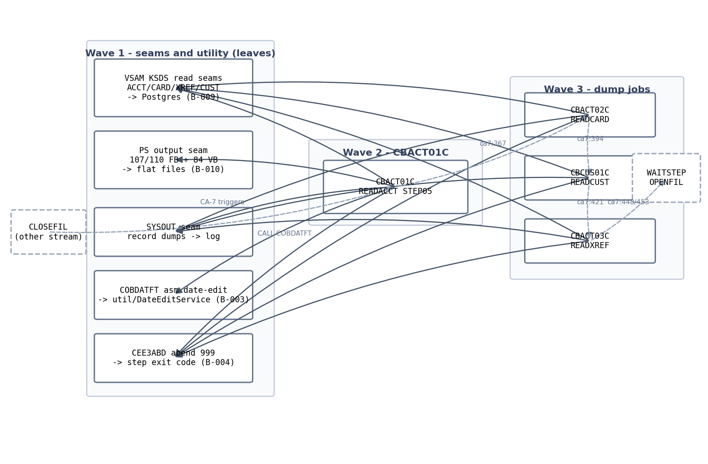

# S-17 — Data Read / Verify Jobs — Stream Analysis

## 1. The pinned stream

**Stream**: S-17 Data read/verify jobs. Inventory row: `S-17 | Data read/verify jobs | BATCH | READ*.jcl | CBACT01C,CBACT02C,CBACT03C,CBCUS01C | active` (functional/CARDDEMO/CardDemo_inventory.md).

**Process type**: BATCH — every entry point is a JCL job submitted through the CA-7 scheduler; no CICS, no screens.

**Entry**: CA-7 triggered chain at SCHID=030. `CLOSEFIL` triggers `READACCT` (app/scheduler/CardDemo.ca7:340), which triggers `READCARD` (ca7:367) → `READCUST` (ca7:394) → `READXREF` (ca7:421) → `WAITSTEP` (ca7:448) → `OPENFIL` (ca7:453). The four S-17 jobs run inside the file-close window between CLOSEFIL (which quiesces the online files) and OPENFIL (which reopens them) — i.e. these are read/verify passes executed while the VSAM datasets are closed to CICS.

**Hard stop**: end-of-job of each READ* job, chained job-to-job by CA-7 triggers. The stream ends at READXREF; WAITSTEP and OPENFIL belong to the file open/close stream and are out of scope.

**Jobs and steps** (every claim from JCL):

| Job | Step(s) | Program | Function |
|---|---|---|---|
| READACCT | PREDEL (`app/jcl/READACCT.jcl:22`), STEP05 (`:32`) | IEFBR14, CBACT01C | PREDEL deletes the 3 output PS datasets (DD01–DD03 `:23-27`); STEP05 reads ACCTFILE and writes OUTFILE + ARRYFILE + VBRCFILE |
| READCARD | STEP05 (`app/jcl/READCARD.jcl:22`) | CBACT02C | Sequential read of CARDFILE, DISPLAY each record to SYSOUT |
| READCUST | STEP05 (`app/jcl/READCUST.jcl:21`) | CBCUS01C | Sequential read of CUSTFILE, DISPLAY each record to SYSOUT |
| READXREF | STEP05 (`app/jcl/READXREF.jcl:22`) | CBACT03C | Sequential read of XREFFILE, DISPLAY each record to SYSOUT |

**Exclusions**: CBACT04C/REPORT-type jobs (a `Cbact04JobConfiguration` exists in baseline for a different program — not this stream); CLOSEFIL/OPENFIL/WAITSTEP (separate file-open/close jobs, other streams); Control-M — `app/scheduler/CardDemo.controlm` contains only DAILY/WEEKLY/MONTHLY folders, no READ* or S-18 jobs (scheduling lives solely in CA-7 for this stream).

## 2. Program inventory and leaf-first DAG

| Program | Source | Role | Callees | Present | Shared |
|---|---|---|---|---|---|
| CBACT01C | `app/cbl/CBACT01C.cbl` | job step — read/verify + multi-file writer | COBDATFT (CALL, `:231`), CEE3ABD (CALL, `:410`) | yes | no |
| CBACT02C | `app/cbl/CBACT02C.cbl` | job step — read/dump | CEE3ABD (`:158`) | yes | no |
| CBACT03C | `app/cbl/CBACT03C.cbl` | job step — read/dump | CEE3ABD (`:158`) | yes | no |
| CBCUS01C | `app/cbl/CBCUS01C.cbl` | job step — read/dump | CEE3ABD (`:158`) | yes | no |
| COBDATFT | `app/asm/COBDATFT.asm` | utility — assembler date reformat | none | yes | owned by S-17 (only caller is CBACT01C); register B-003 |
| CEE3ABD | LE runtime | abend service | — | platform | register B-004 |

Absent programs: none reachable. Baseline Java: **none of these jobs exist** in `spring-boot/` (no `Cbact01/02/03*` or `Cbcus01*` configs; grep `cbact|cbcus|readacct|readcard|readcust|readxref|DateEdit|COBDATFT` over `spring-boot/src` returns only `Cbact04JobConfiguration`, a different program). S-17 is greenfield.

Source: `functional/CARDDEMO/diagrams/S17_data_read_verify_dag.mmd`.

## 3. Surfaces (BATCH)

### READACCT / CBACT01C
- **Input**: `ACCTFILE` — KSDS `AWS.M2.CARDDEMO.ACCTDATA.VSAM.KSDS`, DISP=SHR (`READACCT.jcl:35-36`), 300-byte records (`CVACT01Y.cpy`), sequential read.
- **Outputs** (all pre-deleted by PREDEL then recreated on WRITE):
  - `OUTFILE` → `ACCTDATA.PSCOMP` FB LRECL=107 (`READACCT.jcl:37-39`). Written per account from `OUT-ACCT-REC` (CBACT01C.cbl WORKING-STORAGE): computed field layout is ~106 bytes; JCL LRECL=107 implies a trailing pad byte — **INFERRED layout padding**, flagged.
  - `ARRYFILE` → `ACCTDATA.ARRYPS` FB LRECL=110 (`READACCT.jcl:41-43`). `ARR-ARRAY-REC` layout ~105 bytes vs LRECL=110 — **INFERRED layout padding**, flagged.
  - `VBRCFILE` → `ACCTDATA.VBPS` VB LRECL=84 (`READACCT.jcl:45-47`). Variable output: two records per account — rec1 length 12 (`VB1`: account id + status), rec2 length 39 (`VB2`: account id + curr-bal + credit-limit + reissue YYYY). LRECL 84 = max record 80 + 4-byte RDW.
  - `SYSOUT`/`SYSPRINT` (`READACCT.jcl:49-50`): DISPLAY of raw `ACCOUNT-RECORD` plus per-field labelled lines per record.
- **Control cards / PARM**: none.
- **Status protocol**: file status `'00'` ok, `'10'` EOF; any other → `9999-ABEND` → `CALL 'CEE3ABD' USING ABCODE(999) TIMING(0)` (`CBACT01C.cbl:410`). Write checks additionally tolerate `'10'` on output files.
- **Commit/checkpoint/restart**: none — single pass; rerun = resubmit whole job (outputs deleted by PREDEL anyway).
- **Scheduler conditions**: CA-7 trigger chain only (see §1); job requires prior job success implicitly via trigger.

### READCARD / CBACT02C, READCUST / CBCUS01C, READXREF / CBACT03C
- Identical single-step shape: one KSDS input (`CARDFILE` 150B `CVACT02Y`; `CUSTFILE` 500B `CVCUS01Y`; `XREFFILE` 50B `CVACT03Y`), `DISPLAY` of each record to SYSOUT, same status/abend protocol, no outputs, no PARM, no checkpoint.
- Quirk (keep for parity): CBACT03C and CBCUS01C each DISPLAY the record **twice** per record — once inside the GET-NEXT paragraph and once in the main loop (CBACT03C.cbl:78 and :96; CBCUS01C.cbl:78 and :96). CBACT02C's in-read DISPLAY is commented out (`CBACT02C.cbl:96`), so cards dump once.

### COBDATFT (called utility — SUBTRANSACTION-shaped leaf inside a batch step)
- Linkage via `COCDATFT.mac` DSECT: `COINTYPE` CL1, `COINPDT` CL20, `COOUTYPE` CL1, `COOUTDT` CL20, `COERMSG` CL38.
- Semantics (`app/asm/COBDATFT.asm`): type `'1'` (input `YYYYMMDD`) → output `YYYY-MM-DD`, only when `COOUTYPE='1'`; errors if input byte 5 is `'-'` or `COOUTYPE='2'`. Type `'2'` (input `YYYY-MM-DD`) → output `YYYYMMDD`, only when `COOUTYPE='2'`; errors if `COOUTYPE='1'`. Any other `COINTYPE` → error. Error path writes `INVALID INPUT` into `COERMSG` and still returns R15=0 — callers can only detect failure by inspecting `COERMSG`. CBACT01C calls it with `TYPE='2'`, `OUTTYPE='2'` to reformat `ACCT-REISSUE-DATE` (`CBACT01C.cbl:231`) and never checks `COERMSG` — error input yields garbage output silently. Preserve.
- Only bytes 0–7 of `COOUTDT` are set on the '2' path; bytes 8–19 of the 20-byte output area retain whatever the caller's record area held (spaces in practice). CBACT01C moves the first 10 bytes into `OUT-ACCT-REISSUE-DATE` (X(10)) → `YYYYMMDD` + 2 pad bytes. **INFERRED** on pad content.

## 4. Data + field dictionary

All four inputs are VSAM KSDS read sequentially → Postgres repository reads, key order = primary key (B-009 decided).

### ACCOUNT (ACCTFILE → `accounts` table / `Account` entity; `CVACT01Y.cpy`, 300B)
| COBOL field | PIC | Target | Basis |
|---|---|---|---|
| ACCT-ID | 9(11) | `Long acctId` @Id | FACT (Account.java) |
| ACCT-ACTIVE-STATUS | X(1) | `String status` len 1 | FACT |
| ACCT-CURR-BAL / CREDIT-LIMIT / CASH-CREDIT-LIMIT | S9(10)V99 COMP-3 | `BigDecimal` (19,2) | FACT |
| ACCT-OPEN-DATE / EXPIRAION-DATE / REISSUE-DATE | X(10) `YYYY-MM-DD` | `LocalDate` | FACT |
| ACCT-CURR-CYC-CREDIT / DEBIT | S9(10)V99 COMP-3 | `BigDecimal` | FACT |
| ACCT-GROUP-ID | X(10) | `String groupId` len 10 | FACT |

### CARD (CARDFILE → `cards` / `Card`; `CVACT02Y.cpy`, 150B)
card-number X(16)→`String cardNumber` @Id; card-acct-id 9(11)→`Long`; card-cvv-code 9(3)→`Integer`; card-embossed-name X(50)→`String`; card-expiration-date X(10)→`LocalDate`; card-active-status X(1)→`String`. FACT.

### XREF (XREFFILE → `card_xrefs` / `CardXref`; `CVACT03Y.cpy`, 50B)
xref-card-number X(16)→@Id `String`; xref-cust-id 9(9)→`Long`; xref-acct-id 9(11)→`Long`. FACT.

### CUSTOMER (CUSTFILE → `customers` / `Customer`; `CVCUS01Y.cpy`, 500B)
cust-id 9(9)→`Long custId` @Id; name X(25)×3; address X(50)×3 + state X(2) + country X(3) + zip X(10); phone X(15)×2; ssn 9(9)→`Long`; govt-id X(20); dob X(10)→`LocalDate`; eft-account-id X(10); primary-card-holder X(1); fico 9(3)→`Integer`. FACT.

### S-17-only output layouts (WRITE targets, not tables)
- `OUT-ACCT-REC` (PSCOMP): field-for-field copy of account with reissue date reformatted; `S9(10)V99` written as **zoned display** (12 bytes, overpunch sign) except `OUT-ACCT-CURR-CYC-DEBIT` COMP-3 6 bytes; constant `2525.00` substituted when `ACCT-CURR-CYC-DEBIT` = 0 (`CBACT01C.cbl:236-237`).
- `ARR-ARRAY-REC` (ARRYPS): acct-id + 5-element occur of (curr-bal, cyc-debit COMP-3) with hardcoded demo values `1005.00/1525.00/-1025.00/-2500.00` + 4-byte filler (`CBACT01C.cbl:256-260`).

## 5. Boundary table (headline)

Module-level register entries already DECIDED and inherited: B-003 (COBDATFT → Java util), B-004 (CEE3ABD → step failure → process exit code 999), B-008 (job launcher `POST /api/admin/jobs/{jobName}` + documented job order), B-009 (VSAM→Postgres), B-010 (PS/GDG → flat files under job output dir).

`.migration/` is read-only for this doc pass — the following are **proposed register entries for append** by the orchestrator:

| ID | Crossing | Class | Contract | Dir | Action |
|---|---|---|---|---|---|
| S17-B1 | CA-7 SCHID=030 chain: CLOSEFIL→READACCT→READCARD→READCUST→READXREF→WAITSTEP→OPENFIL (ca7:340,367,394,421,448,453) | B8 scheduler | ordered job chain inside file-close window; each step gated on prior success | in | Implement as documented job-order config over `BatchJobLauncherService`; launch via `POST /api/admin/jobs/{jobName}` |
| S17-B2 | ACCTFILE/CARDFILE/XREFFILE/CUSTFILE KSDS sequential reads (JCL DDs above) | B9 persistence | full-file sequential scan in key order | in | `RepositoryItemReader` / `JpaPagingItemReader` sorted by primary key; physical layer = Postgres JPA, no stored procedures |
| S17-B3 | `CALL 'COBDATFT'` (CBACT01C.cbl:231) | B3 non-COBOL callee | COCDATFT parameter block (type/in-date/outtype/out-date/err); R15 always 0; '1'→'1' adds dashes, '2'→'2' strips dashes, else `INVALID INPUT` | in | Port as `util/DateEditService` preserving semantics incl. silent-error + trailing-space behavior |
| S17-B4 | `CALL 'CEE3ABD' ABCODE 999` (all 4 pgms) | B4 LE runtime | abend on file-status ≠ '00'/'10' | out | Step failure → process exit code 999-equivalent per B-004 decision |
| S17-B5 | PSCOMP/ARRYPS/VBPS PS outputs + PREDEL deletes (READACCT.jcl:22-47) | B10 dataset hand-off | FB 107/110 + VB 84 (12/39-byte recs); recreate each run | out | Flat files under job output dir, delete-if-exists on rerun; fixed-width byte-faithful write incl. zoned-decimal overpunch via `CobolFieldReader`/writer `-fsign=EBCDIC` semantics |
| S17-B6 | DISPLAY → SYSOUT record dumps (all 4 pgms) | B10 report surface | per-record dump lines; labelled per-field lines in CBACT01C; double-display quirk in CBACT03C/CBCUS01C | out | Write to job log (SLF4J), preserving record dump format + the double-display quirk for parity |
| S17-B7 | INFERRED output padding — OUT-ACCT-REC 106 vs LRECL 107; ARR-ARRAY-REC 105 vs LRECL 110 | B10 layout | trailing pad bytes to LRECL | out | **Unresolved**: pad to JCL LRECL in writer; mark layout FACT-pending confirmation |

## 6. Waves

| Wave | Programs/seams | Why |
|---|---|---|
| 1 | VSAM read seams (repository readers), PS-output flat-file seam (fixed/variable writers), SYSOUT→log seam, `util/DateEditService` (COBDATFT port), abend→exit-code seam | All leaves; nothing in waves 2–3 runs without them |
| 2 | CBACT01C (`Cbact01JobConfiguration` → `readacctJob`) | Depends on every seam incl. DateEditService; most complex (3 outputs, VB, constants) |
| 3 | CBACT02C, CBACT03C, CBCUS01C (`cbact02`/`cbact03`/`cbcus01` jobs) | Identical shape, independent of wave 2 and each other |

Strict cross-wave edges: wave-2 CBACT01C needs wave-1 DateEditService + writers; wave-3 jobs need wave-1 readers/log seam only. Shared programs ported for the module: COBDATFT (only S-17 caller today, but it is module property once ported).

## 7. Risks

- **R1** PSCOMP/ARRYPS record layouts are shorter than JCL LRECL (106<107, 105<110) — trailing pad content INFERRED; pick space pad, flag in plan.
- **R2** COBDATFT output area bytes 8–19 unspecified — write `YYYYMMDD` + spaces to match space-initialized WS.
- **R3** Double-DISPLAY quirk in CBACT03C/CBCUS01C is easy to "fix" accidentally — keep duplicate log lines for parity.
- **R4** `OUT-ACCT-CURR-CYC-DEBIT` written COMP-3 while sibling money fields are zoned — must not normalize to a single encoding.
- **R5** CA-7 chain semantics (files closed during verify) are operational, not enforceable in target — document job-order requirement; nothing in code prevents running mid-online.
- **R6** Baseline has zero S-17 jobs — greenfield; reuse `CobolFieldReader`/batch idioms from S-18/POSTTRAN baseline configs.

## 8. Validation

1. Every program reachable from CA-7 chain inventoried — 4 COBOL + COBDATFT + CEE3ABD, none absent. ✓
2. Waves are a topological sort of the DAG (leaves → CBACT01C → dump jobs). ✓
3. Behavior claims cite file:line. ✓
4. Surfaces are BATCH (datasets, RCs, scheduler conditions) — no screens. ✓
5. All crossings tabled; S17-B7 flagged INFERRED/unresolved rather than guessed. ✓
6. Physical layer resolved: all inputs VSAM→Postgres JPA; outputs flat files. ✓
