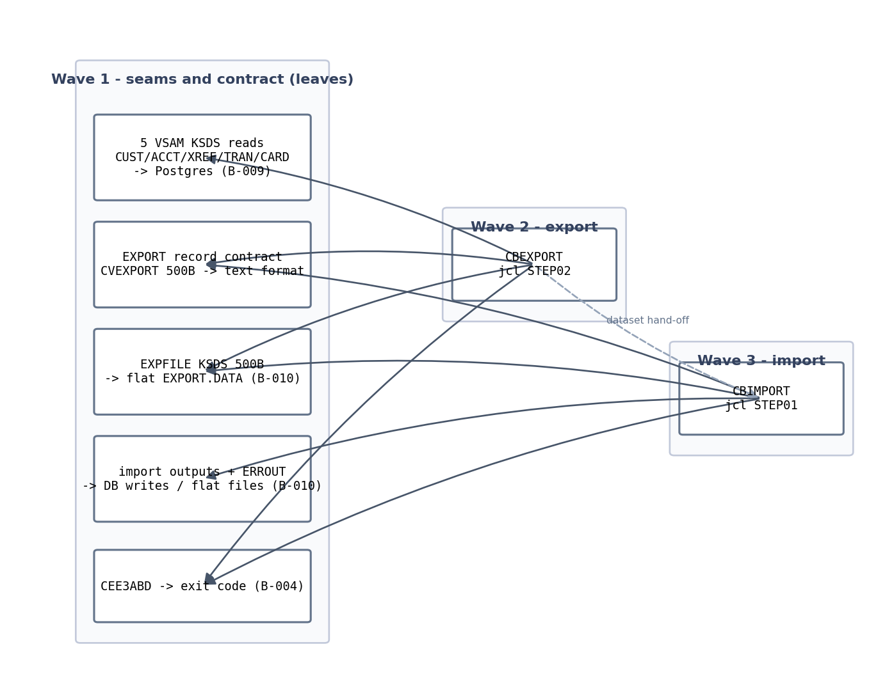

# S-18 — Branch Export / Import — Stream Analysis

## 1. The pinned stream

**Stream**: S-18 Branch export/import. Inventory row: `S-18 | Branch export/import | BATCH | CBEXPORT/CBIMPORT jcl | CBEXPORT,CBIMPORT | active` (functional/CARDDEMO/CardDemo_inventory.md).

**Process type**: BATCH — JCL-submitted jobs; no scheduler folder covers them.

**Entry**: manual submission (`NOTIFY=&SYSUID` on both JOB cards). Neither job appears in `app/scheduler/CardDemo.controlm` (DAILY/WEEKLY/MONTHLY only) nor in `app/scheduler/CardDemo.ca7` (no CBEXPORT/CBIMPORT JOB= entries). These are on-demand ops jobs, not scheduled.

**Hard stop**: end-of-job per job. CBEXPORT produces `AWS.M2.CARDDEMO.EXPORT.DATA`; CBIMPORT consumes it. The dataset, not a scheduler trigger, is the coupling between the two jobs.

**Jobs and steps**:

| Job | Step(s) | Program | Function |
|---|---|---|---|
| CBEXPORT | STEP01 (`app/jcl/CBEXPORT.jcl:24`) IDCAMS; STEP02 (`:43`) CBEXPORT | IDCAMS, CBEXPORT | STEP01 `DELETE ... CLUSTER PURGE` (`:27`) + `DEFINE CLUSTER` KSDS `EXPORT.DATA` `KEYS(4 28)` `RECORDSIZE(500 500)` (`:30-38`); STEP02 reads 5 input KSDS (CUSTFILE/ACCTFILE/XREFFILE/TRANSACT/CARDFILE `:49-58`) and writes export records to EXPFILE (`:62-63`) |
| CBIMPORT | STEP01 (`app/jcl/CBIMPORT.jcl:22`) | CBIMPORT | Reads EXPFILE (`:28-29`), dispatches by record type to CUSTOUT (LRECL 500 `:37`), ACCTOUT (300 `:42`), XREFOUT (50 `:47`), TRNXOUT (350 `:52`), ERROUT (132 `:60`) |

**Exclusions**: the file-open/close CA-7 chain (S-17's container); any external transport of EXPORT.DATA off-platform (none found in source).

## 2. Program inventory and leaf-first DAG

| Program | Source | Role | Callees | Present | Shared |
|---|---|---|---|---|---|
| CBEXPORT | `app/cbl/CBEXPORT.cbl` | job step — multi-file export writer | CEE3ABD (`:579`) | yes | no |
| CBIMPORT | `app/cbl/CBIMPORT.cbl` | job step — dispatch/split writer | CEE3ABD (`:481-484`) | yes | no |
| CVEXPORT | `app/cpy/CVEXPORT.cpy` | record contract copybook | — | yes | shared between the two programs |
| IDCAMS | IBM utility | cluster delete/define | — | platform | n/a |
| CEE3ABD | LE runtime | abend service | — | platform | register B-004 |

Baseline Java: **both jobs exist** — `CbexportJobConfiguration` (`cbexportJob`/`cbexportStep`) and `CbimportJobConfiguration` (`cbimportJob`) under `spring-boot/.../batch/`, backed by `BatchJobService.exportRecord`/`importRecord`, `RepositorySequenceReader`, and the `carddemo.batch.output-dir` seam. S-18 is a parity-refinement stream, not greenfield.

Absent programs: none.

Source: `functional/CARDDEMO/diagrams/S18_branch_export_import_dag.mmd`.

## 3. Surfaces (BATCH)

### CBEXPORT job
- **Inputs** (all DISP=SHR KSDS): CUSTFILE `CUSTDATA.VSAM.KSDS` (500B), ACCTFILE `ACCTDATA.VSAM.KSDS` (300B), XREFFILE `CARDXREF.VSAM.KSDS` (50B), TRANSACT `TRANSACT.VSAM.KSDS` (350B), CARDFILE `CARDDATA.VSAM.KSDS` (150B) — `CBEXPORT.jcl:49-58`.
- **Output**: EXPFILE `EXPORT.DATA` KSDS — logically indexed (KEYS(4 28)) but written sequentially; fixed 500-byte records.
- **Export record contract** (`CVEXPORT.cpy`, 500B fixed):
  - Header: `EXPORT-REC-TYPE` X(1) + `EXPORT-TIMESTAMP` X(26) + `EXPORT-SEQUENCE-NUM` 9(9) COMP + `EXPORT-BRANCH-ID` X(4) + `EXPORT-REGION-CODE` X(5) + `EXPORT-RECORD-DATA` X(460), redefined per type C(customer)/A(account)/X(xref)/T(transaction)/D(card).
  - Record data contains **binary fields** (COMP, COMP-3) per CVEXPORT layouts — the legacy file is NOT plain text.
  - Header values set in COBOL: timestamp `YYYY-MM-DD HH:MM:SS.00` built from ACCEPT DATE/TIME (`CBEXPORT.cbl:172-195`); sequence counter across all records; `BRANCH-ID='0001'`, `REGION='NORTH'`; per-type writers 2200/3200/4200/5200/5700.
  - Section order written: C → A → X → T → D.
- **Reports**: per-type + total record counts DISPLAYed at finalize (`CBEXPORT.cbl:563-573`); per-field dumps absent.
- **PARM/control cards**: none.
- **Status/abend**: file status protocol as S-17; any non-ok → `9999-ABEND-PROGRAM` → CEE3ABD (`:579`).
- **Restart**: none — STEP01 always re-creates the cluster, so rerun regenerates the full export.

### CBIMPORT job
- **Input**: EXPFILE `EXPORT.DATA` (`CBIMPORT.jcl:28-29`), read sequentially.
- **Outputs**: `CUSTOUT` FB 500 `CUSTDATA.IMPORT`; `ACCTOUT` FB 300 `ACCTDATA.IMPORT`; `XREFOUT` FB 50 `CARDXREF.IMPORT`; `TRNXOUT` FB 350 `TRANSACT.IMPORT`; `ERROUT` FB 132 `IMPORT.ERRORS`. All DISP=(NEW,CATLG,DELETE).
- **JCL GAP**: the COBOL SELECTs `CARD-OUTPUT ASSIGN TO CARDOUT` and writes 'D'-type records to it (CBEXPORT emits 'D' records), but `CBIMPORT.jcl` defines **no CARDOUT DD** — legacy run would fail at OPEN OUTPUT CARDOUT (file-status error → abend), or the DD is missing. **Unresolved — flagged**; the baseline's DB-write approach sidesteps it.
- **Dispatch**: EVALUATE `EXPORT-REC-TYPE` → C/A/X/T/D write paragraphs mapping export layout back to normalized record layouts; `OTHER` → 2700 paragraph writing a 132-byte pipe-delimited error record `ERR-TIMESTAMP|ERR-RECORD-TYPE|ERR-SEQUENCE|ERR-MESSAGE` + padding (`CVIMPORT`-style in COBOL WS).
- **"Validation"**: `3000-VALIDATE-IMPORT` displays a fixed stub — `No validation errors detected` (`CBIMPORT.cbl:449-452`); there is no checksum/validation logic despite comments claiming it. Keep as no-op parity.
- **Reports**: per-type + total + error counts at finalize (`CBIMPORT.cbl:465-478`).
- **Status/abend**: same protocol → CEE3ABD.

## 4. Data + field dictionary

Inputs = same five VSAM files as B-009 tables: `customers`, `accounts`, `card_xrefs`, `transactions`, `cards` — field dictionaries identical to §4 of the S-17 analysis (all FACT from copybooks + entities). Export adds TRANSACT (`CVTRA05Y.cpy`, 350B → `transactions`/`Transaction`): tran-id X(16)→`String tranId` @Id; type X(2); category 9(4)→`Integer`; source X(10); description X(100); amount S9(9)V99→`BigDecimal`; merchant id/id-name/city/zip; card-number X(16); orig/process timestamps X(26)→`LocalDateTime`. FACT.

Export per-type payloads (CVEXPORT redefines of the 460-byte data area) mirror the corresponding copybook layouts field-for-field, but several numerics are binary (COMP/COMP-3) — byte-faithful layout ≠ text. **INFERRED risk**: KEY layout — JCL `KEYS(4 28)` claims a 4-byte key at offset 28, but `EXPORT-SEQUENCE-NUM` sits at offset 27 (1+26); 0/1-based offset discrepancy noted for the record, moot in flat-file target.

## 5. Boundary table (headline)

Inherited DECIDED register entries: B-004 (CEE3ABD→exit code), B-008 (job launcher), B-009 (VSAM→Postgres), B-010 (PS/GDG→flat files under job output dir, no GDG versioning, generation role in filename).

Proposed register entries for append:

| ID | Crossing | Class | Contract | Dir | Action |
|---|---|---|---|---|---|
| S18-B1 | EXPFILE `EXPORT.DATA` KSDS (KEYS(4 28), 500B) between CBEXPORT and CBIMPORT | B10 dataset hand-off | 500-byte fixed, multi-type records, header 1+26+9+4+5, data 460; written seq, read seq | both | Flat file `EXPORT.DATA` under job output dir (baseline behavior); keyed access not needed — seq write/read only |
| S18-B2 | 5 input KSDS reads (CBEXPORT.jcl:49-58) | B9 persistence | full scan in key order, in C→A→X→T→D section order | in | `RepositoryItemReader`s sorted by PK fanned out via `RepositorySequenceReader` (baseline already does this) |
| S18-B3 | Import outputs CUSTOUT/ACCTOUT/XREFOUT/TRNXOUT/CARDOUT + ERROUT (CBIMPORT.jcl:33-60) | B10 dataset hand-off | FB 500/300/50/350/132 NEW-CATLG-DELETE | out | DECIDED in plan: normalized entity writes → Postgres `save()` (baseline); ERROUT → flat error file. CARDOUT missing-DD gap recorded |
| S18-B4 | CEE3ABD abend (CBEXPORT.cbl:579, CBIMPORT.cbl:481-484) | B4 LE runtime | abend on file-status error | out | Step failure → exit code (B-004) |
| S18-B5 | Manual submission / `NOTIFY=&SYSUID` — absent from Control-M and CA-7 | B8 scheduler | on-demand ops invocation | in | Launch via `POST /api/admin/jobs/cbexportJob`, `/cbimportJob`; `inputFile` JobParameter replaces the EXPFILE DD override |
| S18-B6 | CVEXPORT byte format — binary COMP/COMP-3 inside 460-byte data | B10 format contract | export writer and import reader must share one byte contract | internal | **Deviation, decided in plan**: baseline writes all-text fixed-width 500-char records (`%09d` seq, text numerics); keep baseline text format — the file is a target-internal transport, no external mainframe consumer exists |
| S18-B7 | CBIMPORT.jcl missing CARDOUT DD | B10 defect | legacy job abends at OPEN or skips card output | out | **Unresolved flag**: document legacy defect; target import writes cards to DB, so gap does not carry — confirm in plan |

## 6. Waves

| Wave | Programs/seams | Why |
|---|---|---|
| 1 | Export record contract (target text format), repository readers for all 5 entities, output-dir seam, stats/listener idiom, abend→exit-code seam | Both jobs consume the contract; all seams are leaves |
| 2 | CBEXPORT parity pass (`cbexportJob`) | Producer of the contract; must lock format before import is verified end-to-end |
| 3 | CBIMPORT parity pass (`cbimportJob`) | Consumer; verified by export→import round-trip |

Strict cross-wave edges: CBIMPORT correctness is defined by the S18-B6 contract fixed in wave 2.

## 7. Risks

- **R1** Baseline export is all-text vs legacy binary-packed — a deliberate target-format decision (S18-B6); any consumer expecting legacy bytes would break, none found.
- **R2** Missing CARDOUT DD is a latent legacy defect; target behavior is a DB write — record the deviation.
- **R3** Baseline `importRecord` writes to Postgres rather than normalized PS files — matches B-010 spirit (normalized storage = DB); document.
- **R4** Timestamp format drift: legacy `YYYY-MM-DD HH:MM:SS.00` (26 chars, literal `.00`) vs baseline `yyyy-MM-dd HH:mm:ss.SSSSSS` (micros, also 26 chars) — harmless width-wise but not byte-identical.
- **R5** Sequence-number width: legacy 9(9) COMP 4 bytes vs baseline 9-char text — consistent inside target format.
- **R6** Import `inputFile` default points at `EXPORT.DATA` in output dir — round-trip self-testable, but there is no legacy-equivalent of consuming a foreign file's binary format.

## 8. Validation

1. Both JCL-reachable programs inventoried; none absent. ✓
2. Waves topologically sorted (contract/seams → export → import). ✓
3. Claims cite file:line. ✓
4. BATCH surfaces only. ✓
5. All crossings tabled; S18-B7 unresolved-flagged, S18-B6 deviation decided at plan. ✓
6. Physical layer resolved: VSAM→Postgres, datasets→flat files. ✓
