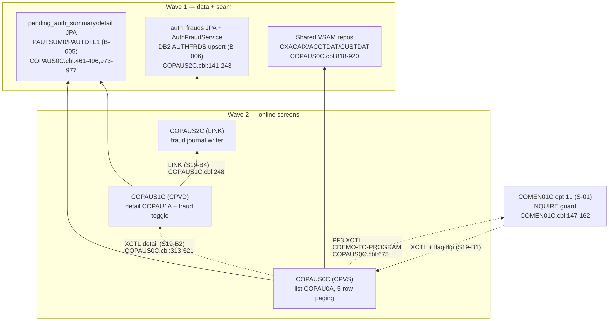

# S-19 Pending Authorization View — Stream Analysis (`!mf_stream_analysis`)

Status: complete (2026-09-16). Stream assigned by orchestrator (doc-authoring brief); process type **ONLINE** (transaction codes CPVS/CPVD behind menu option 11).
Target profiles applied (read-only): CORE + ONLINE + DATA/BOUNDARY from `functional/CARDDEMO/CardDemo_target_state.md`. Greenfield stream — nothing exists under `spring-boot/` yet.

## 1. Pinned stream

- **Entry points (proof)**: `CPVS -> COPAUS0C`, `CPVD -> COPAUS1C` (`app/app-authorization-ims-db2-mq/csd/CRDDEMO2.csd` DEFINE TRANSACTION entries); reached from main menu option 11 `COPAUS0C` ('Pending Authorization View', `app/cpy/COMEN02Y.cpy:86-89`) through the `EXEC CICS INQUIRE PROGRAM` availability probe then XCTL with `CARDDEMO-COMMAREA` (`app/cbl/COMEN01C.cbl:147-162`).
- **Hard stop**: `PF3` / invalid-context paths XCTL `CDEMO-TO-PROGRAM` back to the calling program (`COPAUS0C.cbl:322-323`, `:674-675`; `COPAUS1C.cbl:367-368`); `LINK` to COPAUS2C returns in-stream.
- **Exclusions**: the authorization *producer* side (COPAUA0C/CP00, IMS load/unload/purge utilities) is S-20; the MQ demo consumers are S-22. Writes to pending-auth data are limited to the fraud-tag REPL on PAUTDTL1 (`COPAUS1C.cbl:525`) and the AUTHFRDS INSERT/UPDATE inside COPAUS2C (`COPAUS2C.cbl:141-142`, `:222-223`).
- Pseudo-conversational shape: `EXEC CICS RETURN TRANSID(...) COMMAREA(...)` (`COPAUS0C.cbl:254`, `COPAUS1C.cbl:202`).

## 2. Program inventory + leaf-first DAG

| Program | Path | Role | Callees / edges | Shared? | Present |
|---|---|---|---|---|---|
| COPAUS0C | app/app-authorization-ims-db2-mq/cbl/COPAUS0C.cbl | entry/list (screen COPAU0A, mapset COPAU00 :697,:705,:717) | DL/I GU/GNP PSB PSBPAUTB; CICS READ CXACAIX (:819)/ACCTDAT (:870)/CUSTDAT (:920); XCTL COPAUS1C on 'S' (:313-321 via CDEMO-TO-PROGRAM re-route `COPAUS1C` literal `LIT-DETAILPGM`); XCTL CDEMO-TO-PROGRAM (:675) | extension-only | yes |
| COPAUS1C | app/app-authorization-ims-db2-mq/cbl/COPAUS1C.cbl | read/detail + validate (screen COPAU1A, mapset COPAU01 :383,:391,:402) | DL/I GU/GNP/REPL PAUTSUM0/PAUTDTL1 (:439,:465,:495,:525); LINK COPAUS2C (:248); XCTL CDEMO-TO-PROGRAM (:368); SYNCPOINT (:558) | extension-only | yes |
| COPAUS2C | app/app-authorization-ims-db2-mq/cbl/COPAUS2C.cbl | seam/write (fraud journal, no screen) | EXEC SQL INSERT/UPDATE CARDDEMO.AUTHFRDS (:141-142,:222-223); RETURN (:218) | called only by COPAUS1C | yes |

COMMAREA extension owned by this stream: `CDEMO-CPVS-INFO` (`COPAUS0C.cbl:117-126`) — SEL-FLG, PAU-SELECTED X(8) (the PAUT9CTS complemented timestamp key), a 20-deep prev-page key stack, PAUKEY-LAST, PAGE-NUM, NEXT-PAGE-FLG, AUTH-KEYS(5); mirrored `CDEMO-CPVD-*` in COPAUS1C. Copybooks: `CIPAUSMY` (summary segment), `CIPAUDTY` (detail segment) — `COPAUS0C.cbl:161-165`.

**Leaf-first DAG** (rendered):

Source: [`diagrams/S19_pending_auth_view_dag.mmd`](diagrams/S19_pending_auth_view_dag.mmd)

## 3. Surfaces (ONLINE)

### COPAUS0C — screen COPAU0A / mapset COPAU00 (`app/app-authorization-ims-db2-mq/bms/COPAU00.bms`)

Title 'View Authorizations' (:78). Header TRNNAME/CURDATE/PGMNAME/CURTIME per shell.

| Field | I/O | PIC | Edits (cite) |
|---|---|---|---|
| ACCTID | INPUT | X(11) UNPROT (:84-88) | account lookup key; drives CXACAIX/ACCTDAT/CUSTDAT chain (`COPAUS0C.cbl:754-755`, `:818-820`, `:869-871`, `:919-920`) |
| SEL0001..SEL0005 | INPUT | X(1) UNPROT (:277,:321,...) | `S`/`s` selects row → CDEMO-CPVS-PAU-SELECTED = AUTH-KEYS(n) (:287-305); any other non-blank selection value is evaluated then ignored (only S routes, :313-321) |
| CNAME, CUSTID, ACCSTAT, PHONE1 | DISPLAY | X(25)/9(9)/X(1)/X(13) | customer/account context from VSAM reads (:754-755) |
| APPRCNT, DECLCNT | DISPLAY | len 3 | PA-APPROVED-AUTH-CNT / PA-DECLINED-AUTH-CNT from PAUTSUM0 |
| CREDLIM, CASHLIM, APPRAMT, DECLAMT | DISPLAY | X(12) | PA-CREDIT-LIMIT / PA-CASH-LIMIT / PA-APPROVED-AUTH-AMT / PA-DECLINED-AUTH-AMT |
| rows 1-5: PTRNID?, PDATE0n, PTIME0n, PTYPE0n, A/D, PSTS, PAMT00n | DISPLAY | per column headers (:201-236) | populated by POPULATE-AUTH-LIST (:545-593); date YYMMDD→MM/DD/YY and time HHMMSS→HH:MM:SS re-formats, resp '00'→'A' else 'D' |
| ERRMSG | DISPLAY | X(78) | message line |

AID keys: ENTER=continue/select, PF3=back via XCTL CDEMO-TO-PROGRAM (:675), PF7=backward / PF8=forward paging keyed on PAUKEY-LAST + prev-page stack (:365-368, :391-440). Paging messages: 'You are already at the bottom of the page...' (:403-404).

### COPAUS1C — screen COPAU1A / mapset COPAU01 (`app/app-authorization-ims-db2-mq/bms/COPAU01.bms`)

Title 'View Authorization Details' (:79). All fields DISPLAY-only; no free-form input.

Labels (:84-283): Card #, Auth Date, Auth Time, Auth Resp, Resp Reason, Auth Code, Amount, POS Entry Mode, Source, MCC Code, Card Exp. Date, Auth Type, Tran Id, Match Status, Fraud Status, plus merchant block Name/ID/City/State/Zip — a 1:1 read-out of `CIPAUDTY`.

AID keys (:292): F3=Back (XCTL CDEMO-TO-PROGRAM :368), F5=Mark/Remove Fraud (MARK-AUTH-FRAUD :228-264), F8=Next Auth (READ-NEXT-AUTH-RECORD :488+).

### COPAUS2C — surface `none` (seam program)

LINK-level only; returns WS-FRD-UPDATE-STATUS S/F + WS-FRD-ACT-MSG X(50) in COMMAREA (`COPAUS2C.cbl:80-86`).

## 4. Data + field dictionary

**IMS DB DBPAUTP0** (PSB PSBPAUTB, single PCB PAUTBPCB): root `PAUTSUM0` keyed `ACCNTID` (GU `COPAUS0C.cbl:973-977` / `COPAUS1C.cbl:439-443`), child `PAUTDTL1` keyed `PAUT9CTS` = 9's-complement of auth timestamp (GNP unqualified / qualified `COPAUS0C.cbl:461,493`; GNP WHERE `COPAUS1C.cbl:465-469`). Physical layer: **IMS hierarchical** — two segments become two Postgres tables with parent FK (B-005 decided).

Field dictionary — PAUTSUM0 (`app/app-authorization-ims-db2-mq/cpy/CIPAUSMY.cpy`, FACT):

| COBOL field | PIC | Java type | PostgreSQL column |
|---|---|---|---|
| PA-ACCT-ID | S9(11) COMP-3 | long | pending_auth_summary.acct_id bigint PK |
| PA-CUST-ID | 9(09) | long | .cust_id bigint |
| PA-AUTH-STATUS | X(01) | string(1) | .auth_status char(1) |
| PA-ACCOUNT-STATUS OCCURS 5 | X(02)×5 | List\<String\> (5 slots, concatenated varchar(10)) | .account_status varchar(10) |
| PA-CREDIT-LIMIT | S9(09)V99 COMP-3 | BigDecimal(11,2) | .credit_limit numeric(11,2) |
| PA-CASH-LIMIT | S9(09)V99 COMP-3 | BigDecimal(11,2) | .cash_limit numeric(11,2) |
| PA-CREDIT-BALANCE | S9(09)V99 COMP-3 | BigDecimal(11,2) | .credit_balance numeric(11,2) |
| PA-CASH-BALANCE | S9(09)V99 COMP-3 | BigDecimal(11,2) | .cash_balance numeric(11,2) |
| PA-APPROVED-AUTH-CNT | S9(04) COMP | int | .approved_auth_cnt integer |
| PA-DECLINED-AUTH-CNT | S9(04) COMP | int | .declined_auth_cnt integer |
| PA-APPROVED-AUTH-AMT | S9(09)V99 COMP-3 | BigDecimal(11,2) | .approved_auth_amt numeric(11,2) |
| PA-DECLINED-AUTH-AMT | S9(09)V99 COMP-3 | BigDecimal(11,2) | .declined_auth_amt numeric(11,2) |
| FILLER | X(34) | — | not mapped |

PAUTDTL1 (`app/app-authorization-ims-db2-mq/cpy/CIPAUDTY.cpy`, FACT; key fields PA-AUTH-DATE-9C S9(05)/PA-AUTH-TIME-9C S9(09) are 9's complements of YYMMDD/HHMMSSnnn):

| COBOL field | PIC | Java type | PostgreSQL column |
|---|---|---|---|
| PA-AUTH-DATE-9C | S9(05) COMP-3 | int (complement; or real LocalDate via derived column) | pending_auth_detail.auth_date_9c integer (part of PK) |
| PA-AUTH-TIME-9C | S9(09) COMP-3 | int | .auth_time_9c integer (part of PK) |
| PA-AUTH-ORIG-DATE | X(06) YYMMDD | string(6) (parse to LocalDate for display) | .auth_orig_date varchar(6) |
| PA-AUTH-ORIG-TIME | X(06) HHMMSS | string(6) | .auth_orig_time varchar(6) |
| PA-CARD-NUM | X(16) | string(16) | .card_num varchar(16) |
| PA-AUTH-TYPE | X(04) | string(4) | .auth_type varchar(4) |
| PA-CARD-EXPIRY-DATE | X(04) | string(4) | .card_expiry_date varchar(4) |
| PA-MESSAGE-TYPE | X(06) | string(6) | .message_type varchar(6) |
| PA-MESSAGE-SOURCE | X(06) | string(6) | .message_source varchar(6) |
| PA-AUTH-ID-CODE | X(06) | string(6) | .auth_id_code varchar(6) |
| PA-AUTH-RESP-CODE | X(02) ('00'=approved :88) | string(2) | .auth_resp_code varchar(2) |
| PA-AUTH-RESP-REASON | X(04) | string(4) | .auth_resp_reason varchar(4) |
| PA-PROCESSING-CODE | 9(06) | int | .processing_code integer |
| PA-TRANSACTION-AMT | S9(10)V99 COMP-3 | BigDecimal(12,2) | .transaction_amt numeric(12,2) |
| PA-APPROVED-AMT | S9(10)V99 COMP-3 | BigDecimal(12,2) | .approved_amt numeric(12,2) |
| PA-MERCHANT-CATAGORY-CODE | X(04) | string(4) | .merchant_category_code varchar(4) |
| PA-ACQR-COUNTRY-CODE | X(03) | string(3) | .acqr_country_code varchar(3) |
| PA-POS-ENTRY-MODE | 9(02) | int | .pos_entry_mode smallint |
| PA-MERCHANT-ID | X(15) | string(15) | .merchant_id varchar(15) |
| PA-MERCHANT-NAME | X(22) | string(22) | .merchant_name varchar(22) |
| PA-MERCHANT-CITY | X(13) | string(13) | .merchant_city varchar(13) |
| PA-MERCHANT-STATE | X(02) | string(2) | .merchant_state varchar(2) |
| PA-MERCHANT-ZIP | X(09) | string(9) | .merchant_zip varchar(9) |
| PA-TRANSACTION-ID | X(15) | string(15) | .transaction_id varchar(15) |
| PA-MATCH-STATUS | X(01) P/D/E/M (:40-44) | enum MatchStatus | .match_status char(1) |
| PA-AUTH-FRAUD | X(01) F/R (:45-47) | enum FraudStatus | .auth_fraud char(1) |
| PA-FRAUD-RPT-DATE | X(08) | string(8) | .fraud_rpt_date varchar(8) |
| (parent ref) | — | — | .acct_id bigint FK → pending_auth_summary.acct_id |

**DB2 CARDDEMO.AUTHFRDS** (`dcl/AUTHFRDS.dcl`, `ddl/AUTHFRDS.ddl:28` PK(CARD_NUM,AUTH_TS), `XAUTHFRD.ddl` unique index) → `auth_frauds` table, 26 columns mirroring DCL (FACT): card_num char(16), auth_ts timestamp, auth_type char(4), card_expiry_date char(4), message_type/source char(6), auth_id_code char(6), auth_resp_code char(2), auth_resp_reason char(4), processing_code char(6), transaction_amt/approved_amt decimal(12,2), merchant_catagory_code char(4), acqr_country_code char(3), pos_entry_mode smallint, merchant_id char(15), merchant_name varchar(22), merchant_city char(13), merchant_state char(2), merchant_zip char(9), transaction_id char(15), match_status char(1), auth_fraud char(1), fraud_rpt_date date, acct_id decimal(11), cust_id decimal(9). Insert uses `TIMESTAMP_FORMAT('YY-MM-DD HH24.MI.SSNNNNNN')` from the real (uncomplemented) auth timestamp (`COPAUS2C.cbl:106-110,168-170`).

**VSAM reads (shared, already ported by S-02..S-05)**: CXACAIX alt-index by acct→card (`:817-820`), ACCTDAT account record CVACT01Y (`:869-871`), CUSTDAT customer CVCUS01Y (`:919-920`) — repositories exist in `spring-boot/`.

## 5. Boundary table (headline) — stream IDs S19-B1..S19-B8; each re-decided in Java terms against register decisions

| ID | Class | Contract | Direction | Cite | Decision (Java) |
|---|---|---|---|---|---|
| S19-B1 | B5 cross-program switch + availability probe | COMEN01C opt 11 → INQUIRE PROGRAM then XCTL COPAUS0C w/ COMMAREA; 'not installed' if absent | inbound | COMEN01C.cbl:147-168; COMEN02Y.cpy:86-89 | DECIDED: `MenuService` option 11 `implemented` flag flips true; `UI_ROUTES` gains `COPAUS0C → /ui/pending-auth` (MenuService.java:46,110-120). No register change. |
| S19-B2 | B5 cross-program switch | XCTL COPAUS0C→COPAUS1C w/ acct id + selected auth key in COMMAREA ext | internal | COPAUS0C.cbl:313-321 | DECIDED: in-app navigation `GET /ui/pending-auth/{acctId}/{authKey}` (or POST select); request/session state replaces COMMAREA ext. |
| S19-B3 | B4 data-access leaf | IMS GU/GNP/REPL on PAUTSUM0+PAUTDTL1 via PSB PSBPAUTB; DIBSTAT protocol '  '/GE/GB/other | outbound | COPAUS0C.cbl:461-496,973-977; COPAUS1C.cbl:439-525 | DECIDED (B-005): two JPA entities + FK; parent fetch `findById(acctId)` = GU; children `findByAcctIdOrderByAuthDate9cAscAuthTime9cAsc` = GNP order (complemented key ⇒ newest first); qualified GNP = `findByAcctIdAndKey`; REPL = save(). '  '→found, GE/GB→empty, other→DataAccessException. |
| S19-B4 | B5 in-task call | LINK COPAUS2C w/ WS-FRAUD-DATA COMMAREA (acct, cust, auth rec, action) → returns S/F + msg | internal | COPAUS1C.cbl:248-252; COPAUS2C.cbl:73-86 | DECIDED: `AuthFraudService.reportOrRemove(...)` bean call in same transaction; status→result object. |
| S19-B5 | B4 data-access leaf | DB2 INSERT AUTHFRDS (+ -803 → UPDATE retry) | outbound | COPAUS2C.cbl:141-243 | DECIDED (B-006): `auth_frauds` JPA entity; save(), catch duplicate-key→update path preserved as upsert. Flyway V2601. |
| S19-B6 | B10 shared data contract | VSAM reads CXACAIX/ACCTDAT/CUSTDAT (read-only here; owners = S-02..S-05) | outbound | COPAUS0C.cbl:818-920 | DECIDED (B-009): reuse `CardXrefRepository`/`AccountRepository`/`CustomerRepository`; no new seam. |
| S19-B7 | B6 transactional boundary | SYNCPOINT after REPL and before XCTL-out (:525-558, :686) | internal | COPAUS1C.cbl:525-560 | DECIDED: `@Transactional` service method commits per fraud action; menu return = plain redirect after commit. |
| S19-B8 | B7 paging state | 20-entry prev-page key stack + last key in COMMAREA (X(8) keys) | internal | COPAUS0C.cbl:117-126,365-440 | DECIDED: keyset pagination w/ page-start key history kept server-side (session) or as `?after=` cursor; 20-deep history preserved. |

All contracts resolved from source; **no unresolved-contract blockers**. PSB SCHD/TERM noise (`COPAUS0C.cbl:253-262`, `COPAUS1C.cbl:575-584`) and IMS retry statuses are demoted mechanics, not boundaries.

## 6. Waves (leaf-first, from DAG depth)

| Wave | Content | Repos touched |
|---|---|---|
| 1 | Data layer: Flyway V2601 `pending_auth_summary`/`pending_auth_detail`/`auth_frauds`; JPA entities + repositories (S19-B3,B5); `AuthFraudService` (S19-B4); seed fixture rows | spring-boot/ |
| 2 | Online: `PendingAuthService` + `/api/pending-auth` list & detail endpoints + Thymeleaf screens COPAU00/COPAU01 incl. 5-row paging, fraud mark/remove, F8 next-auth; MenuService flag + UI_ROUTES entry (S19-B1,B2,B7,B8) | spring-boot/ |

Shared-port note: this stream owns the pending-auth entities **on behalf of S-20** (S-20's COPAUA0C/CBPAUP0C write the same segments). If S-20 lands first it ports them instead — first-lander owns (module property rule).

## 7. Risks

1. PAUT9CTS key is a 9's-complement composite (date-9c + time-9c) — JPA must preserve ascending-complement order = descending-real-time order; newest-first display depends on it. MEDIUM.
2. `PA-FRAUD-REMOVED` resets AUTH_FRAUD to 'R' and fraud journal gets a fresh INSERT keyed (CARD_NUM, AUTH_TS); -803→UPDATE retry must be preserved or duplicates fail. MEDIUM.
3. COPAUS0C reads CXACAIX by **acct id** (alternate index) to display the card number — xref direction differs from core streams' card→acct lookups; repository needs `findByAcctId`. LOW (exists per CardXrefRepository).
4. Data volume for pending-auth seeding is produced by S-20's processor; until S-20 lands, screens exercise only seeded rows. LOW (documented dependency).
5. `WS-FRD-ACTION`/'F'/'R' journal semantics live only in COPAUS1C/PENDING-AUTH-DETAILS moves — the AUTHFRDS.AUTH_FRAUD column semantics must match (F=reported, R=removed). LOW.

## 8. Validation

(1) all programs entry→hard stop inventoried (3/3 present, none absent — IBM utility DSNTIAC not invoked by S-19 programs); (2) wave order is a topological sort of the DAG (data layer precedes screens); (3) claims cited `<file>:<line>`; (4) surfaces are ONLINE screens + one `none` seam — matching process type; (5) every mechanical crossing (XCTL×3, LINK, DL/I, EXEC SQL, VSAM reads, SYNCPOINT, COMMAREA state) is in the table with a full contract; (6) every data-access leaf resolved: PAUTSUM0/PAUTDTL1 = IMS→JPA, AUTHFRDS = DB2→JPA, CXACAIX/ACCTDAT/CUSTDAT = VSAM→existing JPA.
