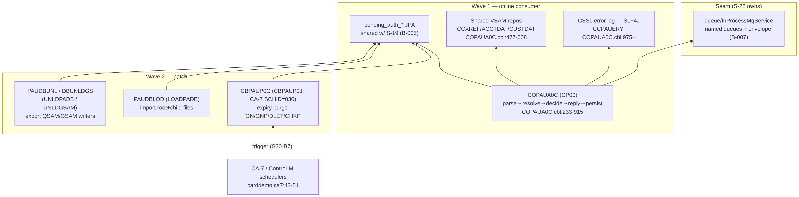

# S-20 Authorization Processing + Purge — Stream Analysis (`!mf_stream_analysis`)

Status: complete (2026-09-16). Stream assigned by orchestrator; process type **MIXED**: CP00/COPAUA0C is an MQ-triggered online **SUBTRANSACTION** (no screen; entry = queue trigger), CBPAUP0J and the load/unload jobs are **BATCH** (scheduler/JCL entries).
Target profiles applied (read-only): CORE + BATCH + DATA/BOUNDARY from `functional/CARDDEMO/CardDemo_target_state.md`. Greenfield.

## 1. Pinned stream

- **Entries (proof)**: `CP00 -> COPAUA0C` MQ-triggered (`app/app-authorization-ims-db2-mq/README.md:170-171,226`); job `CBPAUP0J` = `EXEC PGM=DFSRRC00 PARM='BMP,CBPAUP0C,PSBPAUTB'` (`jcl/CBPAUP0J.jcl:3-4`), CA-7 triggered job SCHID=030 (`app/scheduler/CardDemo.ca7:43-51`); `LOADPADB` BMP load (`jcl/LOADPADB.JCL` EXEC DFSRRC00 BMP,PAUDBLOD,PSBPAUTB), `UNLDPADB` DLI unload to QSAM (`jcl/UNLDPADB.JCL` STEP01 DLI,PAUDBUNL,PAUTBUNL after STEP0 IEFBR14 delete), `UNLDGSAM` DLI unload to GSAM (`jcl/UNLDGSAM.JCL` DLI,DBUNLDGS,DLIGSAMP), plus `DBPAUTP0` ULU unload (`jcl/DBPAUTP0.jcl` DFSURGU0 → VB LRECL=27990 dataset).
- **Hard stop**: request/queue end — COPAUA0C exits when the input queue drains (MQRC-NO-MSG-AVAILABLE) or 500-message cap trips (`COPAUA0C.cbl:40,:339-342`); batch legs end at EOJ/RC.
- **Exclusions**: the pending-auth *view* screens (S-19) — this stream owns the write side of PAUTSUM0/PAUTDTL1; the VSAM-MQ demo consumers (S-22); the VSAM masters it reads (read-only here).

## 2. Program inventory + leaf-first DAG

| Program | Path | Role | Callees / edges | Shared? | Present |
|---|---|---|---|---|---|
| COPAUA0C | app/app-authorization-ims-db2-mq/cbl/COPAUA0C.cbl | entry/orchestration (MQ consumer + auth decision + IMS writes) | MQOPEN/GET request, MQPUT1 reply; CICS READ CCXREF/ACCTDAT/CUSTDAT (:477,:525,:573); DL/I GU/REPL/ISRT PAUTSUM0+PAUTDTL1 (:620,:830-905); WRITEQ TD CSSL error log (9500, :975+); SYNCPOINT per msg (:334-335) | extension-only | yes |
| CBPAUP0C | app/app-authorization-ims-db2-mq/cbl/CBPAUP0C.cbl | batch write (expiry purge) | DL/I GN/GNP/DLET PAUTSUM0/PAUTDTL1 (:223,:255,:310,:335); CHKP (:355); SYSIN parms (:98-105,:189) | extension-only | yes |
| PAUDBLOD | app/app-authorization-ims-db2-mq/cbl/PAUDBLOD.CBL | batch load (data-transfer utility) | DL/I GU/ISRT PAUTSUM0/PAUTDTL1; INFILE1 100B root recs, INFILE2 11B key + 200B child recs | extension-only | yes |
| PAUDBUNL | app/app-authorization-ims-db2-mq/cbl/PAUDBUNL.CBL | batch unload (QSAM out) | DL/I GN/GNP read-all; writes OUTFIL1 LRECL=100 FB, OUTFIL2 LRECL=206 FB | extension-only | yes |
| DBUNLDGS | app/app-authorization-ims-db2-mq/cbl/DBUNLDGS.CBL | batch unload (GSAM out, 3-PCB PSB DLIGSAMP) | same GN/GNP walk; ISRT to PASFLPCB/PADFLDBD GSAM PCBs | extension-only | yes |
| DFSURGU0 | (IBM utility via jcl/DBPAUTP0.jcl) | ULU DB unload | — | — | utility (no FR file) |

Support copybooks: `CCPAURQY` (18-field CSV request), `CCPAURLY` (6-field CSV reply), `CCPAUERY` (TD error record), `CIPAUSMY`/`CIPAUDTY` (segments — shared with S-19), `IMSFUNCS`, PCB masks `PAUTBPCB/PASFLPCB/PADFLPCB`, `CMQ*V` MQ copybooks.

**Leaf-first DAG** (rendered):

Source: [`diagrams/S20_auth_processing_dag.mmd`](diagrams/S20_auth_processing_dag.mmd)

## 3. Surfaces

### COPAUA0C (SUBTRANSACTION — MQ listener; no screen)

- **Trigger**: CICS MQ trigger-monitor start; `EXEC CICS RETRIEVE INTO(MQTM)` yields the triggering queue name + trigger data (`:233-239`).
- **Input queue**: `WS-REQUEST-QNAME` from MQTM (README names it `AWS.M2.CARDDEMO.PAUTH.REQUEST`, :278). OPEN INPUT-SHARED (:255-282); GET w/ 5000 ms wait, NO-SYNCPOINT+CONVERT (:389-409); 1000-byte buffer.
- **Request layout** (`cpy/CCPAURQY.cpy`): 18 CSV fields — auth date X(6), auth time X(6), card num X(16), auth type X(4), card expiry X(4), msg type X(6), msg source X(6), processing code 9(6), txn amt, MCC X(4), acqr country X(3), POS entry 9(2), merchant id X(15)/name X(22)/city X(13)/state X(2)/zip X(9), tran id X(15) (UNSTRING ',' :354-372; NUMVAL for amount).
- **Reply queue**: `WS-REPLY-QNAME` from MQMD-REPLYTOQ (:413-414; README `AWS.M2.CARDDEMO.PAUTH.REPLY` :279). Reply via `MQPUT1` w/ correlId preserved, expiry 50, non-persistent, string format (:744-760).
- **Reply layout** (`cpy/CCPAURLY.cpy`): CSV card-num, tran-id, auth-id-code, resp-code X(2), resp-reason X(4), approved-amt (:729-735).
- **Error sink**: `EXEC CICS WRITEQ TD QUEUE('CSSL')` writing `CCPAUERY` records — date/time, appl/program, location, level (I/W/C), subsystem (A/C/I/D/M/F), code-1/2, message X(50), event-key X(20) (9500-LOG-ERROR :975+).
- **Control**: `WS-REQSTS-PROCESS-LIMIT` 500 msgs/run (:40,:339); SYNCPOINT after each processed message (:334-335).

### CBPAUP0J → CBPAUP0C (BATCH)

- **Scheduler**: CA-7 SCHID=030 triggered (`app/scheduler/CardDemo.ca7:43-51`).
- **JCL**: BMP under DFSRRC00, PSB PSBPAUTB (`jcl/CBPAUP0J.jcl:3-4`).
- **Control card** (`SYSIN DD *`, `PRM-INFO` :98-105): `00,00001,00001,Y` = P-EXPIRY-DAYS 9(2) (default 5 :199), P-CHKP-FREQ X(5) (default 5 :202), P-CHKP-DIS-FREQ X(5) (default 10 :205), P-DEBUG-FLAG Y/N.
- **Output**: DISPLAY counters — totals read/deleted for summaries and details (:171-178); CHKP progress displays (:355-370); ABEND → RC16 (:380-384).
- **Restart**: IMS CHKP ids `RMAD`+counter (:75-77,:355-357) — restart-from-checkpoint semantics.

### Load/unload jobs (BATCH, data-transfer utilities)

| Job | PGM/PARM | In | Out | Notes |
|---|---|---|---|---|
| LOADPADB | BMP,PAUDBLOD,PSBPAUTB | INFILE1 X(100) root recs; INFILE2 = key S9(11) COMP-3 + child X(200) | IMS DB | II status tolerated; other→RC16 via 9999-ABEND |
| UNLDPADB | DLI,PAUDBUNL,PAUTBUNL | IMS DB | OUTFIL1 100B FB, OUTFIL2 206B FB (root + 'rootkey|child' rows) | STEP0 deletes prior outputs |
| UNLDGSAM | DLI,DBUNLDGS,DLIGSAMP | IMS DB | GSAM PASFILOP/PADFILOP | 3-PCB PSB (PAUTBPCB GOTP + 2 GSAM LS) |
| DBPAUTP0 | ULU,DFSURGU0,DBPAUTP0 | IMS DB | AWS.M2.CARDDEMO.IMSDATA.DBPAUTP0 VB 27990 | IBM unload utility |

## 4. Data + field dictionary

IMS segments PAUTSUM0/PAUTDTL1 — identical layouts to S-19 §4 (`CIPAUSMY`/`CIPAUDTY`); **same two Postgres tables**, owned by whichever of S-19/S-20 lands first (module property). PAUTDTL1 key = `PAUT9CTS` = (99999 − YYDDD, 999999999 − HHMMSSmmm) computed at insert (`COPAUA0C.cbl:870-873`).

Match/fraud statuses written here: `PA-MATCH-STATUS` 'P' approved-pending / 'D' declined (`:893-897`); `PA-AUTH-FRAUD` space (`:900-901`).

MQ records (FACT, `cpy/CCPAURQY.cpy`, `cpy/CCPAURLY.cpy`, `cpy/CCPAUERY.cpy`): request 18 CSV fields; reply 6 CSV fields; error record 10 fields w/ 88-level enums.

VSAM reads (shared, read-only): CCXREF by card→acct/cust (`:477-478`), ACCTDAT by acct (`:525-526`), CUSTDAT by cust (`:573-574`).

## 5. Boundary table — stream IDs S20-B1..S20-B8; re-decided in Java terms

| ID | Class | Contract | Direction | Cite | Decision (Java) |
|---|---|---|---|---|---|
| S20-B1 | B7 message-in | MQ request queue + trigger (RETRIEVE MQTM), CSV 18-field body, 5s wait, ≤500 msgs/run | inbound | COPAUA0C.cbl:233-239,354-372,389-409 | DECIDED (B-007): `InProcessMqService` request queue `carddemo.pauth.request` + registered consumer (see MQ-seam ownership note below); CSV→record parser |
| S20-B2 | B7 message-out | reply to MQMD-REPLYTOQ w/ correlId, 6-field CSV | outbound | :413-414,:729-760 | DECIDED (B-007): reply queue from envelope `replyTo`; correlId echoed |
| S20-B3 | B8 daemon/lifecycle | long-running consumer bounded by 500-msg cap + queue-drain exit | internal | :40,:339-342 | DECIDED: bounded `poll` loop in a service method (not a daemon); cap+timeout preserved |
| S20-B4 | B4 data-access leaf | IMS GU/REPL/ISRT PAUTSUM0 + path ISRT PAUTSUM0→PAUTDTL1 | outbound | :620-639,:830-905 | DECIDED (B-005): shared pending-auth JPA entities (first-lander owns schema); summary upsert + detail insert per message |
| S20-B5 | B10 shared data | CCXREF/ACCTDAT/CUSTDAT reads | outbound | :477-608 | DECIDED (B-009): existing repositories |
| S20-B6 | B9 error sink | WRITEQ TD 'CSSL' CCPAUERY records | outbound | :975-1002 | DECIDED: structured logging (SLF4J) w/ level/subsystem fields preserved as log fields; no TD queue |
| S20-B7 | B2 step→BMP job | CBPAUP0J BMP + SYSIN parms + CHKP/RC16 + counters | inbound/outbound | jcl/CBPAUP0J.jcl:3-4,36-37; :189-205,:355-384 | DECIDED (B-008): Spring Batch job `pendingAuthPurgeJob`; JobParameters expiryDays/chkpFreq/debug; chunk commit = CHKP; counters→job metrics log |
| S20-B8 | B10 data transfer | LOADPADB/UNLDPADB/UNLDGSAM/DBPAUTP0 unload-load parity | both | jcl/LOADPADB.JCL; UNLDPADB.JCL; UNLDGSAM.JCL; DBPAUTP0.jcl | DECIDED (B-010): CSV export/import steps (Spring Resource files) replacing 100B/206B FB formats; ULU unload = pg_dump — utility, not a ported program |

| All DL/I status contracts: '  ' ok, 'GE'/'GB' end/not-found, 'II' tolerated on load ISRT, other→error/RC16 (`PAUDBLOD.CBL` 2100/3100; `PAUDBUNL.CBL` 2000; `COPAUA0C.cbl` per-verb handlers). |

**MQ-seam ownership recommendation** (shared-programs rule): **S-22 owns `queue/InProcessMqService`** — it is the canonical MQ user (pure request/reply demo with message envelope + named queues). S-20 consumes `carddemo.pauth.request`/reply; S-19 does not use MQ. If S-20 or S-19 lands before S-22, the first-lander creates the service and S-22 inherits it.

## 6. Waves (leaf-first)

| Wave | Content | Repos touched |
|---|---|---|
| 1 | `AuthProcessingService` (COPAUA0C): request parse, xref/acct/cust reads, limit decision, reply emit, summary upsert + detail insert, CSSL→log; consumes InProcessMqService (S-22 seam; create if not landed) | spring-boot/ |
| 2 | Batch: `pendingAuthPurgeJob` (CBPAUP0C) + CSV load/export utilities (PAUDBLOD/PAUDBUNL/DBUNLDGS parity) | spring-boot/ |

## 7. Risks

1. Pending-auth entities shared with S-19 — must land once; coordinate V2601 (S-19) vs V2701 (S-20). MEDIUM.
2. Decision logic uses summary PA-CREDIT-LIMIT/BALANCE when the segment exists, else ACCTDAT — divergent limit source; keep exact preference order (:666-674). LOW.
3. Julian-YYDDD purge arithmetic (`4000-CHECK-IF-EXPIRED`, :280-284) — 99999−date9c gives YYDDD; diff ≥ days. Year-boundary wrap is a real edge (legacy quirk; preserve or flag). LOW-MEDIUM.
4. CSV wire format is the only contract external consumers see — keep field order and NUMVAL parsing identical. LOW.
5. Reply uses `MQPUT1` (open+put+close) vs COACCT01's open-once — in-process seam models both as queue put; preserve reply-to + correlId. LOW.

## 8. Validation

(1) programs inventoried entry→stop: 5 app programs + 1 IBM utility step; none absent; all JCL/PSB/CSD/scheduler entries cited; (2) wave order topological (consumer before purge uses same entities; load/unload utilities independent); (3) claims cited file:line; (4) surfaces = SUBTRANSACTION (queue contract) + BATCH (datasets/parms/RC/checkpoint); (5) every crossing (MQ get/put, TD WRITEQ, DL/I, VSAM reads, SYSIN parms, step RCs) in the table; (6) data-access leaves resolved: PAUTSUM0/PAUTDTL1 IMS→JPA (shared w/ S-19), VSAM→existing JPA.
