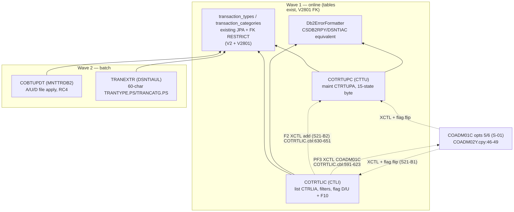

# S-21 Transaction-Type Maintenance — Stream Analysis (`!mf_stream_analysis`)

Status: complete (2026-09-16). Stream assigned by orchestrator; process type **MIXED**: CTLI/CTTU are **ONLINE** screens (admin menu options 5/6), MNTTRDB2/COBTUPDT + TRANEXTR are **BATCH**.
Target profiles applied (read-only): CORE + ONLINE + BATCH + DATA/BOUNDARY from `functional/CARDDEMO/CardDemo_target_state.md`. Greenfield code, but the two DB2 tables map onto **already-existing baseline entities** (`transaction_types`, `transaction_categories` — V2, from the VSAM originals).

## 1. Pinned stream

- **Entries (proof)**: `CTLI -> COTRTLIC`, `CTTU -> COTRTUPC` (`app/app-transaction-type-db2/csd/CRDDEMOD.csd` DEFINE TRANSACTION; DB2ENTRY CARDDEMO + DB2TRAN rows for both trans); reached from admin menu options 5/6 — `COADM02Y.cpy:46-49` lists `COTRTLIC` ('Transaction Type List/Update (Db2)') and `COTRTUPC` ('Transaction Type Maintenance (Db2)') directly (no DUMMY placeholder), XCTL'd by COADM01C (`app/cbl/COADM01C.cbl:141-150`).
- **Batch entries**: `MNTTRDB2` Control-M WEEKLY job (`app/scheduler/CardDemo.controlm:27-62`) = IKJEFT01 DSN RUN COBTUPDT PLAN(CARDDEMO) w/ INPFILE (`jcl/MNTTRDB2.jcl`); `TRANEXTR` = DSNTIAUL extracts to TRANTYPE.PS + TRANCATG.PS GDG-backed (`jcl/TRANEXTR.jcl` STEP10-50); `CREADB21` = create/bind/load (`jcl/CREADB21.jcl` + ctl/DB2CREAT/DB2LTTYP/DB2LTCAT).
- **Hard stop**: PF3 from CTLI → XCTL COADM01C w/ SYNCPOINT (`COTRTLIC.cbl:591-623`); PF3 from CTTU → XCTL `CDEMO-TO-PROGRAM` (`COTRTUPC.cbl:429-460`). Batch legs end at RC.
- **Exclusions**: sign-on/admin-menu shell (S-01); transaction-type usage inside transaction processing (S-07..S-11) — this stream only maintains the reference tables.

## 2. Program inventory + leaf-first DAG

| Program | Path | Role | Callees / edges | Shared? | Present |
|---|---|---|---|---|---|
| COTRTLIC | app/app-transaction-type-db2/cbl/COTRTLIC.cbl (2098) | entry/list + inline delete/update flagging | DB2 cursors fwd/bwd; UPDATE/DELETE on TRANSACTION_TYPE; XCTL COTRTUPC on F2 (:630-651) and COADM01C on PF3 (:591-623); CALL DSNTIAC via CSDB2RPY (:2057-2077 expanded) | extension-only | yes |
| COTRTUPC | app/app-transaction-type-db2/cbl/COTRTUPC.cbl (1702) | detail/add/update/delete state machine | DB2 SELECT/INSERT/UPDATE/DELETE on TRANSACTION_TYPE; XCTL CDEMO-TO-PROGRAM; HANDLE ABEND ABCODE (:348-350,:1675-1697) | extension-only | yes |
| COBTUPDT | app/app-transaction-type-db2/cbl/COBTUPDT.cbl (237) | batch write (maint file apply) | FD INPFILE fixed rec; INSERT/UPDATE/DELETE TRANSACTION_TYPE; abend RC4 | extension-only | yes |
| DSNTIAUL | (IBM utility via jcl/TRANEXTR.jcl) | extract | TRANTYPE.PS/TRANCATG.PS | — | utility (no FR file) |
| DSNTIAC | (IBM subroutine) | SQL error text formatter | CALL'd by COTRTLIC via CSDB2RPY | — | utility |

Route/data copybooks: `COADM02Y` admin table (shared S-01); `CSDB2RPY`/`CSDB2RWY` shared DB2 helpers; `DCLTRTYP`/`DCLTRCAT` DCLGENs; `TRNTYPE`/`TRNTYCAT` DDL.

**Leaf-first DAG** (rendered):

Source: [`diagrams/S21_tran_type_maintenance_dag.mmd`](diagrams/S21_tran_type_maintenance_dag.mmd)

## 3. Surfaces

### COTRTLIC — screen CTRLIA / mapset COTRTLI (`bms/COTRTLI.bms`) — ONLINE

Title 'Maintain Transaction Type' (:76-78), `Page ` + PAGENO (:79-83).

| Field | I/O | PIC | Edits (cite) |
|---|---|---|---|
| TRTYPE | INPUT | X(2) UNPROT,IC (:89-93) | type filter — blank or 2-digit number else 'TYPE CODE FILTER,IF SUPPLIED MUST BE A 2 DIGIT NUMBER' (`COTRTLIC.cbl:1111-1118`) |
| TRDESC | INPUT | X(50) UNPROT (:101-105) | description filter — wrapped `'%'+trim+'%'` LIKE (:1155-1163) |
| TRTSELn n=1..7 | INPUT | X(1) FSET,PROT (:133..) | D=delete/U=update flag on the row; only ONE action allowed — 'Please select only 1 action' (:1021-1052); invalid code → 'Action code selected is invalid' |
| TRTTY Pn/TRTYPDn | INPUT (FSET,PROT row echo) + DISPLAY | X(2)/X(50) | row keys re-read on submit |
| ERRMSG | DISPLAY | X(78) | message line |
| PAGENO | DISPLAY | 3 | page number (:82) |

Footer: `F2=Add F3=Exit F7=Page Up F8=Page Dn F10=Save` (:316-336). Valid AIDs ENTER/F2/F3/F7/F8/F10-when-pending (`:575-583`); F10 counts only when a delete/update is flagged and nothing else changed, else treated as ENTER (:666-678). 7 rows/page (`WS-MAX-SCREEN-LINES` :60). Paging: DB2 cursors C-TR-TYPE-FORWARD `TR_TYPE >= start (+ optional type filter + DESC LIKE) ORDER BY TR_TYPE` (:339-352) and C-TR-TYPE-BACKWARD (:355-368). Cross-check 'No Records found for these filter conditions' (:1248-1266). Page-edge messages 'No previous pages to display' / 'No more pages to display' / 'No more pages for these search conditions' (:1534-1548). Update `+100`→'Record not found. Deleted by others ?' / `-911`→'Deadlock. Someone else updating ?' (:1846-1893); delete `-532`→'Please delete associated child records first:' (:1900-1935). Info messages: 'Type U to update, D to delete any record', 'Delete HIGHLIGHTED row ? Press F10 to confirm', 'Update HIGHLIGHTED row. Press F10 to save', 'HIGHLIGHTED row deleted.Hit Enter to continue', 'HIGHLIGHTED row was updated' (:239-248).

### COTRTUPC — screen CTRTUPA / mapset COTRTUP (`bms/COTRTUP.bms`) — ONLINE

Title 'Maintain Transaction Type' (:76-78). INPUT: TRTYPCD X(2) (:84-87), TRTYDSC X(50) (:94-97); DISPLAY INFOMSG (:100-104) + ERRMSG X(78) (:107-110). Footer `ENTER=Process F3=Exit` + DRK conditional keys `F4=Delete F5=Save F6=Add F12=Cancel` (:111-135).

State machine `TTUP-CHANGE-ACTION` byte (`COTRTUPC.cbl:296-327`): K invalid-search, X not-found, S show, R create-new, V review-new, 9 confirm-delete, 8 start-delete, 7 delete-done, 6 delete-failed, E changes-not-ok, N ok-not-confirmed, L lock-error, F failed, C done, B backed-out. Edits: type code required/numeric/non-zero then zero-pad (:820-842,:907-972); description required ≤50 alphanumeric (:758-764,:849-901); change-compare 'No change detected with respect to values fetched.' (:783-811). Writes: F5 save → 9600 UPDATE, +100 → 9700 INSERT, -911 'Could not lock record for update', else 'Error updating: TRANSACTION_TYPE Table. SQLCODE:' (:1544-1589); F4 delete → 9800 DELETE, -532 'Please delete associated child records first:' (:1638-1649). F12 cancel restores originals (:988-1008). Messages (:160-196): 'Changes validated.Press F5 to save', 'Changes committed to database', 'Changes unsuccessful', 'No record found for this key in database', 'No input received', 'Invalid key pressed', 'PF03 pressed.Exiting'.

### COBTUPDT — BATCH

- Job MNTTRDB2 (`jcl/MNTTRDB2.jcl`): IKJEFT01 `DSN SYSTEM(DAZ1) RUN PROGRAM(COBTUPDT) PLAN(CARDDEMO)`; input DD INPFILE.
- Input record (`COBTUPDT.cbl:39-46,:71-77`): `INPUT-TYPE` X(1) + `INPUT-TR-NUMBER` X(2) + `INPUT-TR-DESC` X(50) fixed 53 bytes; actions 'A' insert / 'U' update / 'D' delete / '*' comment-skip; other → 'ERROR: TYPE NOT VALID' + abend RC4 (:109-129,:230-233). Update miss (+100) → 'No records found.' abend.
- TRANEXTR (`jcl/TRANEXTR.jcl`): GDG backups STEP10/20, deletes STEP30, DSNTIAUL extracts STEP40/50 — TRANTYPE.PS = `TR_TYPE||CAST(TR_DESCRIPTION AS CHAR(50))||REPEAT('0',8)` CHAR(60) ORDER BY TR_TYPE; TRANCATG.PS = `TRC_TYPE_CODE||TRC_TYPE_CATEGORY||CAST(TRC_CAT_DATA AS CHAR(50))||REPEAT('0',4)` CHAR(60); COND-chained (0,NE)/(4,LT).

## 4. Data + field dictionary

**CARDDEMO.TRANSACTION_TYPE** (`dcl/DCLTRTYP.dcl`, `ddl/TRNTYPE.ddl` PK(TR_TYPE), index XTRNTYPE): TR_TYPE CHAR(2) NN, TR_DESCRIPTION VARCHAR(50) NN → **existing** `transaction_types` (`V2__baseline_domain_tables.sql:71-74`: tran_type varchar(2) PK, description varchar(50); entity `model/TransactionType.java`). FACT — 1:1.

**CARDDEMO.TRANSACTION_TYPE_CATEGORY** (`dcl/DCLTRCAT.dcl`, `ddl/TRNTYCAT.ddl` PK(TRC_TYPE_CODE,TRC_TYPE_CATEGORY), FK TRC_TYPE_CODE→TRANSACTION_TYPE ON DELETE RESTRICT): TRC_TYPE_CODE CHAR(2), TRC_TYPE_CATEGORY CHAR(4), TRC_CAT_DATA VARCHAR(50) → **existing** `transaction_categories` (tran_type_code varchar(2), tran_category_code integer, description varchar(255); entity `model/TransactionCategory.java` @EmbeddedId). Type delta: DB2 TRC_TYPE_CATEGORY is CHAR(4) '0001'-style; baseline stores `integer` — render 4-digit zero-padded, store int (INFERRED-compatible; the VSAM original is the same data). FACT for columns, INFERRED for char(4)→int equivalence.

Read/write split: online programs + COBTUPDT write TRANSACTION_TYPE only; TRANSACTION_TYPE_CATEGORY is loaded/extracted by batch (DB2LTCAT seed, TRANEXTR) and constrains parent deletes via FK RESTRICT (-532 → 'Please delete associated child records first:'). Seed values `ctl/DB2LTTYP.ctl` (7 rows '01'..'07') + `ctl/DB2LTCAT.ctl`.

## 5. Boundary table — S21-B1..S21-B7; re-decided in Java terms

| ID | Class | Contract | Direction | Cite | Decision (Java) |
|---|---|---|---|---|---|
| S21-B1 | B5 cross-program switch | COADM01C options 5/6 → XCTL COTRTLIC/COTRTUPC w/ COMMAREA (targets exist in route table — not DUMMY) | inbound | COADM02Y.cpy:46-49; COADM01C.cbl:141-150 | DECIDED: `MenuService` ADMIN options 5/6 `implemented` flags → true; `UI_ROUTES` gains COTRTLIC/COTRTUPC entries (MenuService.java:50-57,110-120) |
| S21-B2 | B5 internal switch | F2 XCTL COTRTLIC→COTRTUPC; PF3 returns COADM01C (CTLI) or CDEMO-TO-PROGRAM (CTTU) | internal | COTRTLIC.cbl:630-651; COTRTUPC.cbl:429-460 | DECIDED: in-app routes `/ui/tran-types` (list) + `/ui/tran-types/{code}` (maint); 'Add' link navigates w/ blank/new state |
| S21-B3 | B4 data-access leaf | DB2 cursor browse fwd/bwd + UPDATE/DELETE/SELECT/INSERT on TRANSACTION_TYPE | outbound | COTRTLIC.cbl:339-368,:1846-1935; COTRTUPC.cbl:1544-1649 | DECIDED (B-006): reuse `transaction_types` entity/repo; keyset pagination over PK order replacing scrollable cursors |
| S21-B4 | B10 shared child table | TRANSACTION_TYPE_CATEGORY exists only to gate parent deletes (FK RESTRICT, -532) | outbound | ddl/TRNTYCAT.ddl | DECIDED: V2801 adds `FOREIGN KEY (tran_type_code) REFERENCES transaction_types ON DELETE RESTRICT` to `transaction_categories`; -532 → friendly message |
| S21-B5 | B2 step→batch | MNTTRDB2 TSO-batch apply of A/U/D records | inbound | jcl/MNTTRDB2.jcl; COBTUPDT.cbl:39-129 | DECIDED (B-008/B-010): Spring Batch job `tranTypeMaintJob`; INPFILE → classpath/parameter file (Spring Resource); RC4→job FAILED |
| S21-B6 | B10 data transfer | TRANEXTR extracts 60-char TRANTYPE.PS/TRANCATG.PS (+GDG backups) | outbound | jcl/TRANEXTR.jcl STEP40/50 | DECIDED: `tranTypeExtractJob` step emitting the exact 60-char layouts; GDG backups → versioned export files (optional, flagged) |
| S21-B7 | B9 utility call | CALL DSNTIAC DB2 error formatting via CSDB2RPY 9998/9999 | internal | CSDB2RPY.cpy 9998-PRIMING-QUERY/9999-FORMAT-DB2-MESSAGE; COTRTLIC.cbl:684-691,:2057-2077 | DECIDED: SQLException→message assembly helper (`Db2ErrorFormatter`); priming query → connectivity health check on entry |

All contracts resolved; no blockers. SYNCPOINT/XCTL transaction semantics → request-scoped `@Transactional` + redirects.

## 6. Waves (leaf-first)

| Wave | Content | Repos touched |
|---|---|---|
| 1 | Online screens: `TranTypeService` (list w/ filters + flag-row updates/deletes; state-machine maint incl. confirm/cancel) + `TranTypeController` + Thymeleaf pages; MenuService flags + UI_ROUTES; V2801 FK RESTRICT; Db2ErrorFormatter | spring-boot/ |
| 2 | Batch: `tranTypeMaintJob` (COBTUPDT) + `tranTypeExtractJob` (TRANEXTR layouts) | spring-boot/ |

## 7. Risks

1. Row-flag update model (D/U on a listed row + F10 confirm) has fiddly precedence (single-action check, F10-only-when-pending, cross-check no-records) — port the EVALUATE order exactly (:575-583,:666-678,:1021-1052). MEDIUM.
2. `-911/-532/+100` SQLSTATE fidelity on update/delete must survive JPA — map DataAccessExceptions to the three messages. MEDIUM.
3. State-byte flow in COTRTUPC is 15-valued; keep the enum exhaustive and the F4/F5/F12 transitions verbatim. MEDIUM.
4. TRC_TYPE_CATEGORY char(4)→int: category codes '0001' display must zero-pad; RESTRICT behavior now enforced by V2801 FK. LOW.
5. `COTRTLIC` +100 'record not found' on update races is preserved as an optimistic-delete edge. LOW.

## 8. Validation

(1) programs inventoried: 3 ported programs + 2 IBM utility steps (DSNTIAUL, DSNTIAC) + JCLs MNTTRDB2/TRANEXTR/CREADB21; none absent; (2) wave order topological (tables/FK before screens; screens before batch is fine since batch reuses repos); (3) claims cited file:line; (4) surfaces match ONLINE (screens/AID/edits) + BATCH (datasets/parms/RCs); (5) every crossing (XCTL×3, EXEC SQL incl. cursors, batch file I/O, DSNTIAC call, FK constraint) in the table; (6) physical layers resolved: both DB2 tables→existing JPA entities (+FK add), INPFILE→Spring Resource.
