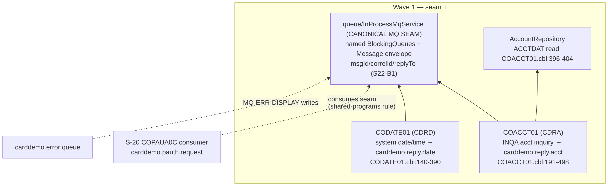

# S-22 VSAM-MQ Request/Reply Demo — Stream Analysis (`!mf_stream_analysis`)

Status: complete (2026-09-16). Stream assigned by orchestrator; process type **SUBTRANSACTION** ×2 — queue-triggered consumer programs (CDRA/CDRD) with no screens, no JCL.
Target profiles applied (read-only): CORE + DATA/BOUNDARY from `functional/CARDDEMO/CardDemo_target_state.md`. Greenfield; **this stream is the canonical owner of the in-process MQ seam** (`queue/InProcessMqService`).

## 1. Pinned stream

- **Entry points (proof)**: `CDRA -> COACCT01`, `CDRD -> CODATE01` (`app/app-vsam-mq/csd/CRDDEMOM.csd` — DEFINE PROGRAM with TRANSID + DEFINE TRANSACTION pairs; `DEFINE LIBRARY(CARDDLIB)` for the loadlib). Both programs are MQ-trigger-monitor tasks: `EXEC CICS RETRIEVE INTO(MQTM)` obtains the triggering queue name (`COACCT01.cbl:191-198`, `CODATE01.cbl:140-147`).
- **Hard stop**: input queue drains (MQRC-NO-MSG-AVAILABLE after 5s GET wait) → close queues → `EXEC CICS RETURN` (`COACCT01.cbl:377-378,549-550`; `CODATE01.cbl:326-327,453-454`).
- **Exclusions**: the pending-auth MQ flow (S-20 — consumer of the same seam); the pending-auth view (S-19); any requester-side program (external to CardDemo — requesters are queue clients).

## 2. Program inventory + leaf-first DAG

| Program | Path | Role | Callees / edges | Shared? | Present |
|---|---|---|---|---|---|
| COACCT01 | app/app-vsam-mq/cbl/COACCT01.cbl (620) | entry/seam consumer — account inquiry request/reply | MQOPEN×3 (input/reply/error), MQGET loop, CICS READ ACCTDAT (:396-404), MQPUT reply + error, MQCLOSE×3, SYNCPOINT (:326-328) | extension-only | yes |
| CODATE01 | app/app-vsam-mq/cbl/CODATE01.cbl (524) | entry/seam consumer — date/time request/reply | same MQ skeleton; ASKTIME+FORMATTIME (:343-353); no dataset access | extension-only | yes |

MQ copybooks `CMQODV/CMQMDV/CMQV/CMQTML/CMQGMOV/CMQPMOV` (system-provided); `CVACT01Y` account record (shared with core streams).

**Leaf-first DAG** (rendered):

Source: [`diagrams/S22_vsam_mq_demo_dag.mmd`](diagrams/S22_vsam_mq_demo_dag.mmd)

## 3. Surfaces (SUBTRANSACTION — linkage/queue contract only)

- **Input queue**: triggering queue name from `MQTM-QNAME` (dynamic — whatever queue triggered the task); opened `MQOO-INPUT-SHARED + SAVE-ALL-CONTEXT + FAIL-IF-QUIESCING` (`COACCT01.cbl:226-244`).
- **Request layout**: `WS-FUNC` X(4) + `WS-KEY` 9(11) + filler X(985) (`COACCT01.cbl:109-112`, `CODATE01.cbl:109-112`). GET: 1000-byte buffer, `MQGMO-SYNCPOINT+WAIT+CONVERT+FAIL-IF-QUIESCING`, 5000 ms wait, no msgId/correlId filtering (`:337-360`).
- **Reply queues**: hardcoded `CARD.DEMO.REPLY.ACCT` (`COACCT01.cbl:197`) and `CARD.DEMO.REPLY.DATE` (`CODATE01.cbl:147`) — **not** the request's `MQMD-REPLYTOQ` (it is captured into `SAVE-REPLY2Q` :370-371 but never used; the PUT goes to the hardcoded output handle). Reply carries `msgId = request msgId`, `correlId = request correlId`, format MQFMT-STRING (:469-471).
- **Error queue**: `CARD.DEMO.ERROR` — `MQ-ERR-DISPLAY` block (para, return msg, condition/reason codes, queue name) put as string (:58-67,:501-536).
- **Reply bodies**: COACCT01 'INQA' path → labeled text `ACCOUNT ID : <id> ACCOUNT STATUS : <s> BALANCE : <b> CREDIT LIMIT : <l> CASH LIMIT : <cl> OPEN DATE : <d> EXPR DATE : <d> REIS DATE : <d> CREDIT BAL : <b> DEBIT BAL : <b> GROUP ID : <g>` (`WS-ACCT-RESPONSE` :130-169); non-INQA/zero key or NOTFND → `INVALID REQUEST PARAMETERS ACCT ID : <key> FUNCTION : <func>` (`:429-456`). CODATE01 → `SYSTEM DATE : MM-DD-YYYY` + `SYSTEM TIME : HH:MM:SS` (`:355-360`).
- **SYNCPOINT** before each GET iteration (:326-328) — per-message unit of work.

Doc note: `app/app-vsam-mq/README.md` names the demo queues differently than the code; **source is authoritative** — reply/error queue names are the literals above.

## 4. Data + field dictionary

No new tables. Reads: `ACCTDAT` VSAM by acct-id RIDFLD keylength 11 (`:396-404`) → fields ACCT-ID/ACTIVE-STATUS/CURR-BAL/CREDIT-LIMIT/CASH-CREDIT-LIMIT/OPEN-DATE/EXPIRAION-DATE/REISSUE-DATE/CURR-CYC-CREDIT/DEBIT/GROUP-ID (`CVACT01Y`; mapped fields listed at `WS-ACCT-RESPONSE` :130-169 → string labels + numeric values). Target: `AccountRepository` (existing).

## 5. Boundary table — S22-B1..S22-B5; re-decided in Java terms

| ID | Class | Contract | Direction | Cite | Decision (Java) |
|---|---|---|---|---|---|
| S22-B1 | B7 MQ seam (canonical) | named request/reply/error queues; GET w/ 5s wait+syncpoint+convert; PUT w/ msgId/correlId echo, format string; OPEN/CLOSE | both | COACCT01.cbl:222-321,334-388,462-536; CODATE01.cbl parallel | DECIDED (B-007): `queue/InProcessMqService` — `Map<String,BlockingQueue<Message>>`; `Message{msgId,correlId,replyTo,format,payload}`; `put(name,msg)` / `poll(name,5000ms)` / `registerConsumer(triggerQueue,handler)`; OPEN→queue lookup, CLOSE→no-op, MQRC-NO-MSG-AVAILABLE→empty poll |
| S22-B2 | B7 fixed reply routing | reply queue is hardcoded per program (REPLYTOQ ignored); error queue `CARD.DEMO.ERROR` | outbound | COACCT01.cbl:197,:370-371,:480-498; CODATE01.cbl:147 | DECIDED: named queues `carddemo.reply.acct`, `carddemo.reply.date`, `carddemo.error` — the ignored-replyTo quirk is PRESERVED verbatim (demo fidelity) |
| S22-B3 | B8 trigger lifecycle | MQTM RETRIEVE gives trigger queue; task drains queue then returns | inbound | COACCT01.cbl:191-210 | DECIDED: `registerConsumer(queueName, handler)` at startup; handler loop exits on 5s empty poll |
| S22-B4 | B4 data-access leaf | CICS READ ACCTDAT by 11-char acct-id; NORMAL/NOTFND/other | outbound | COACCT01.cbl:396-447 | DECIDED (B-009): `AccountRepository.findById` — NOTFND→invalid-params reply; other→error-queue event |
| S22-B5 | B6 tx boundary | SYNCPOINT per GET iteration; MQPUT under syncpoint | internal | COACCT01.cbl:326-328,:475-485 | DECIDED: per-message processing is one unit; in-process queue removes + re-queues on failure policy = at-most-once demo semantics preserved |

All contracts resolved; no blockers.

## 6. Waves (leaf-first)

| Wave | Content | Repos touched |
|---|---|---|
| 1 | `queue/InProcessMqService` (owned here — canonical MQ seam also consumed by S-20) + `AcctInquiryConsumer` (COACCT01) + `DateTimeConsumer` (CODATE01); no Flyway (no persistence) | spring-boot/ |

## 7. Risks

1. Shared-seam contract drift: S-20 uses `MQPUT1`+replyTo-driven reply while S-22 uses open-once+hardcoded reply — the service must support both put styles and both routing modes. MEDIUM (recorded in seam contract).
2. The hardcoded-reply quirk vs README's queue names — doc-vs-source divergence preserved deliberately; could confuse consumers. LOW (documented).
3. 'INQA' is the only function code; CODATE01 ignores request content entirely. LOW.

## 8. Validation

(1) programs inventoried: 2/2 present, no absent modules (CMQ* system copybooks excluded from porting); (2) single wave is a valid DAG topological sort (seam + two consumers are peers); (3) claims cited file:line; (4) surfaces match SUBTRANSACTION (queue/linkage contracts); (5) every crossing (MQOPEN/GET/PUT/PUT1-style, RETRIEVE, VSAM READ, SYNCPOINT, queue literals) in the table; (6) sole data-access leaf resolved: ACCTDAT VSAM → existing JPA repository.
