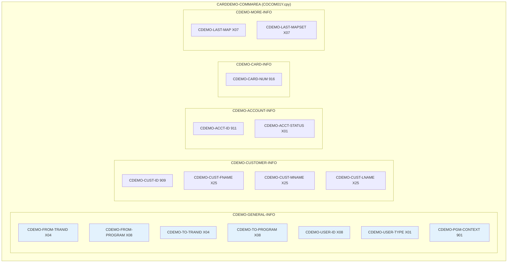
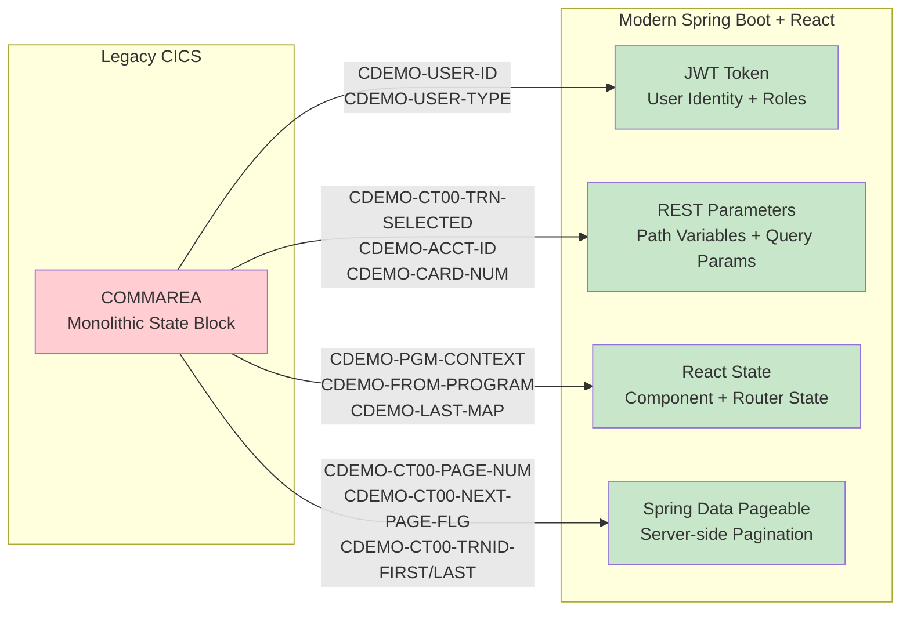

# COMMAREA Variable Mapping: Legacy to REST/Session State

> **Module:** Transaction Processing (CardDemo Modernization)
> **Phase:** 2 - Analysis
> **Source Copybook:** COCOM01Y.cpy
> **Source Programs:** COTRN00C.cbl, COTRN01C.cbl, COTRN02C.cbl

---

## 1. COMMAREA Structure Overview

The `CARDDEMO-COMMAREA` (defined in `COCOM01Y.cpy`) is a shared data area passed between CICS programs via `EXEC CICS RETURN TRANSID ... COMMAREA(...)` and `EXEC CICS XCTL PROGRAM(...) COMMAREA(...)`. It preserves state across pseudo-conversational interactions.

---

## 2. Shared COMMAREA Fields (COCOM01Y.cpy)

### 2.1 General Info Section

| COBOL Field | PIC | Used In | Purpose | REST/Modern Replacement |
|---|---|---|---|---|
| `CDEMO-FROM-TRANID` | `X(04)` | All 3 | Stores the CICS transaction ID of the calling program | **Not needed**: React Router manages navigation history; `Referer` header or breadcrumb state in React |
| `CDEMO-FROM-PROGRAM` | `X(08)` | All 3 | Stores the program name of the caller (for PF3 return routing) | **Not needed**: React Router `navigate(-1)` or explicit route; backend doesn't need this |
| `CDEMO-TO-TRANID` | `X(04)` | All 3 | Target CICS transaction ID for XCTL transfer | **Not needed**: React route path (`/transactions`, `/transactions/add`, etc.) |
| `CDEMO-TO-PROGRAM` | `X(08)` | All 3 | Target program name for XCTL transfer | **Not needed**: React component routing |
| `CDEMO-USER-ID` | `X(08)` | All 3 | Current user's ID (set at login) | **JWT claim**: `sub` (subject) field in JWT token; or Spring Security `SecurityContextHolder.getContext().getAuthentication().getName()` |
| `CDEMO-USER-TYPE` | `X(01)` | All 3 | User type: 'A' = Admin, 'U' = User | **JWT claim**: Custom `role` claim; or Spring Security `@PreAuthorize("hasRole('ADMIN')")` |
| `CDEMO-PGM-CONTEXT` | `9(01)` | All 3 | 0 = first entry, 1 = re-entry (pseudo-conversational state) | **Not needed**: SPA maintains component state; each HTTP request is self-contained |

### 2.2 Customer Info Section

| COBOL Field | PIC | Used In | Purpose | REST/Modern Replacement |
|---|---|---|---|---|
| `CDEMO-CUST-ID` | `9(09)` | Not directly used by COTRN0x | Customer ID passed between modules | **JWT claim** or **request parameter**: `?customerId=123456789` |
| `CDEMO-CUST-FNAME` | `X(25)` | Not directly used by COTRN0x | Customer first name for display | **Not stored in session**: Fetched from `/api/customers/{id}` as needed |
| `CDEMO-CUST-MNAME` | `X(25)` | Not directly used by COTRN0x | Customer middle name for display | **Not stored in session**: Fetched on demand |
| `CDEMO-CUST-LNAME` | `X(25)` | Not directly used by COTRN0x | Customer last name for display | **Not stored in session**: Fetched on demand |

### 2.3 Account Info Section

| COBOL Field | PIC | Used In | Purpose | REST/Modern Replacement |
|---|---|---|---|---|
| `CDEMO-ACCT-ID` | `9(11)` | Not directly used by COTRN0x | Account ID for cross-module navigation | **Request parameter**: `?accountId=12345678901` or path variable `/api/accounts/{id}` |
| `CDEMO-ACCT-STATUS` | `X(01)` | Not directly used by COTRN0x | Account active/inactive status | **Not stored in session**: Derived from account lookup |

### 2.4 Card Info Section

| COBOL Field | PIC | Used In | Purpose | REST/Modern Replacement |
|---|---|---|---|---|
| `CDEMO-CARD-NUM` | `9(16)` | Not directly used by COTRN0x | Card number for cross-module navigation | **Request parameter**: `?cardNumber=1234567890123456` |

### 2.5 More Info Section

| COBOL Field | PIC | Used In | Purpose | REST/Modern Replacement |
|---|---|---|---|---|
| `CDEMO-LAST-MAP` | `X(07)` | Not directly used by COTRN0x | Last BMS map sent (for screen recovery) | **Not needed**: React component state + React Router handles view state |
| `CDEMO-LAST-MAPSET` | `X(07)` | Not directly used by COTRN0x | Last BMS mapset sent | **Not needed**: Same as above |

---

## 3. Program-Specific COMMAREA Extensions

Each transaction program defines its own extension to the COMMAREA immediately after the `COPY COCOM01Y` statement.

### 3.1 COTRN00C (List Transactions) - CT00 Extension

| COBOL Field | PIC | Purpose | REST/Modern Replacement |
|---|---|---|---|
| `CDEMO-CT00-TRNID-FIRST` | `X(16)` | Transaction ID of first record on current page | **Not needed**: Server-side pagination via Spring Data `Pageable`; client tracks via page number |
| `CDEMO-CT00-TRNID-LAST` | `X(16)` | Transaction ID of last record on current page | **Not needed**: Spring Data `Page` object provides `hasNext()` information |
| `CDEMO-CT00-PAGE-NUM` | `9(08)` | Current page number | **Query parameter**: `GET /api/transactions?page=0&size=10` |
| `CDEMO-CT00-NEXT-PAGE-FLG` | `X(01)` | 'Y' if more pages exist, 'N' if at end | **Response metadata**: `Page.hasNext()` in Spring Data; or `totalPages` in JSON response |
| `CDEMO-CT00-TRN-SEL-FLG` | `X(01)` | Selection flag ('S' for select) | **Not needed**: React click handler directly navigates to `/transactions/{id}` |
| `CDEMO-CT00-TRN-SELECTED` | `X(16)` | Transaction ID of selected row | **Path variable**: `GET /api/transactions/{transactionId}` |

### 3.2 COTRN01C (View Transaction) - CT01 Extension

| COBOL Field | PIC | Purpose | REST/Modern Replacement |
|---|---|---|---|
| `CDEMO-CT01-TRNID-FIRST` | `X(16)` | Same pagination state structure | **Not applicable**: View screen doesn't paginate |
| `CDEMO-CT01-TRNID-LAST` | `X(16)` | (inherited structure, not actively used) | **Not applicable** |
| `CDEMO-CT01-PAGE-NUM` | `9(08)` | (inherited structure) | **Not applicable** |
| `CDEMO-CT01-NEXT-PAGE-FLG` | `X(01)` | (inherited structure) | **Not applicable** |
| `CDEMO-CT01-TRN-SEL-FLG` | `X(01)` | (inherited structure) | **Not applicable** |
| `CDEMO-CT01-TRN-SELECTED` | `X(16)` | Pre-selected transaction ID from list screen | **Path variable**: `GET /api/transactions/{transactionId}` - no COMMAREA needed |

### 3.3 COTRN02C (Add Transaction) - CT02 Extension

| COBOL Field | PIC | Purpose | REST/Modern Replacement |
|---|---|---|---|
| `CDEMO-CT02-TRNID-FIRST` | `X(16)` | (inherited structure, not used for add) | **Not applicable** |
| `CDEMO-CT02-TRNID-LAST` | `X(16)` | (inherited structure) | **Not applicable** |
| `CDEMO-CT02-PAGE-NUM` | `9(08)` | (inherited structure) | **Not applicable** |
| `CDEMO-CT02-NEXT-PAGE-FLG` | `X(01)` | (inherited structure) | **Not applicable** |
| `CDEMO-CT02-TRN-SEL-FLG` | `X(01)` | (inherited structure) | **Not applicable** |
| `CDEMO-CT02-TRN-SELECTED` | `X(16)` | Pre-selected card number from calling screen | **Query parameter**: `GET /api/transactions/add?cardNumber=...` to pre-populate form |

---

## 4. Modernization Strategy Summary

### Replacement Categories

| Category | COMMAREA Fields | Modern Mechanism | Rationale |
|---|---|---|---|
| **Authentication & Authorization** | `CDEMO-USER-ID`, `CDEMO-USER-TYPE` | JWT token with `sub` and `role` claims; Spring Security | Stateless auth; no server-side session needed |
| **Navigation State** | `CDEMO-FROM-TRANID`, `CDEMO-FROM-PROGRAM`, `CDEMO-TO-TRANID`, `CDEMO-TO-PROGRAM` | React Router (`useNavigate`, `useLocation`) | SPA handles navigation natively; no XCTL equivalent needed |
| **Entity References** | `CDEMO-CT00-TRN-SELECTED`, `CDEMO-ACCT-ID`, `CDEMO-CARD-NUM`, `CDEMO-CUST-ID` | REST path variables and query parameters | Each API call is self-contained with all necessary identifiers |
| **Pagination State** | `CDEMO-CT00-TRNID-FIRST/LAST`, `CDEMO-CT00-PAGE-NUM`, `CDEMO-CT00-NEXT-PAGE-FLG` | Spring Data `Pageable` (page, size, sort) + `Page` response | Server-managed cursor-based or offset pagination |
| **Pseudo-Conversational Control** | `CDEMO-PGM-CONTEXT` (enter/re-enter), `CDEMO-LAST-MAP/MAPSET` | React component lifecycle + state hooks (`useState`, `useReducer`) | SPA is natively conversational; no pseudo-conversational pattern needed |
| **Display-Only Context** | `CDEMO-CUST-FNAME/MNAME/LNAME`, `CDEMO-ACCT-STATUS` | On-demand API calls (`GET /api/customers/{id}`) | Fetch data when needed instead of carrying it in COMMAREA |

---

## 5. Key Design Decisions

| Decision | Rationale |
|---|---|
| **Stateless REST over server-side sessions** | The COMMAREA pattern exists because CICS is pseudo-conversational. Modern HTTP + SPA removes this constraint entirely. |
| **JWT for user identity** | Replaces `CDEMO-USER-ID` and `CDEMO-USER-TYPE`. Carries authentication state without server-side storage. |
| **No COMMAREA-equivalent session object needed** | Every COMMAREA field maps to either: a JWT claim, a request parameter, a React state variable, or is no longer needed. |
| **Spring Data Pageable for pagination** | Replaces the manual first/last ID tracking in COMMAREA with standard offset/keyset pagination. |
| **React Router for navigation** | Replaces `CDEMO-FROM-PROGRAM` / `CDEMO-TO-PROGRAM` XCTL routing with declarative client-side routing. |
