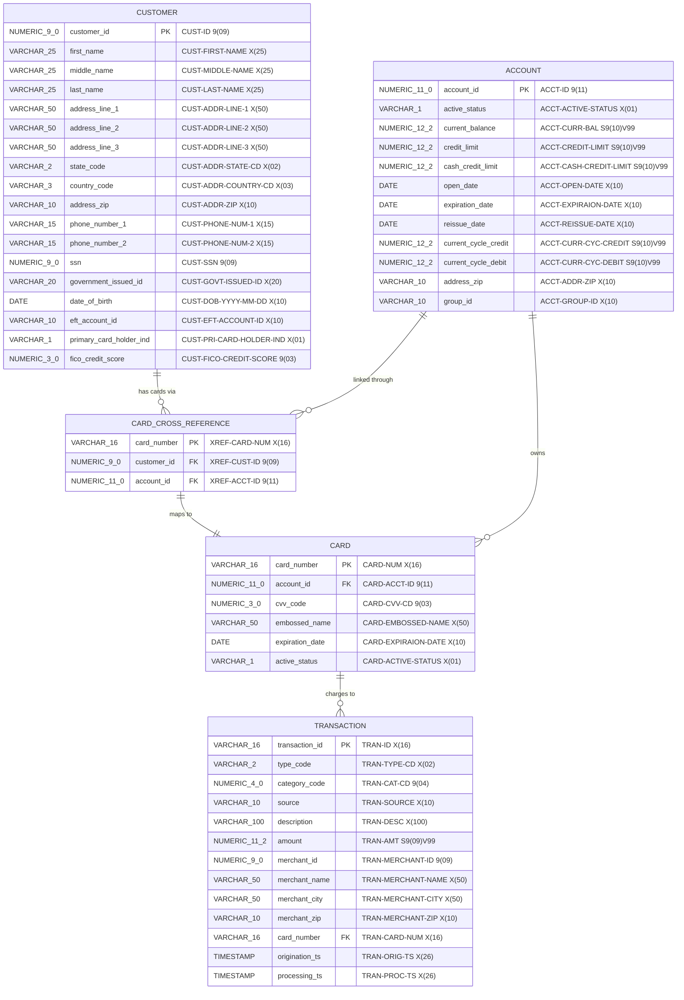
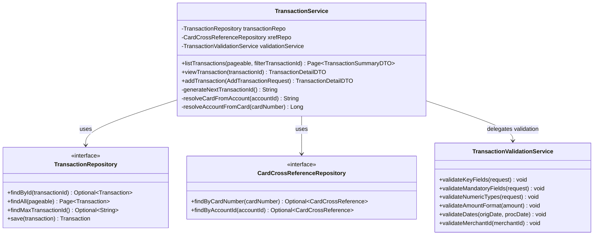
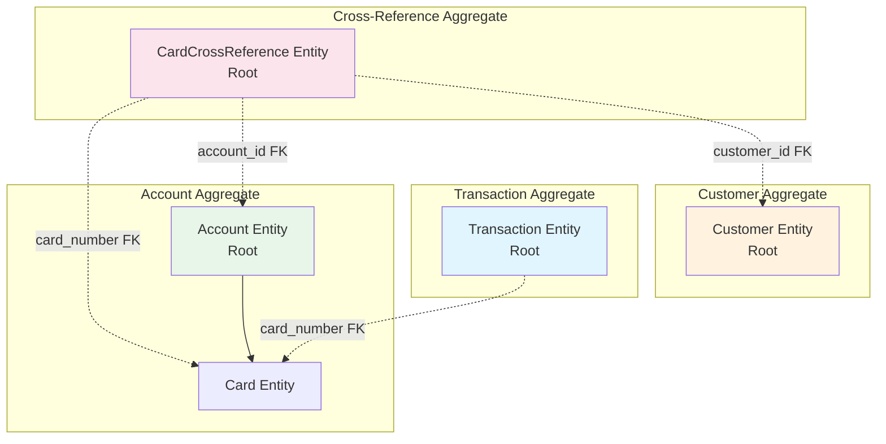

# Business Domain Model: CardDemo Transaction Processing Module

> **Module:** Transaction Processing (CardDemo Modernization)
> **Phase:** 2 - Analysis
> **Source Copybooks:** CVTRA05Y.cpy, CVACT01Y.cpy, CVACT02Y.cpy, CVACT03Y.cpy, CVCUS01Y.cpy

---

## 1. Entity Relationship Diagram

---

## 2. Java Class Diagram

```mermaid
classDiagram
    class Transaction {
        -String transactionId
        -String typeCode
        -Integer categoryCode
        -String source
        -String description
        -BigDecimal amount
        -Long merchantId
        -String merchantName
        -String merchantCity
        -String merchantZip
        -String cardNumber
        -LocalDateTime originationTimestamp
        -LocalDateTime processingTimestamp
        +getTransactionId() String
        +setTransactionId(String) void
        +getTypeCode() String
        +setTypeCode(String) void
        +getCategoryCode() Integer
        +setCategoryCode(Integer) void
        +getSource() String
        +setSource(String) void
        +getDescription() String
        +setDescription(String) void
        +getAmount() BigDecimal
        +setAmount(BigDecimal) void
        +getMerchantId() Long
        +setMerchantId(Long) void
        +getMerchantName() String
        +setMerchantName(String) void
        +getMerchantCity() String
        +setMerchantCity(String) void
        +getMerchantZip() String
        +setMerchantZip(String) void
        +getCardNumber() String
        +setCardNumber(String) void
        +getOriginationTimestamp() LocalDateTime
        +setOriginationTimestamp(LocalDateTime) void
        +getProcessingTimestamp() LocalDateTime
        +setProcessingTimestamp(LocalDateTime) void
    }

    class Account {
        -Long accountId
        -String activeStatus
        -BigDecimal currentBalance
        -BigDecimal creditLimit
        -BigDecimal cashCreditLimit
        -LocalDate openDate
        -LocalDate expirationDate
        -LocalDate reissueDate
        -BigDecimal currentCycleCredit
        -BigDecimal currentCycleDebit
        -String addressZip
        -String groupId
        +getAccountId() Long
        +getActiveStatus() String
        +getCurrentBalance() BigDecimal
        +getCreditLimit() BigDecimal
        +getCashCreditLimit() BigDecimal
        +getOpenDate() LocalDate
        +getExpirationDate() LocalDate
        +getReissueDate() LocalDate
        +getCurrentCycleCredit() BigDecimal
        +getCurrentCycleDebit() BigDecimal
        +getAddressZip() String
        +getGroupId() String
    }

    class Card {
        -String cardNumber
        -Long accountId
        -Integer cvvCode
        -String embossedName
        -LocalDate expirationDate
        -String activeStatus
        +getCardNumber() String
        +getAccountId() Long
        +getCvvCode() Integer
        +getEmbossedName() String
        +getExpirationDate() LocalDate
        +getActiveStatus() String
    }

    class CardCrossReference {
        -String cardNumber
        -Long customerId
        -Long accountId
        +getCardNumber() String
        +getCustomerId() Long
        +getAccountId() Long
    }

    class Customer {
        -Long customerId
        -String firstName
        -String middleName
        -String lastName
        -String addressLine1
        -String addressLine2
        -String addressLine3
        -String stateCode
        -String countryCode
        -String addressZip
        -String phoneNumber1
        -String phoneNumber2
        -Long ssn
        -String governmentIssuedId
        -LocalDate dateOfBirth
        -String eftAccountId
        -String primaryCardHolderIndicator
        -Integer ficoCreditScore
        +getCustomerId() Long
        +getFirstName() String
        +getLastName() String
        +getSsn() Long
        +getDateOfBirth() LocalDate
        +getFicoCreditScore() Integer
    }

    Customer "1" --> "*" CardCrossReference : has
    Account "1" --> "*" CardCrossReference : linked
    CardCrossReference "1" --> "1" Card : maps to
    Account "1" --> "*" Card : owns
    Card "1" --> "*" Transaction : charged on
```

---

## 3. Service Layer Architecture

---

## 4. Transaction Record Field Inventory (Quality Gate)

Every field from the 350-byte `CVTRA05Y.cpy` record is accounted for below:

| # | COBOL Field | PIC Clause | Bytes | Mapped to Java | Mapped to PostgreSQL | Status |
|---|---|---|---|---|---|---|
| 1 | `TRAN-ID` | `X(16)` | 16 | `String transactionId` | `VARCHAR(16) PK` | Mapped |
| 2 | `TRAN-TYPE-CD` | `X(02)` | 2 | `String typeCode` | `VARCHAR(2)` | Mapped |
| 3 | `TRAN-CAT-CD` | `9(04)` | 4 | `Integer categoryCode` | `NUMERIC(4,0)` | Mapped |
| 4 | `TRAN-SOURCE` | `X(10)` | 10 | `String source` | `VARCHAR(10)` | Mapped |
| 5 | `TRAN-DESC` | `X(100)` | 100 | `String description` | `VARCHAR(100)` | Mapped |
| 6 | `TRAN-AMT` | `S9(09)V99` | 11 | `BigDecimal amount` | `NUMERIC(11,2)` | Mapped |
| 7 | `TRAN-MERCHANT-ID` | `9(09)` | 9 | `Long merchantId` | `NUMERIC(9,0)` | Mapped |
| 8 | `TRAN-MERCHANT-NAME` | `X(50)` | 50 | `String merchantName` | `VARCHAR(50)` | Mapped |
| 9 | `TRAN-MERCHANT-CITY` | `X(50)` | 50 | `String merchantCity` | `VARCHAR(50)` | Mapped |
| 10 | `TRAN-MERCHANT-ZIP` | `X(10)` | 10 | `String merchantZip` | `VARCHAR(10)` | Mapped |
| 11 | `TRAN-CARD-NUM` | `X(16)` | 16 | `String cardNumber` | `VARCHAR(16) FK` | Mapped |
| 12 | `TRAN-ORIG-TS` | `X(26)` | 26 | `LocalDateTime originationTimestamp` | `TIMESTAMP` | Mapped |
| 13 | `TRAN-PROC-TS` | `X(26)` | 26 | `LocalDateTime processingTimestamp` | `TIMESTAMP` | Mapped |
| 14 | `FILLER` | `X(20)` | 20 | *Not mapped (padding)* | *Not mapped* | Excluded (expected) |
| | | **Total** | **350** | **13 fields + FILLER** | **13 columns** | **Complete** |

---

## 5. Aggregate Boundaries (DDD)

### Aggregate Design Rationale

| Aggregate | Root Entity | Bounded Context | Rationale |
|---|---|---|---|
| **Transaction** | `Transaction` | Transaction Processing | Transactions are created independently and reference cards by ID only. No cascading updates needed. |
| **Account** | `Account` | Account Management | Account owns cards. Card lifecycle is managed through the account. |
| **Customer** | `Customer` | Customer Management | Customer data is maintained independently; linked to accounts via cross-reference. |
| **Cross-Reference** | `CardCrossReference` | Lookup/Resolution | Bridge entity for resolving Account <-> Card <-> Customer relationships. Read-heavy, write-rare. |
