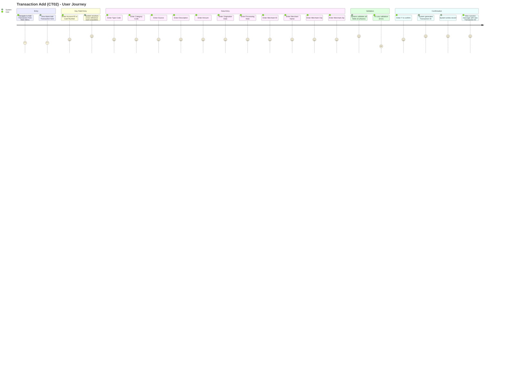
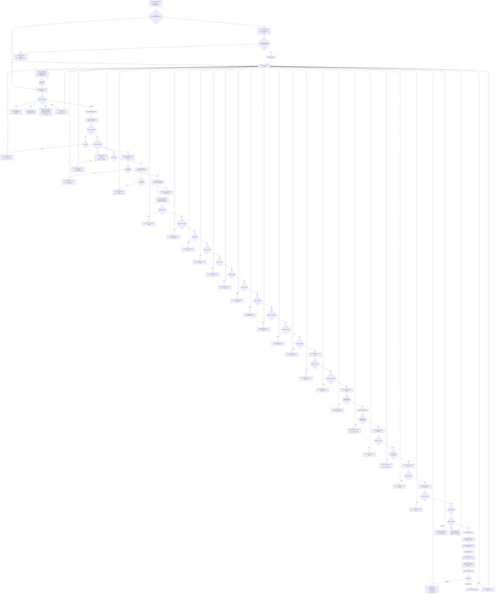
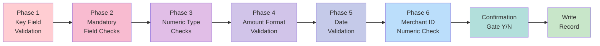

# User Journey Map: Transaction Add (CT02) Flow

> **Module:** Transaction Processing (CardDemo Modernization)
> **Phase:** 2 - Analysis
> **Source Program:** COTRN02C.cbl
> **CICS Transaction ID:** CT02

---

## 1. High-Level User Journey

---

## 2. Detailed Flow Diagram

---

## 3. Validation Chain Summary (6 Phases)

### Phase Details

| Phase | Name | Fields Checked | Error Behavior |
|---|---|---|---|
| **1** | Key Field Validation | Account ID, Card Number | Validates numericity, existence in XREF files, auto-resolves counterpart field |
| **2** | Mandatory Field Checks | 11 data fields (Type CD, Category CD, Source, Description, Amount, Orig Date, Proc Date, Merchant ID/Name/City/Zip) | Each empty field produces a specific error; checks stop at first failure |
| **3** | Numeric Type Checks | Type Code, Category Code | Must be numeric values |
| **4** | Amount Format Validation | Amount | Must match `[+/-]99999999.99` pattern |
| **5** | Date Validation | Origination Date, Processing Date | Format check (YYYY-MM-DD) then calendar validity via CSUTLDTC utility |
| **6** | Merchant ID Numeric Check | Merchant ID | Must be numeric |

---

## 4. REST API Mapping (Modernized Flow)

### Legacy vs. Modernized Interaction Comparison

| Step | Legacy (CICS/3270) | Modernized (REST/React) |
|---|---|---|
| Entry | XCTL from COMEN01C, COMMAREA passed | `GET /api/transactions/add` (load form) or React route navigation |
| Key Resolution | CICS READ on CXACAIX/CCXREF files | `GET /api/cross-references/resolve?accountId={id}` or `?cardNumber={num}` |
| Field Entry | 3270 screen fields, pseudo-conversational | React form with real-time client-side validation |
| Validation | 6-phase server-side COBOL logic | `POST /api/transactions` with server-side validation (Spring `@Valid` + custom validator) |
| Confirmation | Y/N field on same screen | Confirmation modal/dialog in React UI |
| ID Generation | STARTBR HIGH-VALUES → READPREV → +1 | PostgreSQL SEQUENCE or `SELECT MAX(transaction_id) + 1` with row-level locking |
| Write | CICS WRITE to TRANSACT VSAM | JPA `save()` → PostgreSQL INSERT |
| Success Feedback | Green message on 3270 screen | HTTP 201 Created with JSON response body containing new transaction ID |
| Error Feedback | Error message + cursor repositioning | HTTP 400/422 with structured error response (field-level error messages) |

### Proposed REST Endpoints

| Method | Endpoint | Legacy Equivalent | Description |
|---|---|---|---|
| `GET` | `/api/transactions` | COTRN00C List | Paginated transaction listing |
| `GET` | `/api/transactions/{id}` | COTRN01C View | View single transaction detail |
| `POST` | `/api/transactions` | COTRN02C Add | Create new transaction (with full validation) |
| `GET` | `/api/cross-references/resolve` | CXACAIX/CCXREF READ | Resolve Account ID <-> Card Number |
| `GET` | `/api/transactions/latest` | READPREV from HIGH-VALUES | Get most recent transaction (for PF5 copy feature) |

---

## 5. Pseudo-Conversational State Mapping

The legacy CT02 flow is pseudo-conversational: the CICS program processes one interaction, sends the screen, and returns to CICS. State is preserved in COMMAREA between interactions.

In the modernized architecture:

| Legacy Mechanism | Modernized Replacement |
|---|---|
| COMMAREA persistence across interactions | Stateless REST: All needed data is in the request body / JWT token |
| `CDEMO-PGM-REENTER` flag | Not needed: React SPA maintains UI state client-side |
| `WS-ERR-FLG` error flag | HTTP status codes (400, 422) + structured error response |
| Screen field cursor positioning (`MOVE -1 TO fieldL`) | React form focus management (`ref.current.focus()`) |
| `EXEC CICS RETURN TRANSID COMMAREA` | HTTP response (stateless) + React state management |
