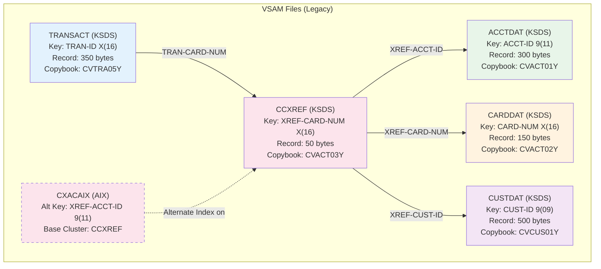
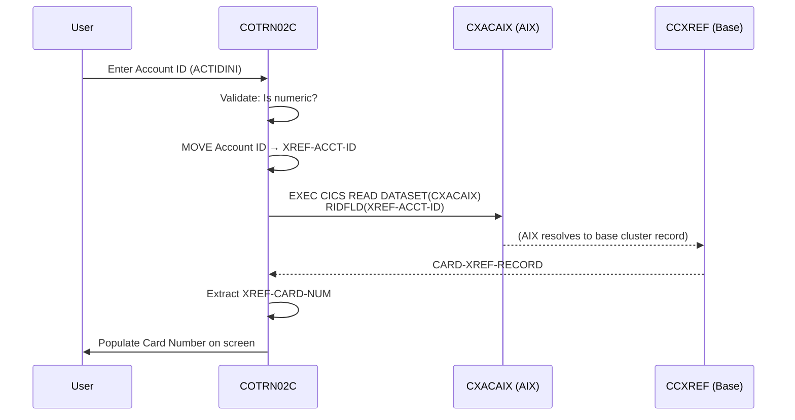
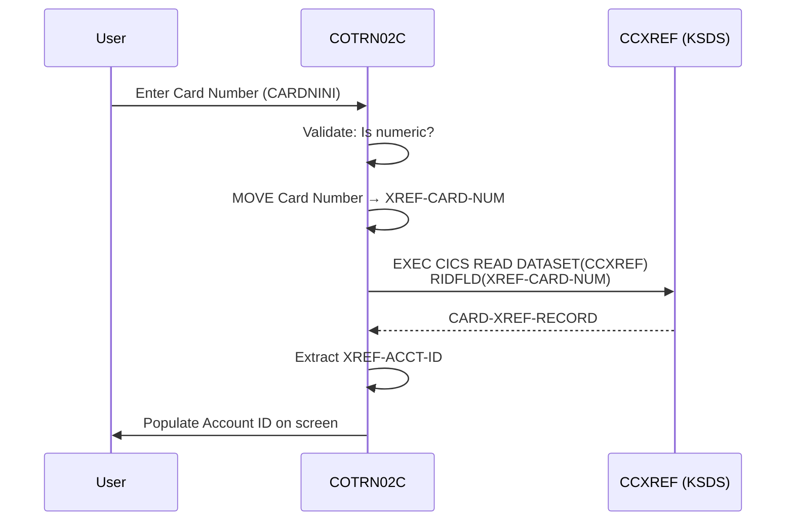

# VSAM File Relationships and Cross-Reference (XREF) Patterns

> **Module:** Transaction Processing (CardDemo Modernization)
> **Phase:** 2 - Analysis
> **Source Programs:** COTRN00C.cbl, COTRN01C.cbl, COTRN02C.cbl
> **Source Copybooks:** CVTRA05Y.cpy, CVACT01Y.cpy, CVACT02Y.cpy, CVACT03Y.cpy, CVCUS01Y.cpy

---

## 1. VSAM File Inventory

The Transaction Processing Module accesses the following VSAM files:

| VSAM File (DD Name) | Type | Record Copybook | Record Length | Primary Key | Programs |
|---|---|---|---|---|---|
| `TRANSACT` | KSDS | CVTRA05Y.cpy (`TRAN-RECORD`) | 350 bytes | `TRAN-ID` X(16) | COTRN00C, COTRN01C, COTRN02C |
| `CCXREF` | KSDS | CVACT03Y.cpy (`CARD-XREF-RECORD`) | 50 bytes | `XREF-CARD-NUM` X(16) | COTRN02C |
| `CXACAIX` | AIX (on CCXREF) | CVACT03Y.cpy (`CARD-XREF-RECORD`) | 50 bytes | `XREF-ACCT-ID` 9(11) | COTRN02C |
| `ACCTDAT` | KSDS | CVACT01Y.cpy (`ACCOUNT-RECORD`) | 300 bytes | `ACCT-ID` 9(11) | Referenced by COTRN02C (file name defined, not directly read in CT02 flow) |

### VSAM File Types

- **KSDS** (Key-Sequenced Data Set): Records stored and accessed by a primary key. Supports sequential (browse) and random (direct) access.
- **AIX** (Alternate Index): A secondary index over an existing KSDS, allowing access by a different key field. `CXACAIX` is an alternate index on the `CCXREF` base cluster, keyed by `XREF-ACCT-ID`.

---

## 2. File Relationship Diagram



---

## 3. Access Patterns by Program

### 3.1 COTRN00C (List Transactions - CT00)

| Operation | VSAM Command | File | Key Used | Purpose |
|---|---|---|---|---|
| Start Browse | `EXEC CICS STARTBR` | TRANSACT | `TRAN-ID` | Position cursor at specified transaction ID (or beginning) |
| Read Next | `EXEC CICS READNEXT` | TRANSACT | `TRAN-ID` | Iterate forward through records (page forward) |
| Read Previous | `EXEC CICS READPREV` | TRANSACT | `TRAN-ID` | Iterate backward through records (page backward) |
| End Browse | `EXEC CICS ENDBR` | TRANSACT | N/A | Release browse cursor |

**Access Pattern**: Sequential browse with bidirectional pagination. 10 records per page.

### 3.2 COTRN01C (View Transaction - CT01)

| Operation | VSAM Command | File | Key Used | Purpose |
|---|---|---|---|---|
| Direct Read | `EXEC CICS READ` | TRANSACT | `TRAN-ID` | Fetch a single transaction record by ID |

**Access Pattern**: Direct random-access read by primary key.

### 3.3 COTRN02C (Add Transaction - CT02)

| Operation | VSAM Command | File | Key Used | Purpose |
|---|---|---|---|---|
| Read XREF by Account | `EXEC CICS READ` | CXACAIX | `XREF-ACCT-ID` | Resolve Account ID to Card Number |
| Read XREF by Card | `EXEC CICS READ` | CCXREF | `XREF-CARD-NUM` | Resolve Card Number to Account ID |
| Start Browse (for ID gen) | `EXEC CICS STARTBR` | TRANSACT | `TRAN-ID` (HIGH-VALUES) | Position at end of file for ID generation |
| Read Previous (for ID gen) | `EXEC CICS READPREV` | TRANSACT | `TRAN-ID` | Get highest existing transaction ID |
| End Browse | `EXEC CICS ENDBR` | TRANSACT | N/A | Release browse cursor |
| Write Record | `EXEC CICS WRITE` | TRANSACT | `TRAN-ID` | Insert new transaction record |

**Access Pattern**: Cross-reference lookup + sequential browse (for ID generation) + direct write.

---

## 4. Cross-Reference (XREF) Resolution Patterns

The XREF pattern is central to the Add Transaction flow. It connects three entities: Customer, Account, and Card.

### 4.1 XREF Record Structure (CVACT03Y.cpy)

```
CARD-XREF-RECORD (50 bytes)
├── XREF-CARD-NUM    X(16)   ← Primary Key of CCXREF
├── XREF-CUST-ID     9(09)   ← Foreign Key to Customer
├── XREF-ACCT-ID     9(11)   ← Foreign Key to Account (also AIX key for CXACAIX)
└── FILLER            X(14)   ← Padding
```

### 4.2 Resolution Path A: Account ID to Card Number



### 4.3 Resolution Path B: Card Number to Account ID



---

## 5. SQL JOIN Strategy (Modernized)

### 5.1 VSAM-to-PostgreSQL Table Mapping

| VSAM File | PostgreSQL Table | Primary Key | Indexes |
|---|---|---|---|
| `TRANSACT` | `transaction` | `transaction_id VARCHAR(16)` | PK index; index on `card_number` for FK lookup |
| `CCXREF` | `card_cross_reference` | `card_number VARCHAR(16)` | PK index; index on `account_id` (replaces CXACAIX AIX); index on `customer_id` |
| `ACCTDAT` | `account` | `account_id NUMERIC(11,0)` | PK index |
| `CARDDAT` | `card` | `card_number VARCHAR(16)` | PK index; index on `account_id` for FK lookup |
| `CUSTDAT` | `customer` | `customer_id NUMERIC(9,0)` | PK index |

### 5.2 Foreign Key Relationships

```sql
-- Transaction references Card via card_number
ALTER TABLE transaction
    ADD CONSTRAINT fk_transaction_card
    FOREIGN KEY (card_number) REFERENCES card(card_number);

-- Card references Account via account_id
ALTER TABLE card
    ADD CONSTRAINT fk_card_account
    FOREIGN KEY (account_id) REFERENCES account(account_id);

-- Cross-reference bridges Card, Account, and Customer
ALTER TABLE card_cross_reference
    ADD CONSTRAINT fk_xref_card
    FOREIGN KEY (card_number) REFERENCES card(card_number);

ALTER TABLE card_cross_reference
    ADD CONSTRAINT fk_xref_account
    FOREIGN KEY (account_id) REFERENCES account(account_id);

ALTER TABLE card_cross_reference
    ADD CONSTRAINT fk_xref_customer
    FOREIGN KEY (customer_id) REFERENCES customer(customer_id);
```

### 5.3 Replacing VSAM Access Patterns with SQL

#### List Transactions (COTRN00C → `GET /api/transactions`)

**Legacy**: STARTBR + READNEXT/READPREV loop (10 records at a time)

**SQL**:
```sql
-- Offset-based pagination (Spring Data default)
SELECT t.* FROM transaction t
ORDER BY t.transaction_id ASC
LIMIT 10 OFFSET :offset;

-- Keyset-based pagination (better performance for large datasets)
SELECT t.* FROM transaction t
WHERE t.transaction_id > :lastSeenId
ORDER BY t.transaction_id ASC
LIMIT 10;

-- With filter by starting Transaction ID
SELECT t.* FROM transaction t
WHERE t.transaction_id >= :filterTransactionId
ORDER BY t.transaction_id ASC
LIMIT 10;
```

#### View Transaction (COTRN01C → `GET /api/transactions/{id}`)

**Legacy**: `EXEC CICS READ DATASET(TRANSACT) RIDFLD(TRAN-ID)`

**SQL**:
```sql
SELECT t.* FROM transaction t
WHERE t.transaction_id = :transactionId;
```

#### Resolve Account ID to Card Number (CXACAIX → `GET /api/cross-references/resolve?accountId=...`)

**Legacy**: `EXEC CICS READ DATASET(CXACAIX) RIDFLD(XREF-ACCT-ID)` (Alternate Index lookup)

**SQL** (replaces AIX):
```sql
-- The AIX is replaced by a standard SQL index on account_id
SELECT xref.card_number FROM card_cross_reference xref
WHERE xref.account_id = :accountId;

-- Index needed:
CREATE INDEX idx_xref_account_id ON card_cross_reference(account_id);
```

#### Resolve Card Number to Account ID (CCXREF → `GET /api/cross-references/resolve?cardNumber=...`)

**Legacy**: `EXEC CICS READ DATASET(CCXREF) RIDFLD(XREF-CARD-NUM)` (Primary Key lookup)

**SQL**:
```sql
SELECT xref.account_id FROM card_cross_reference xref
WHERE xref.card_number = :cardNumber;
```

#### Generate Next Transaction ID (COTRN02C - ID Generation)

**Legacy**: STARTBR with HIGH-VALUES → READPREV → get highest ID → add 1

**SQL** (Option A - MAX query with locking):
```sql
-- Use row-level locking to prevent race conditions
SELECT MAX(t.transaction_id) FROM transaction t FOR UPDATE;
-- Then: new_id = max_id + 1
```

**SQL** (Option B - PostgreSQL Sequence, recommended):
```sql
-- Create a sequence for transaction IDs
CREATE SEQUENCE transaction_id_seq START WITH 1 INCREMENT BY 1;

-- Use nextval for new IDs
SELECT LPAD(nextval('transaction_id_seq')::TEXT, 16, '0');
```

#### Full Transaction with Resolved References (JOIN query)

**Legacy**: Multiple separate CICS READ operations across different files

**SQL** (single query replacing multiple VSAM reads):
```sql
-- Get transaction with full account and customer context
SELECT
    t.transaction_id, t.type_code, t.category_code,
    t.source, t.description, t.amount,
    t.merchant_id, t.merchant_name, t.merchant_city, t.merchant_zip,
    t.card_number, t.origination_ts, t.processing_ts,
    c.embossed_name AS card_holder_name,
    a.account_id, a.current_balance,
    cu.first_name, cu.last_name
FROM transaction t
JOIN card c ON t.card_number = c.card_number
JOIN card_cross_reference xref ON c.card_number = xref.card_number
JOIN account a ON xref.account_id = a.account_id
JOIN customer cu ON xref.customer_id = cu.customer_id
WHERE t.transaction_id = :transactionId;
```

---

## 6. Alternate Index (AIX) to SQL Index Mapping

The VSAM Alternate Index (AIX) pattern is a key concept that maps directly to PostgreSQL secondary indexes:

| VSAM Concept | PostgreSQL Equivalent | Example |
|---|---|---|
| **KSDS Primary Key** | `PRIMARY KEY` constraint + B-tree index | `card_number` on `card_cross_reference` |
| **AIX (Alternate Index)** | Secondary `CREATE INDEX` | `CREATE INDEX idx_xref_account_id ON card_cross_reference(account_id)` |
| **AIX with UNIQUEKEY** | `CREATE UNIQUE INDEX` | If one-to-one relationship |
| **AIX with NONUNIQUEKEY** | `CREATE INDEX` (standard, allows duplicates) | If one-to-many relationship |
| **KSDS STARTBR + READNEXT** | `SELECT ... ORDER BY ... LIMIT ... OFFSET ...` | Cursor-based pagination |
| **KSDS READPREV** | `SELECT ... ORDER BY ... DESC LIMIT 1` | Reverse scan for max value |

### Critical Index: CXACAIX Replacement

The `CXACAIX` alternate index is the most important VSAM concept to replicate correctly:

```sql
-- This single PostgreSQL index replaces the entire CXACAIX AIX definition
CREATE INDEX idx_card_xref_account_id
    ON card_cross_reference(account_id);

-- The original CXACAIX was defined as:
-- Base Cluster: CCXREF (primary key = XREF-CARD-NUM)
-- AIX Key: XREF-ACCT-ID
-- Access: EXEC CICS READ DATASET(CXACAIX) RIDFLD(XREF-ACCT-ID)
--
-- In PostgreSQL, this is simply a query on the indexed column:
-- SELECT * FROM card_cross_reference WHERE account_id = ?
```

---

## 7. Data Integrity Considerations

### 7.1 VSAM vs. PostgreSQL Integrity

| Concern | VSAM (Legacy) | PostgreSQL (Modern) |
|---|---|---|
| **Referential Integrity** | Not enforced by VSAM; application logic only | `FOREIGN KEY` constraints enforce at database level |
| **Duplicate Key Prevention** | VSAM KSDS rejects duplicate keys (DUPREC/DUPKEY response) | `PRIMARY KEY` / `UNIQUE` constraints; `ON CONFLICT` handling |
| **Transaction Atomicity** | CICS Unit of Work (single file operation) | PostgreSQL transactions (`BEGIN` / `COMMIT` / `ROLLBACK`) |
| **Concurrent Access** | CICS enqueue/dequeue; single-threaded transaction | PostgreSQL MVCC + row-level locking |
| **Cascade Operations** | Not supported in VSAM | `ON DELETE CASCADE`, `ON UPDATE CASCADE` |

### 7.2 Migration Risks

| Risk | Description | Mitigation |
|---|---|---|
| **Orphaned References** | VSAM has no FK enforcement; migrated data may have orphaned card numbers | Run data validation queries post-migration; use `ON DELETE SET NULL` or reject invalid records |
| **ID Format Change** | TRAN-ID is `X(16)` (alphanumeric in COBOL, but used as numeric) | Maintain `VARCHAR(16)` in PostgreSQL for backward compatibility; validate format at application level |
| **Concurrent ID Generation** | Legacy used single-threaded CICS; PostgreSQL is multi-user | Use PostgreSQL SEQUENCE for thread-safe ID generation instead of MAX+1 pattern |
