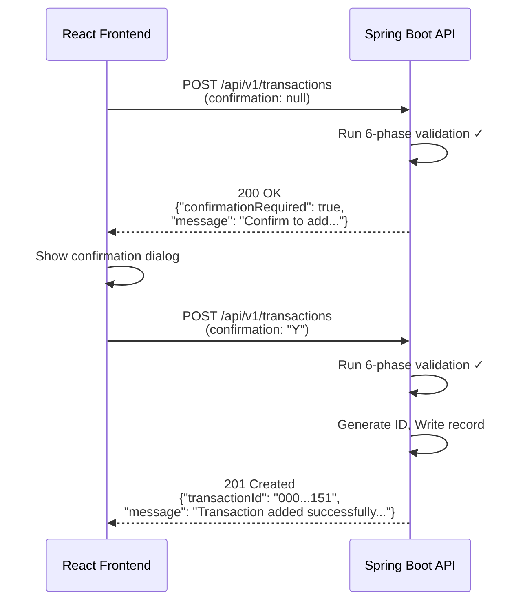

# API Design: Transaction Processing Module

> **Module:** Transaction Processing (CardDemo Modernization)
> **Phase:** 3 - Design
> **Target Stack:** Java 21, Spring Boot 3, Spring Data JPA
> **Standard:** OpenAPI 3.0 / Swagger
> **BRE Reference:** `transactions-processing-module-doc-devin.md`

---

## 1. API Overview

This document defines the RESTful API contract that replaces the legacy CICS 3270 screen interactions for the three transaction processing functions:

| Legacy Function | CICS TRANID | REST Endpoint | HTTP Method |
|---|---|---|---|
| List Transactions | CT00 (COTRN00C) | `/api/v1/transactions` | `GET` |
| View Transaction | CT01 (COTRN01C) | `/api/v1/transactions/{transactionId}` | `GET` |
| Add Transaction | CT02 (COTRN02C) | `/api/v1/transactions` | `POST` |
| Cross-Reference Resolution | N/A (internal) | `/api/v1/cross-references/resolve` | `GET` |
| Latest Transaction (Copy Last) | N/A (PF5 in CT02) | `/api/v1/transactions/latest` | `GET` |

**Base URL:** `http://{host}:{port}/api/v1`

---

## 2. OpenAPI 3.0 Specification

```yaml
openapi: 3.0.3
info:
  title: CardDemo Transaction Processing API
  description: |
    RESTful API for the modernized CardDemo Transaction Processing Module.
    Replaces legacy CICS/COBOL programs COTRN00C (List), COTRN01C (View),
    and COTRN02C (Add) with cloud-native Spring Boot endpoints.
    
    All 30 business rules from the legacy BRE are addressable through this API.
  version: 1.0.0
  contact:
    name: CardDemo Modernization Team
  license:
    name: Internal

servers:
  - url: http://localhost:8080/api/v1
    description: Local development
  - url: https://{environment}.carddemo.example.com/api/v1
    description: Deployed environment
    variables:
      environment:
        default: dev
        enum: [dev, staging, prod]

tags:
  - name: Transactions
    description: Transaction CRUD operations (CT00, CT01, CT02)
  - name: Cross-References
    description: Account ↔ Card Number resolution (CXACAIX/CCXREF replacement)

paths:
  # ============================================================
  # CT00 - List Transactions (replaces COTRN00C)
  # ============================================================
  /transactions:
    get:
      tags: [Transactions]
      operationId: listTransactions
      summary: List transactions with pagination (CT00)
      description: |
        Replaces the COTRN00C List Transactions screen (CT00).
        Returns a paginated list of transactions, 10 per page (matching legacy page size).
        
        **Business Rules:** BR-LT-01, BR-LT-02, BR-LT-04, BR-LT-05, BR-LT-06, BR-LT-07
        
        **Legacy PF Key Mapping:**
        - PF7 (Page Backward) → `page` parameter decremented
        - PF8 (Page Forward) → `page` parameter incremented
        - ENTER with filter → `startTransactionId` parameter
      parameters:
        - name: page
          in: query
          description: |
            Zero-based page number. Replaces CDEMO-CT00-PAGE-NUM from COMMAREA.
            Default is 0 (first page).
          required: false
          schema:
            type: integer
            minimum: 0
            default: 0
        - name: size
          in: query
          description: |
            Page size. Fixed at 10 to match legacy 3270 screen row count (BR-LT-01).
          required: false
          schema:
            type: integer
            default: 10
            minimum: 1
            maximum: 100
        - name: startTransactionId
          in: query
          description: |
            Filter transactions starting from this Transaction ID (inclusive).
            Replaces the filter field on the CT00 screen.
            Must be numeric (BR-LT-02). Returns 400 if non-numeric.
          required: false
          schema:
            type: string
            pattern: '^[0-9]+$'
      responses:
        '200':
          description: Paginated list of transactions
          content:
            application/json:
              schema:
                $ref: '#/components/schemas/TransactionListResponse'
              examples:
                firstPage:
                  summary: First page of transactions
                  value:
                    content:
                      - transactionId: "0000000000000001"
                        typeCode: "01"
                        categoryCode: 5001
                        source: "ONLINE"
                        description: "Purchase at Electronics Store"
                        amount: -125.50
                        cardNumber: "4111111111111111"
                        originationTimestamp: "2024-01-15T10:30:00"
                        processingTimestamp: "2024-01-15T10:30:05"
                    page: 0
                    size: 10
                    totalElements: 150
                    totalPages: 15
                    first: true
                    last: false
                    hasNext: true
                    hasPrevious: false
        '400':
          description: |
            Invalid request. Possible causes:
            - startTransactionId is not numeric (BR-LT-02): "Tran ID must be Numeric ..."
          content:
            application/json:
              schema:
                $ref: '#/components/schemas/ErrorResponse'
              examples:
                nonNumericFilter:
                  summary: Non-numeric Transaction ID filter
                  value:
                    timestamp: "2024-01-15T10:30:00Z"
                    status: 400
                    error: "Bad Request"
                    message: "Tran ID must be Numeric ..."
                    field: "startTransactionId"
                    businessRule: "BR-LT-02"

    # ============================================================
    # CT02 - Add Transaction (replaces COTRN02C)
    # ============================================================
    post:
      tags: [Transactions]
      operationId: addTransaction
      summary: Add a new transaction (CT02)
      description: |
        Replaces the COTRN02C Add Transaction screen (CT02).
        Executes the full 6-phase validation chain before writing the record.
        
        **Validation Phases (sequential, first error halts chain):**
        1. Key Field Validation (BR-AT-01 through BR-AT-05)
        2. Mandatory Field Checks (BR-AT-06) — 11 fields
        3. Numeric Type Checks (BR-AT-07) — Type Code, Category Code
        4. Amount Format Validation (BR-AT-08)
        5. Date Validation (BR-AT-09, BR-AT-10) — format + calendar validity
        6. Merchant ID Numeric Check (BR-AT-11)
        
        **Confirmation Flow (BR-AT-12):**
        The `confirmation` field must be set to `"Y"` or `"y"` for the record to be written.
        - `"Y"` / `"y"` → proceed to write
        - `"N"` / `"n"` / `""` / `null` → return prompt message (HTTP 200 with confirmation required)
        - Other value → return validation error
        
        **ID Generation (BR-AT-13):**
        Transaction ID is auto-generated using a PostgreSQL sequence (thread-safe).
        The generated ID is returned in the response body.
        
        **Business Rules:** BR-AT-01 through BR-AT-14, BR-CF-01, BR-CF-02
      requestBody:
        required: true
        content:
          application/json:
            schema:
              $ref: '#/components/schemas/AddTransactionRequest'
            examples:
              fullRequest:
                summary: Complete transaction with confirmation
                value:
                  accountId: "00000000123"
                  cardNumber: null
                  typeCode: "01"
                  categoryCode: "5001"
                  source: "ONLINE"
                  description: "Purchase at Electronics Store"
                  amount: "-125.50"
                  originationDate: "2024-01-15"
                  processingDate: "2024-01-15"
                  merchantId: "123456789"
                  merchantName: "Best Electronics"
                  merchantCity: "New York"
                  merchantZip: "10001"
                  confirmation: "Y"
              withoutConfirmation:
                summary: Request without confirmation (will prompt)
                value:
                  accountId: "00000000123"
                  typeCode: "01"
                  categoryCode: "5001"
                  source: "ONLINE"
                  description: "Purchase at Electronics Store"
                  amount: "-125.50"
                  originationDate: "2024-01-15"
                  processingDate: "2024-01-15"
                  merchantId: "123456789"
                  merchantName: "Best Electronics"
                  merchantCity: "New York"
                  merchantZip: "10001"
                  confirmation: null
      responses:
        '201':
          description: |
            Transaction created successfully (BR-AT-13).
            Response includes the auto-generated Transaction ID.
          content:
            application/json:
              schema:
                $ref: '#/components/schemas/AddTransactionResponse'
              examples:
                success:
                  summary: Successfully added transaction
                  value:
                    transactionId: "0000000000000151"
                    message: "Transaction added successfully. Your Tran ID is 0000000000000151."
                    transaction:
                      transactionId: "0000000000000151"
                      accountId: "00000000123"
                      cardNumber: "4111111111111111"
                      typeCode: "01"
                      categoryCode: 5001
                      source: "ONLINE"
                      description: "Purchase at Electronics Store"
                      amount: -125.50
                      merchantId: 123456789
                      merchantName: "Best Electronics"
                      merchantCity: "New York"
                      merchantZip: "10001"
                      originationTimestamp: "2024-01-15T00:00:00"
                      processingTimestamp: "2024-01-15T00:00:00"
        '200':
          description: |
            Confirmation required (BR-AT-12).
            All validation passed but confirmation was not "Y".
          content:
            application/json:
              schema:
                $ref: '#/components/schemas/ConfirmationRequiredResponse'
              examples:
                confirmPrompt:
                  summary: Confirmation prompt (N/blank)
                  value:
                    confirmationRequired: true
                    message: "Confirm to add this transaction..."
                    resolvedAccountId: "00000000123"
                    resolvedCardNumber: "4111111111111111"
                invalidConfirm:
                  summary: Invalid confirmation value
                  value:
                    confirmationRequired: true
                    message: "Invalid value. Valid values are (Y/N)..."
                    resolvedAccountId: "00000000123"
                    resolvedCardNumber: "4111111111111111"
        '400':
          description: |
            Validation error from the 6-phase validation chain.
            The `phase` field indicates which validation phase failed.
            The `field` field indicates which input field caused the error.
          content:
            application/json:
              schema:
                $ref: '#/components/schemas/ValidationErrorResponse'
              examples:
                noKeyField:
                  summary: "Phase 1: No key field provided (BR-AT-01)"
                  value:
                    timestamp: "2024-01-15T10:30:00Z"
                    status: 400
                    error: "Validation Failed"
                    message: "Account or Card Number must be entered..."
                    field: "accountId"
                    phase: 1
                    businessRule: "BR-AT-01"
                nonNumericAccount:
                  summary: "Phase 1: Non-numeric Account ID (BR-AT-02)"
                  value:
                    timestamp: "2024-01-15T10:30:00Z"
                    status: 400
                    error: "Validation Failed"
                    message: "Account ID must be Numeric..."
                    field: "accountId"
                    phase: 1
                    businessRule: "BR-AT-02"
                emptyTypeCode:
                  summary: "Phase 2: Empty mandatory field (BR-AT-06)"
                  value:
                    timestamp: "2024-01-15T10:30:00Z"
                    status: 400
                    error: "Validation Failed"
                    message: "Type CD can NOT be empty..."
                    field: "typeCode"
                    phase: 2
                    businessRule: "BR-AT-06"
                badAmountFormat:
                  summary: "Phase 4: Invalid amount format (BR-AT-08)"
                  value:
                    timestamp: "2024-01-15T10:30:00Z"
                    status: 400
                    error: "Validation Failed"
                    message: "Amount should be in format -99999999.99"
                    field: "amount"
                    phase: 4
                    businessRule: "BR-AT-08"
                invalidDate:
                  summary: "Phase 5: Invalid calendar date (BR-AT-10)"
                  value:
                    timestamp: "2024-01-15T10:30:00Z"
                    status: 400
                    error: "Validation Failed"
                    message: "Orig Date - Not a valid date..."
                    field: "originationDate"
                    phase: 5
                    businessRule: "BR-AT-10"
        '404':
          description: |
            Cross-reference not found during Phase 1 validation (BR-AT-04).
          content:
            application/json:
              schema:
                $ref: '#/components/schemas/ValidationErrorResponse'
              examples:
                accountNotFound:
                  summary: Account ID not in cross-reference
                  value:
                    timestamp: "2024-01-15T10:30:00Z"
                    status: 404
                    error: "Not Found"
                    message: "Account ID NOT found..."
                    field: "accountId"
                    phase: 1
                    businessRule: "BR-AT-04"
                cardNotFound:
                  summary: Card Number not in cross-reference
                  value:
                    timestamp: "2024-01-15T10:30:00Z"
                    status: 404
                    error: "Not Found"
                    message: "Card Number NOT found..."
                    field: "cardNumber"
                    phase: 1
                    businessRule: "BR-AT-04"
        '409':
          description: |
            Duplicate Transaction ID (BR-AT-14). Extremely unlikely with sequences
            but handled for completeness.
          content:
            application/json:
              schema:
                $ref: '#/components/schemas/ErrorResponse'
              examples:
                duplicateId:
                  summary: Generated ID already exists
                  value:
                    timestamp: "2024-01-15T10:30:00Z"
                    status: 409
                    error: "Conflict"
                    message: "Tran ID already exist..."
                    field: "transactionId"
                    businessRule: "BR-AT-14"
        '500':
          description: |
            Unexpected server error during transaction write or cross-reference lookup.
          content:
            application/json:
              schema:
                $ref: '#/components/schemas/ErrorResponse'
              examples:
                writeError:
                  summary: Unable to write transaction
                  value:
                    timestamp: "2024-01-15T10:30:00Z"
                    status: 500
                    error: "Internal Server Error"
                    message: "Unable to Add Transaction..."
                    field: null
                    businessRule: null
                xrefError:
                  summary: Cross-reference lookup error
                  value:
                    timestamp: "2024-01-15T10:30:00Z"
                    status: 500
                    error: "Internal Server Error"
                    message: "Unable to lookup Acct in XREF AIX file..."
                    field: "accountId"
                    businessRule: null

  # ============================================================
  # CT01 - View Transaction (replaces COTRN01C)
  # ============================================================
  /transactions/{transactionId}:
    get:
      tags: [Transactions]
      operationId: viewTransaction
      summary: View a single transaction (CT01)
      description: |
        Replaces the COTRN01C View Transaction screen (CT01).
        Returns all 13 fields of the transaction record in read-only mode.
        
        When navigating from the List screen (CT00), the selected Transaction ID
        is passed as a path variable (replacing COMMAREA's CDEMO-CT00-TRN-SELECTED).
        
        **Business Rules:** BR-VT-01, BR-VT-02, BR-VT-03, BR-VT-04
        
        **Legacy Behavior:**
        - BR-VT-01: Empty ID → error (handled by path variable requirement)
        - BR-VT-02: Record read (SELECT, no FOR UPDATE lock — improves on legacy)
        - BR-VT-03: All 13 detail fields displayed
        - BR-VT-04: Read-only enforcement (GET method — no modification possible)
      parameters:
        - name: transactionId
          in: path
          required: true
          description: |
            The 16-character Transaction ID to look up.
            Replaces the TRNIDINI field on the CT01 screen.
            Must not be empty (BR-VT-01).
          schema:
            type: string
            minLength: 1
            maxLength: 16
      responses:
        '200':
          description: |
            Transaction found. Returns all 13 detail fields (BR-VT-03).
            Read-only — no modification endpoint exists (BR-VT-04).
          content:
            application/json:
              schema:
                $ref: '#/components/schemas/TransactionDetailResponse'
              examples:
                found:
                  summary: Transaction found with all 13 fields
                  value:
                    transactionId: "0000000000000001"
                    accountId: "00000000123"
                    cardNumber: "4111111111111111"
                    typeCode: "01"
                    categoryCode: 5001
                    source: "ONLINE"
                    description: "Purchase at Electronics Store"
                    amount: -125.50
                    merchantId: 123456789
                    merchantName: "Best Electronics"
                    merchantCity: "New York"
                    merchantZip: "10001"
                    originationTimestamp: "2024-01-15T10:30:00"
                    processingTimestamp: "2024-01-15T10:30:05"
        '404':
          description: |
            Transaction ID not found (BR-VT-01 — "Transaction ID NOT found...").
          content:
            application/json:
              schema:
                $ref: '#/components/schemas/ErrorResponse'
              examples:
                notFound:
                  summary: Transaction not found
                  value:
                    timestamp: "2024-01-15T10:30:00Z"
                    status: 404
                    error: "Not Found"
                    message: "Transaction ID NOT found..."
                    field: "transactionId"
                    businessRule: "BR-VT-01"
        '500':
          description: Unexpected error during transaction lookup.
          content:
            application/json:
              schema:
                $ref: '#/components/schemas/ErrorResponse'
              examples:
                lookupError:
                  summary: Unable to lookup transaction
                  value:
                    timestamp: "2024-01-15T10:30:00Z"
                    status: 500
                    error: "Internal Server Error"
                    message: "Unable to lookup Transaction..."
                    field: null
                    businessRule: null

  # ============================================================
  # Latest Transaction (PF5 Copy Last - part of CT02)
  # ============================================================
  /transactions/latest:
    get:
      tags: [Transactions]
      operationId: getLatestTransaction
      summary: Get the most recent transaction (PF5 Copy Last)
      description: |
        Returns the transaction with the highest Transaction ID.
        Used by the Add Transaction screen's "Copy Last" feature (PF5).
        
        The response contains only the 11 data fields (excludes Account ID
        and Card Number, which are NOT overwritten during copy per US-AT-06).
        
        **Legacy Equivalent:** STARTBR TRANSACT with HIGH-VALUES → READPREV
      responses:
        '200':
          description: Latest transaction data for copy operation.
          content:
            application/json:
              schema:
                $ref: '#/components/schemas/LatestTransactionResponse'
              examples:
                latest:
                  summary: Most recent transaction data fields
                  value:
                    transactionId: "0000000000000150"
                    typeCode: "01"
                    categoryCode: 5001
                    source: "ONLINE"
                    description: "Purchase at Electronics Store"
                    amount: -125.50
                    originationDate: "2024-01-15"
                    processingDate: "2024-01-15"
                    merchantId: 123456789
                    merchantName: "Best Electronics"
                    merchantCity: "New York"
                    merchantZip: "10001"
        '404':
          description: No transactions exist in the database.
          content:
            application/json:
              schema:
                $ref: '#/components/schemas/ErrorResponse'

  # ============================================================
  # Cross-Reference Resolution (replaces CXACAIX/CCXREF lookups)
  # ============================================================
  /cross-references/resolve:
    get:
      tags: [Cross-References]
      operationId: resolveCrossReference
      summary: Resolve Account ID ↔ Card Number
      description: |
        Bidirectional resolution of Account ID to Card Number (and vice versa).
        Replaces the legacy CXACAIX (Alternate Index) and CCXREF (KSDS) VSAM file reads.
        
        **Path A:** Provide `accountId` → returns associated Card Number
        (replaces `EXEC CICS READ DATASET(CXACAIX) RIDFLD(XREF-ACCT-ID)`)
        
        **Path B:** Provide `cardNumber` → returns associated Account ID
        (replaces `EXEC CICS READ DATASET(CCXREF) RIDFLD(XREF-CARD-NUM)`)
        
        Exactly one of `accountId` or `cardNumber` must be provided.
        
        **Business Rules:** BR-AT-04, BR-AT-05
      parameters:
        - name: accountId
          in: query
          description: Account ID to resolve to a Card Number (Path A).
          required: false
          schema:
            type: string
            pattern: '^[0-9]+$'
        - name: cardNumber
          in: query
          description: Card Number to resolve to an Account ID (Path B).
          required: false
          schema:
            type: string
            pattern: '^[0-9]+$'
      responses:
        '200':
          description: Cross-reference resolved successfully.
          content:
            application/json:
              schema:
                $ref: '#/components/schemas/CrossReferenceResponse'
              examples:
                accountToCard:
                  summary: Account ID resolved to Card Number
                  value:
                    accountId: "00000000123"
                    cardNumber: "4111111111111111"
                    customerId: 123456789
                cardToAccount:
                  summary: Card Number resolved to Account ID
                  value:
                    accountId: "00000000123"
                    cardNumber: "4111111111111111"
                    customerId: 123456789
        '400':
          description: |
            Invalid request: neither accountId nor cardNumber provided,
            or both provided, or value is not numeric.
          content:
            application/json:
              schema:
                $ref: '#/components/schemas/ErrorResponse'
        '404':
          description: |
            Account ID or Card Number not found in cross-reference.
            - "Account ID NOT found..." (BR-AT-04)
            - "Card Number NOT found..." (BR-AT-04)
          content:
            application/json:
              schema:
                $ref: '#/components/schemas/ErrorResponse'
              examples:
                accountNotFound:
                  summary: Account ID not in XREF
                  value:
                    timestamp: "2024-01-15T10:30:00Z"
                    status: 404
                    error: "Not Found"
                    message: "Account ID NOT found..."
                    field: "accountId"
                    businessRule: "BR-AT-04"
                cardNotFound:
                  summary: Card Number not in XREF
                  value:
                    timestamp: "2024-01-15T10:30:00Z"
                    status: 404
                    error: "Not Found"
                    message: "Card Number NOT found..."
                    field: "cardNumber"
                    businessRule: "BR-AT-04"
        '500':
          description: |
            Unexpected error during cross-reference lookup.
            - "Unable to lookup Acct in XREF AIX file..." (CXACAIX error)
            - "Unable to lookup Card # in XREF file..." (CCXREF error)
          content:
            application/json:
              schema:
                $ref: '#/components/schemas/ErrorResponse'

# ============================================================
# Components
# ============================================================
components:
  schemas:
    # ----------------------------------------------------------
    # Transaction Summary (List view - CT00)
    # ----------------------------------------------------------
    TransactionSummary:
      type: object
      description: |
        Summary view of a transaction for the list screen (CT00).
        Matches the columns displayed on the legacy 3270 list screen.
      properties:
        transactionId:
          type: string
          description: "Transaction ID — TRAN-ID X(16)"
          maxLength: 16
          example: "0000000000000001"
        typeCode:
          type: string
          description: "Type Code — TRAN-TYPE-CD X(02)"
          maxLength: 2
          example: "01"
        categoryCode:
          type: integer
          description: "Category Code — TRAN-CAT-CD 9(04)"
          example: 5001
        source:
          type: string
          description: "Transaction Source — TRAN-SOURCE X(10)"
          maxLength: 10
          example: "ONLINE"
        description:
          type: string
          description: "Transaction Description — TRAN-DESC X(100)"
          maxLength: 100
          example: "Purchase at Electronics Store"
        amount:
          type: number
          format: double
          description: "Transaction Amount — TRAN-AMT S9(09)V99. Serialized as JSON number; stored as BigDecimal internally."
          example: -125.50
        cardNumber:
          type: string
          description: "Card Number — TRAN-CARD-NUM X(16)"
          maxLength: 16
          example: "4111111111111111"
        originationTimestamp:
          type: string
          format: date-time
          description: "Origination Timestamp — TRAN-ORIG-TS X(26)"
          example: "2024-01-15T10:30:00"
        processingTimestamp:
          type: string
          format: date-time
          description: "Processing Timestamp — TRAN-PROC-TS X(26)"
          example: "2024-01-15T10:30:05"
      required:
        - transactionId

    # ----------------------------------------------------------
    # Transaction List Response (CT00 - Paginated)
    # ----------------------------------------------------------
    TransactionListResponse:
      type: object
      description: |
        Paginated transaction list response. Replaces the CT00 3270 screen
        with its 10-row display (BR-LT-01) and page navigation (BR-LT-05, BR-LT-06).
        
        The `first` and `last` flags drive boundary messages:
        - `first: true` + page backward → "You are already at the top of the page..." (BR-LT-05)
        - `last: true` + page forward → "You are already at the bottom of the page..." (BR-LT-06)
      properties:
        content:
          type: array
          items:
            $ref: '#/components/schemas/TransactionSummary'
          description: "List of transactions on the current page (max 10 per BR-LT-01)"
          maxItems: 100
        page:
          type: integer
          description: "Current page number (0-based). Replaces CDEMO-CT00-PAGE-NUM."
          example: 0
        size:
          type: integer
          description: "Page size (default 10, matching legacy screen row count)."
          example: 10
        totalElements:
          type: integer
          format: int64
          description: "Total number of transactions matching the filter."
          example: 150
        totalPages:
          type: integer
          description: "Total number of pages."
          example: 15
        first:
          type: boolean
          description: "True if this is the first page (BR-LT-05 boundary)."
          example: true
        last:
          type: boolean
          description: "True if this is the last page (BR-LT-06 boundary)."
          example: false
        hasNext:
          type: boolean
          description: "True if there is a next page. Replaces CDEMO-CT00-NEXT-PAGE-FLG."
          example: true
        hasPrevious:
          type: boolean
          description: "True if there is a previous page."
          example: false
      required:
        - content
        - page
        - size
        - totalElements
        - totalPages
        - first
        - last

    # ----------------------------------------------------------
    # Transaction Detail Response (CT01 - View)
    # ----------------------------------------------------------
    TransactionDetailResponse:
      type: object
      description: |
        Full transaction detail with all 13 fields (BR-VT-03).
        Replaces the CT01 3270 detail screen.
        Includes resolved Account ID from cross-reference for display.
      properties:
        transactionId:
          type: string
          description: "Transaction ID — TRAN-ID X(16)"
          maxLength: 16
        accountId:
          type: string
          description: "Resolved Account ID from cross-reference (XREF-ACCT-ID)"
          maxLength: 11
        cardNumber:
          type: string
          description: "Card Number — TRAN-CARD-NUM X(16)"
          maxLength: 16
        typeCode:
          type: string
          description: "Type Code — TRAN-TYPE-CD X(02)"
          maxLength: 2
        categoryCode:
          type: integer
          description: "Category Code — TRAN-CAT-CD 9(04)"
        source:
          type: string
          description: "Source — TRAN-SOURCE X(10)"
          maxLength: 10
        description:
          type: string
          description: "Description — TRAN-DESC X(100)"
          maxLength: 100
        amount:
          type: number
          format: double
          description: "Amount — TRAN-AMT S9(09)V99"
        merchantId:
          type: integer
          format: int64
          description: "Merchant ID — TRAN-MERCHANT-ID 9(09)"
        merchantName:
          type: string
          description: "Merchant Name — TRAN-MERCHANT-NAME X(50)"
          maxLength: 50
        merchantCity:
          type: string
          description: "Merchant City — TRAN-MERCHANT-CITY X(50)"
          maxLength: 50
        merchantZip:
          type: string
          description: "Merchant Zip — TRAN-MERCHANT-ZIP X(10)"
          maxLength: 10
        originationTimestamp:
          type: string
          format: date-time
          description: "Origination Timestamp — TRAN-ORIG-TS X(26)"
        processingTimestamp:
          type: string
          format: date-time
          description: "Processing Timestamp — TRAN-PROC-TS X(26)"
      required:
        - transactionId
        - cardNumber
        - typeCode
        - categoryCode
        - source
        - description
        - amount
        - merchantId
        - merchantName
        - merchantCity
        - merchantZip
        - originationTimestamp
        - processingTimestamp

    # ----------------------------------------------------------
    # Add Transaction Request (CT02 - Input)
    # ----------------------------------------------------------
    AddTransactionRequest:
      type: object
      description: |
        Request body for adding a new transaction.
        Maps to the 14 input fields on the CT02 3270 screen.
        All fields are submitted as strings to allow server-side validation
        with exact legacy error messages.
      properties:
        accountId:
          type: string
          description: |
            Account ID (ACTIDINI). Either this or cardNumber must be provided (BR-AT-01).
            Must be numeric if provided (BR-AT-02).
          maxLength: 11
          nullable: true
        cardNumber:
          type: string
          description: |
            Card Number (CARDNINI). Either this or accountId must be provided (BR-AT-01).
            Must be numeric if provided (BR-AT-03).
          maxLength: 16
          nullable: true
        typeCode:
          type: string
          description: "Type Code (TRNTYINI). Mandatory (BR-AT-06). Must be numeric (BR-AT-07)."
          maxLength: 2
        categoryCode:
          type: string
          description: "Category Code (TRNCAINI). Mandatory (BR-AT-06). Must be numeric (BR-AT-07)."
          maxLength: 4
        source:
          type: string
          description: "Transaction Source (TRNSRINI). Mandatory (BR-AT-06)."
          maxLength: 10
        description:
          type: string
          description: "Description (TABORINI). Mandatory (BR-AT-06)."
          maxLength: 100
        amount:
          type: string
          description: |
            Transaction Amount (TRNMEINI). Mandatory (BR-AT-06).
            Must match format +/-99999999.99 (BR-AT-08).
            Submitted as string for server-side format validation.
          maxLength: 13
        originationDate:
          type: string
          description: |
            Origination Date (TRNORINI). Mandatory (BR-AT-06).
            Must be in YYYY-MM-DD format (BR-AT-09) and a valid calendar date (BR-AT-10).
          maxLength: 10
        processingDate:
          type: string
          description: |
            Processing Date (TRNPRINI). Mandatory (BR-AT-06).
            Must be in YYYY-MM-DD format (BR-AT-09) and a valid calendar date (BR-AT-10).
          maxLength: 10
        merchantId:
          type: string
          description: |
            Merchant ID (TRNMEINI). Mandatory (BR-AT-06).
            Must be numeric (BR-AT-11).
          maxLength: 9
        merchantName:
          type: string
          description: "Merchant Name (TRMNMINI). Mandatory (BR-AT-06)."
          maxLength: 50
        merchantCity:
          type: string
          description: "Merchant City (TRMC1INI). Mandatory (BR-AT-06)."
          maxLength: 50
        merchantZip:
          type: string
          description: "Merchant Zip (TRMZ1INI). Mandatory (BR-AT-06)."
          maxLength: 10
        confirmation:
          type: string
          description: |
            Confirmation field (CONFIRMI). Required for write (BR-AT-12).
            - "Y" / "y" → write the transaction
            - "N" / "n" / "" / null → prompt "Confirm to add this transaction..."
            - Other → error "Invalid value. Valid values are (Y/N)..."
          maxLength: 1
          nullable: true
          enum: ["Y", "y", "N", "n", ""]

    # ----------------------------------------------------------
    # Add Transaction Response (CT02 - Success)
    # ----------------------------------------------------------
    AddTransactionResponse:
      type: object
      description: |
        Successful transaction creation response.
        Includes the auto-generated Transaction ID (BR-AT-13).
      properties:
        transactionId:
          type: string
          description: "Auto-generated Transaction ID"
          example: "0000000000000151"
        message:
          type: string
          description: "Success message matching legacy format"
          example: "Transaction added successfully. Your Tran ID is 0000000000000151."
        transaction:
          $ref: '#/components/schemas/TransactionDetailResponse'
      required:
        - transactionId
        - message
        - transaction

    # ----------------------------------------------------------
    # Confirmation Required Response (CT02 - Awaiting Y/N)
    # ----------------------------------------------------------
    ConfirmationRequiredResponse:
      type: object
      description: |
        Returned when all validation passes but confirmation is not "Y" (BR-AT-12).
        The client should display the message and re-submit with confirmation = "Y".
      properties:
        confirmationRequired:
          type: boolean
          description: "Always true for this response type"
          example: true
        message:
          type: string
          description: |
            Prompt or error message:
            - "Confirm to add this transaction..." (for N/blank)
            - "Invalid value. Valid values are (Y/N)..." (for invalid value)
        resolvedAccountId:
          type: string
          description: "The resolved Account ID (from cross-reference)"
        resolvedCardNumber:
          type: string
          description: "The resolved Card Number (from cross-reference)"
      required:
        - confirmationRequired
        - message

    # ----------------------------------------------------------
    # Latest Transaction Response (PF5 Copy Last)
    # ----------------------------------------------------------
    LatestTransactionResponse:
      type: object
      description: |
        Data fields from the most recent transaction, used for the
        "Copy Last Transaction" feature (PF5 in CT02, US-AT-06).
        Excludes Account ID and Card Number (per US-AT-06: key fields are NOT overwritten).
      properties:
        transactionId:
          type: string
          description: "Transaction ID of the source record"
        typeCode:
          type: string
        categoryCode:
          type: integer
        source:
          type: string
        description:
          type: string
        amount:
          type: number
          format: double
        originationDate:
          type: string
          format: date
          description: "Date portion of TRAN-ORIG-TS"
        processingDate:
          type: string
          format: date
          description: "Date portion of TRAN-PROC-TS"
        merchantId:
          type: integer
          format: int64
        merchantName:
          type: string
        merchantCity:
          type: string
        merchantZip:
          type: string

    # ----------------------------------------------------------
    # Cross-Reference Response
    # ----------------------------------------------------------
    CrossReferenceResponse:
      type: object
      description: |
        Result of the bidirectional cross-reference resolution (BR-AT-04, BR-AT-05).
        Contains all three fields from the CARD-XREF-RECORD (CVACT03Y.cpy).
      properties:
        cardNumber:
          type: string
          description: "XREF-CARD-NUM X(16)"
          maxLength: 16
        accountId:
          type: string
          description: "XREF-ACCT-ID 9(11)"
          maxLength: 11
        customerId:
          type: integer
          format: int64
          description: "XREF-CUST-ID 9(09)"
      required:
        - cardNumber
        - accountId
        - customerId

    # ----------------------------------------------------------
    # Error Response (General)
    # ----------------------------------------------------------
    ErrorResponse:
      type: object
      description: |
        Standard error response format. Used for all error conditions
        across the API. Matches the legacy error message catalog
        (BRE Section 8.2) for message text parity.
      properties:
        timestamp:
          type: string
          format: date-time
          description: "ISO-8601 timestamp of the error"
        status:
          type: integer
          description: "HTTP status code"
        error:
          type: string
          description: "HTTP status reason phrase"
        message:
          type: string
          description: |
            Error message matching the legacy error catalog.
            Must be character-for-character identical to legacy messages.
        field:
          type: string
          description: |
            Name of the input field that caused the error.
            Used by the React frontend for cursor/focus positioning
            (replacing the legacy MOVE -1 TO fieldL pattern).
          nullable: true
        businessRule:
          type: string
          description: "Business rule reference (e.g., BR-AT-01)"
          nullable: true
      required:
        - timestamp
        - status
        - error
        - message

    # ----------------------------------------------------------
    # Validation Error Response (6-Phase Chain)
    # ----------------------------------------------------------
    ValidationErrorResponse:
      type: object
      description: |
        Extended error response for the 6-phase validation chain in CT02.
        Includes the validation phase number for diagnostics and traceability.
      allOf:
        - $ref: '#/components/schemas/ErrorResponse'
        - type: object
          properties:
            phase:
              type: integer
              description: |
                Validation phase that failed (1-6).
                Phase 1: Key Field Validation
                Phase 2: Mandatory Field Checks
                Phase 3: Numeric Type Checks
                Phase 4: Amount Format Validation
                Phase 5: Date Validation
                Phase 6: Merchant ID Numeric Check
              minimum: 1
              maximum: 6
```

---

## 3. Request/Response DTO Summary

### 3.1 Request DTOs

| DTO | Endpoint | Fields | Notes |
|---|---|---|---|
| (Query params) | `GET /api/v1/transactions` | `page`, `size`, `startTransactionId` | Pagination + optional filter |
| (Path variable) | `GET /api/v1/transactions/{transactionId}` | `transactionId` | Single record lookup |
| `AddTransactionRequest` | `POST /api/v1/transactions` | 14 fields (13 data + confirmation) | All submitted as strings for validation |
| (Query params) | `GET /api/v1/cross-references/resolve` | `accountId` or `cardNumber` | Exactly one required |

### 3.2 Response DTOs

| DTO | Endpoint | Description |
|---|---|---|
| `TransactionListResponse` | `GET /transactions` | Paginated list with metadata |
| `TransactionDetailResponse` | `GET /transactions/{id}` | Full 13-field detail |
| `AddTransactionResponse` | `POST /transactions` (201) | Created transaction + generated ID |
| `ConfirmationRequiredResponse` | `POST /transactions` (200) | Validation passed, awaiting Y/N |
| `LatestTransactionResponse` | `GET /transactions/latest` | Copy-last data (11 data fields) |
| `CrossReferenceResponse` | `GET /cross-references/resolve` | Resolved XREF record |
| `ErrorResponse` | All endpoints (4xx/5xx) | Standard error with field + BR ref |
| `ValidationErrorResponse` | `POST /transactions` (400) | Error with validation phase number |

---

## 4. Error Response Format

All API errors follow a consistent structure to enable the React frontend to:
1. Display the exact legacy error message (character-for-character parity)
2. Position cursor/focus on the offending field (replacing `MOVE -1 TO fieldL`)
3. Trace errors back to specific business rules

```json
{
  "timestamp": "2024-01-15T10:30:00Z",
  "status": 400,
  "error": "Validation Failed",
  "message": "Account or Card Number must be entered...",
  "field": "accountId",
  "phase": 1,
  "businessRule": "BR-AT-01"
}
```

### Field-to-Focus Mapping (Replaces Legacy Cursor Positioning)

| Error Field Value | React Focus Target | Legacy COBOL Equivalent |
|---|---|---|
| `accountId` | Account ID input | `MOVE -1 TO ACTIDIL` |
| `cardNumber` | Card Number input | `MOVE -1 TO CARDNIL` |
| `typeCode` | Type Code input | `MOVE -1 TO TRNTYPIL` |
| `categoryCode` | Category Code input | `MOVE -1 TO TRNCATIL` |
| `source` | Source input | `MOVE -1 TO TRNSRCIL` |
| `description` | Description input | `MOVE -1 TO TABORIL` |
| `amount` | Amount input | `MOVE -1 TO TRNMEIL` |
| `originationDate` | Origination Date input | `MOVE -1 TO TRNORIL` |
| `processingDate` | Processing Date input | `MOVE -1 TO TRNPRIL` |
| `merchantId` | Merchant ID input | `MOVE -1 TO TRNMEIL` |
| `merchantName` | Merchant Name input | `MOVE -1 TO TRMNMIL` |
| `merchantCity` | Merchant City input | `MOVE -1 TO TRMC1IL` |
| `merchantZip` | Merchant Zip input | `MOVE -1 TO TRMZ1IL` |
| `confirmation` | Confirmation input | `MOVE -1 TO CONFIRMIL` |
| `startTransactionId` | Filter input (CT00) | `MOVE -1 TO TRNIDIL` |

---

## 5. Pagination Model (CT00)

### 5.1 Design Decision: Offset-Based Pagination

Spring Data JPA's `Pageable` interface is used for pagination, providing:
- Zero-based page numbering
- Configurable page size (default 10, matching legacy BR-LT-01)
- Total element count and total page count
- First/last page indicators for boundary detection

### 5.2 Boundary Message Handling

| Condition | Legacy Message (BRE 8.2) | API Behavior |
|---|---|---|
| `first: true` + client requests page -1 | "You are already at the top of the page..." (BR-LT-05) | Client-side: prevent request; show message |
| `last: true` + client requests next page | "You are already at the bottom of the page..." (BR-LT-06) | Client-side: prevent request; show message |

### 5.3 Filter Behavior

| Scenario | Legacy Behavior | API Behavior |
|---|---|---|
| No filter | Start from beginning of TRANSACT file | `GET /api/v1/transactions?page=0&size=10` |
| Filter by Transaction ID | STARTBR at specified ID | `GET /api/v1/transactions?startTransactionId={id}&page=0&size=10` |
| Non-numeric filter | Error: "Tran ID must be Numeric ..." (BR-LT-02) | HTTP 400 with error response |

---

## 6. Confirmation Flow (CT02)

The Add Transaction endpoint uses a single `POST` request with a `confirmation` field to implement the legacy Y/N confirmation gate (BR-AT-12):



---

## 7. Business Rule to API Traceability

Every business rule from the BRE is addressable through this API design:

| Business Rule | API Endpoint | How Addressed |
|---|---|---|
| **BR-CF-01** (Session required) | All endpoints | Spring Security JWT authentication |
| **BR-CF-02** (Stateless REST) | All endpoints | Stateless HTTP — no server-side session |
| **BR-CF-03** (Invalid key) | N/A (frontend) | React handles unrecognized keyboard/button actions |
| **BR-LT-01** (10 per page) | `GET /transactions?size=10` | `size` parameter defaults to 10 |
| **BR-LT-02** (Numeric filter) | `GET /transactions?startTransactionId=` | 400 error if non-numeric |
| **BR-LT-03** (S selection) | N/A (frontend) | React row click navigates to `/transactions/{id}` |
| **BR-LT-04** (Filter display) | `GET /transactions?startTransactionId=` | `startTransactionId` query parameter |
| **BR-LT-05** (Top boundary) | `GET /transactions` | `first: true` in response |
| **BR-LT-06** (Bottom boundary) | `GET /transactions` | `last: true` in response |
| **BR-LT-07** (Page number) | `GET /transactions` | `page` field in response |
| **BR-LT-08** (ENTER = refresh) | `GET /transactions` | Re-issue GET request |
| **BR-VT-01** (ID required/not found) | `GET /transactions/{id}` | 404 with legacy error message |
| **BR-VT-02** (Read without lock) | `GET /transactions/{id}` | Standard SELECT (no FOR UPDATE) |
| **BR-VT-03** (13 fields) | `GET /transactions/{id}` | `TransactionDetailResponse` with 13 fields |
| **BR-VT-04** (Read-only) | `GET /transactions/{id}` | GET method — no PUT/PATCH endpoint |
| **BR-VT-05** (Return to list) | N/A (frontend) | React Router navigation |
| **BR-AT-01** (Account or Card required) | `POST /transactions` | Phase 1 validation |
| **BR-AT-02** (Account numeric) | `POST /transactions` | Phase 1 validation |
| **BR-AT-03** (Card numeric) | `POST /transactions` | Phase 1 validation |
| **BR-AT-04** (Must exist in XREF) | `POST /transactions` + `GET /cross-references/resolve` | Phase 1 + dedicated endpoint |
| **BR-AT-05** (Cross-ref resolution) | `POST /transactions` + `GET /cross-references/resolve` | Phase 1 + dedicated endpoint |
| **BR-AT-06** (11 mandatory fields) | `POST /transactions` | Phase 2 validation |
| **BR-AT-07** (Type/Category numeric) | `POST /transactions` | Phase 3 validation |
| **BR-AT-08** (Amount format) | `POST /transactions` | Phase 4 validation |
| **BR-AT-09** (Date format) | `POST /transactions` | Phase 5 validation |
| **BR-AT-10** (Date validity) | `POST /transactions` | Phase 5 validation |
| **BR-AT-11** (Merchant ID numeric) | `POST /transactions` | Phase 6 validation |
| **BR-AT-12** (Confirmation Y/N) | `POST /transactions` | `confirmation` field + 200 prompt |
| **BR-AT-13** (Auto-increment ID) | `POST /transactions` | PostgreSQL sequence `transaction_id_seq` |
| **BR-AT-14** (Duplicate rejection) | `POST /transactions` | 409 Conflict response |

**All 30 business rules are addressable through the API design.**

---

## 8. Spring Boot Controller Signatures

```java
@RestController
@RequestMapping("/api/v1")
public class TransactionController {

    // CT00 - List Transactions
    @GetMapping("/transactions")
    public ResponseEntity<TransactionListResponse> listTransactions(
            @RequestParam(defaultValue = "0") int page,
            @RequestParam(defaultValue = "10") int size,
            @RequestParam(required = false) String startTransactionId) { ... }

    // CT01 - View Transaction
    @GetMapping("/transactions/{transactionId}")
    public ResponseEntity<TransactionDetailResponse> viewTransaction(
            @PathVariable String transactionId) { ... }

    // CT02 - Add Transaction
    @PostMapping("/transactions")
    public ResponseEntity<?> addTransaction(
            @RequestBody AddTransactionRequest request) { ... }

    // PF5 - Get Latest Transaction (Copy Last)
    @GetMapping("/transactions/latest")
    public ResponseEntity<LatestTransactionResponse> getLatestTransaction() { ... }
}

@RestController
@RequestMapping("/api/v1")
public class CrossReferenceController {

    // Cross-Reference Resolution
    @GetMapping("/cross-references/resolve")
    public ResponseEntity<CrossReferenceResponse> resolveCrossReference(
            @RequestParam(required = false) String accountId,
            @RequestParam(required = false) String cardNumber) { ... }
}
```
