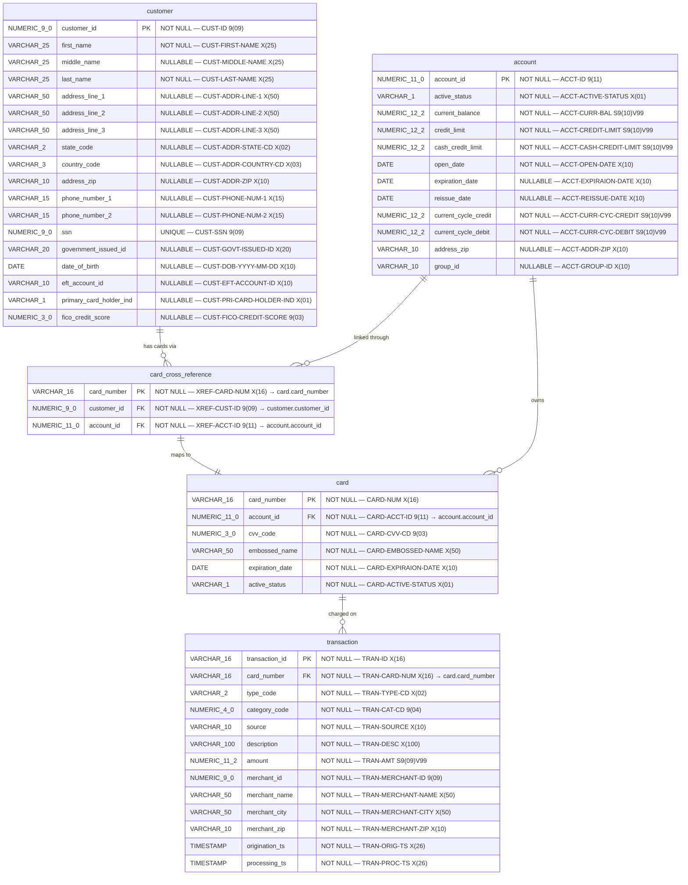
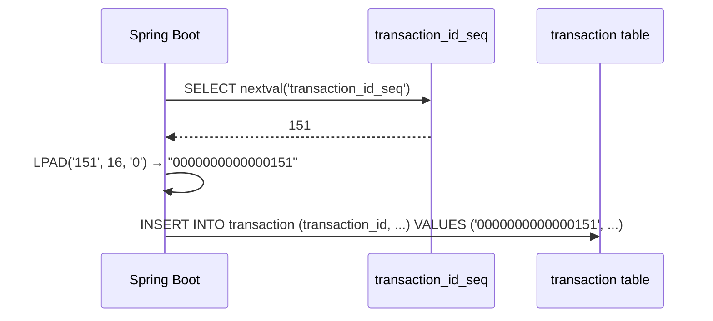
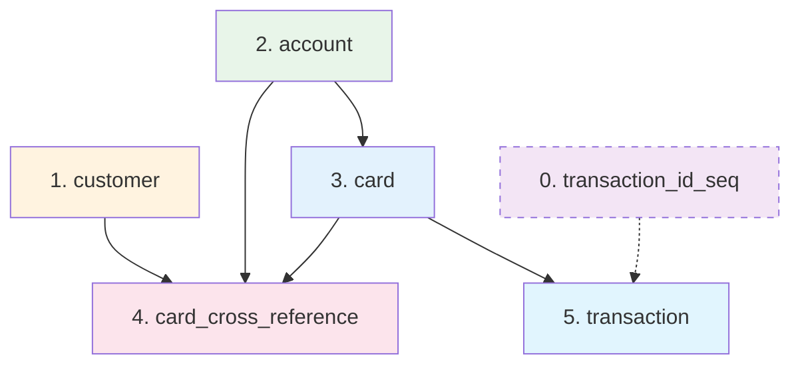

# Entity-Relationship Diagram: PostgreSQL Schema

> **Module:** Transaction Processing (CardDemo Modernization)
> **Phase:** 3 - Design
> **Target Database:** PostgreSQL 15+
> **Notation:** Mermaid.js
> **Source Copybooks:** CVTRA05Y.cpy, CVACT01Y.cpy, CVACT02Y.cpy, CVACT03Y.cpy, CVCUS01Y.cpy

---

## 1. Complete Entity-Relationship Diagram

This diagram shows the full PostgreSQL schema with all foreign key relationships, replacing the legacy VSAM KSDS/AIX file structures.



---

## 2. Foreign Key Relationships

```mermaid
graph TB
    subgraph "PostgreSQL Tables"
        CUST[customer<br/>PK: customer_id NUMERIC(9,0)]
        ACCT[account<br/>PK: account_id NUMERIC(11,0)]
        CARD[card<br/>PK: card_number VARCHAR(16)]
        XREF[card_cross_reference<br/>PK: card_number VARCHAR(16)]
        TRAN[transaction<br/>PK: transaction_id VARCHAR(16)]
        SEQ[transaction_id_seq<br/>PostgreSQL SEQUENCE]
    end

    CARD -->|FK: account_id| ACCT
    XREF -->|FK: card_number| CARD
    XREF -->|FK: account_id| ACCT
    XREF -->|FK: customer_id| CUST
    TRAN -->|FK: card_number| CARD
    SEQ -.->|generates| TRAN

    style CUST fill:#fff3e0
    style ACCT fill:#e8f5e9
    style CARD fill:#e3f2fd
    style XREF fill:#fce4ec
    style TRAN fill:#e1f5fe
    style SEQ fill:#f3e5f5,stroke-dasharray: 5 5
```

### Foreign Key Summary

| Child Table | Column | References | Parent Table | Column | On Delete | Purpose |
|---|---|---|---|---|---|---|
| `card` | `account_id` | → | `account` | `account_id` | RESTRICT | Card belongs to account |
| `card_cross_reference` | `card_number` | → | `card` | `card_number` | RESTRICT | XREF maps to card |
| `card_cross_reference` | `account_id` | → | `account` | `account_id` | RESTRICT | XREF links account |
| `card_cross_reference` | `customer_id` | → | `customer` | `customer_id` | RESTRICT | XREF links customer |
| `transaction` | `card_number` | → | `card` | `card_number` | RESTRICT | Transaction charged to card |

> **Note:** `ON DELETE RESTRICT` is used instead of `CASCADE` because the legacy VSAM system has no cascading behavior. Deleting parent records should be explicitly managed during data migration.

---

## 3. Index Strategy

```mermaid
graph LR
    subgraph "Primary Key Indexes (Auto-created)"
        PK1[customer_pkey<br/>ON customer(customer_id)]
        PK2[account_pkey<br/>ON account(account_id)]
        PK3[card_pkey<br/>ON card(card_number)]
        PK4[card_cross_reference_pkey<br/>ON card_cross_reference(card_number)]
        PK5[transaction_pkey<br/>ON transaction(transaction_id)]
    end

    subgraph "Foreign Key Indexes"
        FK1[idx_card_account_id<br/>ON card(account_id)]
        FK2[idx_xref_account_id<br/>ON card_cross_reference(account_id)<br/>⚡ Replaces CXACAIX AIX]
        FK3[idx_xref_customer_id<br/>ON card_cross_reference(customer_id)]
        FK4[idx_transaction_card_number<br/>ON transaction(card_number)]
    end

    subgraph "Additional Indexes"
        IDX1[idx_customer_ssn<br/>ON customer(ssn)<br/>UNIQUE]
    end

    style FK2 fill:#ffcdd2
```

### Index Details

| Index Name | Table | Column(s) | Type | Legacy Equivalent | Purpose |
|---|---|---|---|---|---|
| `customer_pkey` | `customer` | `customer_id` | PRIMARY KEY | CUSTDAT KSDS primary key | Customer lookup |
| `account_pkey` | `account` | `account_id` | PRIMARY KEY | ACCTDAT KSDS primary key | Account lookup |
| `card_pkey` | `card` | `card_number` | PRIMARY KEY | CARDDAT KSDS primary key | Card lookup |
| `card_cross_reference_pkey` | `card_cross_reference` | `card_number` | PRIMARY KEY | CCXREF KSDS primary key | Card → Account resolution (Path B) |
| `idx_xref_account_id` | `card_cross_reference` | `account_id` | B-TREE | **CXACAIX Alternate Index** | Account → Card resolution (Path A) |
| `idx_xref_customer_id` | `card_cross_reference` | `customer_id` | B-TREE | N/A | Customer lookup via XREF |
| `transaction_pkey` | `transaction` | `transaction_id` | PRIMARY KEY | TRANSACT KSDS primary key | Transaction lookup |
| `idx_transaction_card_number` | `transaction` | `card_number` | B-TREE | N/A | Transactions by card |
| `idx_card_account_id` | `card` | `account_id` | B-TREE | N/A | Cards by account |
| `idx_customer_ssn` | `customer` | `ssn` | UNIQUE | N/A | SSN uniqueness |

---

## 4. Sequence (Transaction ID Generation)



**Sequence Definition:**
```sql
CREATE SEQUENCE transaction_id_seq
    START WITH 1
    INCREMENT BY 1
    NO MAXVALUE
    NO CYCLE;
```

> **Design Decision:** PostgreSQL `SEQUENCE` replaces the legacy browse-to-end pattern (`STARTBR HIGH-VALUES → READPREV → +1`). Sequences are atomic and thread-safe, eliminating the race condition risk documented in BRE Section 10.1.

---

## 5. VSAM-to-PostgreSQL Mapping Summary

| VSAM File | Type | Record Length | PostgreSQL Table | Columns | PK |
|---|---|---|---|---|---|
| `TRANSACT` | KSDS | 350 bytes | `transaction` | 13 data + FILLER excluded | `transaction_id VARCHAR(16)` |
| `CCXREF` | KSDS | 50 bytes | `card_cross_reference` | 3 data + FILLER excluded | `card_number VARCHAR(16)` |
| `CXACAIX` | AIX on CCXREF | 50 bytes | *(index only)* `idx_xref_account_id` | N/A | N/A |
| `ACCTDAT` | KSDS | 300 bytes | `account` | 12 data + FILLER excluded | `account_id NUMERIC(11,0)` |
| `CARDDAT` | KSDS | 150 bytes | `card` | 6 data + FILLER excluded | `card_number VARCHAR(16)` |
| `CUSTDAT` | KSDS | 500 bytes | `customer` | 18 data + FILLER excluded | `customer_id NUMERIC(9,0)` |

---

## 6. Data Integrity Constraints

| Constraint | Table | Type | Business Rule |
|---|---|---|---|
| `transaction_pkey` | `transaction` | PRIMARY KEY | BR-AT-14: Duplicate ID rejection |
| `card_cross_reference_pkey` | `card_cross_reference` | PRIMARY KEY | BR-AT-04: Card number uniqueness in XREF |
| `fk_transaction_card` | `transaction` | FOREIGN KEY | Referential integrity (card must exist) |
| `fk_card_account` | `card` | FOREIGN KEY | Card must belong to valid account |
| `fk_xref_card` | `card_cross_reference` | FOREIGN KEY | XREF card must exist in card table |
| `fk_xref_account` | `card_cross_reference` | FOREIGN KEY | XREF account must exist in account table |
| `fk_xref_customer` | `card_cross_reference` | FOREIGN KEY | XREF customer must exist in customer table |
| `transaction_id_seq` | `transaction` | SEQUENCE | BR-AT-13: Thread-safe auto-increment |
| `idx_xref_account_id` | `card_cross_reference` | INDEX | BR-AT-05: Account → Card resolution |
| `customer_ssn_unique` | `customer` | UNIQUE INDEX | SSN uniqueness |

---

## 7. Table Creation Order (Dependency Graph)

Tables must be created in dependency order to satisfy foreign key constraints:



**Creation Order:**
1. `transaction_id_seq` (sequence — no dependencies)
2. `customer` (no foreign keys)
3. `account` (no foreign keys)
4. `card` (depends on: `account`)
5. `card_cross_reference` (depends on: `card`, `account`, `customer`)
6. `transaction` (depends on: `card`)
