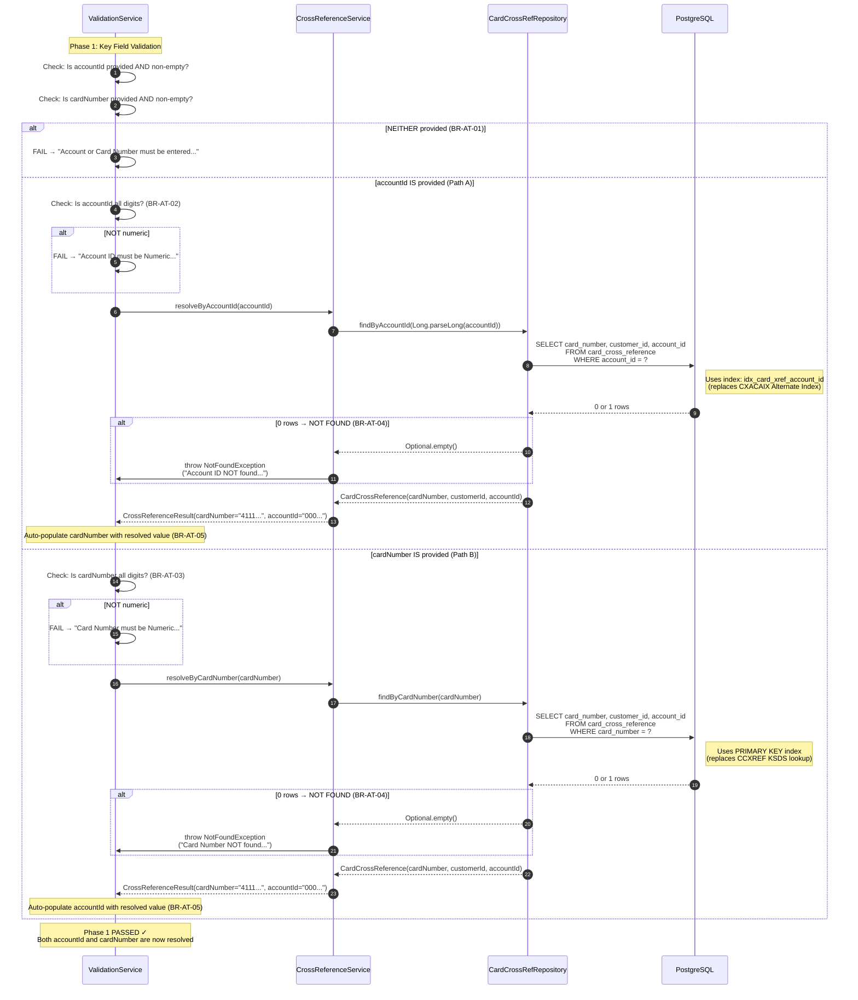
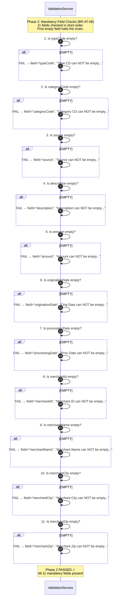
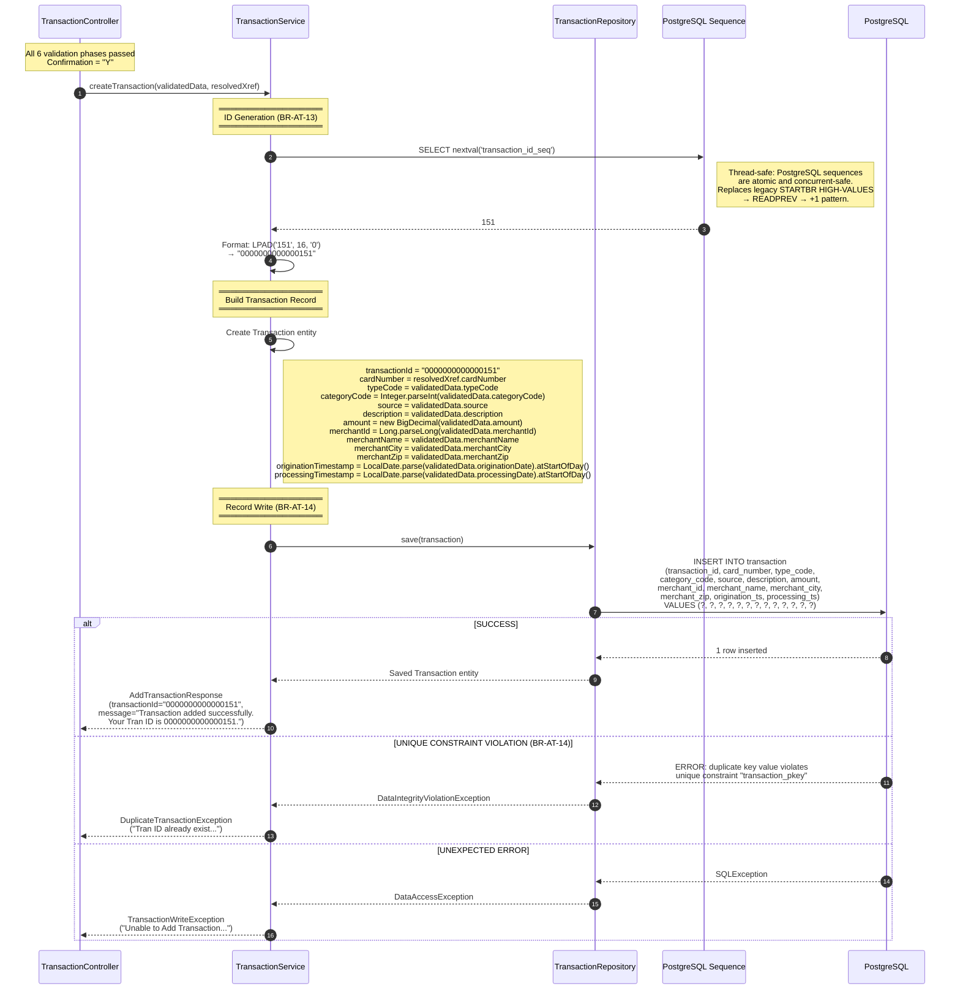
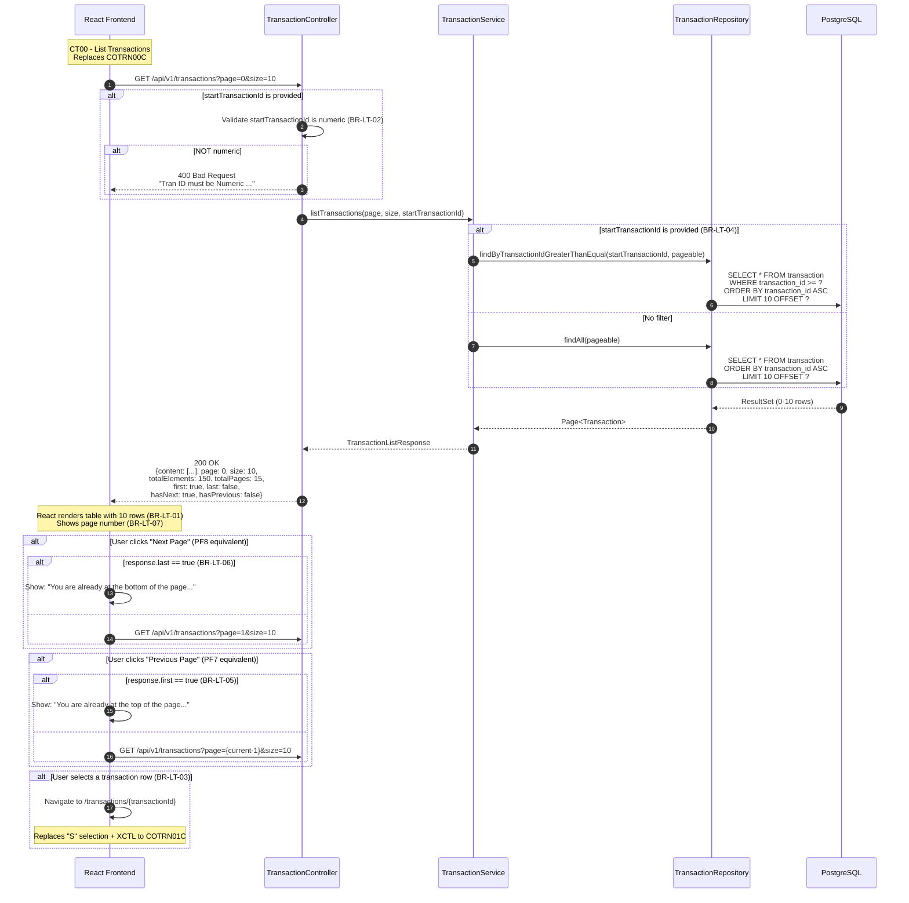
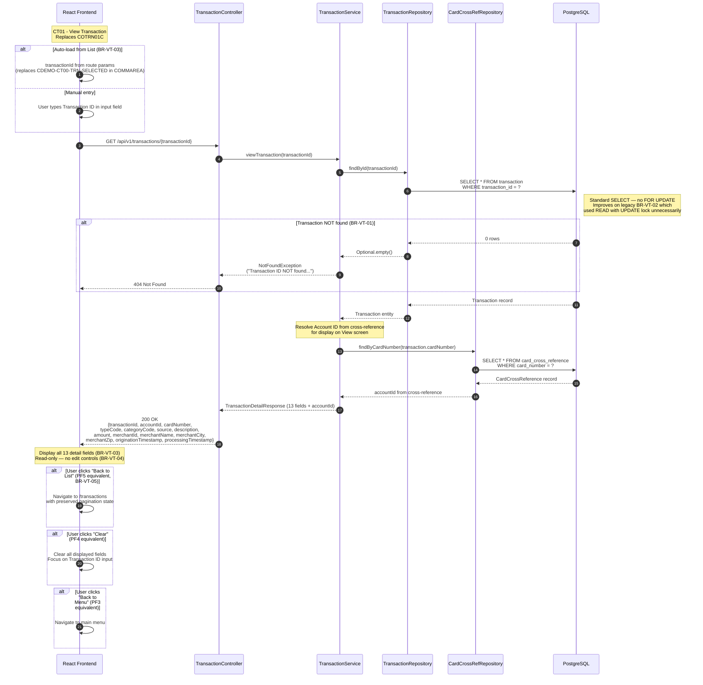
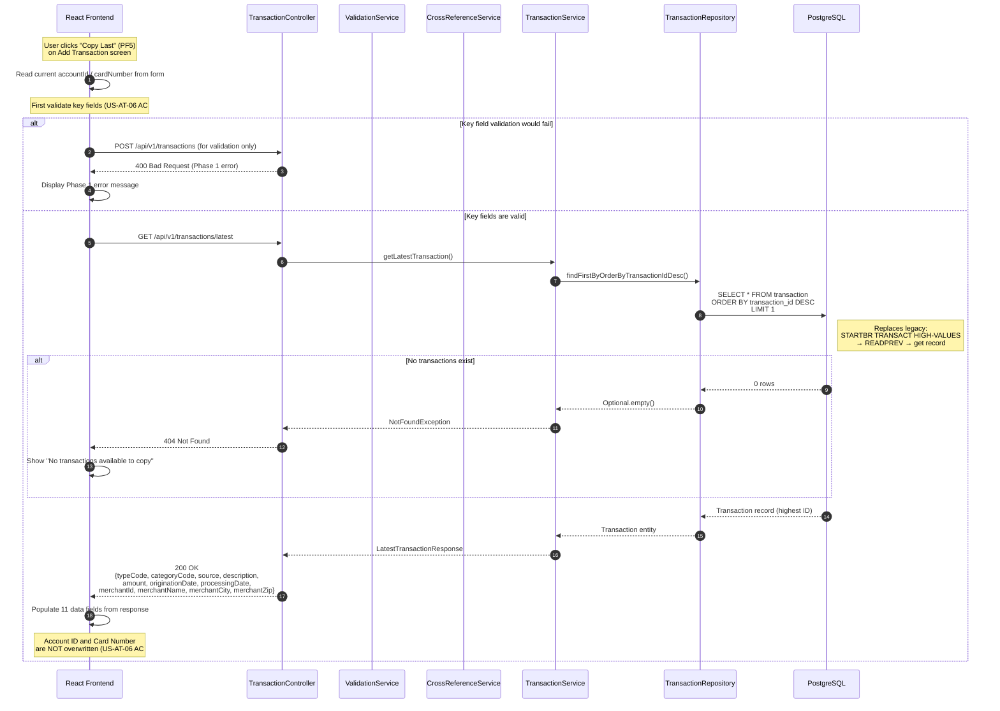
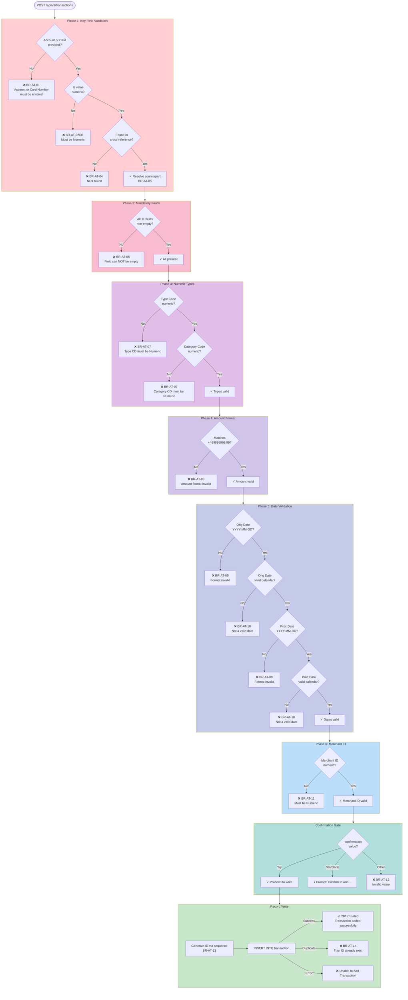

# Sequence Diagrams: Transaction Processing Module

> **Module:** Transaction Processing (CardDemo Modernization)
> **Phase:** 3 - Design
> **Notation:** Mermaid.js
> **BRE Reference:** `transactions-processing-module-doc-devin.md`

---

## 1. CT02 Add Transaction — Full 6-Phase Validation Chain

This is the primary sequence diagram showing the complete flow of the Add Transaction function, including all 6 validation phases, cross-reference resolution, confirmation gate, ID generation, and record write.

```mermaid
sequenceDiagram
    autonumber
    participant UI as React Frontend
    participant API as TransactionController
    participant VS as TransactionValidationService
    participant XS as CrossReferenceService
    participant XR as CardCrossReferenceRepository
    participant TS as TransactionService
    participant TR as TransactionRepository
    participant DB as PostgreSQL

    UI->>API: POST /api/v1/transactions<br/>(AddTransactionRequest)
    API->>VS: validateAndProcess(request)

    Note over VS: ═══════════════════════<br/>PHASE 1: Key Field Validation<br/>BR-AT-01, BR-AT-02, BR-AT-03,<br/>BR-AT-04, BR-AT-05<br/>═══════════════════════

    VS->>VS: Phase 1.1: Check Account ID or Card Number provided (BR-AT-01)
    alt Both accountId AND cardNumber are empty
        VS-->>API: ValidationException(phase=1, field="accountId",<br/>"Account or Card Number must be entered...")
        API-->>UI: 400 Bad Request
    end

    alt accountId is provided
        VS->>VS: Phase 1.2a: Validate Account ID is numeric (BR-AT-02)
        alt accountId is NOT numeric
            VS-->>API: ValidationException(phase=1, field="accountId",<br/>"Account ID must be Numeric...")
            API-->>UI: 400 Bad Request
        end
        VS->>XS: resolveByAccountId(accountId)
        XS->>XR: findByAccountId(accountId)
        XR->>DB: SELECT * FROM card_cross_reference<br/>WHERE account_id = ?
        DB-->>XR: Result
        alt Account NOT found in cross-reference (BR-AT-04)
            XR-->>XS: Optional.empty()
            XS-->>VS: NotFoundException("Account ID NOT found...")
            VS-->>API: ValidationException(phase=1, field="accountId",<br/>"Account ID NOT found...")
            API-->>UI: 404 Not Found
        end
        XR-->>XS: CardCrossReference record
        XS-->>VS: resolvedCardNumber (BR-AT-05)
    else cardNumber is provided
        VS->>VS: Phase 1.2b: Validate Card Number is numeric (BR-AT-03)
        alt cardNumber is NOT numeric
            VS-->>API: ValidationException(phase=1, field="cardNumber",<br/>"Card Number must be Numeric...")
            API-->>UI: 400 Bad Request
        end
        VS->>XS: resolveByCardNumber(cardNumber)
        XS->>XR: findByCardNumber(cardNumber)
        XR->>DB: SELECT * FROM card_cross_reference<br/>WHERE card_number = ?
        DB-->>XR: Result
        alt Card NOT found in cross-reference (BR-AT-04)
            XR-->>XS: Optional.empty()
            XS-->>VS: NotFoundException("Card Number NOT found...")
            VS-->>API: ValidationException(phase=1, field="cardNumber",<br/>"Card Number NOT found...")
            API-->>UI: 404 Not Found
        end
        XR-->>XS: CardCrossReference record
        XS-->>VS: resolvedAccountId (BR-AT-05)
    end

    Note over VS: Phase 1 PASSED ✓<br/>Cross-reference resolved

    Note over VS: ═══════════════════════<br/>PHASE 2: Mandatory Field Checks<br/>BR-AT-06 (11 fields)<br/>═══════════════════════

    VS->>VS: Phase 2: Check 11 mandatory fields in order
    Note right of VS: Check order:<br/>1. Type Code<br/>2. Category Code<br/>3. Source<br/>4. Description<br/>5. Amount<br/>6. Origination Date<br/>7. Processing Date<br/>8. Merchant ID<br/>9. Merchant Name<br/>10. Merchant City<br/>11. Merchant Zip
    alt Any mandatory field is empty (first empty field halts chain)
        VS-->>API: ValidationException(phase=2, field="{fieldName}",<br/>"{Field} can NOT be empty...")
        API-->>UI: 400 Bad Request
    end

    Note over VS: Phase 2 PASSED ✓<br/>All 11 fields present

    Note over VS: ═══════════════════════<br/>PHASE 3: Numeric Type Checks<br/>BR-AT-07<br/>═══════════════════════

    VS->>VS: Phase 3.1: Validate Type Code is numeric
    alt typeCode is NOT numeric
        VS-->>API: ValidationException(phase=3, field="typeCode",<br/>"Type CD must be Numeric...")
        API-->>UI: 400 Bad Request
    end
    VS->>VS: Phase 3.2: Validate Category Code is numeric
    alt categoryCode is NOT numeric
        VS-->>API: ValidationException(phase=3, field="categoryCode",<br/>"Category CD must be Numeric...")
        API-->>UI: 400 Bad Request
    end

    Note over VS: Phase 3 PASSED ✓<br/>Types are numeric

    Note over VS: ═══════════════════════<br/>PHASE 4: Amount Format Validation<br/>BR-AT-08<br/>═══════════════════════

    VS->>VS: Phase 4: Validate amount matches +/-99999999.99
    alt amount does NOT match format
        VS-->>API: ValidationException(phase=4, field="amount",<br/>"Amount should be in format -99999999.99")
        API-->>UI: 400 Bad Request
    end

    Note over VS: Phase 4 PASSED ✓<br/>Amount format valid

    Note over VS: ═══════════════════════<br/>PHASE 5: Date Validation<br/>BR-AT-09, BR-AT-10<br/>═══════════════════════

    VS->>VS: Phase 5.1: Validate Origination Date format (YYYY-MM-DD)
    alt originationDate format invalid (BR-AT-09)
        VS-->>API: ValidationException(phase=5, field="originationDate",<br/>"Orig Date should be in format YYYY-MM-DD")
        API-->>UI: 400 Bad Request
    end
    VS->>VS: Phase 5.2: Validate Origination Date is valid calendar date
    Note right of VS: Uses java.time.LocalDate.parse()<br/>Replaces legacy CSUTLDTC utility
    alt originationDate is NOT a valid calendar date (BR-AT-10)
        VS-->>API: ValidationException(phase=5, field="originationDate",<br/>"Orig Date - Not a valid date...")
        API-->>UI: 400 Bad Request
    end
    VS->>VS: Phase 5.3: Validate Processing Date format (YYYY-MM-DD)
    alt processingDate format invalid (BR-AT-09)
        VS-->>API: ValidationException(phase=5, field="processingDate",<br/>"Proc Date should be in format YYYY-MM-DD")
        API-->>UI: 400 Bad Request
    end
    VS->>VS: Phase 5.4: Validate Processing Date is valid calendar date
    alt processingDate is NOT a valid calendar date (BR-AT-10)
        VS-->>API: ValidationException(phase=5, field="processingDate",<br/>"Proc Date - Not a valid date...")
        API-->>UI: 400 Bad Request
    end

    Note over VS: Phase 5 PASSED ✓<br/>Both dates valid

    Note over VS: ═══════════════════════<br/>PHASE 6: Merchant ID Numeric Check<br/>BR-AT-11<br/>═══════════════════════

    VS->>VS: Phase 6: Validate Merchant ID is numeric
    alt merchantId is NOT numeric
        VS-->>API: ValidationException(phase=6, field="merchantId",<br/>"Merchant ID must be Numeric...")
        API-->>UI: 400 Bad Request
    end

    Note over VS: Phase 6 PASSED ✓<br/>ALL VALIDATION COMPLETE

    Note over VS: ═══════════════════════<br/>CONFIRMATION GATE<br/>BR-AT-12<br/>═══════════════════════

    VS-->>API: Validation passed, return resolved data
    API->>API: Check confirmation field

    alt confirmation = "Y" or "y"
        Note over API: Confirmation accepted → proceed to write
    else confirmation = "N" or "n" or null or ""
        API-->>UI: 200 OK<br/>{"confirmationRequired": true,<br/>"message": "Confirm to add this transaction..."}
    else confirmation = other value
        API-->>UI: 200 OK<br/>{"confirmationRequired": true,<br/>"message": "Invalid value. Valid values are (Y/N)..."}
    end

    Note over TS: ═══════════════════════<br/>ID GENERATION & RECORD WRITE<br/>BR-AT-13, BR-AT-14<br/>═══════════════════════

    API->>TS: createTransaction(validatedRequest, resolvedXref)
    TS->>DB: SELECT nextval('transaction_id_seq')
    DB-->>TS: nextId (e.g., 151)
    TS->>TS: Format ID: LPAD(151, 16, '0') → "0000000000000151"
    TS->>TS: Build Transaction entity with all fields
    TS->>TR: save(transaction)
    TR->>DB: INSERT INTO transaction VALUES (...)
    alt UNIQUE constraint violation (BR-AT-14)
        DB-->>TR: DuplicateKeyException
        TR-->>TS: DataIntegrityViolationException
        TS-->>API: DuplicateTransactionException<br/>("Tran ID already exist...")
        API-->>UI: 409 Conflict
    else Unexpected DB error
        DB-->>TR: SQLException
        TR-->>TS: DataAccessException
        TS-->>API: TransactionWriteException<br/>("Unable to Add Transaction...")
        API-->>UI: 500 Internal Server Error
    end
    DB-->>TR: Success
    TR-->>TS: Saved Transaction entity
    TS-->>API: TransactionDetailResponse
    API-->>UI: 201 Created<br/>{"transactionId": "0000000000000151",<br/>"message": "Transaction added successfully.<br/>Your Tran ID is 0000000000000151."}
```

---

## 2. Phase 1 Detail — Cross-Reference Resolution

Detailed view of Phase 1 showing both resolution paths (Account → Card and Card → Account).

---

## 3. Phase 2 Detail — Mandatory Field Validation

---

## 4. Phases 3–6 Detail — Format & Type Validation

```mermaid
sequenceDiagram
    autonumber
    participant VS as ValidationService

    Note over VS: ══════════════════<br/>Phase 3: Numeric Type Checks<br/>BR-AT-07<br/>══════════════════

    VS->>VS: Is typeCode all digits?
    alt NOT numeric
        VS->>VS: FAIL → field="typeCode", "Type CD must be Numeric..."
    end

    VS->>VS: Is categoryCode all digits?
    alt NOT numeric
        VS->>VS: FAIL → field="categoryCode", "Category CD must be Numeric..."
    end

    Note over VS: Phase 3 PASSED ✓

    Note over VS: ══════════════════<br/>Phase 4: Amount Format<br/>BR-AT-08<br/>══════════════════

    VS->>VS: Does amount match regex?<br/>Pattern: ^[+-]?\d{1,8}\.\d{2}$
    Note right of VS: Legacy format: +/-99999999.99<br/>Sign optional, 1-8 integer digits,<br/>mandatory decimal point, exactly 2 decimal digits
    alt DOES NOT match
        VS->>VS: FAIL → field="amount",<br/>"Amount should be in format -99999999.99"
    end

    Note over VS: Phase 4 PASSED ✓

    Note over VS: ══════════════════<br/>Phase 5: Date Validation<br/>BR-AT-09, BR-AT-10<br/>══════════════════

    VS->>VS: Does originationDate match YYYY-MM-DD format?
    alt FORMAT invalid (BR-AT-09)
        VS->>VS: FAIL → field="originationDate",<br/>"Orig Date should be in format YYYY-MM-DD"
    end

    VS->>VS: Is originationDate a valid calendar date?
    Note right of VS: LocalDate.parse(originationDate)<br/>Replaces legacy CSUTLDTC utility call
    alt NOT valid calendar date (e.g., 2024-02-30) (BR-AT-10)
        VS->>VS: FAIL → field="originationDate",<br/>"Orig Date - Not a valid date..."
    end

    VS->>VS: Does processingDate match YYYY-MM-DD format?
    alt FORMAT invalid (BR-AT-09)
        VS->>VS: FAIL → field="processingDate",<br/>"Proc Date should be in format YYYY-MM-DD"
    end

    VS->>VS: Is processingDate a valid calendar date?
    alt NOT valid calendar date (BR-AT-10)
        VS->>VS: FAIL → field="processingDate",<br/>"Proc Date - Not a valid date..."
    end

    Note over VS: Phase 5 PASSED ✓

    Note over VS: ══════════════════<br/>Phase 6: Merchant ID Numeric<br/>BR-AT-11<br/>══════════════════

    VS->>VS: Is merchantId all digits?
    alt NOT numeric
        VS->>VS: FAIL → field="merchantId",<br/>"Merchant ID must be Numeric..."
    end

    Note over VS: Phase 6 PASSED ✓<br/>ALL VALIDATION COMPLETE
```

---

## 5. ID Generation & Record Write

---

## 6. CT00 List Transactions — Pagination Flow

---

## 7. CT01 View Transaction — Detail Lookup

---

## 8. CT02 Copy Last Transaction (PF5)

---

## 9. Validation Chain Summary Flow

High-level overview of the 6-phase validation chain as a single diagram for quick reference:

---

## 10. Error Message to Validation Phase Mapping

Complete mapping of all error messages from BRE Section 8.2 (Add Transaction) to their validation phase:

| Phase | Business Rule | Error Message | Field | HTTP Status |
|---|---|---|---|---|
| 1 | BR-AT-01 | "Account or Card Number must be entered..." | `accountId` | 400 |
| 1 | BR-AT-02 | "Account ID must be Numeric..." | `accountId` | 400 |
| 1 | BR-AT-03 | "Card Number must be Numeric..." | `cardNumber` | 400 |
| 1 | BR-AT-04 | "Account ID NOT found..." | `accountId` | 404 |
| 1 | BR-AT-04 | "Card Number NOT found..." | `cardNumber` | 404 |
| 1 | N/A | "Unable to lookup Acct in XREF AIX file..." | `accountId` | 500 |
| 1 | N/A | "Unable to lookup Card # in XREF file..." | `cardNumber` | 500 |
| 2 | BR-AT-06 | "Type CD can NOT be empty..." | `typeCode` | 400 |
| 2 | BR-AT-06 | "Category CD can NOT be empty..." | `categoryCode` | 400 |
| 2 | BR-AT-06 | "Source can NOT be empty..." | `source` | 400 |
| 2 | BR-AT-06 | "Description can NOT be empty..." | `description` | 400 |
| 2 | BR-AT-06 | "Amount can NOT be empty..." | `amount` | 400 |
| 2 | BR-AT-06 | "Orig Date can NOT be empty..." | `originationDate` | 400 |
| 2 | BR-AT-06 | "Proc Date can NOT be empty..." | `processingDate` | 400 |
| 2 | BR-AT-06 | "Merchant ID can NOT be empty..." | `merchantId` | 400 |
| 2 | BR-AT-06 | "Merchant Name can NOT be empty..." | `merchantName` | 400 |
| 2 | BR-AT-06 | "Merchant City can NOT be empty..." | `merchantCity` | 400 |
| 2 | BR-AT-06 | "Merchant Zip can NOT be empty..." | `merchantZip` | 400 |
| 3 | BR-AT-07 | "Type CD must be Numeric..." | `typeCode` | 400 |
| 3 | BR-AT-07 | "Category CD must be Numeric..." | `categoryCode` | 400 |
| 4 | BR-AT-08 | "Amount should be in format -99999999.99" | `amount` | 400 |
| 5 | BR-AT-09 | "Orig Date should be in format YYYY-MM-DD" | `originationDate` | 400 |
| 5 | BR-AT-09 | "Proc Date should be in format YYYY-MM-DD" | `processingDate` | 400 |
| 5 | BR-AT-10 | "Orig Date - Not a valid date..." | `originationDate` | 400 |
| 5 | BR-AT-10 | "Proc Date - Not a valid date..." | `processingDate` | 400 |
| 6 | BR-AT-11 | "Merchant ID must be Numeric..." | `merchantId` | 400 |
| — | BR-AT-12 | "Confirm to add this transaction..." | `confirmation` | 200 |
| — | BR-AT-12 | "Invalid value. Valid values are (Y/N)..." | `confirmation` | 200 |
| — | BR-AT-14 | "Tran ID already exist..." | `transactionId` | 409 |
| — | N/A | "Unable to Add Transaction..." | `null` | 500 |

**Total: 29 distinct error messages from the Add Transaction error catalog — all mapped.**
